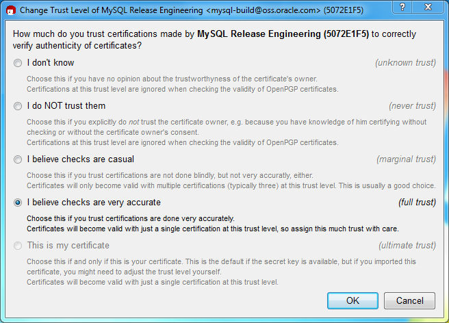
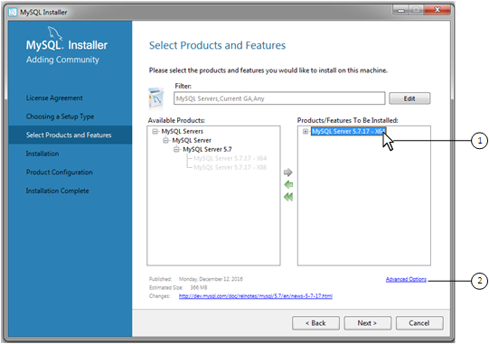
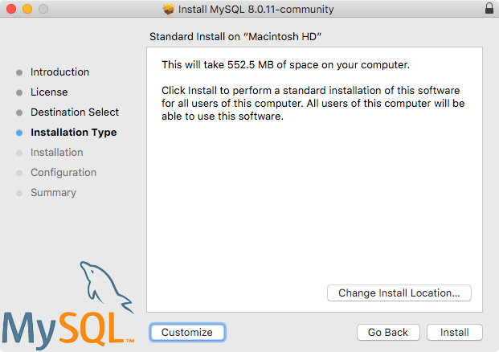

# 第二章 安装和升级MySQL

本章介绍如何获取和安装MySQL。 摘要在后面段落列出。如果您打算将现有的 MySQL 升级到较新的版本，而不是第一次安装MySQL，请参阅[节2.11 升级 MySQL](＃_211-升级-MySQL)，以便在升级之前获取有关升级过程和应考虑的问题的信息。

如果你需要从其他数据库迁移至 MySQL，请参阅 [Section A.8, “MySQL 8.0 FAQ: Migration”](faqs.md#faqs-migration)，其中包含有关迁移问题的一些常见问题的答案。  

MySQL 的安装通常遵循此处概述的步骤：

1. **确定 MySQL 是否可以在您的平台上运行并受支持。** 
  请注意，并非所有平台都可以运行MySQL，而且并非所有运行 MySQL 的平台都由 Oracle Corporation 正式支持。 有关官方支持的平台的信息，请参阅MySQL网站：https://www.mysql.com/support/supportedplatforms/database.html。

2. **选择需要安装的发行版。** 
  多个版本的 MySQL 可用，多数都有几种分发格式。 您可以从包含二进制（预编译）发行版或源代码的预打包发行版中进行选择。不知如何选择？请使用二进制发行版。 Oracle还为那些想要查看最新开发和测试新代码的人提供了 MySQL 源代码包。 要确定应使用的版本和分发类型， 请参阅[节2.1.1 需要什么版本的 MySQL](#_211-需要什么版本的-MySQL)。  

3. **下载需要安装的发行版。** 
  详见 [节2.1.2 如何获取 MySQL](#_212-如何获取-MySQL). 要验证文件的完整性，[节2.1.3 使用MD5或GnuPG验证安装包](#_213-使用-MD5-或-GnuPG-验证安装包)。  

4. **安装MySQL。** 

 To install MySQL from a binary distribution, use the instructions in [节2.2, “Installing MySQL on Unix/Linux Using Generic Binaries”](#binary-installation). 

 To install MySQL from a source distribution or from the current development source tree, use the instructions in [节2.9, “Installing MySQL from Source”](#source-installation). 

5. **执行必要的安装后设置。** 

 After installing MySQL, see [节2.10, “Postinstallation Setup and Testing”](#postinstallation) for information about making sure the MySQL server is working properly. Also refer to the information provided in [节2.10.4, “Securing the Initial MySQL Account”](#default-privileges). This section describes how to secure the initial MySQL `root` user account, *which has no password* until you assign one. The section applies whether you install MySQL using a binary or source distribution. 

6. If you want to run the MySQL benchmark scripts, Perl support for MySQL must be available. See [节2.13, “Perl Installation Notes”](#perl-support).

​  Instructions for installing MySQL on different platforms and  environments is available on a platform by platform basis:

- **Unix, Linux, FreeBSD** 

  For instructions on installing MySQL on most Linux and Unix platforms using a generic binary (for example, a `.tar.gz` package), see [节2.2, “Installing MySQL on Unix/Linux Using Generic Binaries”](#binary-installation). 

  For information on building MySQL entirely from the source code distributions or the source code repositories, see [节2.9, “Installing MySQL from Source”](#source-installation) 

  For specific platform help on installation, configuration, and building from source see the corresponding platform section:

  - Linux, including notes on distribution specific methods, see [节2.5, “Installing MySQL on Linux”](#linux-installation). 
  - IBM AIX, see [节2.7, “Installing MySQL on Solaris”](#solaris-installation). 
  - FreeBSD, see [节2.8, “Installing MySQL on FreeBSD”](#freebsd-installation).

- **Microsoft Windows** 

  For instructions on installing MySQL on Microsoft Windows, using either the MySQL Installer or Zipped binary, see [节2.3, “Installing MySQL on Microsoft Windows”](#windows-installation). 

  For information about managing MySQL instances, see [MySQL Notifier Overview](https://dev.mysql.com/doc/mysql-notifier/en/mysql-notifier-overview.html). 

  For details and instructions on building MySQL from source code using Microsoft Visual Studio, see [节2.9, “Installing MySQL from Source”](#source-installation). 

- **macOS** 

  For installation on macOS, including using both the binary package and native PKG formats, see [节2.4, “Installing MySQL on macOS”](#osx-installation). 

  For information on making use of an macOS Launch Daemon to automatically start and stop MySQL, see [节2.4.3, “Installing and Using the MySQL Launch Daemon”](#osx-installation-launchd). 

  For information on the MySQL Preference Pane, see [节2.4.4, “Installing and Using the MySQL Preference Pane”](#osx-installation-prefpane).

## 2.1 安装指引说明

以下部分包含选择，下载和验证您的分发所需的信息。 本章后面部分中的说明介绍了如何安装所选的发行版。 对于二进制发行版，请参见第“[节2.2 在Unix / Linux上使用通用二进制文件安装MySQL](#_22-在-Unix-Linux-上使用通用二进制文件安装-MySQL)”中的说明或适用于您的平台的相应部分（如果有）。 要从源代码构建MySQL，请使用[节2.9 从源代码安装MySQL](#_29-从源代码安装MySQL)中的说明。

### 2.1.1 需要什么版本的MySQL

MySQL 支持多个操作系统及平台，想要查看MySQL兼容性列表，请参阅 https://www.mysql.com/support/supportedplatforms/database.html 。

准备安装MySQL时，请确定要使用的版本和分发格式（二进制文件或源代码）。

首先，决定是安装开发版本还是正式版(GA)。 开发版本有最新功能，但不建议用于生产环境。GA，也称为生产版或稳定版，适用于生产用途。 我们建议使用最新的GA版本。

- 第一个数字 (**8**) 是主版本号。
- 第二个数字 (**0**) 是次要版本号。总的来说，主版本号和次要版本号确定了发行版本号，发行版本号代修改表功能性更新。
- 第三个数字 (**1**) 非发行版本号。每次修正问题，都会修改这个版本号。 在大多数情况下，第三个版本号选择最新的就可以了。

发行版本号可能还含有后缀用于描述当前的更新属性。通过一组后缀来说明该系列进程中来说明稳定性提高级别。可能含有后缀如下：

- **dmr** 代表里程碑（development milestone release）版本。MySQL开发使用里程碑模型，其中每个里程碑都引入了一小部分经过全面测试的功能。从一个里程碑到下一个里程碑，根据尝试这些早期版本的社区成员提供的反馈，功能界面可能会发生变化，甚至可能会删除功能。 里程碑版本中的功能可被视为具有预生产质量。 
- **rc** 代表发行候选版（Release Candidate）。发行候选版可以认为是稳定的，通过了所有MySQL内部测试，新RC版本中可能仍会引入新功能，但重点转移到修复错误以稳定系列早期介绍的功能。 
- 缺少后缀表示正式版（GA）或生产版本。 GA版本是稳定的，已成功通过早期版本阶段，并且被认为是可靠的，没有严重的错误，并且适用于生产系统。

系列中的开发始于DMR版本，随后是RC版本，最后达到GA状态版本。

选择要安装的MySQL版本后，要为您的操作系统确定安装哪种分发格式。 对于大多数用例，二进制分发是正确的选择。 对于许多平台，二进制发行版以本机格式提供，例如Linux的RPM软件包或OS X的DMG软件包。分发版也可以使用更通用的格式，例如zip存档或压缩的 **tar** 文件。 在 Windows 上，您可以使用[MySQL安装程序](docs/ch2/2.3.3_Windows专用MySQL安装包.md)安装二进制分发版。

在某些情况下，最好从源码发行版安装 MySQL ：

- 把 MySQL 安装到特殊位置。标准二进制发行版已经允许 MySQL 在任意目录下运行，使用源码发行版可以更灵活的指定 MySQL 各个组件的安装路径。 

- 使用二进制分发版中 [**mysqld**](programs.md#mysqld) 可能未包含的功能。 以下是用于确保功能可用性的最常见附加选项列表：
  - [`-DWITH_LIBWRAP=1`](#option_cmake_with_libwrap) TCP wrappers 支持 
  - [`-DWITH_ZLIB={system|bundled}`](#option_cmake_with_zlib) 启用 zlib 压缩
  - [`-DWITH_DEBUG=1`](#option_cmake_with_debug) 开启调试功能

  如需更多细信息，请参阅 [节2.9.7, “MySQL Source-Configuration Options”](#source-configuration-options)。
- 去除发行版 [**mysqld**](programs.md#mysqld) 中不需要的功能
- 如想要读取或修改MySQL的C和C ++代码，请获取源码发行版。
- 源代码分发包含比二进制分发更多的测试和示例。

### 2.1.2 如何获取 MySQL

有关当前MySQL版本和下载说明的信息，请访问[https://dev.mysql.com/downloads/]()。有关MySQL下载镜像站点的完整最新列表，请参阅[https://dev.mysql.com/downloads/mirrors.html]()。您还可以在那里找到有关成为MySQL镜像站点以及如何报告错误或过时镜像的信息。

​ For RPM-based Linux platforms that use Yum as their package management system, MySQL can be installed using the [MySQL Yum  Repository](https://dev.mysql.com/downloads/repo/yum/). See [节2.5.1, “Installing MySQL on Linux Using the MySQL Yum Repository”](#linux-installation-yum-repo) for details.  

​ For Debian-based Linux platforms, MySQL can be installed using the [MySQL APT  Repository](https://dev.mysql.com/downloads/repo/apt/). See [节2.5.2, “Installing MySQL on Linux Using the MySQL APT Repository”](#linux-installation-apt-repo) for details.  

​ For SUSE Linux Enterprise Server (SLES) platforms, MySQL can be installed using the [MySQL SLES  Repository](https://dev.mysql.com/downloads/repo/suse/). See [节2.5.3, “Installing MySQL on Linux Using the MySQL SLES Repository”](#linux-installation-sles-repo) for details.  

​ To obtain the latest development source, see [节2.9.5, “Installing MySQL Using a Development Source Tree”](#installing-development-tree).

### 2.1.3 使用 MD5 或 GnuPG 验证安装包

下载适合您需要的MySQL安装包之后，在尝试安装之前，请确保它完好无损且未被篡改。 有三种完整性检查方法：

 -  MD5校验
 -  使用GNU Privacy Guard的“GnuPG”进行加密签名
 -  对于RPM软件包，内置RPM完整性验证机制

本章节描述了如何使用这几种方法校验安装包。

如果您注意到MD5校验和或GPG签名不匹配，请首先尝试再次下载相应的程序包，或者从镜像站点下载。

#### 2.1.3.1 使用 MD5 验证安装包

下载MySQL软件包后，应确保其MD5校验和与MySQL下载页面上提供的校验和匹配。 每个包都有一个单独的校验和，您可以根据下载的包进行验证。 每个MySQL产品的下载页面上都列出了正确的MD5校验和，您将把它与您下载的文件（产品）的MD5校验和进行比较。

大部分操作系统上都对应版本的用于检查MD5校验和的命令行工具。 通常命令为`md5sum`，或者是`md5`，并且某些操作系统上根本没有这工具。 在Linux上，它是**GNU Text Utilities**软件包的一部分，可用于各种发行版。 您也可以从[http://www.gnu.org/software/textutils/](http://www.gnu.org/software/textutils/)下载源代码。 如果安装了OpenSSL，则可以使用命令`openssl md5 package_name`来计算MD5校验和。 可以从[http://www.fourmilab.ch/md5/](http://www.fourmilab.ch/md5/)获得`md5`命令行程序Windows版本。**winMd5Sum **是一个图形化的MD5计算工具，可以从[http://www.nullriver.com/index/products/winmd5sum](http://www.nullriver.com/index/products/winmd5sum)获得。 我们的Microsoft Windows示例将采用命令`md5.exe`。

Linux 和 Microsoft Windows 示例：
```
shell> md5sum mysql-standard-8.0.23-linux-i686.tar.gz
aaab65abbec64d5e907dcd41b8699945  mysql-standard-8.0.23-linux-i686.tar.gz
PS > md5.exe mysql-installer-community-8.0.23.msi
aaab65abbec64d5e907dcd41b8699945  mysql-installer-community-8.0.23.msi
```

您应该验证生成的校验和（十六进制数字的字符串）是否与相应程序包正下方的下载页面上显示的校验和相匹配。

 > **注意**
确保验证的是压缩文件的校验和（例如，.zip，.tar.gz或.msi文件），而不是存档中包含的文件。 换句话说，在解压之前验证该文件。

#### 2.1.3.2 Signature Checking U

验证包的完整性和真实性的另一种方法是使用加密签名。加密签名比[MD5 校验和](#_2131-使用-MD5-验证安装包)更加可靠，但是麻烦。

我们使用**GnuPG**（GNU Privacy Guard）对MySQL安装包签名。 **GnuPG**是Phil Zimmermann开发的著名的Pretty Good Privacy（**PGP**）的开源替代品。 大多数Linux发行版默认安装**GnuPG**。 否则，请参阅[http://www.gnupg.org/](http://www.gnupg.org/)以获取有关**GnuPG**以及如何获取和安装的更多信息。

要验证安装包的签名，首先需要获取我们的公共GPG构建密钥的副本，您可以从[http://pgp.mit.edu/](http://pgp.mit.edu/)下载该密钥。 您想要获得的密钥名为`mysql-build@oss.oracle.com`。 或者，您可以直接从以下文本复制并粘贴密钥：

```
-----BEGIN PGP PUBLIC KEY BLOCK-----
Version: GnuPG v1

mQGiBD4+owwRBAC14GIfUfCyEDSIePvEW3SAFUdJBtoQHH/nJKZyQT7h9bPlUWC3
RODjQReyCITRrdwyrKUGku2FmeVGwn2u2WmDMNABLnpprWPkBdCk96+OmSLN9brZ
fw2vOUgCmYv2hW0hyDHuvYlQA/BThQoADgj8AW6/0Lo7V1W9/8VuHP0gQwCgvzV3
BqOxRznNCRCRxAuAuVztHRcEAJooQK1+iSiunZMYD1WufeXfshc57S/+yeJkegNW
hxwR9pRWVArNYJdDRT+rf2RUe3vpquKNQU/hnEIUHJRQqYHo8gTxvxXNQc7fJYLV
K2HtkrPbP72vwsEKMYhhr0eKCbtLGfls9krjJ6sBgACyP/Vb7hiPwxh6rDZ7ITnE
kYpXBACmWpP8NJTkamEnPCia2ZoOHODANwpUkP43I7jsDmgtobZX9qnrAXw+uNDI
QJEXM6FSbi0LLtZciNlYsafwAPEOMDKpMqAK6IyisNtPvaLd8lH0bPAnWqcyefep
rv0sxxqUEMcM3o7wwgfN83POkDasDbs3pjwPhxvhz6//62zQJ7Q2TXlTUUwgUmVs
ZWFzZSBFbmdpbmVlcmluZyA8bXlzcWwtYnVpbGRAb3NzLm9yYWNsZS5jb20+iGwE
ExECACwCGyMCHgECF4ACGQEGCwkIBwMCBhUKCQgCAwUWAgMBAAUCXEBY+wUJI87e
5AAKCRCMcY07UHLh9RZPAJ9uvm0zlzfCN+DHxHVaoFLFjdVYTQCfborsC9tmEZYa
whhogjeBkZkorbyIaQQTEQIAKQIbIwYLCQgHAwIEFQIIAwQWAgMBAh4BAheAAhkB
BQJTAdRmBQkaZsvLAAoJEIxxjTtQcuH1X4MAoKNLWAbCBUj96637kv6Xa/fJuX5m
AJwPtmgDfjUe2iuhXdTrFEPT19SB6ohmBBMRAgAmAhsjBgsJCAcDAgQVAggDBBYC
AwECHgECF4AFAk53PioFCRP7AhUACgkQjHGNO1By4fUmzACeJdfqgc9gWTUhgmcM
AOmG4RjwuxcAoKfM+U8yMOGELi+TRif7MtKEms6piGkEExECACkCGyMGCwkIBwMC
BBUCCAMEFgIDAQIeAQIXgAIZAQUCUZSROgUJFTchqgAKCRCMcY07UHLh9YtAAJ9X
rA/ymlmozPZn+A9ls8/uwMcTsQCfaQMNq1dNkhH2kyByc3Rx9/W2xfqJARwEEAEC
AAYFAlAS6+UACgkQ8aIC+GoXHivrWwf/dtLk/x+NC2VMDlg+vOeM0qgG1IlhXZfi
NsEisvvGaz4m8fSFRGe+1bvvfDoKRhxiGXU48RusjixzvBb6KTMuY6JpOVfz9Dj3
H9spYriHa+i6rYySXZIpOhfLiMnTy7NH2OvYCyNzSS/ciIUACIfH/2NH8zNT5CNF
1uPNRs7HsHzzz7pOlTjtTWiF4cq/Ij6Z6CNrmdj+SiMvjYN9u6sdEKGtoNtpycgD
5HGKR+I7Nd/7v56yhaUe4FpuvsNXig86K9tI6MUFS8CUyy7Hj3kVBZOUWVBM053k
nGdALSygQr50DA3jMGKVl4ZnHje2RVWRmFTr5YWoRTMxUSQPMLpBNIkBHAQQAQIA
BgUCU1B+vQAKCRAohbcD0zcc8dWwCACWXXWDXIcAWRUw+j3ph8dr9u3SItljn3wB
c7clpclKWPuLvTz7lGgzlVB0s8hH4xgkSA+zLzl6u56mpUzskFl7f1I3Ac9GGpM4
0M5vmmR9hwlD1HdZtGfbD+wkjlqgitNLoRcGdRf/+U7x09GhSS7Bf339sunIX6sM
gXSC4L32D3zDjF5icGdb0kj+3lCrRmp853dGyA3ff9yUiBkxcKNawpi7Vz3D2ddU
pOF3BP+8NKPg4P2+srKgkFbd4HidcISQCt3rY4vaTkEkLKg0nNA6U4r0YgOa7wIT
SsxFlntMMzaRg53QtK0+YkH0KuZR3GY8B7pi+tlgycyVR7mIFo7riQEcBBABCAAG
BQJWgVd0AAoJEEZu4b/gk4UKk9MH/Rnt7EccPjSJC5CrB2AU5LY2Dsr+PePI2ubP
WsEdG82qSjjGpbhIH8LSg/PzQoGHiFWMmmZWJktRT+dcgLbs3b2VwCNAwCE8jOHd
UkQhEowgomdNvHiBHKHjP4/lF68KOPiO/2mxYYkmpM7BWf3kB57DJ5CTi3/JLoN7
zF40qIs/p09ePvnwStpglbbtUn7XPO+1/Ee8VHzimABom52PkQIuxNiVUzLVn3bS
Wqrd5ecuqLk6yzjPXd2XhDHWC9Twpl68GePru6EzQtusi0m6S/sHgEXqh/IxrFZV
JlljF75JvosZq5zeulr0i6kOij+Y1p6MFffihITZ1gTmk+CLvK2JASIEEAECAAwF
Ak53QS4FAwASdQAACgkQlxC4m8pXrXwJ8Qf/be/UO9mqfoc2sMyhwMpN4/fdBWwf
LkA12FXQDOQMvwH9HsmEjnfUgYKXschZRi+DuHXe1P7l8G2aQLubhBsQf9ejKvRF
TzuWMQkdIq+6Koulxv6ofkCcv3d1xtO2W7nb5yxcpVBPrRfGFGebJvZa58DymCNg
yGtAU6AOz4veavNmI2+GIDQsY66+tYDvZ+CxwzdYu+HDV9HmrJfc6deM0mnBn7SR
jqzxJPgoTQhihTav6q/R5/2p5NvQ/H84OgS6GjosfGc2duUDzCP/kheMRKfzuyKC
OHQPtJuIj8++gfpHtEU7IDUX1So3c9n0PdpeBvclsDbpRnCNxQWU4mBot4kBIgQQ
AQIADAUCToi2GQUDABJ1AAAKCRCXELibyletfLZAB/9oRqx+NC98UQD/wlxCRytz
vi/MuPnbgQUPLHEap10tvEi33S/H/xDR/tcGofY4cjAvo5skZXXeWq93Av7PACUb
zkg0X0eSr2oL6wy66xfov72AwSuX+iUK68qtKaLqRLitM02y8aNRV/ggKvt7UMvG
mOvs5yLaYlobyvGaFC2ClfkNOt2MlVnQZCmnYBCwOktPGkExiu2yZMifcYGxQcpH
KVFG59KeF2cM2d4xYM8HJqkSGGW306LFVSyeRwG+wbttgLpD5bM/T2b3fF/J35ra
CSMLZearRTq8aygPl+XM7MM2eR946aw6jmOsgNBErbvvIdQj6LudAZj+8imcXV2K
iQEiBBABAgAMBQJOmdnRBQMAEnUAAAoJEJcQuJvKV618AvIIAIEF1ZJ+Ry7WOdKF
5oeQ/ynaYUigzN92fW/9zB8yuQlngkFJGidYMbci1tR1siziIVJFusR3ZonqAPGK
/SUta9Y6KWLhmc7c5UnEHklq/NfdMZ2WVSIykXlctqw0sbb+z1ecEd4G8u9j5ill
MO1B36rQayYAPoeXLX8dY4VyFLVGaQ00rWQBYFZrpw16ATWbWGJP332NSfCk4zZq
6kXEW07q0st3YBgAAGdNQyEeZCa4d4pBRSX6189Kjg6GDnIcaiOF6HO6PLr9fRlL
r5ObCgU+G9gEhfiVwDEV9E+7/Bq2pYZ9whhkBqWQzdpXTNTM24uaEhE01EPO5zeC
O214q6mJASIEEAECAAwFAk6rpgEFAwASdQAACgkQlxC4m8pXrXzAhwf/f9O99z16
3Y5FZVIxexyqXQ/Mct9uKHuXEVnRFYbA49dQLD4S73N+zN7gn9jFeQcBo4w8qVUV
94U/ta/VbLkdtNREyplPM4XY8YE5Wfd9bfyg3q1PbEiVjk995sBF+2+To99YYKst
gXPqjlH0jUfEyDmexOj+hsp8Rc63kvkIx36VBa4ONRYFefGAhKDMigL2YAhc1UkG
tkGTuLmlCGwIV6lviDZD3RJf5375VFnaHv7eXfwQxCwE+BxG3CURrjfxjaxMTmMP
yAG2rhDp5oTUEvqDYNbko5UxYOmrSjvF4FzXwqerElXJUkUzSh0pp7RxHB/1lCxD
s7D1F1hlgFQuNIkBIgQQAQIADAUCTrzZHAUDABJ1AAAKCRCXELibyletfMUpB/4s
07dREULIBnA1D6qr3fHsQJNZqbAuyDlvgGGLWzoyEDs+1JMFFlaa+EeLIo1386GU
2DammDC23p3IB79uQhJeD2Z1TcVg4cA64SfF/CHca5coeRSrdAiudzU/cgLGtXIP
/OaFamXgdMxAhloLFbSHPCZkyb00phVa8+xeIVDrK1HByZsNIXy/SSK8U26S2PVZ
2o14fWvKbJ1Aga8N6DuWY/D8P2mi3RAbiuZgfzkmKL5idH/wSKfnFKdTgJzssdCc
1jZEGVk5rFYcWOrJARHeP/tsnb/UxKBEsNtO7e3N2e/rLVnEykVIO066hz7xZK/V
NBSpx3k3qj4XPK41IHy2iQEiBBABAgAMBQJOzqO8BQMAEnUAAAoJEJcQuJvKV618
2twH/0IzjXLxN45nvIfEjC75a+i9ZSLlqR8lsHL4GpEScFKI0a0lT4IVAIY2RKG+
MAs2eHm0UfKuwGs5jluRZ9RqKrc61sY0XQV9/7znY9Db16ghX04JjknOKs/fPi87
rvKkB/QxJWS8qbb/erRmW+cPNjbRxTFPS5JIwFWHA16ieFEpvdAgKV6nfvJVTq1r
jPDcnIA9CJN2SmUFx9Qx3SRc6ITbam1hjFnY6sCh6AUhxLI2f1mq1xH9PqEy42Um
68prRqTyJ7Iox1g/UDDkeeUcAg7T1viTz7uXpS3Wrq4zzo4yOpaJfLDR3pI5g2Zk
SNGTMo6aySE4OABt8i1Pc1Pm6AmJASIEEAECAAwFAk7yPFYFAwASdQAACgkQlxC4
m8pXrXzXiAf9FrXe0lgcPM+tYOWMLhv5gXJi2VUBaLxpyRXm/kJcmxInKq1GCd3y
D4/FLHNu3ZcCz/uklPAbZXWI0O6ewq0LWsRtklmJjWiedH+hGyaTv95VklojRIBd
8nBaJ6M98rljMBHTFwWvjQFVf4FLRJQZqHlvjcCkq2Dd9BWJpGXvr/gpKkmMJYNK
/ftfZRcChb35NI19WRpOhj9u808OPcqKVvZBcPwFGV5cEBzmAC94J7JcD8+S8Ik8
iUJMQGGL3QcmZOBozovh86hj7KTSEBHlLXl832z89H1hLeuLbnXoGLv3zeUFSxkv
1h35LhZLqIMDQRXLuUzxGHMBpLhPyGWRJ4kBIgQQAQIADAUCTwQJFwUDABJ1AAAK
CRCXELibyletfABvB/9Cy69cjOqLGywITs3Cpg//40jmdhSAVxilJivP6J5bubFH
DJlVTx541Dv5h4hTG2BQuueQ4q1VCpSGW+rHcdhPyvmZGRz1rxdQQGh1Dv0Bod2c
3PJVSYPSrRSwCZJkJHOtVRBdjK4mkZb5aFTza+Tor9kxzj4FcXVd4KAS+hHQHYHc
Ar8tt2eOLzqdEFTULeGiSoNn+PVzvzdfhndphK+8F2jfQ2UKuc01O7k0Yn9xZVx0
OG6fE1gStzLv7C5amWLRd8+xh+MN0G8MgNglpBoExsEMMlPBYSUHa6lxpdMNMuib
rIyVncE9X8QOhImt8K0sNn/EdbuldJNGYbDLt7O4iQEiBBABAgAMBQJPFdTcBQMA
EnUAAAoJEJcQuJvKV6184owH+wZ/uLpezXnSxigeH1sig72QEXMrNd5DVHCJdig3
bo+K5YmmN710/m5z+63XKUEWpd6/knajObgckThzWftNeK1SSFQGPmoYZP9EZnSU
7L+/dSUpExbj842G5LYagrCyMGtlxRywWEmbi72TKS/JOK0jLiOdvVy+PHrZSu0D
TVQ7cJh1BmPsbz7zzxjmcI5l+7B7K7RHZHq45nDLoIabwDacj7BXvBK0Ajqz4QyJ
GQUjXC7q+88I+ptPvOXlE5nI/NbiCJOMI6d/bWN1KwYrC80fZuFaznfQFcPyUaDw
yRaun+K3kEji2wXecq+yMmLUEp01TKsUeOL50HD6hHH07W+JASIEEAECAAwFAk85
bQsFAwASdQAACgkQlxC4m8pXrXwKPQgAlkbUsTr7nkq+haOk0jKpaHWEbRMEGMrB
I3F7E+RDO6V/8y4Jtn04EYDc8GgZMBah+mOgeINq3y8jRMYV5jVtZXv2MWYFUcjM
kVBKeqhi/pGEjmUdmdt3DlPv3Z+fMTMRmAocI981iY/go8PVPg/+nrR6cFK2xxnO
R8TacikJBFeSfkkORg1tDzjjYv1B5ZIEkpplepl5ahJBBq7cpYhTdY6Yk0Sz0J8w
EdffLSaNxrRuWLrRhWzZU7p9bFzfb/7OHc21dJnB7wKv5VvtgE+jiQw9tOKaf5hc
SgRYuF6heu+B25gc5Uu88lo409mZ7oxQ6hDCn7JHvzh0rhmSN+Kid4kBIgQQAQIA
DAUCT0qQrQUDABJ1AAAKCRCXELibyletfC9UB/4o2ggJYM0CLxEpP0GU8UKOh3+/
zm1DN7Qe4kY2iCtF1plKHQaTgt5FlgRCFaiXcVv7WzGz/FnmxonR1leLl+kfRlwy
PPnoI/AWPCy/NO4Cl5KnjsSmsdDUpObwZ4KYsdilZR7ViJu2swdAIgnXBUwrlRJR
7CK4TAKrTeonRgVSrVx8Vt//8/cYj73CLq8oY/KK0iHiQrSwo44uyhdiFIAssjyX
n6/2E+w0zgvPexNSNNROHQ8pjbq+NTY6GwKIGsaej3UTRwQ7psvKXz8y7xdzmOAr
/khGvxB5gjkx02pimjeia8v66aH6rbnojJMAovNUS4EHdHnulv4rovC8Kf9iiQEi
BBABAgAMBQJPVdsaBQMAEnUAAAoJEJcQuJvKV618vVEIALFXPBzcAO1SnQarBLzy
YMVZZumPvSXKnUHAO+6kjApXPJ+qFRdUaSNshZxVKY9Zryblu4ol/fLUTt0CliSD
IxD6L4GXEm4VYYCl4lPO3bVsJnGITLFwQGHM27EmjVoTiD8Ch7kPq2EXr3dMRgzj
pdz+6aHGSUfOdLTPXufDvW83bEWGaRVuTJKw+wIrcuRqQ+ucWJgJGwcE4zeHjZad
Jx1XUm1X+BbI73uiQussyjhhQVVNU7QEdrjyuscaZ/H38wjUwNbylxDPB4I8quC1
knQ0wSHr7gKpM+E9nhiS14poRqU18u78/sJ2MUPXnQA6533IC238/LP8JgqB+BiQ
BTSJASIEEAECAAwFAk9ng3cFAwASdQAACgkQlxC4m8pXrXxQRAf/UZlkkpFJj1om
9hIRz7gS+l7YvTaKSzpo+TBcx3C7aqKJpir6TlMK9cb9HGTHo2Xp1N3FtQL72NvO
6CcJpBURbvSyb4i0hrm/YcbUC4Y3eajWhkRS3iVfGNFbc/rHthViz0r6Y5lhXX16
aVkDv5CIFWaF3BiUK0FnHrZiy4FPacUXCwEjv3uf8MpxV5oEmo8Vs1h4TL3obyUz
qrImFrEMYE/12lkE8iR5KWCaF8eFyl56HL3PPl90JMQBXzhwsFoWCPuwjfM5w6sW
Ll//zynwxtlJ9CRz9c2vK6aJ8DRu3OfBKN1iiEcNEynksDnNXErn5xXKz3p5pYdq
e9BLzUQCDYkBIgQQAQIADAUCT3inRgUDABJ1AAAKCRCXELibyletfGMKCADJ97qk
geBntQ+tZtKSFyXznAugYQmbzJld8U6eGSQnQkM40Vd62UZLdA8MjlWKS8y4A4L2
0cI14zs5tKG9Q72BxQOw5xkxlLASw1/8WeYEbw7ZA+sPG//q9v3kIkru3sv64mMA
enZtxsykexRGyCumxLjzlAcL1drWJGUYE2Kl6uzQS7jb+3PNBloQvz6nb3YRZ+Cg
Ly9D41SIK+fpnV8r4iqhu7r4LmAQ7Q1DF9aoGaYvn2+xLGyWHxJAUet4xkMNOLp6
k9RF1nbNe4I/sqeCB25CZhCTEvHdjSGTD2yJR5jfoWkwO9w8DZG1Q9WrWqki4hSB
l0cmcvO34pC1SJYziQEiBBABAgAMBQJPinQFBQMAEnUAAAoJEJcQuJvKV618CFEI
AJp5BbcV7+JBMRSvkoUcAWDoJSP2ug9zGw5FB8J90PDefKWCKs5Tjayf2TvM5ntq
5DE9SGaXbloIwa74FoZlgqlhMZ4AtY9Br+oyPJ5S844wpAmWMFc6NnEPFaHQkQ+b
dJYpRVNd9lzagJP261P3S+S9T2UeHVdOJBgWIq9Mbs4lnZzWsnZfQ4Lsz0aPqe48
tkU8hw+nflby994qIwNOlk/u+I/lJbNz5zDY91oscXTRl2jV1qBgKYwwCXxyB3j9
fyVpRl+7QnqbTWcCICVFL+uuYpP0HjdoKNqhzEguAUQQLOB9msPTXfa2hG+32ZYg
5pzI5V7GCHq0KO6u5Ctj3TGJASIEEAECAAwFAk+cQEEFAwASdQAACgkQlxC4m8pX
rXzi7AgAx8wJzNdD7UlgdKmrAK//YqH7arSssb33Xf45sVHDpUVA454DXeBrZpi+
zEuo03o5BhAuf38cwfbkV6jN1mC2N0FZfpy4v7RxHKLYr7tr6r+DRn1L1giX5ybx
CgY0fLAxkwscWUKGKABWxkz9b/beEXaO2rMt+7DBUdpAOP5FNRQ8WLRWBcMGQiaT
S4YcNDAiNkrSP8CMLQP+04hQjahxwCgBnksylciqz3Y5/MreybNnTOrdjVDsF0Oe
t0uLOiWXUZV1FfaGIdb/oBQLg+e1B74p5+q3aF8YI97qAZpPa1qiQzWIDX8LX9QX
EFyZ3mvqzGrxkFoocXleNPgWT8fRuokBIgQQAQIADAUCT64N/QUDABJ1AAAKCRCX
ELibyletfDOGCACKfcjQlSxrWlEUrYYZpoBP7DE+YdlIGumt5l6vBmxmt/5OEhqr
+dWwuoiyC5tm9CvJbuZup8anWfFzTTJmPRPsmE4z7Ek+3CNMVM2wIynsLOt1pRFK
4/5RNjRLbwI6EtoCQfpLcZJ//SB56sK4DoFKH28Ok4cplESPnoMqA3QafdSEA/FL
qvZV/iPgtTz7vjQkMgrXAIUM4fvKe3iXkAExGXtmgdXHVFoKmHrxJ2DTSvM7/19z
jGJeu2MhIKHyqEmCk6hLjxyCE5pAH59KlbAQOP1bS28xlRskBApm2wN+LOZWzC62
HhEReQ50inCGuuubK0PqUQnyYc+lUFxrFpcliQEiBBABAgAMBQJPv9lVBQMAEnUA
AAoJEJcQuJvKV618AzgH/iRFFCi4qjvoqji1fi7yNPZVOMMO2H13Ks+AfcjRtHuV
aa30u50ND7TH+XQe6yerTapLh3aAm/sNP99aTxIuwRSlyKEoDs93+XVSgRqPBgbF
/vxv0ykok3p6L9DxFO/w5cL8JrBhMZoJrEkIBFkwN8tWlcXPRFQvcdBYv3M3DTZU
qY+UHnOxHvSzsl+LJ0S9Xcd9C5bvYfabmYJvG5eRS3pj1L/y3a6yw6hvY+JtnQAk
t05TdeHMIgQH/zb8V9wxDzmE0un8LyoC2Jx5TpikQsJSejwK6b3coxVBlngku6+C
qDAimObZLw6H9xYYIK0FoJs7j5bQZEwUO7OLBgjcMOqJASIEEAECAAwFAk/Rpc8F
AwASdQAACgkQlxC4m8pXrXw49Qf/TdNbun2htQ+cRWarszOx8BLEiW/x6PVyUQpZ
nV/0qvhKzlJUjM9hQPcA0AsOjhqtCN6Cy8KXbK/TvPm9D/Nk6HWwD1PomzrJVFk2
ywGFIuTR+lluKSp7mzm5ym0wJs5cPq731Im31RUQU8ndjLrq9YOf5FVL8NqmcOAU
4E8d68BbmVCQC5MMr0901FKwKznShfpy7VYN25/BASj8dhnynBYQErqToOJB6Cnd
JhdTlbfR4SirqAYZZg3XeqGhByytEHE1x7FMWWFYhdNtsnAVhYBbWqAzBs8lF9Jd
Mhaf0VQU/4z10gVrRtXLR/ixrCi+P4cM/fOQkqd6pwqWkaXt6okBIgQQAQIADAUC
T+NxIAUDABJ1AAAKCRCXELibyletfFBBCAC6+0TUJDcNaqOxOG1KViY6KYg9NCL8
pwNK+RKNK/N1V+WGJQH7qDMwRoOn3yogrHax4xIeOWiILrvHK0O6drS1DjsymIhR
Sm2XbE/8pYmEbuJ9vHh3b/FTChmSAO7dDjSKdWD3dvaY8lSsuDDqPdTX8FzOfrXC
M22C/YPg7oUG2A5svE1b+yismP4KmVNWAepEuPZcnEMPFgop3haHg9X2+mj/btDB
Yr6p9kAgIY17nigtNTNjtI0dMLu43aIzedCYHqOlNHiB049jkJs54fMGBjF9qPtc
m0k44xyKd1/JXWMdNUmtwKsChAXJS3YOciMgIx6tqYUTndrP4I6q1rfriQEiBBAB
AgAMBQJP9T1VBQMAEnUAAAoJEJcQuJvKV618J9wIAI1lId9SMbEHF6PKXRe154lE
pap5imMU/lGTj+9ZcXmlf8o2PoMMmb3/E1k+EZUaeSBoOmjS8C2gwd5XFwRrlwAD
RlK/pG5XsL4h5wmN2fj1ororrJXvqH427PLRQK9yzdwG4+9HTBOxjoS8qZT9plyK
AJZzAydAMqyseRHgNo0vMwlgrs4ojo+GcFGQHrF3IaUjvVfUPOmIj7afopFdIZmI
GaSF0TXBzqcZ1chFv/eTBcIuIKRvlaDee5FgV7+nLH2nKOARCLvV/+8uDi2zbr83
Ip5x2tD3XuUZ0ZWxD0AQWcrLdmGb4lkxbGxvCtsaJHaLXWQ2m760RjIUcwVMEBKJ
ASIEEAECAAwFAlAGYWsFAwASdQAACgkQlxC4m8pXrXwyVAgAvuvEl6yuGkniWOlv
uHEusUv/+2GCBg6qV+IEpVtbTCCgiFjYR5GasSp1gpZ5r4BocOlbGdjdJGHTpyK8
xD1i+6qZWUYhNRg2POXUVzcNEl2hhouwPLOifcmTwAKU76TEv3L5STviL3hWgUR2
yEUZ3Ut0IGVV6uPER9jpR3qd6O3PeuFkwf+NaGTye4jioLAy3aYwtZCUXzvYmNLP
90K4y+5yauZteLmNeq26miKC/NQu4snNFClPbGRjHD1ex9KDiAMttOgN4WEq7srT
rYgtT531WY4deHpNgoPlHPuAfC0H+S6YWuMbgfcb6dV+Rrd8Ij6zM3B/PcjmsYUf
OPdPtIkBIgQQAQIADAUCUBgtfQUDABJ1AAAKCRCXELibyletfAm3CACQlw21Lfeg
d8RmIITsfnFG/sfM3MvZcjVfEAtsY3fTK9NiyU0B3yX0PU3ei37qEW+50BzqiStf
5VhNvLfbZR+yPou7o2MAP31mq3Uc6grpTV64BRIkCmRWg40WMjNI1hv7AN/0atgj
ATYQXgnEw7mfFb0XZtMTD6cmrz/A9nTPVgZDxzopOMgCCC1ZK4Vpq9FKdCYUaHpX
3sqnDf+gpVIHkTCMgWLYQOeX5Nl+fgnq6JppaQ3ySZRUDr+uFUs0uvDRvI/cn+ur
ri92wdDnczjFumKvz/cLJAg5TG2Jv1Jx3wecALsVqQ3gL7f7vr1OMaqhI5FEBqdN
29L9cZe/ZmkriQEiBBIBCgAMBQJVoNxyBYMHhh+AAAoJEEoz7NUmyPxLD1EH/2eh
7a4+8A1lPLy2L9xcNt2bifLfFP2pEjcG6ulBoMKpHvuTCgtX6ZPdHpM7uUOje/F1
CCN0IPB533U1NIoWIKndwNUJjughtoRM+caMUdYyc4kQm29Se6hMPDfyswXE5Bwe
PmoOm4xWPVOH/cVN04zyLuxdlQZNQF/nJg6PMsz4w5z+K6NGGm24NEPcc72iv+6R
Uc/ry/7v5cVu4hO5+r104mmNV5yLecQF13cHy2JlngIHXPSlxTZbeJX7qqxE7TQh
5nviSPgdk89oB5jFSx4g1efXiwtLlP7lbDlxHduomyQuH9yqmPZMbkJt9uZDc8Zz
MYsDDwlc7BIe5bGKfjqJAhwEEAECAAYFAlSanFIACgkQdzHqU52lcqLdvg//cAEP
qdN5VTKWEoDFjDS4I6t8+0KzdDWDacVFwKJ8RAo1M2SklDxnIvnzysZd2VHp5Pq7
i4LYCZo5lDkertQ6LwaQxc4X6myKY4LTA652ObFqsSfgh9kW+aJBBAyeahPQ8CDD
+Yl23+MY5wTsj4qt7KffNzy78vLbYnVnvRQ3/CboVix0SRzg0I3Oi7n3B0lihvXy
5goy9ikjzZevejMEfjfeRCgoryy9j5RvHH9PF3fJVtUtHCS4f+kxLmbQJ1XqNDVD
hlFzjz8oUzz/8YXy3im5MY7Zuq4P4wWiI7rkIFMjTYSpz/evxkVlkR74qOngT2pY
VHLyJkqwh56i0aXcjMZiuu2cymUt2LB9IsaMyWBNJjXr2doRGMAfjuR5ZaittmML
yZwix9mWVk7tkwlIxmT/IW6Np0qMhDZcWYqPRpf7+MqY3ZYMK4552b8aDMjhXrnO
OwLsz+UI4bZa1r9dguIWIt2C2b5C1RQ9AsQBPwg7h5P+HhRuFAuDKK+vgV8FRuzR
JeKkFqwB4y0Nv7BzKbFKmP+V+/krRv+/Dyz9Bz/jyAQgw02u1tPupH9BGhlRyluN
yCJFTSNj7G+OLU0/l4XNph5OOC7sy+AMZcsL/gsT/TXCizRcCuApNTPDaenACpbv
g8OoIzmNWhh4LXbAUHCKmY//hEw9PvTZA1xKHgyJAhwEEgECAAYFAlJYsKQACgkQ
oirk60MpxUV2XQ//b2/uvThkkbeOegusDC4AZfjnL/V3mgk4iYy4AC9hum0R9oNl
XDR51P1TEw9mC1btHj+7m7Iq1a5ke5wIC7ENZiilr0yPqeWgL5+LC98dz/L85hqA
wIoGeOfMhrlaVbAZEj4yQTAJDA35vZHVsQmp87il0m+fZX04OBLXBzw86EoAAZ7Q
EoH4qFcT9k1T363tvNnIm3mEvkQ5WjE1R9uchJa1g7hdlNQlVkjFmPZrJK9fl4z5
6Dto89Po4Sge48jDH0pias4HATYHsxW819nz5jZzGcxLnFRRR5iITVZi9qzsHP7N
bUh3qxuWCHS9xziXpOcSZY848xXw63Y5jDJfpzupzu/KHj6CzXYJUEEqp9MluoGb
/BCCEPzdZ0ovyxFutM/BRcc6DvE6sTDF/UES21ROqfuwtJ6qJYWX+lBIgyCJvj4o
RdbzxUleePuzqCzmwrIXtoOKW0Rlj4SCeF9yCwUMBTGW5/nCLmN4dwf1KW2RP2Eg
4ERbuUy7QnwRP5UCl+0ISZJyYUISfg8fmPIdQsetUK9Cj+Q5jpB2GXwELXWnIK6h
K/6jXp+EGEXSqdIE53vAFe7LwfHiP/D5M71D2h62sdIOmUm3lm7xMOnM5tKlBiV+
4jJSUmriCT62zo710+6iLGqmUUYlEll6Ppvo8yuanXkYRCFJpSSP7VP0bBqIZgQT
EQIAJgUCTnc9dgIbIwUJEPPzpwYLCQgHAwIEFQIIAwQWAgMBAh4BAheAAAoJEIxx
jTtQcuH1Ut4AoIKjhdf70899d+7JFq3LD7zeeyI0AJ9Z+YyE1HZSnzYi73brScil
bIV6sbQ7TXlTUUwgUGFja2FnZSBzaWduaW5nIGtleSAod3d3Lm15c3FsLmNvbSkg
PGJ1aWxkQG15c3FsLmNvbT6IbwQwEQIALwUCTnc9rSgdIGJ1aWxkQG15c3FsLmNv
bSB3aWxsIHN0b3Agd29ya2luZyBzb29uAAoJEIxxjTtQcuH1tT0An3EMrSjEkUv2
9OX05JkLiVfQr0DPAJwKtL1ycnLPv15pGMvSzav8JyWN3IhlBBMRAgAdBQJHrJS0
BQkNMFioBQsHCgMEAxUDAgMWAgECF4AAEgkQjHGNO1By4fUHZUdQRwABAa6SAJ9/
PgZQSPNeQ6LvVVzCALEBJOBt7QCffgs+vWP18JutdZc7XiawgAN9vmmITAQTEQIA
DAUCPj6j0QWDCWYAuwAKCRBJUOEqsnKR8iThAJ9ZsR4o37dNGyl77nEqP6RAlJqa
YgCeNTPTEVY+VXHR/yjfyo0bVurRxT2ITAQTEQIADAUCPkKCAwWDCWIiiQAKCRC2
9c1NxrokP5aRAKCIaaegaMyiPKenmmm8xeTJSR+fKQCgrv0TqHyvCRINmi6LPucx
GKwfy7KIRgQQEQIABgUCP6zjrwAKCRCvxSNIeIN0D/aWAKDbUiEgwwAFNh2n8gGJ
Sw/8lAuISgCdHMzLAS26NDP8T2iejsfUOR5sNriIRgQQEQIABgUCP7RDdwAKCRCF
lq+rMHNOZsbDAJ0WoPV+tWILtZG3wYqg5LuHM03faQCeKuVvCmdPtro06xDzeeTX
VrZ14+GIRgQQEQIABgUCQ1uz6gAKCRCL2C5vMLlLXH90AJ0QsqhdAqTAk3SBnO2w
zuSOwiDIUwCdFExsdDtXf1cL3Q4ilo+OTdrTW2CIRgQTEQIABgUCRPEzJgAKCRD2
ScT0YJNTDApxAKCJtqT9LCHFYfWKNGGBgKjka0zi9wCcCG3MvnvBzDUqDVebudUZ
61Sont+ITAQQEQIADAUCQYHLAQWDBiLZiwAKCRAYWdAfZ3uh7EKNAJwPywk0Nz+Z
Lybw4YNQ7H1UxZycaQCePVhY4P5CHGjeYj9SX2gQCE2SNx+ITAQQEQIADAUCQYHL
NAWDBiLZWAAKCRCBwvfr4hO2kiIjAJ0VU1VQHzF7yYVeg+bh31nng9OOkwCeJI8D
9mx8neg4wspqvgXRA8+t2saITAQQEQIADAUCQYHLYgWDBiLZKgAKCRBrcOzZXcP0
cwmqAJsFjOvkY9c5eA/zyMrOZ1uPB6pd4QCdGyzgbYb/eoPu6FMvVI9PVIeNZReI
TAQQEQIADAUCQdCTJAWDBdQRaAAKCRB9JcoKwSmnwmJVAKCG9a+Q+qjCzDzDtZKx
5NzDW1+W+QCeL68seX8OoiXLQuRlifmPMrV2m9+ITAQQEQIADAUCQitbugWDBXlI
0gAKCRDmG6SJFeu5q/MTAKCTMvlCQtLKlzD0sYdwVLHXJrRUvgCffmdeS6aDpwIn
U0/yvYjg1xlYiuqITAQSEQIADAUCQCpZOgWDB3pLUgAKCRA8oR80lPr4YSZcAJwP
4DncDk4YzvDvnRbXW6SriJn1yQCdEy+d0CqfdhM7HGUs+PZQ9mJKBKqITAQSEQIA
DAUCQD36ugWDB2ap0gAKCRDy11xj45xlnLLfAKC0NzCVqrbTDRw25cUss14RRoUV
PACeLpEc3zSahJUB0NNGTNlpwlTczlCITAQSEQIADAUCQQ4KhAWDBpaaCAAKCRA5
yiv0PWqKX/zdAJ4hNn3AijtcAyMLrLhlZQvib551mwCgw6FEhGLjZ+as0W681luc
wZ6PzW+ITAQSEQIADAUCQoClNAWDBSP/WAAKCRAEDcCFfIOfqOMkAJwPUDhS1eTz
gnXclDKgf353LbjvXgCeLCWyyj/2d0gIk6SqzaPl2UcWrqiITAQTEQIADAUCPk1N
hAWDCVdXCAAKCRAtu3a/rdTJMwUMAKCVPkbk1Up/kyPrlsVKU/Nv3bOTZACfW5za
HX38jDCuxsjIr/084n4kw/uITAQTEQIADAUCQdeAdgWDBc0kFgAKCRBm79vIzYL9
Pj+8AJ9d7rvGJIcHzTCSYVnaStv6jP+AEACeNHa5yltqieRBCCcLcacGqYK81omI
TAQTEQIADAUCQhiBDgWDBYwjfgAKCRB2wQMcojFuoaDuAJ9CLYdysef7IsW42UfW
hI6HjxkzSgCfeEpXS4hEmmGicdpRiJQ/W21aB0GIZQQTEQIAHQULBwoDBAMVAwID
FgIBAheABQJLcC/KBQkQ8/OnABIHZUdQRwABAQkQjHGNO1By4fWw2wCeJilgEarL
8eEyfDdYTyRdqE45HkoAnjFSZY8Zg/iXeErHI0r04BRukNVgiHsEMBECADsFAkJ3
NfU0HQBPb3BzLi4uIHNob3VsZCBoYXZlIGJlZW4gbG9jYWwhIEknbSAqc28qIHN0
dXBpZC4uLgAKCRA5yiv0PWqKX+9HAJ0WjTx/rqgouK4QCrOV/2IOU+jMQQCfYSC8
JgsIIeN8aiyuStTdYrk0VWCIjwQwEQIATwUCRW8Av0gdAFNob3VsZCBoYXZlIGJl
ZW4gYSBsb2NhbCBzaWduYXR1cmUsIG9yIHNvbWV0aGluZyAtIFdURiB3YXMgSSB0
aGlua2luZz8ACgkQOcor9D1qil+g+wCfcFWoo5qUl4XTE9K8tH3Q+xGWeYYAnjii
KxjtOXc0ls+BlqXxbfZ9uqBsiQIiBBABAgAMBQJBgcuFBYMGItkHAAoJEKrj5s5m
oURoqC8QAIISudocbJRhrTAROOPoMsReyp46Jdp3iL1oFDGcPfkZSBwWh8L+cJjh
dycIwwSeZ1D2h9S5Tc4EnoE0khsS6wBpuAuih5s//coRqIIiLKEdhTmNqulkCH5m
imCzc5zXWZDW0hpLr2InGsZMuh2QCwAkB4RTBM+r18cUXMLV4YHKyjIVaDhsiPP/
MKUj6rJNsUDmDq1GiJdOjySjtCFjYADlQYSD7zcd1vpqQLThnZBESvEoCqumEfOP
xemNU6xAB0CL+pUpB40pE6Un6Krr5h6yZxYZ/N5vzt0Y3B5UUMkgYDSpjbulNvaU
TFiOxEU3gJvXc1+h0BsxM7FwBZnuMA8LEA+UdQb76YcyuFBcROhmcEUTiducLu84
E2BZ2NSBdymRQKSinhvXsEWlH6Txm1gtJLynYsvPi4B4JxKbb+awnFPusL8W+gfz
jbygeKdyqzYgKj3M79R3geaY7Q75Kxl1UogiOKcbI5VZvg47OQCWeeERnejqEAdx
EQiwGA/ARhVOP/1l0LQA7jg2P1xTtrBqqC2ufDB+v+jhXaCXxstKSW1lTbv/b0d6
454UaOUV7RisN39pE2zFvJvY7bwfiwbUJVmYLm4rWJAEOJLIDtDRtt2h8JahDObm
3CWkpadjw57S5v1c/mn+xV9yTgVx5YUfC/788L1HNKXfeVDq8zbAiQIiBBMBAgAM
BQJCnwocBYMFBZpwAAoJENjCCglaJFfPIT4P/25zvPp8ixqV85igs3rRqMBtBsj+
5EoEW6DJnlGhoi26yf1nasC2frVasWG7i4JIm0U3WfLZERGDjR/nqlOCEqsP5gS3
43N7r4UpDkBsYh0WxH/ZtST5llFK3zd7XgtxvqKL98l/OSgijH2W2SJ9DGpjtO+T
iegq7igtJzw7Vax9z/LQH2xhRQKZR9yernwMSYaJ72i9SyWbK3k0+e95fGnlR5pF
zlGq320rYHgD7v9yoQ2t1klsAxK6e3b7Z+RiJG6cAU8o8F0kGxjWzF4v8D1op7S+
IoRdB0Bap01ko0KLyt3+g4/33/2UxsW50BtfqcvYNJvU4bZns1YSqAgDOOanBhg8
Ip5XPlDxH6J/3997n5JNj/nk5ojfd8nYfe/5TjflWNiput6tZ7frEki1wl6pTNbv
V9C1eLUJMSXfDZyHtUXmiP9DKNpsucCUeBKWRKLqnsHLkLYydsIeUJ8+ciKc+EWh
FxEY+Ml72cXAaz5BuW9L8KHNzZZfez/ZJabiARQpFfjOwAnmhzJ9r++TEKRLEr96
taUI9/8nVPvT6LnBpcM38Td6dJ639YvuH3ilAqmPPw50YvglIEe4BUYD5r52Seqc
8XQowouGOuBX4vs7zgWFuYA/s9ebfGaIw+uJd/56Xl9ll6q5CghqB/yt1EceFEnF
CAjQc2SeRo6qzx22iEYEEBECAAYFAkSAbycACgkQCywYeUxD5vWDcACfQsVk/XGi
ITFyFVQ3IR/3Wt7zqBMAoNhso/cX8VUfs2BzxPvvGS3y+5Q9iEYEEBECAAYFAkUw
ntcACgkQOI4l6LNBlYkyFgCbBcw5gIii0RTDJsdNiuJDcu/NPqEAniSq9iTaLjgF
HZbaizUU8arsVCB5iEYEEBECAAYFAkWho2sACgkQu9u2hBuwKr6bjwCfa7ZK6O+X
mT08Sysg4DEoZnK4L9UAoLWgHuYg35wbZYx+ZUTh98diGU/miF0EExECAB0FAj4+
owwFCQlmAYAFCwcKAwQDFQMCAxYCAQIXgAAKCRCMcY07UHLh9XGOAJ4pVME15/DG
rUDohtGv2z8a7yv4AgCeKIp0jWUWE525QocBWms7ezxd6syIXQQTEQIAHQUCR6yU
zwUJDTBYqAULBwoDBAMVAwIDFgIBAheAAAoJEIxxjTtQcuH1dCoAoLC6RtsD9K3N
7NOxcp3PYOzH2oqzAKCFHn0jSqxk7E8by3sh+Ay8yVv0BYhdBBMRAgAdBQsHCgME
AxUDAgMWAgECF4AFAkequSEFCQ0ufRUACgkQjHGNO1By4fUdtwCfRNcueXikBMy7
tE2BbfwEyTLBTFAAnifQGbkmcARVS7nqauGhe1ED/vdgiF0EExECAB0FCwcKAwQD
FQMCAxYCAQIXgAUCS3AuZQUJEPPyWQAKCRCMcY07UHLh9aA+AKCHDkOBKBrGb8tO
g9BIub3LFhMvHQCeIOOot1hHHUlsTIXAUrD8+ubIeZaJARwEEgECAAYFAkvCIgMA
CgkQ3PTrHsNvDi8eQgf/dSx0R9Klozz8iK79w00NOsdoJY0Na0NTFmTbqHg30XJo
G62cXYgc3+TJnd+pYhYi5gyBixF/L8k/kPVPzX9W0YfwChZDsfTw0iDVmGxOswiN
jzSo0lhWq86/nEL30Khl9AhCC1XFNRw8WZYq9Z1qUXHHJ2rDARaedvpKHOjzRY0N
dx6R2zNyHDx2mlfCQ9wDchWEuJdAv0uHrQ0HV9+xq7lW/Q3L/V5AuU0tiowyAbBL
PPYrB6x9vt2ZcXS7BOy8SfQ1i8W2QDQ/Toork4YwBiv6WCW/ociy7paAoPOWV/Nf
2S6hDispeecbk7wqpbUj5klDmwrlgB/jmoAXWEnbsYkBIgQQAQIADAUCSSpooAUD
ABJ1AAAKCRCXELibyletfFOMCACpP+OVZ7lH/cNY+373c4FnSI0/S5PXS0ABgdd4
BFWRFWKrWBeXBGc8sZfHOzVEwkzV96iyHbpddeAOAkEA4OVPW1MMFCmlHxi2s9/N
JrSrTPVfQOH5fR9hn7Hbpq/ETw0IoX1FKo7vndMnHZnFEnI+PDXLcdMYQgljYzhT
xER4vYY0UKu8ekSshUy4zOX7XSJxwqPUvps8qs/TvojIF+vDJvgFYHVkgvS+shp8
Oh/exg9vKETBlgU87Jgsqn/SN2LrR/Jhl0aLd0G0iQ+/wHmVYdQUMFaCZwk/BKNa
XPzmGZEUZ3RNbYa19Mo7hcE3js76nh5YMxFvxbTggVu4kdFkiQEiBBABAgAMBQJK
M06IBQMAEnUAAAoJEJcQuJvKV618F4gH/innejIHffGMk8jYix4ZZT7pW6ApyoI+
N9Iy85H4L+8rVQrtcTHyq0VkcN3wPSwtfZszUF/0qP6P8sLJNJ1BtrHxLORYjJPm
gveeyHPzA2oJl6imqWUTiW822fyjY/azwhvZFzxmvbFJ+r5N/Z57+Ia4t9LTSqTN
HzMUYaXKDaAqzZeK7P0E6XUaaeygbjWjBLQ1O0ezozAy+Kk/gXApmDCGFuHSFe7Z
mgtFcbXLM2XFQpMUooETD2R8MUsd+xnQsff/k6pQOLxi+jUEsWSr/iqmvlk6gZ4D
pemBjuhcXYlxJYjUaX9Zmn5s+ofF4GFxRqXoY7l9Z+tCM9AX37lm6S+JASIEEAEC
AAwFAkpEcgoFAwASdQAACgkQlxC4m8pXrXz2mgf/RQkpmMM+5r8znx2TpRAGHi5w
ktvdFxlvPaOBWE28NDwTrpcoMqo9kzAiuvEQjVNihbP21wR3kvnQ84rTAH0mlC2I
uyybggpqwzOUl+Wi0o+vk8ZA0A0dStWRN8uqneCsd1XnqDe1rvqC4/9yY223tLmA
kPvz54ka2vX9GdJ3kxMWewhrVQSLCktQpygU0dujGTDqJtnk0WcBhVF9T87lv3W2
eGdPielzHU5trXezmGFj21d56G5ZFK8co7RrTt4qdznt80glh1BTGmhLlzjMPLTe
dcMusm3D1QB9ITogcG94ghSf9tEKmmRJ6OnnWM5Kn9KcL63E5oj2/lY9H54wSYkB
IgQQAQIADAUCSlY+RwUDABJ1AAAKCRCXELibyletfOOQB/0dyJBiBjgf+8d3yNID
pDktLhZYw8crIjPBVdOgX12xaUYBTGcQITRVHSggzffDA5BQXeUuWhpL4QB0uz1c
EPPwSMiWiXlBtwF5q6RVf3PZGJ9fmFuTkPRO7SruZeVDo9WP8HjbQtOLukYf566e
grzAYR9p74UgWftpDtmrqrRTobiuvsFBxosbeRCvEQCrN0n+p5D9hCVB88tUPHnO
WA4mlduAFZDxQWTApKQ92frHiBqy+M1JFezz2OM3fYN+Dqo/Cb7ZwOAA/2dbwS7o
y4sXEHbfWonjskgPQwFYB23tsFUuM4uZwVEbJg+bveglDsDStbDlfgArXSL/0+ak
lFcHiQEiBBABAgAMBQJKaAqEBQMAEnUAAAoJEJcQuJvKV618rH0H/iCciD4U6YZN
JBj0GN7/Xt851t9FWocmcaC+qtuXnkFhplXkxZVOCU4VBMs4GBoqfIvagbBTyfV4
Di+W8Uxr+/1jiu3l/HvoFxwdwNkGG6zNBhWSjdwQpGwPvh5ryV1OfLX/mgQgdDmx
vqz5+kFDUj4m7uLaeuU2j1T0lR4zU0yAsbt7J3hwfqJCXHOc9bm5nvJwMrSm+sdC
TP5HjUlwHr9mTe8xuZvj6sO/w0P4AqIMxjC9W7pT9q0ofG2KSTwt7wFbh05sbG4U
QYOJe4+Soh3+KjAa1c0cvmIh4cKX9qfCWwhhdeNfh1A9VTHhnl5zTv/UjvnQtjhl
H/Fq1eBSKcSJASIEEAECAAwFAkp5LgoFAwASdQAACgkQlxC4m8pXrXwY6wgAg3f8
76L3qDZTYlFAWs3pXBl8GsUr1DEkTlEDZMZKDM3wPmhaWBR1hMA3y6p3aaCUyJIJ
BEneXzgyU9uqCxXpC78d5qc3xs/Jd/SswzNYuvuzLYOw5wN5L31SLmQTQ8KqE0uo
RynBmtDCQ4M2UKifSnv+0+3mPh85LVAS481GNpL+VVfCYtKesWNu40+98Yg6L9NG
WwRTfsQbcdokZo44Jz7Y7f81ObC4r/X1DgPj2+d4AU/plzDcdrbINOyprs+7340e
cnaGO4Lsgd19b1CvcgJgltRquu3kRvd+Ero2RYpDv6GVK8Ea0Lto4+b/Ae8cLXAh
QnaWQCEWmw+AU4Jbz4kBIgQQAQIADAUCSo5fvQUDABJ1AAAKCRCXELibyletfA08
B/9w8yJdc8K+k07U30wR/RUg3Yb2lBDygmy091mVsyB0RGixBDXEPOXBqGKAXiV1
QSMAXM2VKRsuKahY2HFkPbyhZtjbdTa7Pr/bSnPvRhAh9GNWvvRg2Kp3qXDdjv9x
ywEghKVxcEIVXtNRvpbqRoKmHzIExvUQck5DM1VwfREeYIoxgs4035WADhVMdngQ
S2Gt8P2WaU/p8EZhFGg6X8KtOlD68zGboaJe0hj2VDc+Jc+KdjRfE3fW5IToid/o
DkUaIW6tB3WkXb0g6D/2hrEJbX3headChHKSB8eQdOR9bcCJDhhU8csd501qmrhC
ctmvlpeWQZdIQdk6sABPWeeCiQEiBBABAgAMBQJKoBJHBQMAEnUAAAoJEJcQuJvK
V618Ml8H/1D88/g/p9fSVor4Wu5WlMbg8zEAik3BIxQruEFWda6nART6M9E7e+P1
++UHZsWYs6l9ROpWxRLG1Yy9jLec2Y3nUtb20m65p+IVeKR2a9PHW35WZDV9dOYP
GZabKkO1clLeWLVgp9LRjZ+AeRG+ljHqsULXro1dwewLTB/gg9I2vgNv6dKxyKak
nM/GrqZLATAq2KoaE/u/6lzRFZIzZnLtjZh8X7+nS+V8v9IiY4ntrpkrbvFk30U6
WJp79oBIWwnW/84RbxutRoEwSar/TLwVRkcZyRXeJTapbnLGnQ/lDO1o1d7+Vbjd
q/Sg/cKHHf7NthCwkQNsCnHL0f51gZCJASIEEAECAAwFAkqoEAAFAwASdQAACgkQ
lxC4m8pXrXwE/Af/XD4R/A5R6Ir/nCvKwCTKJmalajssuAcLEa2pMnFZYO/8rzLO
+Gp8p0qFH9C4LFwA0NvR5q6X/swuROf4zxljSvNcdlQVaAfJ2ZDEgJ5GXzsPplrv
SAI9jS3LL7fSWDZgKuUe0a4qx7A0NgyGMUYGhP+QlRFa8vWEBI9fANd/0mMqAeBV
qQyOH0X1FiW1Ca2Jn4NKfuMy9GEvRddVIbB1LvoNVtXPNzeeKMyNb9Jdx1MFWssy
COBP2DayJKTmjvqPEc/YOjOowoN5sJ/jn4mVSTvvlTooLiReSs6GSCAjMVxN7eYS
/Oyq6Iu1JDcJvmB8N2WixAZtAVgF8OA7CWXKVYkBIgQQAQIADAUCSrnHiQUDABJ1
AAAKCRCXELibyletfPChB/9uECti1dZeNuFsd0/RuGyRUVlrrhJE6WCcOrLO9par
rPbewbKBmjSzB0MygJXGvcC06mPNuquJ7/WpxKsFmfg4vJBPlADFKtgRUy9BLzjC
eotWchPHFBVW9ftPbaQViSUu7d89NLjDDM5xrh80puDIApxoQLDoIrh3T1kpZx56
jSWv0gelFUMbXAzmqkJSyL4Xdh1aqzgUbREd7Xf2ICzuh0sV6V7c/AwWtjWEGEsA
HZaiQDywZwbC18GwrMLiAzGWb/AScFDQRCZKJDjL+Ql8YT6z+ZMVr8gb7CIU5PKY
dhiIf2UVTQwLAoW7lNRCQQAqcGjK3IMIz7SO/yk4HmVUiQEiBBABAgAMBQJK3gjG
BQMAEnUAAAoJEJcQuJvKV618jkEH+wb0Zv9z7xQgpLMowVuBFQVu8/z7P5ASumyB
PUO3+0JVxSHBhlCKQK7n11m1fhuGt2fCxXhSU6LzXj36rsKRY53lGZ9QhvqFUtQH
3Xb2IQLIJC4UKjG2jSSCdcuA/x98bwp2v7O03rn7ndCS16CwXnRV3geQoNipRKMS
DajKPpZv1RiZm8pMKqEb8WSw352xWoOcxuffjlsOEwvJ85SEGCAZ9tmIlkZOc7Ai
QONDvii9b8AYhQ60RIQC0HP2ASSmK0V92VeFPxHmAygdDQgZNVtbVxgnnt7oTNEu
VRXNY+z4OfBArp7R+cTsvijDRZY4kML1n22hUybwoxUEvjqZV2+JASIEEAECAAwF
AkrvOlQFAwASdQAACgkQlxC4m8pXrXxrPAgArXiNgZirNuBhfNCXlkzkCHLx5wnV
e4SmTpbWzTwWw7+qk7d4l9hlWtdImISORINzo7f4ShSUzJX2GciNaXhaHRo7+y5O
Zbu82jQb09aQQj/nibKYuqxqUrobTEm+DuYz3JUQZm2PsPcHLS8mX9cxvrJUncPG
nXEV0DRaq71SGWDprtkvBbp6i38aY3sIhYgz8wM5m1szKDtjywmBYcFehIdozt9z
hm7wZshzRWQX1+Rf/pIsnk+OzBIa34crSemTnacbV/B7278z2XAyziPNFuqz0xu+
iltOmYmayfNWAmumuw9NcuwWMlth6Mc2HLrpo0ZBheJ6iuDMPsHnwqdB/4kBIgQQ
AQIADAUCSwBd2gUDABJ1AAAKCRCXELibyletfP6tB/4m1w0BtlkJgtS6E+B/ns14
z4A4PGors+n+MYm05qzvi+EnDF/sytCmVcKeimrtvDcfoDtKAFFvJjcYXfnJdGWm
Pu0SJMRL5KKCirAKwZmU/saxOgoB5QLNw+DHPteJ3w9GmWlGxIqG1r15WC5duzBC
y3FsnjJYG3jaLnHOO9yXXb5h0kUTORfUKdvAr1gxF2KoatZWqGoaPPnHoqb88rjt
zk8I7gDqoXnzh8wLxa0ZYvfTC/McxdWTrwXLft+krmMQ18iIZEne2hvVLNJVuluU
oiWLeHA8iNCQ4W4WTdLc1mCnCjGTMX/MN41uLH0C9Ka4R6wEaqj4lPDk1B/1TV+Q
iQEiBBABAgAMBQJLEYGrBQMAEnUAAAoJEJcQuJvKV618naIH/2t9aH5mBTKBN6fU
qhrf79vIsjtI/QNS5qisBISZMX3/1/0Gu6WnxkPSfdCUJMWCjMcnVj7KU2wxTHHG
VpAStd9r2afUNxRyqZwzwyytktuZok0XngAEDYDDBS3ssu2R4uWLCsC2ysXEqO/5
tI5YrTWJZrfeIphTaYP5hxrMujvqy3kEwKKbiMz91cDeiLS+YCBcalj5n/1dMYf7
8U8C6ieurxAg/L8h6x25VM4Ilx4MmG2T8QGtkkUXd+Fd/KYWmf0LE5LLPknf0Hhw
oVslPXeinp4FsHK/5wzviv4YZpzuTqs9NlKcMsa4IuuPOB0FDf0pn+OFQbEg9QwY
2gCozK+JASIEEAECAAwFAksjTdQFAwASdQAACgkQlxC4m8pXrXwlogf/XBGbXRVX
LMaRN4SczOjwT3/tUCriTkb3v+zKjRG90zFhYAccjn7w+7jKQicjq6quQG1EH2X4
/Su6ps1lDLqGHHhiJW3ZhxQScLZmhdAYsh2qG4GP/UW3QjXG7c61t+H3olvWg2cr
wqCxxFZAgkAAkr9xcHWFZJEQeXoob6cCZObaUnHSANdmC6s5lUxXYa2bmL7Q3UB4
4KCzDvAfbPZKJOw9k0qb3lc11zx+vGdyZFbm4R0+3LPp/vT0b3GlSbbF9lU1GOXh
VaphrgFFa76dmjfHCkPplXAkK1VSIU/aPGAefduTFMdlSZpdMtJ5AULjGcszBDlR
pLlPxvqVa0ZpgIkBIgQQAQIADAUCSycmkgUDABJ1AAAKCRCXELibyletfHlNCACp
1YespiHfQt2alcscE5zgfETEHHic8Ai6pNkU9HT4TeWcFHEDe5QqfYcpjLrQvBXS
kSvxEittbyRdv+e+j5Z+HyHjiG8nAQBL6qy9eHqQE4+d7gYs6DTk7sG9ZMYphREb
ltzD+F4hVCQdLT8LNr0eVFN7ehqECScDaCG8/Qyti+l/0M902/Yn+mz0ilOiUdWJ
9x6LPaIINtb1gsYDEylLjwGIZmI0r5Kh9wYoV4vnNezFbxO1uRiW0B7iaPjIEsbt
OOKp7wx2aX+DM3N9F3BtaIY8XnzcnomNm83SNsgmgrZljpQltUnNqIhNM8DupQ+I
WOV5gtl6pTC7CgeVTVyRiQEiBBABAgAMBQJLOGXuBQMAEnUAAAoJEJcQuJvKV618
ll4IAKJ9mm4jb0c8fe9+uDI8eCJRbzNbVXm8zWzpA8GUtQAakwxoKv332QP1Wa1P
odni/e3EMhsSREOZJJv79YqGxGRBTE9Kb/VjM34nas4XSnXKW28XWhKyIw+XwQAi
nY2swFHh+83Htr/mwTdJfS2aEYl2zboBvd/JZCdhOGU2GH737S/3uEczoKkfVQ/w
OTM8X1xWwlYWqx23k/DsGcuDs9lA2g7Mx7DSqBtVjaTkn9h0zATzXLDkmP4SAUVj
cZ83WDpFre5WnizZjdXlBMM5OCexp5WpmzyHLTnaBFK4jEmnsk5C2Rnoyp8Ivz6g
Ecg1tRbEXijRw++d2TFYlJwLKtiJASIEEAECAAwFAktKMicFAwASdQAACgkQlxC4
m8pXrXxqHQgAuYY5scKrh0m/GS9EYnyC9494lOlO6iytU0CpE6oBC31M3hfX/Dbj
UbcS5szZNU+2CPYo4ujQLZ7suN7+tTjG6pZFfMevajT9+jsL+NPMF8RLdLOVYmbl
TmSQGNO+XGEYaKYH5oZIeIW5AKCgi2ozkdFlBBLAx7Kqo/FyybhkURFEcvEyVmgf
3KLV7IIiX/fYLfoCMCJ/Lcm9/llSFB1n8Nvg66Xd533DKoHjueD3jyaNAVlo2mq/
sIAv++kntvOiB3GDK5pfwHZ78WWiCpsWZpE5gzAnzJ1Y0WEigRo0PVLu3cLO0jLG
23d+H/CbfZ8rkajHJeCDQF7YVmP0t0nYpYkBIgQQAQIADAUCS1v+ZgUDABJ1AAAK
CRCXELibyletfNS/CACqt2TkB86mjqM+cJ74+dWBvJ2aFuURuxzm95i9Q/W/hU08
2iMbC3+0k2oD8CrTOe61P+3oRyLjv/UEDUNzLncNe2YsA9JeV+4hvPwH5Vp3Om13
089fCKZUbqslXNKkHiWYU+zAaZJXEuGRmRz0HbQIeAMOWF4oa226uo1e4ws1Jhc+
F3E/ApCRyFBqBUdL05hapQLditYpsBjIdiBGpjzidMLE2wX2W4ZpAdN0U6BIyIqR
mTPjbSkvzS9kSWFmfhQgnBDKEYJpVZgE1sN52rYC1sDeGeiuKxlzjVov9MMhYMWa
Zo3R5o3F2iIM/BK6FbC252lf/Mhu3ICuXujNBZNYiQEiBBABAgAMBQJLbSH4BQMA
EnUAAAoJEJcQuJvKV618kd0IAJLLwDH6gvgAlBFklQJXqQxUdcSOOVMAWtlHgWOy
ozjgomZZBkRL8dtCDr9YBMcj5czcQ3qpmLJdppXhKB+kJV2iUXfDMSFXwJ4wLfIs
8FNnXw8H5U01oBkGH/Ku6ngL9Vwt+MjYHtCWkw9QueUKZnDudX9qIzLAIt+mwSTu
A6+fY4VWIg40AA0v3exaQM55YR/UhlKunpGG9o8Qkq77dMEbTMpOmBoLbOMRB3Dd
MAvVU6G2l6Pcb7KobVCuOBnb6batXARV/G8sw+nzfJ16fr/KobZT2A6m+Jrqk4dl
F14ljLbz16O5JGUPAryN2G2ddBdSAy7dtFSVhWWiWC9n88q5Ag0EPj6jHRAIAO/h
iX8WzHWOMLJT54x/axeDdqn1rBDf5cWmaCWHN2ujNNlgpx5emoU9v7QStsNUCOGB
bXkeO4Ar7YG+jtSR33zqNh3y5kQ0YkY3dQ0wh6nsl+wh4XIIY/3TUZVtmdJeUBRH
JlfVNFYad2hX1guFI37Ny1PoZAFsxO82g+XB/Se8r/+sbmVcONdcdIeFKrE3FjLt
IjNQcxC6l9Q2Oy8KDxG/zvUZG3+H5i3tdRMyGgmuD6gEV0GXOHYUopzLeit1+Aa0
bCk36Mwbu+BeOw/CJW3+b0mB27hOaf9aCA855IP6fJFvtxcblq8nHIqhU3Dc9tec
sl9/S1xZ5S8ylG/xeRsAAwUH/i8KqmvAhq0X7DgCcYputwh37cuZlHOa1Ep07JRm
BCDgkdQXkGrsj2Wzw7Aw/TGdWWkmn2pxb8BRui5cfcZFO7c6vryi6FpJuLucX975
+eVY50ndWkPXkJ1HF4i+HJwRqE2zliN/RHMs4LJcwXQvvjD43EE3AO6eiVFbD+qA
AdxUFoOeLblKNBHPG7DPG9xL+Ni5rkE+TXShxsB7F0z7ZdJJZOG0JODmox7IstQT
GoaU9u41oyZTIiXPiFidJoIZCh7fdurP8pn3X+R5HUNXMr7M+ba8lSNxce/F3kmH
0L7rsKqdh9d/aVxhJINJ+inVDnrXWVoXu9GBjT8Nco1iU9SIVAQYEQIADAUCTnc9
7QUJE/sBuAASB2VHUEcAAQEJEIxxjTtQcuH1FJsAmwWK9vmwRJ/y9gTnJ8PWf0BV
roUTAKClYAhZuX2nUNwH4vlEJQHDqYa5yQ==
=ghXk
-----END PGP PUBLIC KEY BLOCK-----
```

要将构建密钥导入个人公共 GPG 密钥环，请使用**gpg --import**。 例如，如果已将密钥保存在名为`mysql_pubkey.asc`的文件中，则导入命令如下所示：

```
shell> gpg --import mysql_pubkey.asc
gpg: key 5072E1F5: public key "MySQL Release Engineering
<mysql-build@oss.oracle.com>" imported
gpg: Total number processed: 1
gpg: imported: 1
gpg: no ultimately trusted keys found
```

您还可以使用公钥ID`5072E1F5`从公钥服务器下载密钥：

```
shell> gpg --recv-keys 5072E1F5
gpg: requesting key 5072E1F5 from hkp server keys.gnupg.net
gpg: key 5072E1F5: "MySQL Release Engineering <mysql-build@oss.oracle.com>"
1 new user ID
gpg: key 5072E1F5: "MySQL Release Engineering <mysql-build@oss.oracle.com>"
53 new signatures
gpg: no ultimately trusted keys found
gpg: Total number processed: 1
gpg:  new user IDs: 1
gpg:  new signatures: 53
```

如果要将密钥导入RPM配置以验证RPM安装包，则直接导入密钥：

```
shell> rpm --import mysql_pubkey.asc
```

​如果遇到问题或需要RPM特殊信息，请参阅 [节2.1.3.4 使用 RPM 验证签名](#_2134-使用-RPM-验证签名). 

下载并导入公共构建密钥后，下载所需的MySQL软件包和相应的签名，该签名也可从下载页面获得。 签名文件与具有“.asc”扩展名的分发文件具有相同的名称，如下表中的示例所示。

**表 2.1 MySQL 源码安装包和签名文件**

| 文件类型   | 文件名                                        |
| ---------- | --------------------------------------------- |
| 发行安装包 | `mysql-standard-8.0.23-linux-i686.tar.gz`     |
| 签名文件   | `mysql-standard-8.0.23-linux-i686.tar.gz.asc` |

确保两个文件都存储在同一目录中，然后运行以下命令以验证分发文件的签名：

```
shell> gpg --verify package_name.asc
```

如果下载的包有效，您将看到类似于以下内容的`有效签名`：

```
shell> gpg --verify mysql-standard-8.0.23-linux-i686.tar.gz.asc
gpg: Signature made Tue 01 Feb 2011 02:38:30 AM CST using DSA key ID 5072E1F5
gpg: Good signature from "MySQL Release Engineering <mysql-build@oss.oracle.com>"
```

与我们网站上列出的签名相比，`有效签名`消息表明文件签名有效。 但您可能也会看到警告，如下所示：

```
shell> gpg --verify mysql-standard-8.0.23-linux-i686.tar.gz.asc
gpg: Signature made Wed 23 Jan 2013 02:25:45 AM PST using DSA key ID 5072E1F5
gpg: checking the trustdb
gpg: no ultimately trusted keys found
gpg: Good signature from "MySQL Release Engineering <mysql-build@oss.oracle.com>"
gpg: WARNING: This key is not certified with a trusted signature!
gpg: There is no indication that the signature belongs to the owner.
Primary key fingerprint: A4A9 4068 76FC BD3C 4567  70C8 8C71 8D3B 5072 E1F5
```

这是正常的，因为它们取决于您的设置和配置。 以下是对这些警告的解释：

* gpg：*no ultimately trusted keys found*：这意味着您或您的信任网不会`永久信任`特定密钥，这对于验证文件签名是可以的。
* *WARNING: This key is not certified with a trusted signature! There is no indication that the signature belongs to the owner.*：这表示您相信您拥有我们的真实公钥的信任程度。 这是个人设置。 理想情况下，MySQL开发人员会亲自向您提供密钥，但更常见的是，您下载了密钥。 下载是否被篡改？ 可能不是，但这个决定取决于你。 建立信任网是信任它们的一种方法。

有关如何使用公钥的更多信息，请参阅GPG文档。

#### 2.1.3.3 Signature Checking Using Gpg4win for Windows

[节2.1.3.2 使用 GPG 验证签名](#_2132-使用-GPG-验证签名) 介绍如何使用 GPG 验证 MySQL 安装包。 该指南也适用于Microsoft Windows，但是可以选择使用 GUI 工具，例如[Gpg4win](http://www.gpg4win.org/)。 您可以使用其他工具，但我们的示例基于 Gpg4win，并使用其捆绑的“ Kleopatra” 。

下载并安装 Gpg4win ，然后加载 Kleopatra 。 该对话框应类似于：

*图 2.1 Kleopatra: 初始化界面**


下一步，添加 MySQL Release Engineering 证书。 选择菜单“Lookup Certificates on Server”。 在搜索框中键入“ Mysql Release Engineering”，然后点击 Search。

**图 2.2 Kleopatra: 在服务器向导上查找证书：查找证书**


选择`MySQL Release Engineering`证书。 指纹和密钥ID必须为“ 5072E1F5”，或选择“详细信息...”以确认证书有效。 现在，通过单击导入将其导入。 将显示一个导入对话框，选择“确定”，该证书现在将列在“导入的证书”选项卡下。

下一步，为我们的证书配置信任级别。 选择我们的证书，然后从主菜单中选择“证书”，“更改所有者信任...”。我们建议选择“我认为支票对我们的证书非常准确”，否则您可能无法验证我们的签名。 选择“我相信检查非常准确”以启用“完全信任”，然后按OK。

**图2.3 Kleopatra：更改MySQL发布工程的信任级别**



接下来，验证下载的MySQL软件包文件。 这需要用于打包文件和签名的文件。 签名文件必须与打包文件具有相同的名称，但具有扩展的.asc扩展名，如下表中的示例所示。 签名链接到每个MySQL产品的下载页面上。 您必须使用此签名创建`.asc`文件。

**表2.2 适用于 Microsoft Windows 的 MySQL Installer 的 MySQL 软件包和签名文件**

| File Type         | File Name                                  |
| ----------------- | ------------------------------------------ |
| Distribution file | `mysql-installer-community-8.0.23.msi`     |
| Signature file    | `mysql-installer-community-8.0.23.msi.asc` |

确保两个文件都存储在同一目录中，然后运行以下命令来验证分发文件的签名。 可以将签名（.asc）文件拖放到Kleopatra中，或者从“文件”，“解密/验证文件...”中加载对话框，然后选择“ .msi”或“ .asc”文件。

**Figure 2.4 Kleopatra: The Decrypt and Verify Files Dialog**

![Shows available decrypt and verify options to perform. A MySQL Installer MSI file is used in the example where the .asc file is listed as "Input file" and the .msi file is listed under "Signed Data". The "Input file is detached signature" option's checkbox is checked. A "Input file is an archive; unpack with:" option is shown but greyed out. Below is the "Create all output files in a single folder" option checkbox that is checked, and an "Output folder" input field with "C:/docs" entered as an example. The available buttons are "Back" (greyed out), "Decrypt/Verify", and "Cancel."](images/gnupg-kleopatra-decrypt-load.png)


​ Click Decrypt/Verify to check the file. The two most common results will look like the following, and although the yellow warning looks problematic, the following means that the file check passed with success. You may now run this installer.


**Figure 2.5 Kleopatra: the Decrypt and Verify Results Dialog: All operations completed**


​ Seeing a red "The signature is bad" error means the file is invalid. Do not execute the MSI file if you see this error.


**Figure 2.6 Kleopatra: the Decrypt and Verify Results Dialog: Bad**


​ The [节2.1.3.2, “Signature Checking Using GnuPG”](#checking-gpg-signature) section explains why you probably don't see a green `Good signature` result.

#### 2.1.3.4 Signature Checking Using RPM

​ For RPM packages, there is no separate signature. RPM packages have a built-in GPG signature and MD5 checksum. You can verify a package by running the following command: 

```
shell> rpm --checksig package_name.rpm
```

​ Example: 

```
shell> rpm --checksig MySQL-server-8.0.23-0.linux_glibc2.5.i386.rpm
MySQL-server-8.0.23-0.linux_glibc2.5.i386.rpm: md5 gpg OK
```

Note

​ If you are using RPM 4.1 and it complains about `(GPG) NOT OK (MISSING KEYS: GPG#5072e1f5)`, even though you have imported the MySQL public build key into your own GPG keyring, you need to import the key into the RPM keyring first. RPM 4.1 no longer uses your personal GPG keyring (or GPG itself). Rather, RPM maintains a separate keyring because it is a system-wide application and a user's GPG public keyring is a user-specific file. To import the MySQL public key into the RPM keyring, first obtain the key, then use **rpm --import** to import the key. For example:

```
shell> gpg --export -a 5072e1f5 > 5072e1f5.asc
shell> rpm --import 5072e1f5.asc
```

​ Alternatively, **rpm** also supports loading the key directly from a URL, and you can use this manual page: 

```
shell> rpm --import https://dev.mysql.com/doc/refman/8.0/en/checking-gpg-signature.html
```

​ If you need to obtain the MySQL public key, see [节2.1.3.2, “Signature Checking Using GnuPG”](#checking-gpg-signature).

### 2.1.4 安装布局

不同安装包(例如，原生安装包，二进制tar包和源代码压缩包)的安装输出路径不同，这可能会在管理不同系统或使用不同安装源时混淆。各个输出路径在相应的安装类型或平台章节中给出，如下所述。请注意，Oracle以外的供应商的安装输出路径可能与这些路径不同。

- [节2.3.1, “MySQL Installation Layout on Microsoft Windows”](#windows-installation-layout) 
- [节2.9.3, “MySQL Layout for Source Installation”](#source-installation-layout) 
- [Table 2.3, “MySQL Installation Layout for Generic Unix/Linux Binary Package”](#binary-installation-layout) 
- [Table 2.11, “MySQL Installation Layout for Linux RPM Packages from the MySQL  Developer Zone”](#mysql-installation-layout-linuxrpm) 
- [Table 2.6, “MySQL Installation Layout on macOS”](#mysql-installation-layout-osx)

### 2.1.5 Compiler-Specific Build Characteristics


​ In some cases, the compiler used to build MySQL affects the features available for use. The notes in this section apply for binary distributions provided by Oracle Corporation or that you compile yourself from source.  

​ ***\*icc\** (Intel C++ Compiler) Builds**  

​ A server built with **icc** has these characteristics:

- SSL support is not included.

## 2.2 Installing MySQL on Unix/Linux Using Generic Binaries


​  Oracle provides a set of binary distributions of MySQL. These  include generic binary distributions in the form of compressed  **tar** files (files with a  `.tar.xz` extension) for a number of platforms,  and binaries in platform-specific package formats for selected  platforms.  

​  This section covers the installation of MySQL from a compressed  **tar** file binary distribution on Unix/Linux  platforms. For other platform-specific binary package formats, see  the other platform-specific sections in this manual. For example,  for Windows distributions, see  [节2.3, “Installing MySQL on Microsoft Windows”](#windows-installation). See  [节2.1.2, “How to Get MySQL”](#getting-mysql) on how to obtain MySQL in different  distribution formats.  

​  MySQL compressed **tar** file binary distributions  have names of the form  `mysql-*`VERSION`*-*`OS`*.tar.xz`,  where `*`VERSION`*` is a  number (for example, `8.0.23`), and  *`OS`* indicates the type of operating system  for which the distribution is intended (for example,  `pc-linux-i686` or `winx64`).  

​  There is also a “minimal install” version of the MySQL  compressed **tar** file for the Linux generic binary  distribution, which has a name of the form  `mysql-*`VERSION`*-*`OS`*-*`GLIBCVER`*-*`ARCH`*-minimal.tar.xz`.  The minimal install distribution excludes debug binaries and is  stripped of debug symbols, making it significantly smaller than the  regular binary distribution. If you choose to install the minimal  install distribution, remember to adjust for the difference in file  name format in the instructions that follow.

Warnings

- If you have previously installed MySQL using your operating system native package management system, such as Yum or APT, you may experience problems installing using a native binary. Make sure your previous MySQL installation has been removed entirely (using your package management system), and that any additional files, such as old versions of your data files, have also been removed. You should also check for configuration files such as `/etc/my.cnf` or the `/etc/mysql` directory and delete them. 

  For information about replacing third-party packages with official MySQL packages, see the related [APT  guide](http://dev.mysql.com/doc/mysql-apt-repo-quick-guide/en/) or [Yum  guide](https://dev.mysql.com/doc/refman/5.7/en/replace-third-party-yum.html). 

- MySQL has a dependency on the `libaio` library. Data directory initialization and subsequent server startup steps will fail if this library is not installed locally. If necessary, install it using the appropriate package manager. For example, on Yum-based systems: 

  

  ```
  shell> yum search libaio  # search for info
  shell> yum install libaio # install library
  ```

  Or, on APT-based systems: 

  ```
  shell> apt-cache search libaio # search for info
  shell> apt-get install libaio1 # install library
  ```

- **Oracle Linux 8 / Red Hat 8** (EL8): These platforms by default do not install the file `/lib64/libtinfo.so.5`, which is required by the MySQL client **bin/mysql** for packages `mysql-VERSION-el7-x86_64.tar.gz` and `mysql-VERSION-linux-glibc2.12-x86_64.tar.xz`. To work around this issue, install the `ncurses-compat-libs` package: 

  ```
  shell> yum install ncurses-compat-libs
  ```

​  To install a compressed **tar** file binary  distribution, unpack it at the installation location you choose  (typically `/usr/local/mysql`). This creates the  directories shown in the following table.


**Table 2.3 MySQL Installation Layout for Generic Unix/Linux Binary Package**

| Directory       | Contents of Directory                                                |
| --------------- | -------------------------------------------------------------------- |
| `bin`           | [**mysqld**](programs.md#mysqld) server, client and utility programs |
| `docs`          | MySQL manual in Info format                                          |
| `man`           | Unix manual pages                                                    |
| `include`       | Include (header) files                                               |
| `lib`           | Libraries                                                            |
| `share`         | Error messages, dictionary, and SQL for database installation        |
| `support-files` | Miscellaneous support files                                          |


​  Debug versions of the [**mysqld**](programs.md#mysqld) binary are available  as [**mysqld-debug**](programs.md#mysqld). To compile your own debug  version of MySQL from a source distribution, use the appropriate  configuration options to enable debugging support. See  [节2.9, “Installing MySQL from Source”](#source-installation).  


​  To install and use a MySQL binary distribution, the command sequence  looks like this:  

```
shell> groupadd mysql
shell> useradd -r -g mysql -s /bin/false mysql
shell> cd /usr/local
shell> tar xvf /path/to/mysql-VERSION-OS.tar.xz
shell> ln -s full-path-to-mysql-VERSION-OS mysql
shell> cd mysql
shell> mkdir mysql-files
shell> chown mysql:mysql mysql-files
shell> chmod 750 mysql-files
shell> bin/mysqld --initialize --user=mysql
shell> bin/mysql_ssl_rsa_setup
shell> bin/mysqld_safe --user=mysql &
# Next command is optional
shell> cp support-files/mysql.server /etc/init.d/mysql.server
```

Note

​ This procedure assumes that you have `root` (administrator) access to your system. Alternatively, you can prefix each command using the **sudo** (Linux) or **pfexec** (Solaris) command.

​  The `mysql-files` directory provides a convenient  location to use as the value for the  `secure_file_priv` system variable, which limits  import and export operations to a specific directory. See  [Section 5.1.8, “Server System Variables”](server-administration.md#server-system-variables).  

​  A more detailed version of the preceding description for installing  a binary distribution follows.

### Create a mysql User and Group

​  If your system does not already have a user and group to use for  running [**mysqld**](programs.md#mysqld), you may need to create them. The  following commands add the `mysql` group and the  `mysql` user. You might want to call the user and  group something else instead of `mysql`. If so,  substitute the appropriate name in the following instructions. The  syntax for **useradd** and  **groupadd** may differ slightly on different  versions of Unix/Linux, or they may have different names such as  **adduser** and **addgroup**.  

```
shell> groupadd mysql
shell> useradd -r -g mysql -s /bin/false mysql
```

Note

​ Because the user is required only for ownership purposes, not login purposes, the **useradd** command uses the `-r` and `-s /bin/false` options to create a user that does not have login permissions to your server host. Omit these options if your **useradd** does not support them.

### Obtain and Unpack the Distribution

​  Pick the directory under which you want to unpack the distribution  and change location into it. The example here unpacks the  distribution under `/usr/local`. The  instructions, therefore, assume that you have permission to create  files and directories in `/usr/local`. If that  directory is protected, you must perform the installation as  `root`.  

```
shell> cd /usr/local
```

​  Obtain a distribution file using the instructions in  [节2.1.2, “How to Get MySQL”](#getting-mysql). For a given release, binary  distributions for all platforms are built from the same MySQL source  distribution.  

​  Unpack the distribution, which creates the installation directory.  **tar** can uncompress and unpack the distribution if  it has `z` option support:  

```
shell> tar xvf /path/to/mysql-VERSION-OS.tar.xz
```

​  The **tar** command creates a directory named  `mysql-*`VERSION`*-*`OS`*`.  

​  To install MySQL from a compressed **tar** file  binary distribution, your system must have GNU `XZ  Utils` to uncompress the distribution and a reasonable  **tar** to unpack it.

Note

​ The compression algorithm changed from Gzip to XZ in MySQL Server 8.0.12; and the generic binary's file extension changed from .tar.gz to .tar.xz.

​  GNU **tar** is known to work. The standard  **tar** provided with some operating systems is not  able to unpack the long file names in the MySQL distribution. You  should download and install GNU **tar**, or if  available, use a preinstalled version of GNU tar. Usually this is  available as **gnutar**, **gtar**, or  as **tar** within a GNU or Free Software directory,  such as `/usr/sfw/bin` or  `/usr/local/bin`. GNU **tar** is  available from http://www.gnu.org/software/tar/.  

​  If your **tar** does not support the  `xz` format then use the **xz**  command to unpack the distribution and **tar** to  unpack it. Replace the preceding **tar** command with  the following alternative command to uncompress and extract the  distribution:  

```
shell> xz -dc /path/to/mysql-VERSION-OS.tar.xz | tar x
```

​  Next, create a symbolic link to the installation directory created  by **tar**:

```
shell> ln -s full-path-to-mysql-VERSION-OS mysql
```

  

​  The `ln` command makes a symbolic link to the  installation directory. This enables you to refer more easily to it  as `/usr/local/mysql`. To avoid having to type  the path name of client programs always when you are working with  MySQL, you can add the `/usr/local/mysql/bin`  directory to your `PATH` variable:

```
shell> export PATH=$PATH:/usr/local/mysql/bin
```


### Perform Postinstallation Setup

​  The remainder of the installation process involves setting  distribution ownership and access permissions, initializing the data  directory, starting the MySQL server, and setting up the  configuration file. For instructions, see  [节2.10, “Postinstallation Setup and Testing”](#postinstallation).

## 2.3 Installing MySQL on Microsoft Windows

- [2.3.1 MySQL Installation Layout on Microsoft Windows](#windows-installation-layout)
- [2.3.2 Choosing an Installation Package](#windows-choosing-package)
- [2.3.3 MySQL Installer for Windows](#mysql-installer)
- [2.3.4 Installing MySQL on Microsoft Windows Using a `noinstall` ZIP Archive](#windows-install-archive)
- [2.3.5 Troubleshooting a Microsoft Windows MySQL Server Installation](#windows-troubleshooting)
- [2.3.6 Windows Postinstallation Procedures](#windows-postinstallation)
- [2.3.7 Windows Platform Restrictions](#windows-restrictions)

Important

​ MySQL 8.0 Server requires the Microsoft Visual C++ 2015 Redistributable Package to run on Windows platforms. Users should make sure the package has been installed on the system before installing the server. The package is available at the [Microsoft  Download Center](http://www.microsoft.com/en-us/download/default.aspx). Additionally, MySQL debug binaries require Visual Studio 2015 to be installed.

​  MySQL is available for Microsoft Windows 64-bit operating systems  only. For supported Windows platform information, see  https://www.mysql.com/support/supportedplatforms/database.html.  

​  There are different methods to install MySQL on Microsoft Windows.

### MySQL Installer Method

​  The simplest and recommended method is to download MySQL Installer (for  Windows) and let it install and configure a specific version of  MySQL Server as follows:

1. Download MySQL Installer from https://dev.mysql.com/downloads/installer/ and execute it.

 Note

 Unlike the standard MySQL Installer, the smaller "web-community" version does not bundle any MySQL applications but it will download the MySQL products you choose to install.

2. Determine the setup type to use for the initial installation of MySQL products. For example:

 - Developer Default: Provides a setup type that includes the selected version of MySQL Server and other MySQL tools related to MySQL development, such as MySQL Workbench. 
 - Server Only: Provides a setup for the selected version of MySQL Server without other products. 
 - Custom: Enables you to select any version of MySQL Server and other MySQL products.

3. Install the server instance (and products) and then begin the server configuration by first selecting one of the following levels of availability for the server instance:

 - Standalone MySQL Server / Classic MySQL Replication (default) 

  Configures a server instance to run without high availability. 

 - InnoDB cluster 

  Provides two configuration options based on MySQL Group Replication to:

 -  Configure multiple server instances in a sandbox  InnoDB Cluster on the local host (for testing only).  
 -  Create a new InnoDB Cluster and configure one seed  instance or add a new server instance to an existing  InnoDB Cluster.

4. Complete the configuration process by following the onscreen instructions. For more information about each individual step, see [节2.3.3.3.1, “MySQL Server Configuration with MySQL Installer”](#mysql-installer-workflow-server).

​  MySQL is now installed. If you configured MySQL as a service, then  Windows will automatically start MySQL server every time you restart  your system. Also, this process installs the MySQL Installer application on the  local host, which you can use later to upgrade or reconfigure MySQL  server.

Note

​ If you installed MySQL Workbench on your system, consider using it to check your new MySQL server connection. By default, the program automatically start after installing MySQL.

### Additional Installation Information

​  It is possible to run MySQL as a standard application or as a  Windows service. By using a service, you can monitor and control the  operation of the server through the standard Windows service  management tools. For more information, see  [节2.3.4.8, “Starting MySQL as a Windows Service”](#windows-start-service).  

​  To accommodate the [`RESTART`](sql-statements.md#restart) statement,  the MySQL server forks when run as a service or standalone, to  enable a monitor process to supervise the server process. In this  case, you will observe two [**mysqld**](programs.md#mysqld) processes. If  [`RESTART`](sql-statements.md#restart) capability is not required,  the server can be started with the  [`--no-monitor`](server-administration.md#option_mysqld_no-monitor) option. See  [Section 13.7.8.8, “RESTART Statement”](sql-statements.md#restart).  

​  Generally, you should install MySQL on Windows using an account that  has administrator rights. Otherwise, you may encounter problems with  certain operations such as editing the `PATH`  environment variable or accessing the **Service Control  Manager**. When installed, MySQL does not need to be  executed using a user with Administrator privileges.  

​  For a list of limitations on the use of MySQL on the Windows  platform, see [节2.3.7, “Windows Platform Restrictions”](#windows-restrictions).  

​  In addition to the MySQL Server package, you may need or want  additional components to use MySQL with your application or  development environment. These include, but are not limited to:

- To connect to the MySQL server using ODBC, you must have a Connector/ODBC driver. For more information, including installation and configuration instructions, see [MySQL Connector/ODBC Developer Guide](https://dev.mysql.com/doc/connector-odbc/en/).

  Note

  MySQL Installer will install and configure Connector/ODBC for you.

- To use MySQL server with .NET applications, you must have the Connector/NET driver. For more information, including installation and configuration instructions, see [MySQL Connector/NET Developer Guide](https://dev.mysql.com/doc/connector-net/en/).

  Note

  MySQL Installer will install and configure MySQL Connector/NET for you.

​  MySQL distributions for Windows can be downloaded from  https://dev.mysql.com/downloads/. See  [节2.1.2, “How to Get MySQL”](#getting-mysql).  

​  MySQL for Windows is available in several distribution formats,  detailed here. Generally speaking, you should use MySQL Installer. It contains  more features and MySQL products than the older MSI, is simpler to  use than the compressed file, and you need no additional tools to  get MySQL up and running. MySQL Installer automatically installs MySQL Server  and additional MySQL products, creates an options file, starts the  server, and enables you to create default user accounts. For more  information on choosing a package, see  [节2.3.2, “Choosing an Installation Package”](#windows-choosing-package).

- A MySQL Installer distribution includes MySQL Server and additional MySQL products including MySQL Workbench, MySQL for Visual Studio, and MySQL for Excel. MySQL Installer can also be used to upgrade these products in the future (see https://dev.mysql.com/doc/mysql-compat-matrix/en/). 

  For instructions on installing MySQL using MySQL Installer, see [节2.3.3, “MySQL Installer for Windows”](#mysql-installer). 

- The standard binary distribution (packaged as a compressed file) contains all of the necessary files that you unpack into your chosen location. This package contains all of the files in the full Windows MSI Installer package, but does not include an installation program. 

  For instructions on installing MySQL using the compressed file, see [节2.3.4, “Installing MySQL on Microsoft Windows Using a  `noinstall` ZIP Archive”](#windows-install-archive). 

- The source distribution format contains all the code and support files for building the executables using the Visual Studio compiler system. 

  For instructions on building MySQL from source on Windows, see [节2.9, “Installing MySQL from Source”](#source-installation).

### MySQL on Windows Considerations

- **Large Table Support** 

  If you need tables with a size larger than 4GB, install MySQL on an NTFS or newer file system. Do not forget to use `MAX_ROWS` and `AVG_ROW_LENGTH` when you create tables. See [Section 13.1.20, “CREATE TABLE Statement”](sql-statements.md#create-table). 

- **MySQL and Virus Checking Software** 

  Virus-scanning software such as Norton/Symantec Anti-Virus on directories containing MySQL data and temporary tables can cause issues, both in terms of the performance of MySQL and the virus-scanning software misidentifying the contents of the files as containing spam. This is due to the fingerprinting mechanism used by the virus-scanning software, and the way in which MySQL rapidly updates different files, which may be identified as a potential security risk. 

  After installing MySQL Server, it is recommended that you disable virus scanning on the main directory ([`datadir`](server-administration.md#sysvar_datadir)) used to store your MySQL table data. There is usually a system built into the virus-scanning software to enable specific directories to be ignored. 

  In addition, by default, MySQL creates temporary files in the standard Windows temporary directory. To prevent the temporary files also being scanned, configure a separate temporary directory for MySQL temporary files and add this directory to the virus scanning exclusion list. To do this, add a configuration option for the [`tmpdir`](server-administration.md#option_mysqld_tmpdir) parameter to your `my.ini` configuration file. For more information, see [节2.3.4.2, “Creating an Option File”](#windows-create-option-file).

### 2.3.1 MySQL Installation Layout on Microsoft Windows

​ For MySQL 8.0 on Windows, the default installation directory is `C:\Program Files\MySQL\MySQL Server 8.0` for installations performed with MySQL Installer. If you use the ZIP archive method to install MySQL, you may prefer to install in `C:\mysql`. However, the layout of the subdirectories remains the same.  

​ All of the files are located within this parent directory, using the structure shown in the following table.


**Table 2.4 Default MySQL Installation Layout for Microsoft Windows**

| Directory                               | Contents of Directory                                                                                                                 | Notes                                                                            |
| --------------------------------------- | ------------------------------------------------------------------------------------------------------------------------------------- | -------------------------------------------------------------------------------- |
| `bin`                                   | [**mysqld**](programs.md#mysqld) server, client and utility programs                                                                  |                                                                                  |
| `%PROGRAMDATA%\MySQL\MySQL Server 8.0\` | Log files, databases                                                                                                                  | The Windows system variable `%PROGRAMDATA%` defaults to `C:\ProgramData`.        |
| `docs`                                  | Release documentation                                                                                                                 | With MySQL Installer, use the `Modify` operation to select this optional folder. |
| `include`                               | Include (header) files                                                                                                                |                                                                                  |
| `lib`                                   | Libraries                                                                                                                             |                                                                                  |
| `share`                                 | Miscellaneous support files, including error messages, character set files, sample configuration files, SQL for database installation |                                                                                  |


### 2.3.2 Choosing an Installation Package

​ For MySQL 8.0, there are multiple installation package formats to choose from when installing MySQL on Windows. The package formats described in this section are:

- [MySQL Installer](#windows-choosing-package-mysql-installer)
- [MySQL noinstall ZIP Archives](#windows-choosing-package-no-zip)
- [MySQL Docker Images](#windows-choosing-package-docker)

​ Program Database (PDB) files (with file name extension `pdb`) provide information for debugging your MySQL installation in the event of a problem. These files are included in ZIP Archive distributions (but not MSI distributions) of MySQL.

#### MySQL Installer

​ This package has a file name similar to `mysql-installer-community-8.0.23.0.msi` or `mysql-installer-commercial-8.0.23.0.msi`, and utilizes MSIs to automatically install MySQL server and other products. MySQL Installer will download and apply updates to itself, and for each of the installed products. It also configures the installed MySQL server (including a sandbox InnoDB cluster test setup) and MySQL Router. MySQL Installer is recommended for most users. 

​ MySQL Installer can install and manage (add, modify, upgrade, and remove) many other MySQL products, including:

- Applications – MySQL Workbench, MySQL for Visual Studio, MySQL for Excel, MySQL Shell, and MySQL Router (see https://dev.mysql.com/doc/mysql-compat-matrix/en/) 
- Connectors – MySQL Connector/C++, MySQL Connector/NET, Connector/ODBC, MySQL Connector/Python, MySQL Connector/J, MySQL Connector/Node.js 
- Documentation – MySQL Manual (PDF format), samples and examples

​ MySQL Installer operates on all MySQL supported versions of Windows (see https://www.mysql.com/support/supportedplatforms/database.html).

Note

​ Because MySQL Installer is not a native component of Microsoft Windows and depends on .NET, it will not work on minimal installation options like the Server Core version of Windows Server.

​ For instructions on how to install MySQL using MySQL Installer, see [节2.3.3, “MySQL Installer for Windows”](#mysql-installer).

#### MySQL noinstall ZIP Archives

​ These packages contain the files found in the complete MySQL Server installation package, with the exception of the GUI. This format does not include an automated installer, and must be manually installed and configured. 

​ The `noinstall` ZIP archives are split into two separate compressed files. The main package is named `mysql-*`VERSION`*-winx64.zip`. This contains the components needed to use MySQL on your system. The optional MySQL test suite, MySQL benchmark suite, and debugging binaries/information components (including PDB files) are in a separate compressed file named `mysql-*`VERSION`*-winx64-debug-test.zip`. 

​ If you choose to install a `noinstall` ZIP archive, see [节2.3.4, “Installing MySQL on Microsoft Windows Using a  `noinstall` ZIP Archive”](#windows-install-archive).

#### MySQL Docker Images

​ For information on using the MySQL Docker images provided by Oracle on Windows platform, see [节2.5.6.3, “Deploying MySQL on Windows and Other Non-Linux Platforms with Docker”](#deploy-mysql-nonlinux-docker).

Warning

​ The MySQL Docker images provided by Oracle are built specifically for Linux platforms. Other platforms are not supported, and users running the MySQL Docker images from Oracle on them are doing so at their own risk.

### 2.3.3 MySQL Installer for Windows

- [2.3.3.1 MySQL Installer Initial Setup](#mysql-installer-setup)
- [2.3.3.2 Setting Alternative Server Paths with MySQL Installer](#mysql-installer-change-path-proc)
- [2.3.3.3 Installation Workflow with MySQL Installer](#mysql-installer-workflow)
- [2.3.3.4 MySQL Installer Product Catalog and Dashboard](#mysql-installer-catalog-dashboard)
- [2.3.3.5 MySQLInstallerConsole Reference](#MySQLInstallerConsole)


​  MySQL Installer is a standalone application designed to ease the complexity of  installing and configuring MySQL products that run on Microsoft  Windows. It supports the following MySQL products:

- MySQL Servers 

  MySQL Installer can install and manage multiple, separate MySQL server instances on the same host at the same time. For example, MySQL Installer can install, configure, and upgrade a separate instance of MySQL 5.6, MySQL 5.7, and MySQL 8.0 on the same host. MySQL Installer does not permit server upgrades between major and minor version numbers, but does permit upgrades within a release series (such as 5.7.18 to 5.7.19).

  Note

  MySQL Installer cannot install both *Community* and *Commercial* releases of MySQL server on the same host. If you require both releases on the same host, consider using the [ZIP  archive](#windows-choosing-package-no-zip) distribution to install one of the releases.

- MySQL Applications 

  MySQL Workbench, MySQL Shell, MySQL Router, MySQL for Visual Studio, MySQL for Excel, and MySQL Notifier. 

- MySQL Connectors 

  MySQL Connector/NET, MySQL Connector/Python, MySQL Connector/ODBC, MySQL Connector/J, and MySQL Connector/C++.

  Note

  To install MySQL Connector/Node.js, see https://dev.mysql.com/downloads/connector/nodejs/. Connector/Node.js does not provide an `.msi` file for use with MySQL Installer.

- Documentation and Samples 

  MySQL Reference Manuals (by version) in PDF format and MySQL database samples (by version).

#### Installation Requirements

​  MySQL Installer requires Microsoft .NET Framework 4.5.2 or later. If this  version is not installed on the host computer, you can download it  by visiting the  [Microsoft website](https://www.microsoft.com/en-us/download/details.aspx?id=42643).

#### MySQL Installer Community Release

​  Download software from https://dev.mysql.com/downloads/installer/  to install the Community release of all MySQL products for Windows.  Select one of the following MySQL Installer package options:

- *Web*: Contains MySQL Installer and configuration files only. The web package downloads only the MySQL products you select to install, but it requires an internet connection for each download. The size of this file is approximately 2 MB; the name of the file has the form `mysql-installer-community-web-*`VERSION`*.*`N`*.msi` where `VERSION` is the MySQL server version number such as 8.0 and `N` is the package number, which begins at 0. 
- *Full or Current Bundle*: Bundles all of the MySQL products for Windows (including the MySQL server). The file size is over 300 MB, and the name has the form `mysql-installer-community-*`VERSION`*.*`N`*.msi` where `VERSION` is the MySQL Server version number such as 8.0 and `N` is the package number, which begins at 0.

#### MySQL Installer Commercial Release

​  Download software from https://edelivery.oracle.com/  to install the Commercial release (Standard or Enterprise Edition)  of MySQL products for Windows. If you are logged in to your My  Oracle Support (MOS) account, the Commercial release includes all of  the current and previous GA versions available in the Community  release, but it excludes development-milestone versions. When you  are not logged in, you see only the list of bundled products that  you downloaded already.  

​  The Commercial release also includes the following products:

- Workbench SE/EE 
- MySQL Enterprise Backup 
- MySQL Enterprise Firewall

​  The Commercial release integrates with your MOS account. For  knowledge-base content and patches, see  [My Oracle Support](https://support.oracle.com/).

#### 2.3.3.1 MySQL Installer Initial Setup

- [Choosing a Setup Type](#setup-type)
- [Path Conflicts](#setup-conflicts)
- [Check Requirements](#setup-requirements)
- [MySQL Installer Configuration Files](#setup-layout)

​ When you download MySQL Installer for the first time, a setup wizard guides you through the initial installation of MySQL products. As the following figure shows, the initial setup is a one-time activity in the overall process. MySQL Installer detects existing MySQL products installed on the host during its initial setup and adds them to the list of products to be managed.


**Figure 2.7 MySQL Installer Process Overview**


​ MySQL Installer extracts configuration files (described later) to the hard drive of the host during the initial setup. Although MySQL Installer is a 32-bit application, it can install both 32-bit and 64-bit binaries.  

​ The initial setup adds a link to the Start menu under the MySQL group. Click Start, All Programs, MySQL, MySQL Installer to open MySQL Installer.

##### Choosing a Setup Type

​ During the initial setup, you are prompted to select the MySQL products to be installed on the host. One alternative is to use a predetermined setup type that matches your setup requirements. By default, both GA and pre-release products are included in the download and installation with the Developer Default, Client only, and Full setup types. Select the Only install GA products option to restrict the product set to include GA products only when using these setup types. 

​ Choosing one of the following setup types determines the initial installation only and does not limit your ability to install or update MySQL products for Windows later:

- Developer Default: Install the following products that compliment application development with MySQL:

  -  [MySQL Server](http://dev.mysql.com/doc/) (Installs the version that you selected  when you downloaded MySQL Installer.)  
  -  [MySQL Shell](https://dev.mysql.com/doc/mysql-shell/8.0/en/)  
  -  [MySQL Router](https://dev.mysql.com/doc/mysql-router/8.0/en/)  
  -  [MySQL Workbench](workbench.html)  
  -  [MySQL for Visual Studio](https://dev.mysql.com/doc/visual-studio/en/)  
  -  [MySQL for Excel](https://dev.mysql.com/doc/mysql-for-excel/en/)  
  -  [MySQL Notifier](https://dev.mysql.com/doc/mysql-notifier/en/mysql-notifier-overview.html)  
  -  [MySQL Connectors](http://dev.mysql.com/doc/index-connectors.html) (for .NET / Python / ODBC / Java /  C++)  
  -  MySQL Documentation  
  -  MySQL Samples and Examples

- **Server only**: Only install the MySQL server. This setup type installs the general availability (GA) or development release server that you selected when you downloaded MySQL Installer. It uses the default installation and data paths. 

- **Client only**: Only install the most recent MySQL applications and MySQL connectors. This setup type is similar to the `Developer Default` type, except that it does not include MySQL server or the client programs typically bundled with the server, such as [**mysql**](programs.md#mysql) or [**mysqladmin**](programs.md#mysqladmin). 

- **Full**: Install all available MySQL products. 

- **Custom**: The custom setup type enables you to filter and select individual MySQL products from the [MySQL Installer catalog](#windows-product-catalog).

  Note

 For MySQL Server versions 8.0.20 (and earlier), 5.7, and  5.6, the account you use to run MySQL Installer may not have adequate  permission to install the server data files and this can  interrupt the installation because the  `ExecSecureObjects` MSI action cannot be  executed. To proceed, deselect the Server Data  Files feature in the Select Products and  Features step before attempting to install the server  again.

 Use the `Custom` setup type to install:

  -  A product or product version that is not available from  the usual download locations. The catalog contains all  product releases, including the other releases between  pre-release (or development) and GA.  
  -  An instance of MySQL server using an alternative  installation path, data path, or both. For instructions  on how to adjust the paths, see  [节2.3.3.2, “Setting Alternative Server Paths with MySQL Installer”](#mysql-installer-change-path-proc).  
  -  Two or more MySQL server versions on the same host at  the same time (for example, 5.6, 5.7, and 8.0).  
  -  A specific combination of products and features not  offered as a predetermine setup type. For example, you  can install a single product, such as MySQL Workbench,  instead of installing all client applications for  Windows.

##### Path Conflicts

​ When the default installation or data folder (required by MySQL server) for a product to be installed already exists on the host, the wizard displays the Path Conflict step to identify each conflict and enable you to take action to avoid having files in the existing folder overwritten by the new installation. You see this step in the initial setup only when MySQL Installer detects a conflict. 

​ To resolve the path conflict, do one of the following:

- Select a product from the list to display the conflict options. A warning symbol indicates which path is in conflict. Use the browse button to choose a new path and then click Next. 
- Click Back to choose a different setup type or product version, if applicable. The `Custom` setup type enables you to select individual product versions. 
- Click Next to ignore the conflict and overwrite files in the existing folder. 
- Delete the existing product. Click Cancel to stop the initial setup and close MySQL Installer. Open MySQL Installer again from the Start menu and delete the installed product from the host using the Delete operation from the [dashboard](#windows-product-dashboard).

##### Check Requirements

​ MySQL Installer uses entries in the `package-rules.xml` file to determine whether the prerequisite software for each product is installed on the host. When the requirements check fails, MySQL Installer displays the Check Requirements step to help you update the host. Requirements are evaluated each time you download a new product (or version) for installation. The following figure identifies and describes the key areas of this step.


**Figure 2.8 Check Requirements**


###### Description of Check Requirements Elements

1. Shows the current step in the initial setup. Steps in this list may change slightly depending on the products already installed on the host, the availability of prerequisite software, and the products to be installed on the host. 
2. Lists all pending installation requirements by product and indicates the status as follows:
 -  A blank space in the Status column  means that MySQL Installer can attempt to download and install the  required software for you.  
 -  The word *Manual* in the  Status column means that you must  satisfy the requirement manually. Select each product in  the list to see its requirement details.
3. Describes the requirement in detail to assist you with each manual resolution. When possible, a download URL is provided. After you download and install the required software, click Check to verify that the requirement has been met. 
4. Provides the following set operations to proceed:
 -  Back – Return to the  previous step. This action enables you to select a  different the setup type.  
 -  Execute – Have MySQL Installer attempt  to download and install the required software for all  items without a manual status. Manual requirements are  resolved by you and verified by clicking  Check.  
 -  Next – Do not execute the  request to apply the requirements automatically and  proceed to the installation without including the  products that fail the check requirements step.  
 -  Cancel – Stop the  installation of MySQL products. Because MySQL Installer is already  installed, the initial setup begins again when you open  MySQL Installer from the Start menu and click  Add from the dashboard. For a  description of the available management operations, see  [Product Catalog](#windows-product-catalog).

##### MySQL Installer Configuration Files

​ All MySQL Installer files are located within the `C:\Program Files (x86)` and `C:\ProgramData` folders. The following table describes the files and folders that define MySQL Installer as a standalone application.

Note

​ Installed MySQL products are neither altered nor removed when you update or uninstall MySQL Installer.


**Table 2.5 MySQL Installer Configuration Files**

| File or Folder                | Description                                                                                                                                                                       | Folder Hierarchy                                             |
| ----------------------------- | --------------------------------------------------------------------------------------------------------------------------------------------------------------------------------- | ------------------------------------------------------------ |
| `MySQL Installer for Windows` | This folder contains all of the files needed to run MySQL Installer and  [MySQLInstallerConsole.exe](#MySQLInstallerConsole),  a command-line program with similar functionality. | `C:\Program Files (x86)`                                     |
| `Templates`                   | The `Templates` folder has one file for each version  of MySQL server. Template files contain keys and formulas  to calculate some values dynamically.                            | `C:\ProgramData\MySQL\MySQL Installer for  Windows\Manifest` |
| `package-rules.xml`           | This file contains the prerequisites for every product  to be installed.                                                                                                          | `C:\ProgramData\MySQL\MySQL Installer for  Windows\Manifest` |
| `produts.xml`                 | The `products` file (or product  catalog) contains a list of all products available for  download.                                                                                | `C:\ProgramData\MySQL\MySQL Installer for  Windows\Manifest` |
| `Product Cache`               | The `Product Cache` folder contains  all standalone `.msi` files bundled  with the full package or downloaded afterward.                                                          | `C:\ProgramData\MySQL\MySQL Installer for Windows`           |


#### 2.3.3.2 Setting Alternative Server Paths with MySQL Installer

​ You can change the default installation path, the data path, or both when you install MySQL server. After you have installed the server, the paths cannot be altered without removing and reinstalling the server instance. 

​ **To change paths for MySQL server** 

1. Identify the MySQL server to change and display the Advanced Options link. 

 1.  Navigate to the Select Products and  Features step by doing one of the following: 
 1.  If this is an  [initial setup](#mysql-installer-setup) of MySQL Installer, select the  `Custom` setup type and click  Next.  
 2.  If MySQL Installer is installed already, launch it from the Start  menu and then click Add from  the dashboard.  
 2.  Click Edit to apply a filter on the  product list shown in Available  Products (see  [Locating Products to Install](#locate-products). 
 3.  With the server instance selected, use the arrow to move  the selected server to the Products/Features To  Be Installed list. 
 4.  Click the server to select it. When you select the server,  the Advanced Options link appears.  For details, see the figure that follows. 

2. Click Advanced Options to open a dialog box where you can enter alternative path names. After the path names are validated, click Next to continue with the configuration steps.

 

 **Figure 2.9 Change MySQL Server Path**

 

#### 2.3.3.3 Installation Workflow with MySQL Installer

​ MySQL Installer provides a wizard-like tool to install and configure new MySQL products for Windows. Unlike the initial setup, which runs only once, MySQL Installer invokes the wizard each time you download or install a new product. For first-time installations, the steps of the initial setup proceed directly into the steps of the installation. For assistance with product selection, see [Locating Products to Install](#locate-products).

Note

​ Full permissions are granted to the user executing MySQL Installer to all generated files, such as `my.ini`. This does not apply to files and directories for specific products, such as the MySQL server data directory in `%ProgramData%` that is owned by `SYSTEM`.

​ Products installed and configured on a host follow a general pattern that might require your input during the various steps. If you attempt to install a product that is incompatible with the existing MySQL server version (or a version selected for upgrade), you are alerted about the possible mismatch.  

​ MySQL Installer loads all selected products together using the following workflow:

- **Product download.** If you installed the full (not web) MySQL Installer package, all `.msi` files were loaded to the `Product Cache` folder during the initial setup and are not downloaded again. Otherwise, click Execute to begin the download. The status of each product changes from `Downloading` to `Downloaded`. 

- **Product installation.** The status of each product in the list changes from `Ready to Install`, to `Installing`, and lastly to `Complete`. During the process, click Show Details to view the installation actions. 

  If you cancel the installation at this point, the products are installed, but the server (if installed) is not yet configured. To restart the server configuration, open MySQL Installer from the Start menu and click the Reconfigure link next to the appropriate server in the dashboard. 

- **Product configuration.** This step applies to MySQL Server, MySQL Router, and samples only. The status for each item in the list should indicate `Ready to Configure`. 

  Click Next to start the configuration wizard for all items in the list. The configuration options presented during this step are specific to the version of database or router that you selected to install. 

  Click Execute to begin applying the configuration options or click Back (repeatedly) to return to each configuration page. Click Finish to open the [MySQL Installer  dashboard](#windows-product-dashboard). 

- **Installation complete.** This step finalizes the installation for products that do not require configuration. It enables you to copy the log to a clipboard and to start certain applications, such as MySQL Workbench and MySQL Shell. Click Finish to open the [MySQL Installer dashboard](#windows-product-dashboard).

##### 2.3.3.3.1 MySQL Server Configuration with MySQL Installer

​ MySQL Installer performs the initial configuration of the MySQL server. For example:

- For the MySQL 8.0 release series, a server can be configured to run as a standalone database, as a sandbox InnoDB Cluster on a single host, or to create a production InnoDB Cluster inside a local network (see [节2.3.3.3.1.1, “High Availability”](#mysql-installer-workflow-innodb-cluster)). 

- It creates the configuration file (`my.ini`) that is used to configure the MySQL server. The values written to this file are influenced by choices you make during the installation process. Some definitions are host dependent. For example, query_cache is enabled if the host has fewer than three cores.

  Note

 Query cache was deprecated in MySQL 5.7 and removed in  MySQL 8.0 (and later).

- By default, a Windows service for the MySQL server is added. 

- Provides default installation and data paths for MySQL server. For instructions on how to change the default paths, see [节2.3.3.2, “Setting Alternative Server Paths with MySQL Installer”](#mysql-installer-change-path-proc). 

- It can optionally create MySQL server user accounts with configurable permissions based on general roles, such as DB Administrator, DB Designer, and Backup Admin. It optionally creates a Windows user named `MysqlSys` with limited privileges, which would then run the MySQL Server. 

 User accounts may also be added and configured in MySQL Workbench. 

- Checking Show Advanced Options enables additional Logging Options to be set. This includes defining custom file paths for the error log, general log, slow query log (including the configuration of seconds it requires to execute a query), and the binary log.

​ During the configuration process, click Next to proceed to the next step or Back to return to the previous step. Click Execute at the final step to apply the server configuration. 

​ The sections that follow describe the server configuration options that apply to MySQL server on Windows. The server version you installed will determine which steps and options you can configure. Configuring MySQL server may include some or all of the steps.

###### 2.3.3.3.1.1 High Availability

​ MySQL Installer enables you to install, configure, and deploy MySQL Server as a standalone instance or as a member of a highly available cluster using MySQL Group Replication. In either case, MySQL Installer restricts the installation and configuration of the server (or servers) to the local Windows host computer.

-  Standalone MySQL Server / Classic MySQL Replication  (default) 

 Select this option to configure one MySQL instance to run  as a standalone database server. This option is ideal if  you intend to set up classic replication later and then to  include this server in your custom solution. The remaining  configuration steps are described in the sections that  follow, starting with  [Type and Networking](#server-type-network). 

-  InnoDB Cluster 

 Select this option to create or extend an InnoDB Cluster  solution that is based on MySQL Group Replication (see  [节21.1, “Introducing InnoDB Cluster”](mysql-innodb-cluster-userguide.md#mysql-innodb-cluster-introduction)). You  can configure (or reconfigure) a minimum of three server  instances to perform a basic setup as a test-only sandbox  cluster on a single computer or to create a production  cluster inside a local network. 

  **InnoDB Cluster Log Verbosity Level.** This configuration step includes an adjustable log that  captures information during the configuration of each  server instance in the production or sandbox cluster.  The values are: `MINIMAL`,  `MEDIUM` (default), and  `DEBUG`. If the cluster configuration  fails, use the Reconfigure action  from the [MySQL Installer dashboard](#windows-product-dashboard) to restart the configuration and then  set the verbosity level to `DEBUG` to  gather additional information during your next attempt.  

 MySQL Installer provides the following configuration variations to  deploy an InnoDB Cluster:

  -  Set Up a Local Server Cluster for Testing Only  

  Select Create a Sandbox InnoDB Cluster for  Testing to enable this option. When  prompted, define the number of server sandbox  instances in the cluster, set a password for the  `root` user, and adjust the  InnoDB Cluster log verbosity level as needed. For a  more detailed description of the configuration, see  [Deploying a Sandbox InnoDB Cluster with MySQL Installer](#mysql-installer-sandbox-innodb-cluster).  This setup requires MySQL 5.7.17 or higher.  

  -  Create or Join an InnoDB Cluster  

  To set up a highly available InnoDB Cluster using  MySQL Installer, you must have a minimum of three computers on a  local network. If you require a more advanced setup,  use MySQL Shell to configure some or all of the  server instances in the cluster. For details about how  to perform a local-network cluster setup, see  [Setting up an InnoDB Cluster with MySQL Installer](#mysql-installer-create-innodb-cluster). This setup  requires MySQL 8.0.0 or higher.

 InnoDB Cluster was designed to operate with  MySQL Shell, which enables you to perform advanced  cluster administration, and MySQL Router to automate the  connections made between client applications and server  instances. Neither MySQL Shell nor MySQL Router are required  to deploy a cluster on Windows using MySQL Installer.

###### Deploying a Sandbox InnoDB Cluster with MySQL Installer

​ A sandbox deployment includes multiple server sandbox instances that run together on the same computer. Because all server instances reside on the same computer, a sandbox cluster does not meet the requirements of a highly available solution. Instead, this deployment option simulates an environment from which you can explore the techniques associated with InnoDB Cluster administration. 

​ When you select Create a Sandbox InnoDB Cluster for Testing, a follow-on step prompts you to select a cluster consisting of three, five, seven, or nine MySQL server instances. Unlike the other server setups provided by MySQL Installer, the sandbox deployment skips the usual server configuration steps (except Authentication Method). The resulting cluster, named `sandboxCluster`, is available on selected ports that are configured for you.

Note

​  MySQL Installer deletes ports 3310 to 3390 during the configuration,  if those ports were set for the sandbox InnoDB Cluster  manually using MySQL Shell.

​ Each sandbox instance is configured to run as a process (not a Windows service). You must start each instance in the sandbox cluster manually after restarting the computer. 

​ After you create the test cluster, click the Summary tab to view the specific ports that apply to your cluster. To modify the number of server instances within the existing cluster or to adjust the logging level, use the Reconfigure quick action from the [MySQL Installer dashboard](#windows-product-dashboard).

Warning

​  MySQL Installer deletes all existing sandbox cluster data when the  cluster is reconfigured or when the server instances  within the sandbox cluster are upgraded.

​ MySQL Installer stores all sandbox InnoDB Cluster configuration entries in the `installer_config.xml` file. By default, MySQL Installer creates the sandbox instances in `%userprofile%\MySQL\mysql-sandboxes` on the local host.

###### Setting up InnoDB Cluster with MySQL Installer

​ To create a single InnoDB Cluster, select InnoDB Cluster as the High Availability option and then select Create a New InnoDB Cluster. Adjust the log verbosity level (as needed), and click Next to configure the first server instance. This setup process involves installing and running MySQL Installer on multiple computers.

Caution

​  **Known limitation:** MySQL Installer  does not generate a list of public IP addresses for  multiple hosts during the configuration. To create a list  of servers manually, set the  [`group_replication_ip_whitelist`](group-replication.md#sysvar_group_replication_ip_whitelist)  server variable on the master before joining an instance  to the InnoDB cluster. For additional information, see  [Creating a Whitelist of Servers](mysql-innodb-cluster-userguide.md#create-whitelist-servers).

​ Define the first server instance (or seed) by providing the following configuration information:

-  InnoDB Cluster Name:  

 The default cluster name is  `myCluster`. If you intend to configure  multiple clusters, replace the default name with one  that is meaningful within your solution. Alphanumeric  characters, spaces, and underscore  (`_`) characters are valid for this  field. The limit is 40 characters.  

-  Cluster Admin User Name:  

 The default cluster administrator name is  `ic`. You can reuse the same MySQL  administrative account across multiple clusters. You  will be prompted for this account name (and password)  later when you configure other server instances to join  the cluster. The limit is 32 characters.  

-  Cluster Admin Password:  

 Enter a password for the cluster administrator account  (minimum length is four characters). MySQL Installer will evaluate  the strength of the MySQL password as you type. Use the  Repeat Password field to confirm  the password.  

-  Host Address:  

 Select the host name or IP address of the local host  from the list. When joining additional server instances  to the cluster, you will be prompted to identify the  seed instance by the host name or IP address.  

-  Server ID:  

 The default value is `1`. This  identifier is required to record the events of a server  instance in the binary log. The ID of each server  instance within a cluster must be unique; however, you  can reuse the same number in a different cluster. The  server ID you specify in this field also appears later  in Advanced Options step. If you change the value in  Advanced Option, the number is changed for the  InnoDB Cluster Setup too.

​ Click Next and then complete the remaining configuration steps, which are described in the sections that follow, starting with [Type and Networking](#server-type-network). After the seed instance is added and the cluster is created, it requires more instances for full tolerance. At this point, the status is `OK_NO_TOLERANCE`. 

​ To add the second and third server instances to the cluster, you must use a separate computer inside the local network for each. Some of the configuration details of the seed instance are required to complete the join operation. 

​ After you start MySQL Installer and install the server instance on the next computer, begin the configuration by selecting InnoDB Cluster as the High Availability option and then select Add Local MySQL Server Instance to an InnoDB Cluster. Adjust the InnoDB Cluster Log Verbosity Level (as needed) and then click Next. 

​ Define the joining server instance by providing the following configuration information:

-  Seed Instance Address:  

 Enter the host name or IP address of the computer that  hosts the seed instance.  

-  Seed Instance Port:  

 The default value is `3306`, which is  the port for classic MySQL. Use the same TCP port that  you configured for the seed instance.  

-  Cluster Admin User Name:  

 The default cluster administrator name is  `ic`. If you assigned a different name  when you configured the seed instance, enter the  alternative cluster administrator name.  

-  Cluster Admin Password:  

 Enter the password assigned to the cluster administrator  account.  

-  Host Address:  

 Select the host name or IP address of the local host  from the list.  

-  Server ID:  

 The default value is `1`. This  identifier is required to record the events of a server  instance in the binary log. The ID of each server  instance within a cluster must be unique; however, you  can reuse the same number in a different cluster. The  server ID you specify in this field also appears later  in Advanced Options step. If you change the value in  Advanced Option, the number is changed for the  InnoDB Cluster Setup too.  

-  Test Connection  

 Use this button to verify the connection between the  local server instance and the seed instance defined for  the cluster. A valid connection is required to proceed.

​ Click Next and then complete the remaining configuration steps, which are described in the sections that follow, starting with [Type and Networking](#server-type-network). 

​ With one seed instance and a second server instance in the cluster, the status is `OK_NO_TOLERANCE`. After you add the third server instance, the status is `OK`, which indicates that the cluster now is tolerant to the failure of one instance.

###### 2.3.3.3.1.2 Type and Networking

-  Server Configuration Type 

 Choose the MySQL server configuration type that describes  your setup. This setting defines the amount of system  resources (memory) to assign to your MySQL server  instance.

  -  **Development**: A  computer that hosts many other applications, and  typically this is your personal workstation. This  setting configures MySQL to use the least amount of  memory.  
  -  **Server**: Several other  applications are expected to run on this computer,  such as a web server. The Server setting configures  MySQL to use a medium amount of memory.  
  -  **Dedicated**: A computer  that is dedicated to running the MySQL server. Because  no other major applications run on this server, this  setting configures MySQL to use the majority of  available memory.

-  Connectivity 

 Connectivity options control how the connection to MySQL  is made. Options include:

  -  TCP/IP: This option is selected  by default. You may disable TCP/IP Networking to  permit local host connections only. With the TCP/IP  connection option selected, you can modify the  following items:

  - Port for the classic MySQL protocol connections. The default value is `3306`. 
  - X Protocol Port shown when configuring MySQL 8.0 server only. 
  - Open Windows Firewall port for network access, which is selected by default for TCP/IP.

  If a port number is in use already, you will see the  information icon () next to the default value and  Next is disabled until you  provide a new port number.  

  -  Named Pipe: Enable and define the  pipe name, similar to setting the  [`named_pipe`](server-administration.md#sysvar_named_pipe) system  variable. The default name is  `MySQL`.  

  -  Shared Memory: Enable and define  the memory name, similar to setting the  [`shared_memory`](server-administration.md#sysvar_shared_memory) system  variable. The default name is  `MySQL`.

-  Advanced Configuration 

 Check Show Advanced and Logging  Options to set custom logging and advanced  options in later steps. The Logging Options step enables  you to define custom file paths for the error log, general  log, slow query log (including the configuration of  seconds it requires to execute a query), and the binary  log. The Advanced Options step enables you to set the  unique server ID required when binary logging is enabled  in a replication topology. 

-  MySQL Enterprise Firewall (Enterprise Edition only) 

 The Enable MySQL Enterprise Firewall  check box is deselected by default. Select this option to  enable a security list that offers protection against  certain types of attacks. Additional post-installation  configuration is required (see  [Section 6.4.7, “MySQL Enterprise Firewall”](security.md#firewall)).

  Important

 There is an issue for MySQL 8.0.19 that prevents the  server from starting if MySQL Enterprise Firewall is selected during the  server configuration steps. If the server startup  operation fails, click Cancel to  end the configuration process and return to the  dashboard. You must uninstall the server.  

 The workaround is to run MySQL Installer without MySQL Enterprise Firewall selected.  (That is, do not select the Enable MySQL  Enterprise Firewall check box.) Then install  MySQL Enterprise Firewall afterward using the instructions for manual  installation (see  [Section 6.4.7.2, “Installing or Uninstalling MySQL Enterprise Firewall”](security.md#firewall-installation)).

###### 2.3.3.3.1.3 Authentication Method

​ The Authentication Method step is visible only during the installation or upgrade of MySQL 8.0.4 or higher. It introduces a choice between two server-side authentication options. The MySQL user accounts that you create in the next step will use the authentication method that you select in this step. 

​ MySQL 8.0 connectors and community drivers that use `libmysqlclient` 8.0 now support the `mysql_native_password` default authentication plugin. However, if you are unable to update your clients and applications to support this new authentication method, you can configure the MySQL server to use `mysql_native_password` for legacy authentication. For more information about the implications of this change, see [caching_sha2_password as the Preferred Authentication Plugin](#upgrade-caching-sha2-password). 

​ If you are installing or upgrading to MySQL 8.0.4 or higher, select one of the following authentication methods:

-  Use Strong Password Encryption for Authentication  (RECOMMENDED) 

 MySQL 8.0 supports a new authentication based on improved,  stronger SHA256-based password methods. It is recommended  that all new MySQL server installations use this method  going forward.

  Important

 The `caching_sha2_password`  authentication plugin on the server requires new  versions of connectors and clients, which add support  for the new MySQL 8.0 default authentication.

-  Use Legacy Authentication Method (Retain MySQL 5.x  Compatibility) 

 Using the old MySQL 5.x legacy authentication method  should be considered only in the following cases:

  -  Applications cannot be updated to use MySQL 8.0  connectors and drivers.  
  -  Recompilation of an existing application is not  feasible.  
  -  An updated, language-specific connector or driver is  not available yet.

###### 2.3.3.3.1.4 Accounts and Roles

-  Root Account Password 

 Assigning a root password is required and you will be  asked for it when performing other MySQL Installer operations.  Password strength is evaluated when you repeat the  password in the box provided. For descriptive information  regarding password requirements or status, move your mouse  pointer over the information icon () when it appears. 

-  MySQL User Accounts (Optional) 

 Click Add User or Edit  User to create or modify MySQL user accounts  with predefined roles. Next, enter the required account  credentials:

  -  User Name: MySQL user names can  be up to 32 characters long.  
  -  Host: Select  `localhost` for local connections  only or `<All Hosts (%)>` when  remote connections to the server are required.  
  -  Role: Each predefined role, such  as `DB Admin`, is configured with its  own set of privileges. For example, the `DB  Admin` role has more privileges than the  `DB Designer` role. The  Role drop-down list contains a  description of each role.  
  -  Password: Password strength  assessment is performed while you type the password.  Passwords must be confirmed. MySQL permits a blank or  empty password (considered to be insecure).

  **MySQL Installer Commercial Release Only:** MySQL Enterprise Edition for Windows, a commercial  product, also supports an authentication method that  performs external authentication on Windows. Accounts  authenticated by the Windows operating system can access  the MySQL server without providing an additional  password.  

 To create a new MySQL account that uses Windows  authentication, enter the user name and then select a  value for Host and  Role. Click  Windows authentication to enable the  `authentication_windows` plugin. In the  Windows Security Tokens area, enter a token for each  Windows user (or group) who can authenticate with the  MySQL user name. MySQL accounts can include security  tokens for both local Windows users and Windows users that  belong to a domain. Multiple security tokens are separated  by the semicolon character (`;`) and use  the following format for local and domain accounts:

  -  Local account  

  Enter the simple Windows user name as the security  token for each local user or group; for example,  **`finley;jeffrey;admin`**.  

  -  Domain account  

  Use standard Windows syntax  (*`domain`*`\`*`domainuser`*)  or MySQL syntax  (*`domain`*`\\`*`domainuser`*)  to enter Windows domain users and groups.  

  For domain accounts, you may need to use the  credentials of an administrator within the domain if  the account running MySQL Installer lacks the permissions to  query the Active Directory. If this is the case,  select Validate Active Directory users  with to activate the domain administrator  credentials.

 Windows authentication permits you to test all of the  security tokens each time you add or modify a token. Click  Test Security Tokens to validate  (or revalidate) each token. Invalid tokens generate a  descriptive error message along with a red  `X` icon and red token text. When all  tokens resolve as valid (green text without an  `X` icon), you can click  OK to save the changes.

###### 2.3.3.3.1.5 Windows Service

​ On the Windows platform, MySQL server can run as a named service managed by the operating system and be configured to start up automatically when Windows starts. Alternatively, you can configure MySQL server to run as an executable program that requires manual configuration.

-  Configure MySQL server as a Windows  service (Selected by default.) 

 When the default configuration option is selected, you can  also select the following:

  -  Start the MySQL Server at System  Startup  

  When selected (default), the service startup type is  set to Automatic; otherwise, the startup type is set  to Manual.  

  -  Run Windows Service as  

  When Standard System Account is  selected (default), the service logs on as Network  Service.  

  The Custom User option must have  privileges to log on to Microsoft Windows as a  service. The Next button will  be disabled until this user is configured with the  required privileges.  

  A custom user account is configured in Windows by  searching for "local security policy" in the Start  menu. In the Local Security Policy window, select  Local Policies, User  Rights Assignment, and then Log  On As A Service to open the property  dialog. Click Add User or Group  to add the custom user and then click  OK in each dialog to save the  changes.

-  Deselect the Windows Service option 

 

###### 2.3.3.3.1.6 Logging Options

​ This step is available if the Show Advanced Configuration check box was selected during the Type and Networking step. To enable this step now, click Back to return to the Type and Networking step and select the check box. 

​ Advanced configuration options are related to the following MySQL log files:

-  [Error Log](server-administration.md#error-log) 
-  [General Log](server-administration.md#query-log) 
-  [Slow Query Log](server-administration.md#slow-query-log) 
-  [Bin Log](server-administration.md#binary-log)

Note

​ The binary log is enabled by default for MySQL 5.7 and higher.

###### 2.3.3.3.1.7 Advanced Options

​ This step is available if the Show Advanced Configuration check box was selected during the Type and Networking step. To enable this step now, click Back to return to the Type and Networking step and select the check box. 

​ The advanced-configuration options include:

-  Server ID 

 Set the unique identifier used in a replication topology.  If binary logging is enabled, you must specify a server  ID. The default ID value depends on the server version.  For more information, see the description of the  [`server_id`](replication.md#sysvar_server_id) system  variable.

  Tip

 If you specified an ID for a server instance of an  InnoDB Cluster, then MySQL Installer adjusts the ID (shown on  this page) to match the previous identifier.

-  Table Names Case 

 You can set the following options during the initial and  subsequent configuration the server. For the MySQL 8.0  release series, these options apply only to the initial  configuration of the server.

  -  Lower Case  

  Sets the  [`lower_case_table_names`](server-administration.md#sysvar_lower_case_table_names)  option value to 1 (default), in which table names are  stored in lowercase on disk and comparisons are not  case-sensitive.  

  -  Preserve Given Case  

  Sets the  [`lower_case_table_names`](server-administration.md#sysvar_lower_case_table_names)  option value to 2, in which table names are stored as  given but compared in lowercase.

###### 2.3.3.3.1.8 Apply Server Configuration

​ All configuration settings are applied to the MySQL server when you click Execute. Use the Configuration Steps tab to follow the progress of each action; the icon for each toggles from white to green (with a check mark) on success. Otherwise, the process stops and displays an error message if an individual action times out. Click the Log tab to view the log. 

​ When the installation completes successfully and you click Finish, MySQL Installer and the installed MySQL products are added to the Microsoft Windows Start menu under the `MySQL` group. Opening MySQL Installer loads the [dashboard](#windows-product-dashboard) where installed MySQL products are listed and other MySQL Installer operations are available.

##### 2.3.3.3.2 MySQL Router Configuration with MySQL Installer

​ MySQL Installer downloads and installs a suite of tools for developing and managing business-critical applications on Windows. The suite consist of applications, connectors, documentation, and samples. 

​ During the [initial  setup](#mysql-installer-setup), choose any predetermined setup type, except `Server only`, to install the latest GA version of the tools. Use the `Custom` setup type to install an individual tool or specific version. If MySQL Installer is installed on the host already, use the Add operation to select and install tools from the MySQL Installer dashboard.

###### MySQL Router Configuration

​ MySQL Installer provides a configuration wizard that can bootstrap an installed instance of MySQL Router 8.0 or later to route traffic between MySQL applications and an InnoDB Cluster. When configured, MySQL Router runs as a local Windows service. For detailed information about using MySQL Router with an InnoDB Cluster, see [Routing for MySQL InnoDB Cluster](https://dev.mysql.com/doc/mysql-router/8.0/en/mysql-router-innodb-cluster.html).

Note

​ You are prompted to configure MySQL Router after the initial installation and when you reconfigure an installed router explicitly. In contrast, the upgrade operation does not require or prompt you to configure the upgraded product.

​ To configure MySQL Router, do the following:

1.  Set up InnoDB Cluster. For instructions on how to  configure a sandbox InnoDB cluster on the local host using  MySQL Installer, see  [节2.3.3.3.1.1, “High Availability”](#mysql-installer-workflow-innodb-cluster). 

  For general InnoDB Cluster information, see  [Chapter 21, *InnoDB Cluster*](mysql-innodb-cluster-userguide.html). 

2.  Using MySQL Installer, download and install the MySQL Router application.  After the installation finishes, the configuration wizard  prompts you for information. Select the  Configure MySQL Router for  InnoDB Cluster check box to begin the  configuration and provide the following configuration  values:

 -  Hostname: Host name of the  primary (seed) server in the InnoDB Cluster  (`localhost` by default).  

 -  Port: The port number of the  primary (seed) server in the InnoDB Cluster  (`3310` by default).  

 -  Management User: An  administrative user with root-level privileges.  

 -  Password: The password for the  management user.  

 -  Classic MySQL protocol connections to  InnoDB Cluster  

 Read/Write: Set the first base  port number to one that is unused (between 80 and  65532) and the wizard will select the remaining ports  for you.  

 The figure that follows shows an example of the  MySQL Router configuration page, with the first base port  number specified as 6446 and the remaining ports set  by the wizard as 6447, 6448, and 6449.

 

 **Figure 2.10 MySQL Router Configuration**

 

3.  Click Next and then  Execute to apply the configuration.  Click Finish to close MySQL Installer or  return to the  [MySQL Installer dashboard](#windows-product-dashboard).

​ After installing a production cluster with MySQL Router, the root account only exists in the user table as `root@localhost` (local), instead of `root@%` (remote). Regardless of where the router or client are located, even if both are located on the same host as the seed server, any connection that passes through the router is viewed by server as being remote, not local. As a result, a connection made to the server using the local host (see the example that follows), does not authenticate. 

```
shell> \c root@localhost:6446
```

#### 2.3.3.4 MySQL Installer Product Catalog and Dashboard

- [Product Catalog](#windows-product-catalog)
- [MySQL Installer Dashboard](#windows-product-dashboard)
- [Locating Products to Install](#locate-products)
- [Upgrading MySQL Installer](#upgrade-mysql-installer)

​ This section describes the MySQL Installer product catalog and the dashboard.

##### Product Catalog

​ The product catalog stores the complete list of released MySQL products for Microsoft Windows that are available to download from [MySQL Downloads](https://dev.mysql.com/downloads/). By default, and when an Internet connection is present, MySQL Installer updates the catalog daily. You can also update the catalog manually from the dashboard (described later). 

​ An up-to-date catalog performs the following actions:

- Populates the Available Products pane of the Select Products and Features step. This step appears when you select:
  -  The `Custom` setup type during the  [initial setup](#mysql-installer-setup).  
  -  The Add operation from the  dashboard.
- Identifies when product updates are available for the installed products listed in the dashboard.

​ The catalog includes all development releases (Pre-Release), general releases (Current GA), and minor releases (Other Releases). Products in the catalog will vary somewhat, depending on the MySQL Installer release that you download.

##### MySQL Installer Dashboard

​ The MySQL Installer dashboard is the default view that you see when you start MySQL Installer after the [initial setup](#mysql-installer-setup) finishes. If you closed MySQL Installer before the setup was finished, MySQL Installer resumes the initial setup before it displays the dashboard.


**Figure 2.11 MySQL Installer Dashboard Elements**


###### Description of MySQL Installer Dashboard Elements

1. MySQL Installer dashboard operations provide a variety of actions that apply to installed products or products listed in the catalog. To initiate the following operations, first click the operation link and then select the product or products to manage:

 -  Add: This operation opens the  Select Products and Features page. From there, you can  filter the product in the product catalog, select one or  more products to download (as needed), and begin the  installation. For hints about using the filter, see  [Locating Products to Install](#locate-products).  

 Use the directional arrows to move each product from the  Available Products column to the  Products/Features To Be Installed  column. Click `+` to show the feature  tree. Some features are enabled by default, as the  following figure shows.

 

 **Figure 2.12 Select Products and Features**

 

 Note

 For MySQL Server versions 8.0.20 (and earlier), 5.7,  and 5.6, the account you use to run MySQL Installer may not have  adequate permission to install the server data files  and this can interrupt the installation because the  `ExecSecureObjects` MSI action cannot  be executed. To proceed, deselect the Server  Data Files feature before attempting to  install the server again.

 -  Modify: Use this operation to add  or remove the features associated with installed  products. Features that you can modify vary in  complexity by product. When the Program  Shortcut check box is selected, the product  appears in the Start menu under the  `MySQL` group.  

 -  Upgrade: This operation loads the  Select Products to Upgrade page and populates it with  all the upgrade candidates. An installed product can  have more than one upgrade version and requires a  current product catalog.  

  **Important server upgrade  conditions:**

 - MySQL Installer does not permit server upgrades between major release versions or minor release versions, but does permit upgrades within a release series, such as an upgrade from 5.7.18 to 5.7.19.  

 - Upgrades between milestone releases (or from a milestone release to a GA release) are not supported. Significant development changes take place in milestone releases and you may encounter compatibility issues or problems starting the server.  

 - For upgrades to MySQL 8.0.16 server and higher, a check box enables you to skip the upgrade check and process for system tables, while checking and processing data dictionary tables normally. MySQL Installer does not prompt you with the check box when the previous server upgrade was skipped or when the server was configured as a sandbox InnoDB Cluster. This behavior represents a change in how MySQL Server performs an upgrade (see [节2.11.3, “What the MySQL Upgrade Process Upgrades”](#upgrading-what-is-upgraded)) and it alters the sequence of steps that MySQL Installer applies to the configuration process.  

 If you select Skip system tables upgrade check and process. (Not recommended), MySQL Installer starts the upgraded server with the [`--upgrade=MINIMAL`](server-administration.md#option_mysqld_upgrade) server option, which upgrades the data dictionary only. If you stop and then restart the server without the [`--upgrade=MINIMAL`](server-administration.md#option_mysqld_upgrade) option, the server upgrades the system tables automatically, if needed.  

 The following information appears in the Log tab and log file after the upgrade configuration (with system tables skipped) is complete:  

  ```
  WARNING: The system tables upgrade was skipped after upgrading MySQL Server. The
  server will be started now with the --upgrade=MINIMAL option, but then each
  time the server is started it will attempt to upgrade the system tables, unless
  you modify the Windows service (command line) to add --upgrade=MINIMAL to bypass
  the upgrade.
  
  FOR THE BEST RESULTS: Run mysqld.exe --upgrade=FORCE on the command line to upgrade
  the system tables manually.
  ```

 To choose a new product version:

 1. Click Upgrade. Confirm that the check box next to product name in the Upgradeable Products pane has a check mark. Deselect the products that you do not intend to upgrade at this time.

 Note

 For server milestone releases in the same release series, MySQL Installer deselects the server upgrade and displays a warning to indicate that the upgrade is not supported, identifies the risks of continuing, and provides a summary of the steps to perform a logical upgrade manually. You can reselect server upgrade at your own risk. For instructions on how to perform a logical upgrade with a milestone release, see [Logical Upgrade](#upgrade-procedure-logical).

 2. Click a product in the list to highlight it. This action populates the Upgradeable Versions pane with the details of each available version for the selected product: version number, published date, and a `Changes` link to open the release notes for that version.

 MySQL Installer upgrades all of the selected products in one  action. Click Show Details to  view the actions performed by MySQL Installer.  

 -  Remove: This operation opens the  Remove Products page and populates it with the MySQL  products installed on the host. Select the MySQL  products you want to remove (uninstall) and then click  Execute to begin the removal  process. During the operation, an indicator shows the  number of steps that are executed as a percentage of all  steps.  

 To select products to remove, do one of the following:

 - Select the check box for one or more products.  
 - Select the Product check box to select all products.

 To remove a local MySQL server:

 1. Determine whether the local data directory should be removed. If you retain the data directory, another server installation can reuse the data. This option is enabled by default (removes the data directory).  
 2. If the local server is a member of an InnoDB Cluster, reconfigure the cluster as follows:
 1. Type the administrator password for the cluster affected when the local server is removed and then click Test Connection to verify the credentials. MySQL Installer can perform the following actions, depending on the configuration of the existing cluster:
  -  If the local server is a seed instance and  the number of instances in the cluster is  one, dissolve the cluster when you remove  the local server. 
  -  If the local server is a seed instance and  the number of instances in the cluster is  greater than one, remove the instance from  the cluster or dissolve the cluster when you  remove the local server. 
  -  If the local server is a slave instance  within the cluster and the number of  instances in the cluster is greater than  two, remove the local instance from the  cluster. (A single slave instance within a  cluster reverts to a seed instance  automatically.) 
  -  If the local server is configured as a  sandbox InnoDB Cluster, remove all  instances created for the sandbox server  installation.
 2. When prompted, do one of the following:
  -  Select an action to apply to the cluster and  click Next. 
  -  Click Next without  selecting an action. In most cases,  MySQL Group Replication can manage the  cluster when the local server becomes  unavailable. A warning message reminds you  that skipping the step may result in an  inconsistent InnoDB Cluster configuration.
 3. Click Execute to begin uninstalling the local server. Note that all products that you selected to remove are also uninstalled at this time.  
 4. (Optional) Click the Log tab to display the current actions performed by MySQL Installer.

2. The Reconfigure link in the Quick Action column next to each installed server loads the current configuration values for the server and then cycles through all configuration steps enabling you to change the options and values. You must provide credentials with root privileges to reconfigure these items. Click the Log tab to show the output of each configuration step performed by MySQL Installer. 

  On completion, MySQL Installer stops the server, applies the configuration changes, and restarts the server for you. For a description of each configuration option, see [节2.3.3.3.1, “MySQL Server Configuration with MySQL Installer”](#mysql-installer-workflow-server). Installed `Samples and Examples` associated with a specific MySQL server version can be also be reconfigured to apply new feature settings, if any. 

3. The Catalog link enables you to download the latest catalog of MySQL products manually and then to integrate those product changes with MySQL Installer. The catalog-download action does not perform an upgrade of the products already installed on the host. Instead, it returns to the dashboard and displays an arrow icon in the Version column for each installed product that has a newer version. Use the Upgrade operation to install the newer product version. 

  You can also use the Catalog link to display the current change history of each product without downloading the new catalog. Select the Do not update at this time check box to view the change history only. 

4. The MySQL Installer About icon () shows the current version of MySQL Installer and general information about MySQL. The version number is located above the Back button.

 Tip

  Always include this version number when reporting a  problem with MySQL Installer.

  In addition to the About MySQL information (), you can also select the following icons from the side panel:

 -  License icon () for MySQL Installer.  

 This product may include third-party software, used  under license. If you are using a Commercial release of  MySQL Installer, the icon opens the MySQL Installer Commercial License Information User Manual for  licensing information, including licensing information  relating to third-party software that may be included in  this Commercial release. If you are using a Community  release of MySQL Installer, the icon opens the MySQL Installer Community  License Information User Manual for licensing information, including licensing  information relating to third-party software that may be  included in this Community release.  

 -  Resource links icon () to the latest MySQL product  documentation, blogs, webinars, and more.

5. The MySQL Installer Options icon () includes the following tabs:

 -  Product Catalog: Manages the daily  automatic catalog updates. By default, catalog updates  are scheduled at a fixed hour. When new products or product versions are available,  MySQL Installer adds them to the catalog and then displays an arrow  icon () next to the version number of  installed products listed in the dashboard.  

 Use this option to enable or disable automatic catalog  updates and to reset the time of day when the MySQL Installer  updates the catalog automatically. For specific  settings, see the task named  `ManifestUpdate` in the Windows Task  Scheduler.  

 -  Connectivity Settings: Several  operations performed by MySQL Installer require internet access.  This option enables you to use a default value to  validate the connection or to use a different URL, one  selected from a list or added by you manually. With the  Manual option selected, new URLs  can be added and all URLs in the list can be moved or  deleted. When the Automatic option  is selected, MySQL Installer attempts to connect to each default  URL in the list (in order) until a connection is made.  If no connection can be made, it raises an error.

##### Locating Products to Install

​ MySQL products in the catalog are listed by category: MySQL Servers, Applications, MySQL Connectors, and Documentation. Only the latest GA versions appear in the Available Products pane by default. If you are looking for a pre-release or older version of a product, it may not be visible in the default list. 

​ To change the default product list, click Add on the dashboard to open the Select Products and Features page, and then click Edit to open the filter dialog box (see the figure that follows). Modify the product values and then click Filter.


**Figure 2.13 Filter Available Products**


​ Reset one or more of the following values to filter the list of available products:

- Text: Filter by text. 

- Category: All Software (default), MySQL Servers, Applications, MySQL Connectors, or Documentation (for samples and documentation). 

- Maturity: Current Bundle (appears initially with the full package only), Pre-Release, Current GA, or Other Releases.

  Note

 The Commercial release of MySQL Installer does not display any MySQL  products when you select the Pre-Release age filter.  Products in development are available from the Community  release of MySQL Installer only.

- Already Downloaded (the check box is deselected by default). 

- Architecture: Any (default), 32-bit, or 64-bit.

##### Upgrading MySQL Installer

​ MySQL Installer remains installed on your computer, and like other software, MySQL Installer can be upgraded from the previous version. In some cases, other MySQL software may require that you upgrade MySQL Installer for compatibility. This section describes how to identify the current version of MySQL Installer and how to upgrade MySQL Installer manually. 

​ **To locate the installed version of MySQL Installer:**

1. Start MySQL Installer from the search menu. The MySQL Installer dashboard opens. 
2. Click the MySQL Installer About icon (). The version number is located above the Back button.

​ **To initiate an on-demand upgrade of MySQL Installer:**

1. Connect the computer with MySQL Installer installed to the internet. 
2. Start MySQL Installer from the search menu. The MySQL Installer dashboard opens. 
3. Click Catalog on the bottom of the dashboard to open the Update Catalog window. 
4. Click Execute to begin the process. If the installed version of MySQL Installer can be upgraded, you will be prompted to start the upgrade. 
5. Click Next to review all changes to the catalog and then click Finish to return to the dashboard. 
6. Verify the (new) installed version of MySQL Installer (see the previous procedure).

#### 2.3.3.5 MySQLInstallerConsole Reference


​ [**MySQLInstallerConsole.exe**](#MySQLInstallerConsole) provides command-line functionality that is similar to MySQL Installer. It is installed when MySQL Installer is initially executed and then available within the `MySQL Installer` directory. Typically, that is in `C:\Program Files (x86)\MySQL\MySQL Installer\`, and the console must be executed with administrative privileges.  

​ To use, invoke the command prompt with administrative privileges by choosing Start, Accessories, then right-click on Command Prompt and choose `Run as administrator`. And from the command line, optionally change the directory to where [**MySQLInstallerConsole.exe**](#MySQLInstallerConsole) is located:  

```
C:\> cd Program Files (x86)\MySQL\MySQL Installer for Windows
C:\Program Files (x86)\MySQL\MySQL Installer for Windows> MySQLInstallerConsole.exe help
=================== Start Initialization ===================
MySQL Installer is running in Community mode

Attempting to update manifest.
Initializing product requirements
Loading product catalog
Checking for product catalog snippets
Checking for product packages in the bundle
Categorizing product catalog
Finding all installed packages.
Your product catalog was last updated at 11/1/2016 4:10:38 PM
=================== End Initialization ===================

The following commands are available:

Configure - Configures one or more of your installed programs.
Help - Provides list of available commands.
Install - Install and configure one or more available MySQL programs.
List - Provides an interactive way to list all products available.
Modify  - Modifies the features of installed products.
Remove  - Removes one or more products from your system.
Status  - Shows the status of all installed products.
Update  - Update the current product catalog.
Upgrade - Upgrades one or more of your installed programs.
```

​ [**MySQLInstallerConsole.exe**](#MySQLInstallerConsole) supports the following commands:

Note

​ Configuration block values that contain a colon (":") must be wrapped in double quotes. For example, installdir="C:\MySQL\MySQL Server 8.0".

- `configure *`[product1]:[setting]=[value]; [product2]:[setting]=[value]; [...]`*` 

  

  

  Configure one or more MySQL products on your system. Multiple setting=value pairs can be configured for each product. 

  Switches include:

  -  `-showsettings` : Displays the available  options for the selected product, by passing in the  product name after `-showsettings`. 
  -  `-silent` : Disable confirmation prompts.

  ```
  C:\> MySQLInstallerConsole configure -showsettings server
  C:\> MySQLInstallerConsole configure server:port=3307
  ```

- `help *`[command]`*` 

  

  

  Displays a help message with usage examples, and then exits. Pass in an additional command to receive help specific to that command. 

  ```
  C:\> MySQLInstallerConsole help
  C:\> MySQLInstallerConsole help install
  ```

- `install *`[product]:[features]:[config block]:[config block]:[config block]; [...]`*` 

  

  

  Install one or more MySQL products on your system. If pre-release products are available, both GA and pre-release products are installed when the value of the `-type` switch is `Developer`, `Client`, or `Full`. Use the `-only_ga_products` switch to restrict the product set to GA products only when using these setup types. 

  Switches and syntax options include:

  -  `-only_ga_products` : Restricts the  product set to include GA products only. 

  -  `-type=[SetupType]` : Installs a  predefined set of software. The "SetupType" can be one of  the following:

  Note

 Non-custom setup types can only be chosen if no other  MySQL products are installed.

  -  **Developer**: Installs a  complete development environment.  
  -  **Server**: Installs a  single MySQL server  
  -  **Client**: Installs  client programs and libraries  
  -  **Full**: Installs  everything  
  -  **Custom**: Installs user  selected products. This is the default option.

  -  `-showsettings` : Displays the available  options for the selected product, by passing in the  product name after `-showsettings`. 

  -  `-silent` : Disable confirmation prompts. 

  -  *`[config block]`*: One or more  configuration blocks can be specified. Each configuration  block is a semicolon separated list of key value pairs. A  block can include either a "config" or "user" type key,  where "config" is the default type if one is not defined. 

 Configuration block values that contain a colon character  (`:`) must be wrapped in double quotes.  For example, `installdir="C:\MySQL\MySQL Server  8.0"`. 

 Only one "config" type block can be defined per product. A  "user" block should be defined for each user that should  be created during the product's installation.

  Note

 Adding users is not supported when a product is being  reconfigured.

  -  *`[feature]`*: The feature block is  a semicolon separated list of features, or an asterisk  character (`*`) to select all features.

  ```
  C:\> MySQLInstallerConsole install server;5.6.25:*:port=3307;serverid=2:type=user;username=foo;password=bar;role=DBManager
  C:\> MySQLInstallerConsole install server;5.6.25;x64 -silent
  ```

  An example that passes in additional configuration blocks, separated by `^` to fit: 

  ```
  C:\> MySQLInstallerConsole install server;5.6.25;x64:*:type=config;openfirewall=true; ^
 generallog=true;binlog=true;serverid=3306;enable_tcpip=true;port=3306;rootpasswd=pass; ^
 installdir="C:\MySQL\MySQL Server 5.6":type=user;datadir="C:\MySQL\data";username=foo;password=bar;role=DBManager
  ```

- `list` 

  

  

  Lists an interactive console where all of the available MySQL products can be searched. Execute `MySQLInstallerConsole list` to launch the console, and enter in a substring to search. 

  ```
  C:\> MySQLInstallerConsole list
  ```

- `modify *`[product1:-removelist|+addlist] [product2:-removelist|+addlist] [...]`*` 

  

  

  Modifies or displays features of a previously installed MySQL product.

  -  `-silent` : Disable confirmation prompts.

  ```
  C:\> MySQLInstallerConsole modify server
  C:\> MySQLInstallerConsole modify server:+documentation
  C:\> MySQLInstallerConsole modify server:-debug
  ```

- `remove *`[product1] [product2] [...]`*` 

  

  

  Removes one ore more products from your system.

  -  `*` : Pass in `*` to  remove all of the MySQL products. 
  -  `-continue` : Continue the operation even  if an error occurs. 
  -  `-silent` : Disable confirmation prompts.

  ```
  C:\> MySQLInstallerConsole remove *
  C:\> MySQLInstallerConsole remove server
  ```

- `status` 

  

  

  Provides a quick overview of the MySQL products that are installed on the system. Information includes product name and version, architecture, date installed, and install location. 

  ```
  C:\> MySQLInstallerConsole status
  ```

- `update` 

  

  

  Downloads the latest MySQL product catalog to your system. On success, the download catalog will be applied the next time either MySQLInstaller or MySQLInstallerConsole is executed. 

  ```
  C:\> MySQLInstallerConsole update
  ```

  Note

 The Automatic Catalog Update GUI option executes this command from the Windows Task Scheduler.

- `upgrade *`[product1:version] [product2:version] [...]`*` 

  

  

  Upgrades one or more products on your system. Syntax options include:

  -  `*` : Pass in `*` to  upgrade all products to the latest version, or pass in  specific products. 
  -  `!` : Pass in `!` as a  version number to upgrade the MySQL product to its latest  version. 
  -  `-silent` : Disable confirmation prompts.

  ```
  C:\> MySQLInstallerConsole upgrade *
  C:\> MySQLInstallerConsole upgrade workbench:6.3.5
  C:\> MySQLInstallerConsole upgrade workbench:!
  C:\> MySQLInstallerConsole upgrade workbench:6.3.5 excel:1.3.2
  ```

### 2.3.4 Installing MySQL on Microsoft Windows Using a `noinstall` ZIP Archive

- [2.3.4.1 Extracting the Install Archive](#windows-extract-archive)
- [2.3.4.2 Creating an Option File](#windows-create-option-file)
- [2.3.4.3 Selecting a MySQL Server Type](#windows-select-server)
- [2.3.4.4 Initializing the Data Directory](#windows-initialize-data-directory)
- [2.3.4.5 Starting the Server for the First Time](#windows-server-first-start)
- [2.3.4.6 Starting MySQL from the Windows Command Line](#windows-start-command-line)
- [2.3.4.7 Customizing the PATH for MySQL Tools](#mysql-installation-windows-path)
- [2.3.4.8 Starting MySQL as a Windows Service](#windows-start-service)
- [2.3.4.9 Testing The MySQL Installation](#windows-testing)

​ Users who are installing from the `noinstall` package can use the instructions in this section to manually install MySQL. The process for installing MySQL from a ZIP Archive package is as follows:

1. Extract the main archive to the desired install directory 

 *Optional*: also extract the debug-test archive if you plan to execute the MySQL benchmark and test suite 

2. Create an option file 

3. Choose a MySQL server type 

4. Initialize MySQL 

5. Start the MySQL server 

6. Secure the default user accounts

​ This process is described in the sections that follow.

#### 2.3.4.1 Extracting the Install Archive

​ To install MySQL manually, do the following:

1. If you are upgrading from a previous version please refer to [节2.11.10, “Upgrading MySQL on Windows”](#windows-upgrading), before beginning the upgrade process. 

2. Make sure that you are logged in as a user with administrator privileges. 

3. Choose an installation location. Traditionally, the MySQL server is installed in `C:\mysql`. If you do not install MySQL at `C:\mysql`, you must specify the path to the install directory during startup or in an option file. See [节2.3.4.2, “Creating an Option File”](#windows-create-option-file).

 Note

  The MySQL Installer installs MySQL under `C:\Program  Files\MySQL`.

4. Extract the install archive to the chosen installation location using your preferred file-compression tool. Some tools may extract the archive to a folder within your chosen installation location. If this occurs, you can move the contents of the subfolder into the chosen installation location.

#### 2.3.4.2 Creating an Option File

​ If you need to specify startup options when you run the server, you can indicate them on the command line or place them in an option file. For options that are used every time the server starts, you may find it most convenient to use an option file to specify your MySQL configuration. This is particularly true under the following circumstances:

- The installation or data directory locations are different from the default locations (`C:\Program Files\MySQL\MySQL Server 8.0` and `C:\Program Files\MySQL\MySQL Server 8.0\data`). 
- You need to tune the server settings, such as memory, cache, or InnoDB configuration information.

​ When the MySQL server starts on Windows, it looks for option files in several locations, such as the Windows directory, `C:\`, and the MySQL installation directory (for the full list of locations, see [Section 4.2.2.2, “Using Option Files”](programs.md#option-files)). The Windows directory typically is named something like `C:\WINDOWS`. You can determine its exact location from the value of the `WINDIR` environment variable using the following command: 

```
C:\> echo %WINDIR%
```

​ MySQL looks for options in each location first in the `my.ini` file, and then in the `my.cnf` file. However, to avoid confusion, it is best if you use only one file. If your PC uses a boot loader where `C:` is not the boot drive, your only option is to use the `my.ini` file. Whichever option file you use, it must be a plain text file.

Note

​ When using the MySQL Installer to install MySQL Server, it will create the `my.ini` at the default location, and the user executing MySQL Installer is granted full permissions to this new `my.ini` file. 

​ In other words, be sure that the MySQL Server user has permission to read the `my.ini` file.

​ You can also make use of the example option files included with your MySQL distribution; see [Section 5.1.2, “Server Configuration Defaults”](server-administration.md#server-configuration-defaults). 

​ An option file can be created and modified with any text editor, such as Notepad. For example, if MySQL is installed in `E:\mysql` and the data directory is in `E:\mydata\data`, you can create an option file containing a `[mysqld]` section to specify values for the `basedir` and `datadir` options: 

```
[mysqld]
# set basedir to your installation path
basedir=E:/mysql
# set datadir to the location of your data directory
datadir=E:/mydata/data
```

​ Microsoft Windows path names are specified in option files using (forward) slashes rather than backslashes. If you do use backslashes, double them: 

```
[mysqld]
# set basedir to your installation path
basedir=E:\\mysql
# set datadir to the location of your data directory
datadir=E:\\mydata\\data
```

​ The rules for use of backslash in option file values are given in [Section 4.2.2.2, “Using Option Files”](programs.md#option-files). 

​ The ZIP archive does not include a `data` directory. To initialize a MySQL installation by creating the data directory and populating the tables in the mysql system database, initialize MySQL using either [`--initialize`](server-administration.md#option_mysqld_initialize) or [`--initialize-insecure`](server-administration.md#option_mysqld_initialize-insecure). For additional information, see [节2.10.1, “Initializing the Data Directory”](#data-directory-initialization). 

​ If you would like to use a data directory in a different location, you should copy the entire contents of the `data` directory to the new location. For example, if you want to use `E:\mydata` as the data directory instead, you must do two things:

1. Move the entire `data` directory and all of its contents from the default location (for example `C:\Program Files\MySQL\MySQL Server 8.0\data`) to `E:\mydata`. 
2. Use a [`--datadir`](server-administration.md#sysvar_datadir) option to specify the new data directory location each time you start the server.

#### 2.3.4.3 Selecting a MySQL Server Type

​ The following table shows the available servers for Windows in MySQL 8.0.

| Binary                                 | Description                                                                                                       |
| -------------------------------------- | ----------------------------------------------------------------------------------------------------------------- |
| [**mysqld**](programs.md#mysqld)       | Optimized binary with named-pipe support                                                                          |
| [**mysqld-debug**](programs.md#mysqld) | Like [**mysqld**](programs.md#mysqld), but compiled with full debugging and  automatic memory allocation checking |

​ All of the preceding binaries are optimized for modern Intel processors, but should work on any Intel i386-class or higher processor. 

​ Each of the servers in a distribution support the same set of storage engines. The [`SHOW ENGINES`](sql-statements.md#show-engines) statement displays which engines a given server supports. 

​ All Windows MySQL 8.0 servers have support for symbolic linking of database directories. 


​ MySQL supports TCP/IP on all Windows platforms. MySQL servers on Windows also support named pipes, if you start the server with the [`named_pipe`](server-administration.md#sysvar_named_pipe) system variable enabled. It is necessary to enable this variable explicitly because some users have experienced problems with shutting down the MySQL server when named pipes were used. The default is to use TCP/IP regardless of platform because named pipes are slower than TCP/IP in many Windows configurations.

#### 2.3.4.4 Initializing the Data Directory

​ If you installed MySQL using the `noinstall` package, no data directory is included. To initialize the data directory, use the instructions at [节2.10.1, “Initializing the Data Directory”](#data-directory-initialization).

#### 2.3.4.5 Starting the Server for the First Time

​ This section gives a general overview of starting the MySQL server. The following sections provide more specific information for starting the MySQL server from the command line or as a Windows service. 

​ The information here applies primarily if you installed MySQL using the `noinstall` version, or if you wish to configure and test MySQL manually rather than with the MySQL Installer. 

​ The examples in these sections assume that MySQL is installed under the default location of `C:\Program Files\MySQL\MySQL Server 8.0`. Adjust the path names shown in the examples if you have MySQL installed in a different location. 

​ Clients have two options. They can use TCP/IP, or they can use a named pipe if the server supports named-pipe connections. 

​ MySQL for Windows also supports shared-memory connections if the server is started with the [`shared_memory`](server-administration.md#sysvar_shared_memory) system variable enabled. Clients can connect through shared memory by using the [`--protocol=MEMORY`](programs.md#option_general_protocol) option. 

​ For information about which server binary to run, see [节2.3.4.3, “Selecting a MySQL Server Type”](#windows-select-server). 

​ Testing is best done from a command prompt in a console window (or “DOS window”). In this way you can have the server display status messages in the window where they are easy to see. If something is wrong with your configuration, these messages make it easier for you to identify and fix any problems.

Note

​ The database must be initialized before MySQL can be started. For additional information about the initialization process, see [节2.10.1, “Initializing the Data Directory”](#data-directory-initialization).

​ To start the server, enter this command: 

```
C:\> "C:\Program Files\MySQL\MySQL Server 8.0\bin\mysqld" --console
```

​ For a server that includes `InnoDB` support, you should see the messages similar to those following as it starts (the path names and sizes may differ): 

```
InnoDB: The first specified datafile c:\ibdata\ibdata1 did not exist:
InnoDB: a new database to be created!
InnoDB: Setting file c:\ibdata\ibdata1 size to 209715200
InnoDB: Database physically writes the file full: wait...
InnoDB: Log file c:\iblogs\ib_logfile0 did not exist: new to be created
InnoDB: Setting log file c:\iblogs\ib_logfile0 size to 31457280
InnoDB: Log file c:\iblogs\ib_logfile1 did not exist: new to be created
InnoDB: Setting log file c:\iblogs\ib_logfile1 size to 31457280
InnoDB: Log file c:\iblogs\ib_logfile2 did not exist: new to be created
InnoDB: Setting log file c:\iblogs\ib_logfile2 size to 31457280
InnoDB: Doublewrite buffer not found: creating new
InnoDB: Doublewrite buffer created
InnoDB: creating foreign key constraint system tables
InnoDB: foreign key constraint system tables created
011024 10:58:25  InnoDB: Started
```

​ When the server finishes its startup sequence, you should see something like this, which indicates that the server is ready to service client connections: 

```
mysqld: ready for connections
Version: '8.0.23'  socket: ''  port: 3306
```

​ The server continues to write to the console any further diagnostic output it produces. You can open a new console window in which to run client programs. 

​ If you omit the [`--console`](server-administration.md#option_mysqld_console) option, the server writes diagnostic output to the error log in the data directory (`C:\Program Files\MySQL\MySQL Server 8.0\data` by default). The error log is the file with the `.err` extension, and may be set using the [`--log-error`](server-administration.md#option_mysqld_log-error) option.

Note

​ The initial `root` account in the MySQL grant tables has no password. After starting the server, you should set up a password for it using the instructions in [节2.10.4, “Securing the Initial MySQL Account”](#default-privileges).

#### 2.3.4.6 Starting MySQL from the Windows Command Line

​ The MySQL server can be started manually from the command line. This can be done on any version of Windows. 

​ To start the [**mysqld**](programs.md#mysqld) server from the command line, you should start a console window (or “DOS window”) and enter this command: 

```
C:\> "C:\Program Files\MySQL\MySQL Server 8.0\bin\mysqld"
```

​ The path to [**mysqld**](programs.md#mysqld) may vary depending on the install location of MySQL on your system. 

​ You can stop the MySQL server by executing this command: 

```
C:\> "C:\Program Files\MySQL\MySQL Server 8.0\bin\mysqladmin" -u root shutdown
```

Note

​ If the MySQL `root` user account has a password, you need to invoke [**mysqladmin**](programs.md#mysqladmin) with the `-p` option and supply the password when prompted.

​ This command invokes the MySQL administrative utility [**mysqladmin**](programs.md#mysqladmin) to connect to the server and tell it to shut down. The command connects as the MySQL `root` user, which is the default administrative account in the MySQL grant system.

Note

​ Users in the MySQL grant system are wholly independent from any operating system users under Microsoft Windows.

​ If [**mysqld**](programs.md#mysqld) doesn't start, check the error log to see whether the server wrote any messages there to indicate the cause of the problem. By default, the error log is located in the `C:\Program Files\MySQL\MySQL Server 8.0\data` directory. It is the file with a suffix of `.err`, or may be specified by passing in the [`--log-error`](server-administration.md#option_mysqld_log-error) option. Alternatively, you can try to start the server with the [`--console`](server-administration.md#option_mysqld_console) option; in this case, the server may display some useful information on the screen that will help solve the problem. 

​ The last option is to start [**mysqld**](programs.md#mysqld) with the [`--standalone`](server-administration.md#option_mysqld_standalone) and [`--debug`](server-administration.md#option_mysqld_debug) options. In this case, [**mysqld**](programs.md#mysqld) writes a log file `C:\mysqld.trace` that should contain the reason why [**mysqld**](programs.md#mysqld) doesn't start. See [节29.5.4, “The DBUG Package”](extending-mysql.md#dbug-package). 

​ Use [**mysqld --verbose --help**](programs.md#mysqld) to display all the options that [**mysqld**](programs.md#mysqld) supports.

#### 2.3.4.7 Customizing the PATH for MySQL Tools


Warning

​ You must exercise great care when editing your system `PATH` by hand; accidental deletion or modification of any portion of the existing `PATH` value can leave you with a malfunctioning or even unusable system.

​ To make it easier to invoke MySQL programs, you can add the path name of the MySQL `bin` directory to your Windows system `PATH` environment variable:

- On the Windows desktop, right-click the My Computer icon, and select Properties. 

- Next select the Advanced tab from the System Properties menu that appears, and click the Environment Variables button. 

- Under System Variables, select Path, and then click the Edit button. The Edit System Variable dialogue should appear. 

- Place your cursor at the end of the text appearing in the space marked Variable Value. (Use the **End** key to ensure that your cursor is positioned at the very end of the text in this space.) Then enter the complete path name of your MySQL `bin` directory (for example, `C:\Program Files\MySQL\MySQL Server 8.0\bin`)

  Note

 There must be a semicolon separating this path from any  values present in this field.

 Dismiss this dialogue, and each dialogue in turn, by clicking OK until all of the dialogues that were opened have been dismissed. The new `PATH` value should now be available to any new command shell you open, allowing you to invoke any MySQL executable program by typing its name at the DOS prompt from any directory on the system, without having to supply the path. This includes the servers, the [**mysql**](programs.md#mysql) client, and all MySQL command-line utilities such as [**mysqladmin**](programs.md#mysqladmin) and [**mysqldump**](programs.md#mysqldump).

​ You should not add the MySQL `bin` directory to your Windows `PATH` if you are running multiple MySQL servers on the same machine.

#### 2.3.4.8 Starting MySQL as a Windows Service

​ On Windows, the recommended way to run MySQL is to install it as a Windows service, so that MySQL starts and stops automatically when Windows starts and stops. A MySQL server installed as a service can also be controlled from the command line using **NET** commands, or with the graphical **Services** utility. Generally, to install MySQL as a Windows service you should be logged in using an account that has administrator rights. 

​ The **Services** utility (the Windows **Service Control Manager**) can be found in the Windows Control Panel. To avoid conflicts, it is advisable to close the **Services** utility while performing server installation or removal operations from the command line.

##### Installing the service

​ Before installing MySQL as a Windows service, you should first stop the current server if it is running by using the following command: 

```
C:\> "C:\Program Files\MySQL\MySQL Server 8.0\bin\mysqladmin"
 -u root shutdown
```

Note

​ If the MySQL `root` user account has a password, you need to invoke [**mysqladmin**](programs.md#mysqladmin) with the `-p` option and supply the password when prompted.

​ This command invokes the MySQL administrative utility [**mysqladmin**](programs.md#mysqladmin) to connect to the server and tell it to shut down. The command connects as the MySQL `root` user, which is the default administrative account in the MySQL grant system.

Note

​ Users in the MySQL grant system are wholly independent from any operating system users under Windows.

​ Install the server as a service using this command: 

```
C:\> "C:\Program Files\MySQL\MySQL Server 8.0\bin\mysqld" --install
```

​ The service-installation command does not start the server. Instructions for that are given later in this section. 

​ To make it easier to invoke MySQL programs, you can add the path name of the MySQL `bin` directory to your Windows system `PATH` environment variable:

- On the Windows desktop, right-click the My Computer icon, and select Properties. 

- Next select the Advanced tab from the System Properties menu that appears, and click the Environment Variables button. 

- Under System Variables, select Path, and then click the Edit button. The Edit System Variable dialogue should appear. 

- Place your cursor at the end of the text appearing in the space marked Variable Value. (Use the **End** key to ensure that your cursor is positioned at the very end of the text in this space.) Then enter the complete path name of your MySQL `bin` directory (for example, `C:\Program Files\MySQL\MySQL Server 8.0\bin`), and there should be a semicolon separating this path from any values present in this field. Dismiss this dialogue, and each dialogue in turn, by clicking OK until all of the dialogues that were opened have been dismissed. You should now be able to invoke any MySQL executable program by typing its name at the DOS prompt from any directory on the system, without having to supply the path. This includes the servers, the [**mysql**](programs.md#mysql) client, and all MySQL command-line utilities such as [**mysqladmin**](programs.md#mysqladmin) and [**mysqldump**](programs.md#mysqldump). 

 You should not add the MySQL `bin` directory to your Windows `PATH` if you are running multiple MySQL servers on the same machine.

Warning

​ You must exercise great care when editing your system `PATH` by hand; accidental deletion or modification of any portion of the existing `PATH` value can leave you with a malfunctioning or even unusable system.

​ The following additional arguments can be used when installing the service:

- You can specify a service name immediately following the `--install` option. The default service name is `MySQL`. 

- If a service name is given, it can be followed by a single option. By convention, this should be [`--defaults-file=*`file_name`*`](programs.md#option_general_defaults-file) to specify the name of an option file from which the server should read options when it starts. 

 The use of a single option other than [`--defaults-file`](programs.md#option_general_defaults-file) is possible but discouraged. [`--defaults-file`](programs.md#option_general_defaults-file) is more flexible because it enables you to specify multiple startup options for the server by placing them in the named option file. 

- You can also specify a `--local-service` option following the service name. This causes the server to run using the `LocalService` Windows account that has limited system privileges. If both [`--defaults-file`](programs.md#option_general_defaults-file) and `--local-service` are given following the service name, they can be in any order.

​ For a MySQL server that is installed as a Windows service, the following rules determine the service name and option files that the server uses:

- If the service-installation command specifies no service name or the default service name (`MySQL`) following the `--install` option, the server uses the service name of `MySQL` and reads options from the `[mysqld]` group in the standard option files. 
- If the service-installation command specifies a service name other than `MySQL` following the `--install` option, the server uses that service name. It reads options from the `[mysqld]` group and the group that has the same name as the service in the standard option files. This enables you to use the `[mysqld]` group for options that should be used by all MySQL services, and an option group with the service name for use by the server installed with that service name. 
- If the service-installation command specifies a [`--defaults-file`](programs.md#option_general_defaults-file) option after the service name, the server reads options the same way as described in the previous item, except that it reads options only from the named file and ignores the standard option files.

​ As a more complex example, consider the following command: 

```
C:\> "C:\Program Files\MySQL\MySQL Server 8.0\bin\mysqld"
 --install MySQL --defaults-file=C:\my-opts.cnf
```

​ Here, the default service name (`MySQL`) is given after the `--install` option. If no [`--defaults-file`](programs.md#option_general_defaults-file) option had been given, this command would have the effect of causing the server to read the `[mysqld]` group from the standard option files. However, because the [`--defaults-file`](programs.md#option_general_defaults-file) option is present, the server reads options from the `[mysqld]` option group, and only from the named file.

Note

​ On Windows, if the server is started with the [`--defaults-file`](programs.md#option_general_defaults-file) and [`--install`](server-administration.md#option_mysqld_install) options, [`--install`](server-administration.md#option_mysqld_install) must be first. Otherwise, `mysqld.exe` will attempt to start the MySQL server.

​ You can also specify options as Start parameters in the Windows **Services** utility before you start the MySQL service. 

​ Finally, before trying to start the MySQL service, make sure the user variables `%TEMP%` and `%TMP%` (and also `%TMPDIR%`, if it has ever been set) for the operating system user who is to run the service are pointing to a folder to which the user has write access. The default user for running the MySQL service is `LocalSystem`, and the default value for its `%TEMP%` and `%TMP%` is `C:\Windows\Temp`, a directory `LocalSystem` has write access to by default. However, if there are any changes to that default setup (for example, changes to the user who runs the service or to the mentioned user variables, or the [`--tmpdir`](server-administration.md#option_mysqld_tmpdir) option has been used to put the temporary directory somewhere else), the MySQL service might fail to run because write access to the temporary directory has not been granted to the proper user.

##### Starting the service

​ After a MySQL server instance has been installed as a service, Windows starts the service automatically whenever Windows starts. The service also can be started immediately from the **Services** utility, or by using an **sc start \*`mysqld_service_name`\*** or **NET START \*`mysqld_service_name`\*** command. **SC** and **NET** commands are not case-sensitive. 

​ When run as a service, [**mysqld**](programs.md#mysqld) has no access to a console window, so no messages can be seen there. If [**mysqld**](programs.md#mysqld) does not start, check the error log to see whether the server wrote any messages there to indicate the cause of the problem. The error log is located in the MySQL data directory (for example, `C:\Program Files\MySQL\MySQL Server 8.0\data`). It is the file with a suffix of `.err`. 

​ When a MySQL server has been installed as a service, and the service is running, Windows stops the service automatically when Windows shuts down. The server also can be stopped manually using the `Services` utility, the **sc stop \*`mysqld_service_name`\*** command, the **NET START \*`mysqld_service_name`\*** command, or the [**mysqladmin shutdown**](programs.md#mysqladmin) command. 

​ You also have the choice of installing the server as a manual service if you do not wish for the service to be started automatically during the boot process. To do this, use the `--install-manual` option rather than the `--install` option: 

```
C:\> "C:\Program Files\MySQL\MySQL Server 8.0\bin\mysqld" --install-manual
```

##### Removing the service

​ To remove a server that is installed as a service, first stop it if it is running by executing **SC STOP \*`mysqld_service_name`\*** or **NET STOP \*`mysqld_service_name`\***. Then use **SC DELETE \*`mysqld_service_name`\*** to remove it: 

```
C:\> SC DELETE mysql
```

​ Alternatively, use the [**mysqld**](programs.md#mysqld) [`--remove`](server-administration.md#option_mysqld_remove) option to remove the service. 

```
C:\> "C:\Program Files\MySQL\MySQL Server 8.0\bin\mysqld" --remove
```

​ If [**mysqld**](programs.md#mysqld) is not running as a service, you can start it from the command line. For instructions, see [节2.3.4.6, “Starting MySQL from the Windows Command Line”](#windows-start-command-line). 

​ If you encounter difficulties during installation, see [节2.3.5, “Troubleshooting a Microsoft Windows MySQL Server Installation”](#windows-troubleshooting). 

​ For more information about stopping or removing a Windows service, see [Section 5.8.2.2, “Starting Multiple MySQL Instances as Windows Services”](server-administration.md#multiple-windows-services).

#### 2.3.4.9 Testing The MySQL Installation


​ You can test whether the MySQL server is working by executing any of the following commands: 

```
C:\> "C:\Program Files\MySQL\MySQL Server 8.0\bin\mysqlshow"
C:\> "C:\Program Files\MySQL\MySQL Server 8.0\bin\mysqlshow" -u root mysql
C:\> "C:\Program Files\MySQL\MySQL Server 8.0\bin\mysqladmin" version status proc
C:\> "C:\Program Files\MySQL\MySQL Server 8.0\bin\mysql" test
```

​ If [**mysqld**](programs.md#mysqld) is slow to respond to TCP/IP connections from client programs, there is probably a problem with your DNS. In this case, start [**mysqld**](programs.md#mysqld) with the [`skip_name_resolve`](server-administration.md#sysvar_skip_name_resolve) system variable enabled and use only `localhost` and IP addresses in the `Host` column of the MySQL grant tables. (Be sure that an account exists that specifies an IP address or you may not be able to connect.) 

​ You can force a MySQL client to use a named-pipe connection rather than TCP/IP by specifying the [`--pipe`](programs.md#option_general_pipe) or [`--protocol=PIPE`](programs.md#option_general_protocol) option, or by specifying `.` (period) as the host name. Use the [`--socket`](programs.md#option_general_socket) option to specify the name of the pipe if you do not want to use the default pipe name. 

​ If you have set a password for the `root` account, deleted the anonymous account, or created a new user account, then to connect to the MySQL server you must use the appropriate `-u` and `-p` options with the commands shown previously. See [Section 4.2.4, “Connecting to the MySQL Server Using Command Options”](programs.md#connecting). 

​ For more information about [**mysqlshow**](programs.md#mysqlshow), see [Section 4.5.7, “**mysqlshow** — Display Database, Table, and Column Information”](programs.md#mysqlshow).

### 2.3.5 Troubleshooting a Microsoft Windows MySQL Server Installation

​ When installing and running MySQL for the first time, you may encounter certain errors that prevent the MySQL server from starting. This section helps you diagnose and correct some of these errors.  

​ Your first resource when troubleshooting server issues is the [error log](glossary.md#glos_error_log). The MySQL server uses the error log to record information relevant to the error that prevents the server from starting. The error log is located in the [data directory](glossary.md#glos_data_directory) specified in your `my.ini` file. The default data directory location is `C:\Program Files\MySQL\MySQL Server 8.0\data`, or `C:\ProgramData\Mysql` on Windows 7 and Windows Server 2008. The `C:\ProgramData` directory is hidden by default. You need to change your folder options to see the directory and contents. For more information on the error log and understanding the content, see [Section 5.4.2, “The Error Log”](server-administration.md#error-log).  

​ For information regarding possible errors, also consult the console messages displayed when the MySQL service is starting. Use the **SC START \*`mysqld_service_name`\*** or **NET START \*`mysqld_service_name`\*** command from the command line after installing [**mysqld**](programs.md#mysqld) as a service to see any error messages regarding the starting of the MySQL server as a service. See [节2.3.4.8, “Starting MySQL as a Windows Service”](#windows-start-service).  

​ The following examples show other common error messages you might encounter when installing MySQL and starting the server for the first time:

- If the MySQL server cannot find the `mysql` privileges database or other critical files, it displays these messages: 

  ```
  System error 1067 has occurred.
  Fatal error: Can't open and lock privilege tables:
  Table 'mysql.user' doesn't exist
  ```

  These messages often occur when the MySQL base or data directories are installed in different locations than the default locations (`C:\Program Files\MySQL\MySQL Server 8.0` and `C:\Program Files\MySQL\MySQL Server 8.0\data`, respectively). 

  This situation can occur when MySQL is upgraded and installed to a new location, but the configuration file is not updated to reflect the new location. In addition, old and new configuration files might conflict. Be sure to delete or rename any old configuration files when upgrading MySQL. 

  If you have installed MySQL to a directory other than `C:\Program Files\MySQL\MySQL Server 8.0`, ensure that the MySQL server is aware of this through the use of a configuration (`my.ini`) file. Put the `my.ini` file in your Windows directory, typically `C:\WINDOWS`. To determine its exact location from the value of the `WINDIR` environment variable, issue the following command from the command prompt: 

  ```
  C:\> echo %WINDIR%
  ```

  You can create or modify an option file with any text editor, such as Notepad. For example, if MySQL is installed in `E:\mysql` and the data directory is `D:\MySQLdata`, you can create the option file and set up a `[mysqld]` section to specify values for the `basedir` and `datadir` options: 

  ```
  [mysqld]
  # set basedir to your installation path
  basedir=E:/mysql
  # set datadir to the location of your data directory
  datadir=D:/MySQLdata
  ```

  Microsoft Windows path names are specified in option files using (forward) slashes rather than backslashes. If you do use backslashes, double them: 

  ```
  [mysqld]
  # set basedir to your installation path
  basedir=C:\\Program Files\\MySQL\\MySQL Server 8.0
  # set datadir to the location of your data directory
  datadir=D:\\MySQLdata
  ```

  The rules for use of backslash in option file values are given in [Section 4.2.2.2, “Using Option Files”](programs.md#option-files). 

  If you change the `datadir` value in your MySQL configuration file, you must move the contents of the existing MySQL data directory before restarting the MySQL server. 

  See [节2.3.4.2, “Creating an Option File”](#windows-create-option-file). 

- If you reinstall or upgrade MySQL without first stopping and removing the existing MySQL service and install MySQL using the MySQL Installer, you might see this error: 

  ```
  Error: Cannot create Windows service for MySql. Error: 0
  ```

  This occurs when the Configuration Wizard tries to install the service and finds an existing service with the same name. 

  One solution to this problem is to choose a service name other than `mysql` when using the configuration wizard. This enables the new service to be installed correctly, but leaves the outdated service in place. Although this is harmless, it is best to remove old services that are no longer in use. 

  To permanently remove the old `mysql` service, execute the following command as a user with administrative privileges, on the command line: 

  ```
  C:\> SC DELETE mysql
  [SC] DeleteService SUCCESS
  ```

  If the `SC` utility is not available for your version of Windows, download the `delsrv` utility from http://www.microsoft.com/windows2000/techinfo/reskit/tools/existing/delsrv-o.asp and use the `delsrv mysql` syntax.

### 2.3.6 Windows Postinstallation Procedures

​ GUI tools exist that perform most of the tasks described in this section, including:

- [MySQL Installer](#mysql-installer): Used to install and upgrade MySQL products. 
- [MySQL Workbench](workbench.html): Manages the MySQL server and edits SQL statements.

​ If necessary, initialize the data directory and create the MySQL grant tables. Windows installation operations performed by MySQL Installer initialize the data directory automatically. For installation from a ZIP Archive package, initialize the data directory as described at [节2.10.1, “Initializing the Data Directory”](#data-directory-initialization).  

​ Regarding passwords, if you installed MySQL using the MySQL Installer, you may have already assigned a password to the initial `root` account. (See [节2.3.3, “MySQL Installer for Windows”](#mysql-installer).) Otherwise, use the password-assignment procedure given in [节2.10.4, “Securing the Initial MySQL Account”](#default-privileges).  

​ Before assigning a password, you might want to try running some client programs to make sure that you can connect to the server and that it is operating properly. Make sure that the server is running (see [节2.3.4.5, “Starting the Server for the First Time”](#windows-server-first-start)). You can also set up a MySQL service that runs automatically when Windows starts (see [节2.3.4.8, “Starting MySQL as a Windows Service”](#windows-start-service)).  

​ These instructions assume that your current location is the MySQL installation directory and that it has a `bin` subdirectory containing the MySQL programs used here. If that is not true, adjust the command path names accordingly.  

​ If you installed MySQL using MySQL Installer (see [节2.3.3, “MySQL Installer for Windows”](#mysql-installer)), the default installation directory is `C:\Program Files\MySQL\MySQL Server 8.0`:  

```
C:\> cd "C:\Program Files\MySQL\MySQL Server 8.0"
```

​ A common installation location for installation from a ZIP archive is `C:\mysql`:  

```
C:\> cd C:\mysql
```


​ Alternatively, add the `bin` directory to your `PATH` environment variable setting. That enables your command interpreter to find MySQL programs properly, so that you can run a program by typing only its name, not its path name. See [节2.3.4.7, “Customizing the PATH for MySQL Tools”](#mysql-installation-windows-path).  

​ With the server running, issue the following commands to verify that you can retrieve information from the server. The output should be similar to that shown here.  

​ Use [**mysqlshow**](programs.md#mysqlshow) to see what databases exist:  

```
C:\> bin\mysqlshow
+--------------------+
| Databases |
+--------------------+
| information_schema |
| mysql  |
| performance_schema |
| sys  |
+--------------------+
```

​ The list of installed databases may vary, but always includes at least `mysql` and `information_schema`.  

​ The preceding command (and commands for other MySQL programs such as [**mysql**](programs.md#mysql)) may not work if the correct MySQL account does not exist. For example, the program may fail with an error, or you may not be able to view all databases. If you install MySQL using MySQL Installer, the `root` user is created automatically with the password you supplied. In this case, you should use the `-u root` and `-p` options. (You must use those options if you have already secured the initial MySQL accounts.) With `-p`, the client program prompts for the `root` password. For example:  

```
C:\> bin\mysqlshow -u root -p
Enter password: (enter root password here)
+--------------------+
| Databases |
+--------------------+
| information_schema |
| mysql  |
| performance_schema |
| sys  |
+--------------------+
```

​ If you specify a database name, [**mysqlshow**](programs.md#mysqlshow) displays a list of the tables within the database:  

```
C:\> bin\mysqlshow mysql
Database: mysql
+---------------------------+
| Tables  |
+---------------------------+
| columns_priv  |
| component |
| db |
| default_roles |
| engine_cost |
| func |
| general_log |
| global_grants |
| gtid_executed |
| help_category |
| help_keyword  |
| help_relation |
| help_topic  |
| innodb_index_stats |
| innodb_table_stats |
| ndb_binlog_index |
| password_history |
| plugin |
| procs_priv  |
| proxies_priv  |
| role_edges  |
| server_cost |
| servers |
| slave_master_info  |
| slave_relay_log_info |
| slave_worker_info  |
| slow_log  |
| tables_priv |
| time_zone |
| time_zone_leap_second |
| time_zone_name |
| time_zone_transition |
| time_zone_transition_type |
| user |
+---------------------------+
```

​ Use the [**mysql**](programs.md#mysql) program to select information from a table in the `mysql` database:  

```
C:\> bin\mysql -e "SELECT User, Host, plugin FROM mysql.user" mysql
+------+-----------+-----------------------+
| User | Host | plugin  |
+------+-----------+-----------------------+
| root | localhost | caching_sha2_password |
+------+-----------+-----------------------+
```

​ For more information about [**mysql**](programs.md#mysql) and [**mysqlshow**](programs.md#mysqlshow), see [Section 4.5.1, “**mysql** — The MySQL Command-Line Client”](programs.md#mysql), and [Section 4.5.7, “**mysqlshow** — Display Database, Table, and Column Information”](programs.md#mysqlshow).

### 2.3.7 Windows Platform Restrictions


​ The following restrictions apply to use of MySQL on the Windows platform:

- **Process memory** 

  On Windows 32-bit platforms, it is not possible by default to use more than 2GB of RAM within a single process, including MySQL. This is because the physical address limit on Windows 32-bit is 4GB and the default setting within Windows is to split the virtual address space between kernel (2GB) and user/applications (2GB). 

  Some versions of Windows have a boot time setting to enable larger applications by reducing the kernel application. Alternatively, to use more than 2GB, use a 64-bit version of Windows. 

- **File system aliases** 

  When using `MyISAM` tables, you cannot use aliases within Windows link to the data files on another volume and then link back to the main MySQL [`datadir`](server-administration.md#sysvar_datadir) location. 

  This facility is often used to move the data and index files to a RAID or other fast solution. 

- **Limited number of ports** 

  Windows systems have about 4,000 ports available for client connections, and after a connection on a port closes, it takes two to four minutes before the port can be reused. In situations where clients connect to and disconnect from the server at a high rate, it is possible for all available ports to be used up before closed ports become available again. If this happens, the MySQL server appears to be unresponsive even though it is running. Ports may be used by other applications running on the machine as well, in which case the number of ports available to MySQL is lower. 

  For more information about this problem, see http://support.microsoft.com/default.aspx?scid=kb;en-us;196271. 

- **`DATA DIRECTORY` and `INDEX DIRECTORY`** 

  The `DATA DIRECTORY` clause of the [`CREATE TABLE`](sql-statements.md#create-table) statement is supported on Windows for `InnoDB` tables only, as described in [Section 15.6.1.2, “Creating Tables Externally”](innodb-storage-engine.md#innodb-create-table-external). For `MyISAM` and other storage engines, the `DATA DIRECTORY` and `INDEX DIRECTORY` clauses for [`CREATE  TABLE`](sql-statements.md#create-table) are ignored on Windows and any other platforms with a nonfunctional `realpath()` call. 

- **[`DROP  DATABASE`](sql-statements.md#drop-database)** 

  You cannot drop a database that is in use by another session. 

- **Case-insensitive names** 

  File names are not case-sensitive on Windows, so MySQL database and table names are also not case-sensitive on Windows. The only restriction is that database and table names must be specified using the same case throughout a given statement. See [Section 9.2.3, “Identifier Case Sensitivity”](language-structure.md#identifier-case-sensitivity). 

- **Directory and file names** 

  On Windows, MySQL Server supports only directory and file names that are compatible with the current ANSI code pages. For example, the following Japanese directory name will not work in the Western locale (code page 1252): 

  ```
  datadir="C:/私たちのプロジェクトのデータ"
  ```

  The same limitation applies to directory and file names referred to in SQL statements, such as the data file path name in [`LOAD DATA`](sql-statements.md#load-data). 

- **The `\` path name separator character** 

  Path name components in Windows are separated by the `\` character, which is also the escape character in MySQL. If you are using [`LOAD  DATA`](sql-statements.md#load-data) or [`SELECT ... INTO  OUTFILE`](sql-statements.md#select-into), use Unix-style file names with `/` characters: 

  ```
  mysql> LOAD DATA INFILE 'C:/tmp/skr.txt' INTO TABLE skr;
  mysql> SELECT * INTO OUTFILE 'C:/tmp/skr.txt' FROM skr;
  ```

  Alternatively, you must double the `\` character: 

  ```
  mysql> LOAD DATA INFILE 'C:\\tmp\\skr.txt' INTO TABLE skr;
  mysql> SELECT * INTO OUTFILE 'C:\\tmp\\skr.txt' FROM skr;
  ```

- **Problems with pipes** 

  Pipes do not work reliably from the Windows command-line prompt. If the pipe includes the character `^Z` / `CHAR(24)`, Windows thinks that it has encountered end-of-file and aborts the program. 

  This is mainly a problem when you try to apply a binary log as follows: 

  ```
  C:\> mysqlbinlog binary_log_file | mysql --user=root
  ```

  If you have a problem applying the log and suspect that it is because of a `^Z` / `CHAR(24)` character, you can use the following workaround: 

  ```
  C:\> mysqlbinlog binary_log_file --result-file=/tmp/bin.sql
  C:\> mysql --user=root --execute "source /tmp/bin.sql"
  ```

  The latter command also can be used to reliably read any SQL file that may contain binary data.

## 2.4 Installing MySQL on macOS

- [2.4.1 General Notes on Installing MySQL on macOS](#osx-installation-notes)
- [2.4.2 Installing MySQL on macOS Using Native Packages](#osx-installation-pkg)
- [2.4.3 Installing and Using the MySQL Launch Daemon](#osx-installation-launchd)
- [2.4.4 Installing and Using the MySQL Preference Pane](#osx-installation-prefpane)


​  For a list of macOS versions that the MySQL server supports, see  https://www.mysql.com/support/supportedplatforms/database.html.  

​  MySQL for macOS is available in a number of different forms:

- Native Package Installer, which uses the native macOS installer (DMG) to walk you through the installation of MySQL. For more information, see [节2.4.2, “Installing MySQL on macOS Using Native Packages”](#osx-installation-pkg). You can use the package installer with macOS. The user you use to perform the installation must have administrator privileges. 

- Compressed TAR archive, which uses a file packaged using the Unix **tar** and **gzip** commands. To use this method, you will need to open a **Terminal** window. You do not need administrator privileges using this method, as you can install the MySQL server anywhere using this method. For more information on using this method, you can use the generic instructions for using a tarball, [节2.2, “Installing MySQL on Unix/Linux Using Generic Binaries”](#binary-installation). 

  In addition to the core installation, the Package Installer also includes [节2.4.3, “Installing and Using the MySQL Launch Daemon”](#osx-installation-launchd) and [节2.4.4, “Installing and Using the MySQL Preference Pane”](#osx-installation-prefpane) to simplify the management of your installation.

​  For additional information on using MySQL on macOS, see  [节2.4.1, “General Notes on Installing MySQL on macOS”](#osx-installation-notes).

### 2.4.1 General Notes on Installing MySQL on macOS

​ You should keep the following issues and notes in mind:

- **Other MySQL installations**: The installation procedure does not recognize MySQL installations by package managers such as Homebrew. The installation and upgrade process is for MySQL packages provided by us. If other installations are present, then consider stopping them before executing this installer to avoid port conflicts. 

  **Homebrew**: For example, if you installed MySQL Server using Homebrew to its default location then the MySQL installer installs to a different location and won't upgrade the version from Homebrew. In this scenario you would end up with multiple MySQL installations that, by default, attempt to use the same ports. Stop the other MySQL Server instances before running this installer, such as executing *brew services stop mysql* to stop the Homebrew's MySQL service. 

- **Launchd**: A launchd daemon is installed that alters MySQL configuration options. Consider editing it if needed, see the documentation below for additional information. Also, macOS 10.10 removed startup item support in favor of launchd daemons. The optional MySQL preference pane under macOS System Preferences uses the launchd daemon. 

- **Users**: You may need (or want) to create a specific `mysql` user to own the MySQL directory and data. You can do this through the **Directory Utility**, and the `mysql` user should already exist. For use in single user mode, an entry for `_mysql` (note the underscore prefix) should already exist within the system `/etc/passwd` file. 

- **Data**: Because the MySQL package installer installs the MySQL contents into a version and platform specific directory, you can use this to upgrade and migrate your database between versions. You will need to either copy the `data` directory from the old version to the new version, or alternatively specify an alternative `datadir` value to set location of the data directory. By default, the MySQL directories are installed under `/usr/local/`. 

- **Aliases**: You might want to add aliases to your shell's resource file to make it easier to access commonly used programs such as [**mysql**](programs.md#mysql) and [**mysqladmin**](programs.md#mysqladmin) from the command line. The syntax for **bash** is: 

  ```
  alias mysql=/usr/local/mysql/bin/mysql
  alias mysqladmin=/usr/local/mysql/bin/mysqladmin
  ```

  For **tcsh**, use: 

  ```
  alias mysql /usr/local/mysql/bin/mysql
  alias mysqladmin /usr/local/mysql/bin/mysqladmin
  ```

  Even better, add `/usr/local/mysql/bin` to your `PATH` environment variable. You can do this by modifying the appropriate startup file for your shell. For more information, see [Section 4.2.1, “Invoking MySQL Programs”](programs.md#invoking-programs). 

- **Removing**: After you have copied over the MySQL database files from the previous installation and have successfully started the new server, you should consider removing the old installation files to save disk space. Additionally, you should also remove older versions of the Package Receipt directories located in `/Library/Receipts/mysql-*`VERSION`*.pkg`. 

- **Legacy**: Prior to OS X 10.7, MySQL server was bundled with OS X Server.

### 2.4.2 Installing MySQL on macOS Using Native Packages

​ The package is located inside a disk image (`.dmg`) file that you first need to mount by double-clicking its icon in the Finder. It should then mount the image and display its contents.

Note

​ Before proceeding with the installation, be sure to stop all running MySQL server instances by using either the MySQL Manager Application (on macOS Server), the preference pane, or [**mysqladmin shutdown**](programs.md#mysqladmin) on the command line.

​ To install MySQL using the package installer:

1. Download the disk image (`.dmg`) file (the community version is available [here](https://dev.mysql.com/downloads/mysql/)) that contains the MySQL package installer. Double-click the file to mount the disk image and see its contents. 

 Double-click the MySQL installer package from the disk. It is named according to the version of MySQL you have downloaded. For example, for MySQL server 8.0.23 it might be named `mysql-8.0.23-osx-*`10.13-x86_64`*.pkg`. 

2. The initial wizard introduction screen references the MySQL server version to install. Click Continue to begin the installation. 

 The MySQL community edition shows a copy of the relevant GNU General Public License. Click Continue and then Agree to continue. 

3. From the Installation Type page you can either click Install to execute the installation wizard using all defaults, click Customize to alter which components to install (MySQL server, MySQL Test, Preference Pane, Launchd Support -- all but MySQL Test are enabled by default).

 Note

  Although the Change Install Location option is visible, the installation location cannot be changed.

 

 **Figure 2.14 MySQL Package Installer Wizard: Installation Type**

 

 

 **Figure 2.15 MySQL Package Installer Wizard: Customize**

 

4. Click Install to install MySQL Server. The installation process ends here if upgrading a current MySQL Server installation, otherwise follow the wizard's additional configuration steps for your new MySQL Server installation. 

5. After a successful new MySQL Server installation, complete the configuration steps by choosing the default encryption type for passwords, define the root password, and also enable (or disable) MySQL server at startup. 

6. The default MySQL 8.0 password mechanism is `caching_sha2_password` (Strong), and this step allows you to change it to `mysql_native_password` (Legacy).

 

 **Figure 2.16 MySQL Package Installer Wizard: Choose a Password Encryption Type**

 

 Choosing the legacy password mechanism alters the generated launchd file to set `--default_authentication_plugin=mysql_native_password` under `ProgramArguments`. Choosing strong password encryption does not set `--default_authentication_plugin` because the default MySQL Server value is used, which is `caching_sha2_password`. 

7. Define a password for the root user, and also toggle whether MySQL Server should start after the configuration step is complete.

 

 **Figure 2.17 MySQL Package Installer Wizard: Define Root Password**

 

8. Summary is the final step and references a successful and complete MySQL Server installation. Close the wizard.

 

 **Figure 2.18 MySQL Package Installer Wizard: Summary**

 

​ MySQL server is now installed. If you chose to not start MySQL, then use either launchctl from the command line or start MySQL by clicking "Start" using the MySQL preference pane. For additional information, see [节2.4.3, “Installing and Using the MySQL Launch Daemon”](#osx-installation-launchd), and [节2.4.4, “Installing and Using the MySQL Preference Pane”](#osx-installation-prefpane). Use the MySQL Preference Pane or launchd to configure MySQL to automatically start at bootup.  

​ When installing using the package installer, the files are installed into a directory within `/usr/local` matching the name of the installation version and platform. For example, the installer file `mysql-8.0.23-*`osx10.13-x86_64.dmg`*` installs MySQL into `/usr/local/mysql-8.0.23-osx10.13-x86_64/ ` with a symlink to `/usr/local/mysql`. The following table shows the layout of this MySQL installation directory.


**Table 2.6 MySQL Installation Layout on macOS**

| Directory         | Contents of Directory                                                                                                         |
| ----------------- | ----------------------------------------------------------------------------------------------------------------------------- |
| `bin`             | [**mysqld**](programs.md#mysqld) server, client and utility programs                                                          |
| `data`            | Log files, databases, where `/usr/local/mysql/data/mysqld.local.err` is the default error log                                 |
| `docs`            | Helper documents, like the Release Notes and build information                                                                |
| `include`         | Include (header) files                                                                                                        |
| `lib`             | Libraries                                                                                                                     |
| `man`             | Unix manual pages                                                                                                             |
| `mysql-test`      | MySQL test suite ('MySQL Test' is disabled by default during the installation process when using the installer package (DMG)) |
| `share`           | Miscellaneous support files, including error messages, sample configuration files, SQL for database installation              |
| `support-files`   | Scripts and sample configuration files                                                                                        |
| `/tmp/mysql.sock` | Location of the MySQL Unix socket                                                                                             |


### 2.4.3 Installing and Using the MySQL Launch Daemon

​ macOS uses launch daemons to automatically start, stop, and manage processes and applications such as MySQL.  

​ By default, the installation package (DMG) on macOS installs a launchd file named `/Library/LaunchDaemons/com.oracle.oss.mysql.mysqld.plist` that contains a plist definition similar to:  

```
<?xml version="1.0" encoding="UTF-8"?>
<!DOCTYPE plist PUBLIC "-//Apple Computer//DTD PLIST 1.0//EN" "http://www.apple.com/DTDs/PropertyList-1.0.dtd">
<plist version="1.0">
<dict>
  <key>Label</key> <string>com.oracle.oss.mysql.mysqld</string>
  <key>ProcessType</key>  <string>Interactive</string>
  <key>Disabled</key> <false/>
  <key>RunAtLoad</key>  <true/>
  <key>KeepAlive</key>  <true/>
  <key>SessionCreate</key> <true/>
  <key>LaunchOnlyOnce</key>  <false/>
  <key>UserName</key> <string>_mysql</string>
  <key>GroupName</key>  <string>_mysql</string>
  <key>ExitTimeOut</key>  <integer>600</integer>
  <key>Program</key>  <string>/usr/local/mysql/bin/mysqld</string>
  <key>ProgramArguments</key>
 <array>
 <string>/usr/local/mysql/bin/mysqld</string>
 <string>--user=_mysql</string>
 <string>--basedir=/usr/local/mysql</string>
 <string>--datadir=/usr/local/mysql/data</string>
 <string>--plugin-dir=/usr/local/mysql/lib/plugin</string>
 <string>--log-error=/usr/local/mysql/data/mysqld.local.err</string>
 <string>--pid-file=/usr/local/mysql/data/mysqld.local.pid</string>
 <string>--keyring-file-data=/usr/local/mysql/keyring/keyring</string>
 <string>--early-plugin-load=keyring_file=keyring_file.so</string>
 </array>
  <key>WorkingDirectory</key>  <string>/usr/local/mysql</string>
</dict>
</plist>
```

Note

​ Some users report that adding a plist DOCTYPE declaration causes the launchd operation to fail, despite it passing the lint check. We suspect it's a copy-n-paste error. The md5 checksum of a file containing the above snippet is *d925f05f6d1b6ee5ce5451b596d6baed*.

​ To enable the launchd service, you can either:

- Open macOS system preferences and select the MySQL preference panel, and then execute Start MySQL Server.

  

  **Figure 2.19 MySQL Preference Pane: Location**

  

  The Instances page includes an option to start or stop MySQL, and Initialize Database recreates the `data/` directory. Uninstall uninstalls MySQL Server and optionally the MySQL preference panel and launchd information.

  

  **Figure 2.20 MySQL Preference Pane: Instances**

  

- Or, manually load the launchd file. 

  ```
  shell> cd /Library/LaunchDaemons
  shell> sudo launchctl load -F com.oracle.oss.mysql.mysqld.plist
 
  ```

- To configure MySQL to automatically start at bootup, you can: 

  ```
  shell> sudo launchctl load -w com.oracle.oss.mysql.mysqld.plist
  ```

Note

​ When upgrading MySQL server, the launchd installation process will remove the old startup items that were installed with MySQL server 5.7.7 and below. 

​ Also, upgrading will replace your existing launchd file named `com.oracle.oss.mysql.mysqld.plist`.

​ Additional launchd related information:

- The plist entries override `my.cnf` entries, because they are passed in as command line arguments. For additional information about passing in program options, see [Section 4.2.2, “Specifying Program Options”](programs.md#program-options). 
- The **ProgramArguments** section defines the command line options that are passed into the program, which is the `mysqld` binary in this case. 
- The default plist definition is written with less sophisticated use cases in mind. For more complicated setups, you may want to remove some of the arguments and instead rely on a MySQL configuration file, such as `my.cnf`. 
- If you edit the plist file, then uncheck the installer option when reinstalling or upgrading MySQL. Otherwise, your edited plist file will be overwritten, and all edits will be lost.

​ Because the default plist definition defines several **ProgramArguments**, you might remove most of these arguments and instead rely upon your `my.cnf` MySQL configuration file to define them. For example:  

```
<?xml version="1.0" encoding="UTF-8"?>
<!DOCTYPE plist PUBLIC "-//Apple Computer//DTD PLIST 1.0//EN" "http://www.apple.com/DTDs/PropertyList-1.0.dtd">
<plist version="1.0">
<dict>
  <key>Label</key> <string>com.oracle.oss.mysql.mysqld</string>
  <key>ProcessType</key>  <string>Interactive</string>
  <key>Disabled</key> <false/>
  <key>RunAtLoad</key>  <true/>
  <key>KeepAlive</key>  <true/>
  <key>SessionCreate</key> <true/>
  <key>LaunchOnlyOnce</key>  <false/>
  <key>UserName</key> <string>_mysql</string>
  <key>GroupName</key>  <string>_mysql</string>
  <key>ExitTimeOut</key>  <integer>600</integer>
  <key>Program</key>  <string>/usr/local/mysql/bin/mysqld</string>
  <key>ProgramArguments</key>
 <array>
 <string>/usr/local/mysql/bin/mysqld</string>
 <string>--user=_mysql</string>
 <string>--basedir=/usr/local/mysql</string>
 <string>--datadir=/usr/local/mysql/data</string>
 <string>--plugin-dir=/usr/local/mysql/lib/plugin</string>
 <string>--log-error=/usr/local/mysql/data/mysqld.local.err</string>
 <string>--pid-file=/usr/local/mysql/data/mysqld.local.pid</string>
 <string>--keyring-file-data=/usr/local/mysql/keyring/keyring</string>
 <string>--early-plugin-load=keyring_file=keyring_file.so</string>
 </array>
  <key>WorkingDirectory</key>  <string>/usr/local/mysql</string>
</dict>
</plist>

 
```

​ In this case, the [`basedir`](server-administration.md#sysvar_basedir), [`datadir`](server-administration.md#sysvar_datadir), [`plugin_dir`](server-administration.md#sysvar_plugin_dir), [`log_error`](server-administration.md#sysvar_log_error), [`pid_file`](server-administration.md#sysvar_pid_file), [`keyring_file_data`](security.md#sysvar_keyring_file_data), and [`--early-plugin-load`](server-administration.md#option_mysqld_early-plugin-load) options were removed from the default plist *ProgramArguments* definition, which you might have defined in `my.cnf` instead.

### 2.4.4 Installing and Using the MySQL Preference Pane

​ The MySQL Installation Package includes a MySQL preference pane that enables you to start, stop, and control automated startup during boot of your MySQL installation.  

​ This preference pane is installed by default, and is listed under your system's *System Preferences* window.


**Figure 2.21 MySQL Preference Pane: Location**


​ The MySQL preference pane is installed with the same DMG file that installs MySQL Server. Typically it is installed with MySQL Server but it can be installed by itself too.  

​ To install the MySQL preference pane:

1. Go through the process of installing the MySQL server, as described in the documentation at [节2.4.2, “Installing MySQL on macOS Using Native Packages”](#osx-installation-pkg). 

2. Click Customize at the Installation Type step. The "Preference Pane" option is listed there and enabled by default; make sure it is not deselected. The other options, such as MySQL Server, can be selected or deslected.

 

 **Figure 2.22 MySQL Package Installer Wizard: Customize**

 

3. Complete the installation process.

Note

​ The MySQL preference pane only starts and stops MySQL installation installed from the MySQL package installation that have been installed in the default location.

​ Once the MySQL preference pane has been installed, you can control your MySQL server instance using this preference pane.  

​ The Instances page includes an option to start and stop MySQL, and Initialize Database recreates the `data/` directory. Uninstall uninstalls MySQL Server and optionally the pain and launchd information.  

​ The Instances page includes an option to start or stop MySQL, and Initialize Database recreates the `data/` directory. Uninstall uninstalls MySQL Server and optionally the MySQL preference panel and launchd information.


**Figure 2.23 MySQL Preference Pane: Instances**


​ The Configuration page shows MySQL Server options including the path to the MySQL configuration file.


**Figure 2.24 MySQL Preference Pane: Configuration**


​ The MySQL Preference Pane shows the current status of the MySQL server, showing stopped (in red) if the server is not running and running (in green) if the server has already been started. The preference pane also shows the current setting for whether the MySQL server has been set to start automatically.

## 2.5 Installing MySQL on Linux

- [2.5.1 使用 YUM 源安装 MySQL](#_251-使用-YUM-源安装-MySQL)
- [2.5.2 Installing MySQL on Linux Using the MySQL APT Repository](#linux-installation-apt-repo)
- [2.5.3 Installing MySQL on Linux Using the MySQL SLES Repository](#linux-installation-sles-repo)
- [2.5.4 Installing MySQL on Linux Using RPM Packages from Oracle](#linux-installation-rpm)
- [2.5.5 Installing MySQL on Linux Using Debian Packages from Oracle](#linux-installation-debian)
- [2.5.6 Deploying MySQL on Linux with Docker](#linux-installation-docker)
- [2.5.7 Installing MySQL on Linux from the Native Software Repositories](#linux-installation-native)
- [2.5.8 Installing MySQL on Linux with Juju](#linux-installation-juju)
- [2.5.9 使用 systemd 管理 MySQL 服务](#using-systemd)

​  Linux supports a number of different solutions for installing MySQL.  We recommend that you use one of the distributions from Oracle, for  which several methods for installation are available:


**Table 2.7 Linux Installation Methods and Information**

| Type                             | Setup Method                                                                                                                                          | Additional Information                         |
| -------------------------------- | ----------------------------------------------------------------------------------------------------------------------------------------------------- | ---------------------------------------------- |
| Apt                              | Enable the [MySQL Apt  repository](https://dev.mysql.com/downloads/repo/apt/)                                                                         | [Documentation](#linux-installation-apt-repo)  |
| Yum                              | Enable the [MySQL Yum  repository](https://dev.mysql.com/downloads/repo/yum/)                                                                         | [Documentation](#linux-installation-yum-repo)  |
| Zypper                           | Enable the [MySQL SLES  repository](https://dev.mysql.com/downloads/repo/suse/)                                                                       | [Documentation](#linux-installation-sles-repo) |
| RPM                              | [Download](https://dev.mysql.com/downloads/mysql/) a specific package                                                                                 | [Documentation](#linux-installation-rpm)       |
| DEB                              | [Download](https://dev.mysql.com/downloads/mysql/) a specific package                                                                                 | [Documentation](#linux-installation-debian)    |
| Generic                          | [Download](https://dev.mysql.com/downloads/mysql/) a generic package                                                                                  | [Documentation](#binary-installation)          |
| Source                           | Compile from [source](https://dev.mysql.com/downloads/mysql/)                                                                                         | [Documentation](#source-installation)          |
| Docker                           | Use Docker Hub for MySQL Community Edition; download Docker image for MySQL Enterprise Edition from [My Oracle  Support](https://support.oracle.com/) | [Documentation](#linux-installation-docker)    |
| Oracle Unbreakable Linux Network | Use ULN channels                                                                                                                                      | [Documentation](#uln-installation)             |


​  As an alternative, you can use the package manager on your system to  automatically download and install MySQL with packages from the  native software repositories of your Linux distribution. These  native packages are often several versions behind the currently  available release. You will also normally be unable to install  development milestone releases (DMRs), as these are not usually made  available in the native repositories. For more information on using  the native package installers, see  [节2.5.7, “Installing MySQL on Linux from the Native Software Repositories”](#linux-installation-native).

Note

​ For many Linux installations, you will want to set up MySQL to be started automatically when your machine starts. Many of the native package installations perform this operation for you, but for source, binary and RPM solutions you may need to set this up separately. The required script, [**mysql.server**](programs.md#mysql-server), can be found in the `support-files` directory under the MySQL installation directory or in a MySQL source tree. You can install it as `/etc/init.d/mysql` for automatic MySQL startup and shutdown. See [Section 4.3.3, “**mysql.server** — MySQL Server Startup Script”](programs.md#mysql-server).

### 2.5.1 使用 YUM 源安装 MySQL

适用于Oracle Linux，Red Hat Enterprise Linux，CentOS和Fedora的[MySQL Yum源](https://dev.mysql.com/downloads/repo/yum/)提供用于安装MySQL server，客户端，MySQL Workbench，MySQL实用程序，MySQL Router，MySQL Shell，Connector/ODBC，Connector/Python等的rpm包（并非所有软件包都可用于所有发行版；请参阅 [Installing Additional MySQL Products and Components with Yum](#yum-install-components) 了解详情).

#### 开始之前

作为一个流行的开源软件，MySQL以原始或重新打包的形式广泛安装在许多系统上。MySQL的安装包来自各种源，包括不同的软件下载站点，软件仓库等。 以下说明假设您的系统上尚未使用第三方分发的RPM软件包安装MySQL；如果不是这样，follow the instructions given in [节2.11.7, “Upgrading MySQL with the MySQL Yum Repository”](#updating-yum-repo) or [Replacing a Third-Party Distribution of MySQL Using the MySQL Yum Repository](https://dev.mysql.com/doc/refman/5.7/en/replace-third-party-yum.html).

#### 全新安装 MySQL 的步骤

按照以下步骤使用MySQL Yum源安装最新的GA版本的MySQL：

1. #### 增加 MySQL 的 Yum 源

  首先，添加MySQL的Yum源到系统源列表中 。这是一次性操作，可以通过安装来自MySQL的rpm来完成，请按照以下步骤操作:

  1. 前往MySQL的Yum源发布页面 (https://dev.mysql.com/downloads/repo/yum/) 
  2. 选择你的平台的发行版本并下载
  3. 安装前面步骤你下载的rpm包：把 *platform-and-version-specific-package-name* 替换为你下载的文件名

  ```
  shell> sudo yum install platform-and-version-specific-package-name.rpm
  ```
  
  对于 EL6 版本系统，命令示例如下：
  ```
  shell> sudo yum install mysql80-community-release-el6-{version-number}.noarch.rpm
  ```

  对于 EL7 版本系统，命令示例如下：
  ```
  shell> sudo yum install mysql80-community-release-el7-{version-number}.noarch.rpm
  ```

  对于 EL8 版本系统，命令示例如下：
  
  ```
  shell> sudo yum install mysql80-community-release-el8-{version-number}.noarch.rpm
  ```
  
  对于 Fedora 32 系统，命令示例如下：
  ```
  shell> sudo dnf install mysql80-community-release-fc32-{version-number}.noarch.rpm
  ```
  
  对于 Fedora 31 系统，命令示例如下：
  ```
  shell> sudo dnf install mysql80-community-release-fc31-{version-number}.noarch.rpm
  ```
  
  以上命令会把MySQL Yum源信息添加到你系统的软件源列表中，同时会下载用于校验安装包的GnuPG Key。更多信息参见[节2.1.3.2 使用 GunPG 验证签名](#_2132-使用-GunPG-验证签名)。
  
  你可以通过一下命令来检查MySQL Yum源是否成功添加到你的系统中（对于使用**dnf**作为包管理器的系统，使用**dnf**替换命令中**yum**）：
  ```
  shell> yum repolist enabled | grep "mysql.*-community.*"
  ```


 > **额外说明**
一旦你的系统中启用了MySQL Yum源， 通过`yum update`命令（对于使用**dnf**作为包管理器的系统，使用**dnf**替换命令中**yum**）进行系统范围的升级会升级你的MySQL，当Yum发现了MySQL Yum源中的包可以替代本地MySQL时，也会替换第三方发行MySQL软件包；see [节2.11.7, “Upgrading MySQL with the MySQL Yum Repository”](#updating-yum-repo) ,如果需要讨论由此可能带来的影响，see [Upgrading the Shared Client Libraries](#updating-yum-repo-client-lib).

2. #### 选择发行系列

 当时用Yum源安装MySQL，默认会安装最新的GA版本 (目前是 MySQL 8.0) ，如果这是你需要的版本，[Installing MySQL](#yum-repo-installing-mysql). 

 在MySQL Yum源中，MySQL Server社区版的不同版本托管在不同的子仓库中。 默认情况下启用最新GA系列（当前为MySQL 8.0）的子仓库，禁用所有其他系列（例如MySQL 8.0系列）的子存储库。 使用此命令查看MySQL Yum源中的所有子仓库，并查看哪些子仓库已启用或禁用（对于使用**dnf**作为包管理器的系统，使用**dnf**替换命令中**yum**）：

 ```
 shell> yum repolist all | grep mysql
 ```

 要安装最新的GA版本，无需进行任何额外配置。 要安装最新的GA版本以外的特定版本，请在运行安装命令之前禁用最新GA系列的子仓库并指定版本的子仓库。 如果您的平台支持**yum-config-manager**，您可以通过命令来完成此操作，以下命令为禁止用5.7子仓库并启用8.0子仓库的示例：

 ```
 shell> sudo yum-config-manager --disable mysql57-community
 shell> sudo yum-config-manager --enable mysql80-community
 ```

 使用*dnf*的平台:

 ```
 shell> sudo dnf config-manager --disable mysql57-community
 shell> sudo dnf config-manager --enable mysql80-community
 ```

 处理使用**yum-config-manager**或者**dnf config-manager**命令，还可以通过直接修改文件`/etc/yum.repos.d/mysql-community.repo`来指定安装的MySQL版本。这是该文件中一个典型的子仓库配置示例：

 ```
 [mysql57-community]
 name=MySQL 5.7 Community Server
 baseurl=http://repo.mysql.com/yum/mysql-5.7-community/el/6/$basearch/
 enabled=1
 gpgcheck=1
 gpgkey=file:///etc/pki/rpm-gpg/RPM-GPG-KEY-mysql
 ```

 在配置文件里找到需要的子仓库，修改`enabled`选项。`enabled=0`代表禁用，`enabled=1`代表启用。比如想安装MySQL8.0，确保如上所示的MySQL5.7子仓库已被禁用（`enabled=0`），同时如下所示的MySQL8.0子仓库已被启用(`enabled=1`)：

 ```
 # Enable to use MySQL 8.0
 [mysql80-community]
 name=MySQL 8.0 Community Server
 baseurl=http://repo.mysql.com/yum/mysql-8.0-community/el/6/$basearch/
 enabled=1
 gpgcheck=1
 gpgkey=file:///etc/pki/rpm-gpg/RPM-GPG-KEY-mysql
 ```

 同时只能启用一个子仓库，如果同时启用多个子仓库，Yum自动选择最新发行版的子仓库。

 想确认你需要的子仓库是否被正确启用可以执行以下命令 （对于使用**dnf**作为包管理器的系统，使用**dnf**替换命令中**yum**）：

 ```
 shell> yum repolist enabled | grep mysql
 ```

3. #### 禁用默认 MySQL 模块

 (仅 EL8 系统可用) 基于EL8的系统（例如 RHEL8 和 Oracle Linux 8 ）在默认情况下启用了 MySQL 模块。 除非禁用此模块，否则它将覆盖 MySQL Yum Repository 提供的软件包。 要禁用包含的模块并使 MySQL Yum Repository 存储库软件包可见，请使用以下命令（对于启用了dnf的系统，将** yum **替换为** dnf **）：

 ```
 shell> sudo yum module disable mysql
 ```

4. #### 安装 MySQL

 使用下面的命令安装MySQL server（对于使用**dnf**作为包管理器的系统，使用**dnf**替换命令中**yum**）：

 ```
 shell> sudo yum install mysql-community-server
 ```

 这将安装MySQL server（`mysql-community-server`）以及运行server所需组件的包，包括客户端（`mysql-community-client`），用于server、客户端的通用错误消息和字符集 （`mysql-community-common`）和共享库（`mysql-community-libs`）。

5. #### 启动 MySQL server

 使用以下命令启动MySQL server：

 ```
 shell> sudo service mysqld start
 Starting mysqld:[ OK ]
 ```

 使用以下命令检查MySQL服务状态：

 ```
 shell> sudo service mysqld status
 mysqld (pid 3066) is running.
 ```

​ 在服务器初始启动时，如果服务器的数据目录为空，则会发生以下情况：

  - MySQL服务器初始化。
  - SSL证书和私钥被生成到数据目录中。
  - 安装并启动用[`validate_password`](security.md#validate-password)插件
  - 超级用户 `'root'@'localhost` 被创建。该用户的临时密码会输出到错误日志里。使用以下命令来查看该密码：

  ```
  shell> sudo grep 'temporary password' /var/log/mysqld.log
  ```

  通过使用生成的临时密码登录并为 root 帐户，尽快更改root密码：

  ```
  shell> mysql -uroot -p 
  ```

  ```
  mysql> ALTER USER 'root'@'localhost' IDENTIFIED BY 'MyNewPass4!';
  ```

   > **额外说明**
   默认会安装[`validate_password`](security.md#validate-password)插件。`validate_password`实现的默认密码策略要求密码包含至少一个大写字母，一个小写字母，一个数字和一个特殊字符，并且密码长度至少为8个字符。

​ 有关安装后过程的详细信息，请参阅 [节2.10 安装后设置和测试](#_210-安装后设置和测试)。

 > **额外说明**
 基于EL7的平台的兼容性信息：*来自发行版本的软件源的以下RPM软件包与官方MySQL Yum源中的软件包不兼容。 使用MySQL Yum存储库安装MySQL后，您将无法安装这些软件包（反之亦然）。
 * akonadi-mysql

#### 使用 Yum 安装其他 MySQL 产品和组件

您可以使用Yum来安装和管理MySQL的各个组件。 其中一些组件托管在MySQL Yum存储库的子存储库中：例如，MySQL Connector可以在MySQL Connectors社区版子仓库中找到，而MySQL Workbench可以在MySQL工具社区版子仓库中找到。 您可以使用以下命令从MySQL Yum存储库列出适用于您的平台的所有MySQL组件的软件包（对于使用**dnf**作为包管理器的系统，使用**dnf**替换命令中**yum**）：

```
shell> sudo yum --disablerepo=\* --enablerepo='mysql*-community*' list available
```

使用以下命令安装您选择的任何软件包，将*package-name*替换为软件包的名称（对于使用**dnf**作为包管理器的系统，使用**dnf**替换命令中**yum**）： 

```
shell> sudo yum install package-name
```

​例如，要在Fedora上安装MySQL Workbench：

```
shell> sudo dnf install mysql-workbench-community
```

​安装共享库（对于使用**dnf**作为包管理器的系统，使用**dnf**替换命令中**yum**）：

```
shell> sudo yum install mysql-community-libs
```

#### 平台支持说明

​- ARM Support  

​Oracle Linux 7 支持ARM 64 位（aarch64），需要 Oracle Linux 7 软件集合仓库（ol7_software_collections）。 例如，要安装服务器： 

```
shell> yum-config-manager --enable ol7_software_collections
shell> yum install mysql-community-server
```

> 额外说明
在 Oracle Linux 7 平台上，MySQL 8.0.12 支持 ARM 64位(aarch64) 。

- 已知限制
8.0.12 以后的版本需要打修正 *libstdc++7* 路径。在执行`yum install`命令安装MySQL后记得运行 `ln -s /opt/oracle/oracle-armtoolset-1/root/usr/lib64 /usr/lib64/gcc7` 。

#### 使用Yum升级MySQL

​ 除了安装之外，您还可以使用MySQL Yum存储库更新MySQL产品和组件。 有关详细信息，详见 [节2.11.7, “Upgrading MySQL with the MySQL Yum Repository”](#updating-yum-repo) for details.

### 2.5.2 使用 APT 源安装 MySQL

​ The MySQL APT repository provides `deb` packages for installing and managing the MySQL server, client, and other components on the current Debian and Ubuntu releases.  

​ Instructions for using the MySQL APT Repository are available in [A Quick  Guide to Using the MySQL APT Repository](https://dev.mysql.com/doc/mysql-apt-repo-quick-guide/en/).

### 2.5.3 Installing MySQL on Linux Using the MySQL SLES Repository


​ The MySQL SLES repository provides RPM packages for installing and managing the MySQL server, client, and other components on SUSE Enterprise Linux Server.  

​ Instructions for using the MySQL SLES repository are available in [A  Quick Guide to Using the MySQL SLES Repository](https://dev.mysql.com/doc/mysql-sles-repo-quick-guide/en/).

### 2.5.4 Installing MySQL on Linux Using RPM Packages from Oracle


​ The recommended way to install MySQL on RPM-based Linux distributions is by using the RPM packages provided by Oracle. There are two sources for obtaining them, for the Community Edition of MySQL:

- From the MySQL software repositories:
  -  The MySQL Yum repository (see  [节2.5.1, “Installing MySQL on Linux Using the MySQL Yum Repository”](#linux-installation-yum-repo) for  details). 
  -  The MySQL SLES repository (see  [节2.5.3, “Installing MySQL on Linux Using the MySQL SLES Repository”](#linux-installation-sles-repo) for  details).
- From the [ Download  MySQL Community Server](https://dev.mysql.com/downloads/mysql/) page in the [MySQL Developer Zone](https://dev.mysql.com/).

Note

​ RPM distributions of MySQL are also provided by other vendors. Be aware that they may differ from those built by Oracle in features, capabilities, and conventions (including communication setup), and that the installation instructions in this manual do not necessarily apply to them. The vendor's instructions should be consulted instead.

#### MySQL RPM Packages


**Table 2.8 RPM Packages for MySQL Community Edition**

| Package Name                      | Summary                                                                                                 |
| --------------------------------- | ------------------------------------------------------------------------------------------------------- |
| `mysql-community-client`          | MySQL client applications and tools                                                                     |
| `mysql-community-common`          | Common files for server and client libraries                                                            |
| `mysql-community-devel`           | Development header files and libraries for MySQL database client applications                           |
| `mysql-community-embedded-compat` | MySQL server as an embedded library with compatibility for applications using version 18 of the library |
| `mysql-community-libs`            | Shared libraries for MySQL database client applications                                                 |
| `mysql-community-libs-compat`     | Shared compatibility libraries for previous MySQL installations                                         |
| `mysql-community-server`          | Database server and related tools                                                                       |
| `mysql-community-server-debug`    | Debug server and plugin binaries                                                                        |
| `mysql-community-test`            | Test suite for the MySQL server                                                                         |
| `mysql-community`                 | The source code RPM looks similar to mysql-community-8.0.23-1.el7.src.rpm, depending on selected OS     |


**Table 2.9 RPM Packages for the MySQL Enterprise Edition**

| Package Name                       | Summary                                                                                                                                                                                   |
| ---------------------------------- | ----------------------------------------------------------------------------------------------------------------------------------------------------------------------------------------- |
| `mysql-commercial-backup`          | MySQL Enterprise Backup (added in 8.0.11)                                                                                                                                                 |
| `mysql-commercial-client`          | MySQL client applications and tools                                                                                                                                                       |
| `mysql-commercial-common`          | Common files for server and client libraries                                                                                                                                              |
| `mysql-commercial-devel`           | Development header files and libraries for MySQL database client applications                                                                                                             |
| `mysql-commercial-embedded-compat` | MySQL server as an embedded library with compatibility for applications using version 18 of the library                                                                                   |
| `mysql-commercial-libs`            | Shared libraries for MySQL database client applications                                                                                                                                   |
| `mysql-commercial-libs-compat`     | Shared compatibility libraries for previous MySQL installations; the version of the libraries matches the version of the libraries installed by default by the distribution you are using |
| `mysql-commercial-server`          | Database server and related tools                                                                                                                                                         |
| `mysql-commercial-test`            | Test suite for the MySQL server                                                                                                                                                           |


​ The full names for the RPMs have the following syntax:  

```
packagename-version-distribution-arch.rpm
```

​ The *`distribution`* and *`arch`* values indicate the Linux distribution and the processor type for which the package was built. See the table below for lists of the distribution identifiers:


**Table 2.10 MySQL Linux RPM Package Distribution Identifiers**

| Distribution Value                                                                       | Intended Use                                                                                                                        |
| ---------------------------------------------------------------------------------------- | ----------------------------------------------------------------------------------------------------------------------------------- |
| el*`{version}`* where *`{version}`* is the major Enterprise Linux version, such as `el8` | EL6, EL7, and EL8-based platforms (for example, the  corresponding versions of Oracle Linux, Red Hat Enterprise Linux, and  CentOS) |
| fc*`{version}`* where *`{version}`* is the major Fedora version, such as `fc31`          | Fedora 31 and 32                                                                                                                    |
| `sles12`                                                                                 | SUSE Linux Enterprise Server 12                                                                                                     |


​ To see all files in an RPM package (for example, `mysql-community-server`), use the following command:  

```
shell> rpm -qpl mysql-community-server-version-distribution-arch.rpm
```

​ *The discussion in the rest of this section applies only to an installation process using the RPM packages directly downloaded from Oracle, instead of through a MySQL repository.*  

​ Dependency relationships exist among some of the packages. If you plan to install many of the packages, you may wish to download the RPM bundle **tar** file instead, which contains all the RPM packages listed above, so that you need not download them separately.  

​ In most cases, you need to install the `mysql-community-server`, `mysql-community-client`, `mysql-community-libs`, `mysql-community-common`, and `mysql-community-libs-compat` packages to get a functional, standard MySQL installation. To perform such a standard, basic installation, go to the folder that contains all those packages (and, preferably, no other RPM packages with similar names), and issue the following command:  

```
shell> sudo yum install mysql-community-{server,client,common,libs}-*
```

​ Replace **yum** with **zypper** for SLES, and with **dnf** for Fedora.  

​ While it is much preferable to use a high-level package management tool like **yum** to install the packages, users who prefer direct **rpm** commands can replace the **yum install** command with the **rpm -Uvh** command; however, using **rpm -Uvh** instead makes the installation process more prone to failure, due to potential dependency issues the installation process might run into.  

​ To install only the client programs, you can skip `mysql-community-server` in your list of packages to install; issue the following command:  

```
shell> sudo yum install mysql-community-{client,common,libs}-* 
```

​ Replace **yum** with **zypper** for SLES, and with **dnf** for Fedora.  

​ A standard installation of MySQL using the RPM packages result in files and resources created under the system directories, shown in the following table.


**Table 2.11 MySQL Installation Layout for Linux RPM Packages from the MySQL Developer Zone**

| Files or Resources                                                                 | Location                                                                                                         |
| ---------------------------------------------------------------------------------- | ---------------------------------------------------------------------------------------------------------------- |
| Client programs and scripts                                                        | `/usr/bin`                                                                                                       |
| [**mysqld**](programs.md#mysqld) server                                            | `/usr/sbin`                                                                                                      |
| Configuration file                                                                 | `/etc/my.cnf`                                                                                                    |
| Data directory                                                                     | `/var/lib/mysql`                                                                                                 |
| Error log file                                                                     | For RHEL, Oracle Linux, CentOS or Fedora platforms:  `/var/log/mysqld.log` For SLES: `/var/log/mysql/mysqld.log` |
| Value of [`secure_file_priv`](server-administration.md#sysvar_secure_file_priv)    | `/var/lib/mysql-files`                                                                                           |
| System V init script                                                               | For RHEL, Oracle Linux, CentOS or Fedora platforms:  `/etc/init.d/mysqld` For SLES: `/etc/init.d/mysql`          |
| Systemd service                                                                    | For RHEL, Oracle Linux, CentOS or Fedora platforms:  `mysqld` For SLES: `mysql`                                  |
| Pid file                                                                           | ` /var/run/mysql/mysqld.pid`                                                                                     |
| Socket                                                                             | `/var/lib/mysql/mysql.sock`                                                                                      |
| Keyring directory                                                                  | `/var/lib/mysql-keyring`                                                                                         |
| Unix manual pages                                                                  | `/usr/share/man`                                                                                                 |
| Include (header) files                                                             | `/usr/include/mysql`                                                                                             |
| Libraries                                                                          | `/usr/lib/mysql`                                                                                                 |
| Miscellaneous support files (for example, error messages, and character set files) | `/usr/share/mysql`                                                                                               |


​ The installation also creates a user named `mysql` and a group named `mysql` on the system.

Note

​ Installation of previous versions of MySQL using older packages might have created a configuration file named `/usr/my.cnf`. It is highly recommended that you examine the contents of the file and migrate the desired settings inside to the file `/etc/my.cnf` file, then remove `/usr/my.cnf`.

​ MySQL is NOT automatically started at the end of the installation process. For Red Hat Enterprise Linux, Oracle Linux, CentOS, and Fedora systems, use the following command to start MySQL:  

```
shell> systemctl start mysqld
```

​ For SLES systems, the command is the same, but the service name is different:  

```
shell> systemctl start mysql
```

​ If the operating system is systemd enabled, standard **systemctl** (or alternatively, **service** with the arguments reversed) commands such as **stop**, **start**, **status**, and [**restart**](sql-statements.md#restart) should be used to manage the MySQL server service. The `mysqld` service is enabled by default, and it starts at system reboot. Notice that certain things might work differently on systemd platforms: for example, changing the location of the data directory might cause issues. See [节2.5.9, “使用 systemd 管理 MySQL 服务”](#using-systemd) for additional information.  

​ During an upgrade installation using RPM and DEB packages, if the MySQL server is running when the upgrade occurs then the MySQL server is stopped, the upgrade occurs, and the MySQL server is restarted. One exception: if the edition also changes during an upgrade (such as community to commercial, or vice-versa), then MySQL server is not restarted.  

​ At the initial start up of the server, the following happens, given that the data directory of the server is empty:

- The server is initialized. 

- An SSL certificate and key files are generated in the data directory. 

- [`validate_password`](security.md#validate-password) is installed and enabled. 

- A superuser account `'root'@'localhost'` is created. A password for the superuser is set and stored in the error log file. To reveal it, use the following command for RHEL, Oracle Linux, CentOS, and Fedora systems: 

  ```
  shell> sudo grep 'temporary password' /var/log/mysqld.log
  ```

  Use the following command for SLES systems: 

  ```
  shell> sudo grep 'temporary password' /var/log/mysql/mysqld.log
  ```

  The next step is to log in with the generated, temporary password and set a custom password for the superuser account:

```
shell> mysql -uroot -p 
mysql> ALTER USER 'root'@'localhost' IDENTIFIED BY 'MyNewPass4!';
```

Note

​ [`validate_password`](security.md#validate-password) is installed by default. The default password policy implemented by `validate_password` requires that passwords contain at least one uppercase letter, one lowercase letter, one digit, and one special character, and that the total password length is at least 8 characters.

​ If something goes wrong during installation, you might find debug information in the error log file `/var/log/mysqld.log`.  

​ For some Linux distributions, it might be necessary to increase the limit on number of file descriptors available to [**mysqld**](programs.md#mysqld). See [Section B.3.2.17, “File Not Found and Similar Errors”](error-handling.md#not-enough-file-handles)  

**Installing Client Libraries from Multiple MySQL Versions.**  It is possible to install multiple client library versions, such as for the case that you want to maintain compatibility with older applications linked against previous libraries. To install an older client library, use the `--oldpackage` option with **rpm**. For example, to install `mysql-community-libs-5.5` on an EL6 system that has `libmysqlclient.21` from MySQL 8.0, use a command like this: 

```
shell> rpm --oldpackage -ivh mysql-community-libs-5.5.50-2.el6.x86_64.rpm
```

**Debug Package.**  A special variant of MySQL Server compiled with the [debug package](extending-mysql.md#dbug-package) has been included in the server RPM packages. It performs debugging and memory allocation checks and produces a trace file when the server is running. To use that debug version, start MySQL with `/usr/sbin/mysqld-debug`, instead of starting it as a service or with `/usr/sbin/mysqld`. See [节29.5.4, “The DBUG Package”](extending-mysql.md#dbug-package) for the debug options you can use.

Note

​ The default plugin directory for debug builds changed from `/usr/lib64/mysql/plugin` to `/usr/lib64/mysql/plugin/debug` in MySQL 8.0.4. Previously, it was necessary to change [`plugin_dir`](server-administration.md#sysvar_plugin_dir) to `/usr/lib64/mysql/plugin/debug` for debug builds.

**Rebuilding RPMs from source SRPMs.**  Source code SRPM packages for MySQL are available for download. They can be used as-is to rebuild the MySQL RPMs with the standard **rpmbuild** tool chain.

### 2.5.5 Installing MySQL on Linux Using Debian Packages from Oracle

​ Oracle provides Debian packages for installing MySQL on Debian or Debian-like Linux systems. The packages are available through two different channels:

- The [MySQL APT  Repository](https://dev.mysql.com/downloads/repo/apt/). This is the preferred method for installing MySQL on Debian-like systems, as it provides a simple and convenient way to install and update MySQL products. For details, see [节2.5.2, “Installing MySQL on Linux Using the MySQL APT Repository”](#linux-installation-apt-repo). 

- The [MySQL Developer Zone's  Download Area](https://dev.mysql.com/downloads/). For details, see [节2.1.2, “How to Get MySQL”](#getting-mysql). The following are some information on the Debian packages available there and the instructions for installing them:

  -  Various Debian packages are provided in the MySQL  Developer Zone for installing different components of  MySQL on the current Debian and Ubuntu platforms. The  preferred method is to use the tarball bundle, which  contains the packages needed for a basic setup of MySQL.  The tarball bundles have names in the format of  `mysql-server_*`MVER`*-*`DVER`*_*`CPU`*.deb-bundle.tar`.  *`MVER`* is the MySQL version and  *`DVER`* is the Linux distribution  version. The *`CPU`* value  indicates the processor type or family for which the  package is built, as shown in the following table:

  

  **Table 2.12 MySQL Debian and Ubuntu Installation Packages CPU Identifiers**

  | *`CPU`* Value | Intended Processor Type or Family   |
  | ------------- | ----------------------------------- |
  | `i386`        | Pentium processor or better, 32 bit |
  | `amd64`       | 64-bit x86 processor                |

  -  After downloading the tarball, unpack it with the  following command: 

  ```
  shell> tar -xvf mysql-server_MVER-DVER_CPU.deb-bundle.tar
  ```

  - You may need to install the `libaio`  library if it is not already present on your system: 

  ```
  shell> sudo apt-get install libaio1
  ```

  -  Preconfigure the MySQL server package with the following  command: 

  ```
  shell> sudo dpkg-preconfigure mysql-community-server_*.deb
  ```

 You will be asked to provide a password for the root user  for your MySQL installation. You might also be asked other  questions regarding the installation.

  Important

 Make sure you remember the root password you set. Users  who want to set a password later can leave the  password field blank in the  dialogue box and just press OK;  in that case, root access to the server is authenticated  using the  [MySQL Socket Peer-Credential Authentication Plugin](security.md#socket-pluggable-authentication) for  connections using a Unix socket file. You can set the  root password later using  [**mysql_secure_installation**](programs.md#mysql-secure-installation).

  -  For a basic installation of the MySQL server, install the  database common files package, the client package, the  client metapackage, the server package, and the server  metapackage (in that order); you can do that with a single  command: 

  ```
  shell> sudo dpkg -i mysql-{common,community-client,client,community-server,server}_*.deb
  ```

 There are also packages with  `server-core` and  `client-core` in the package names. These  contain binaries only and are installed automatically by  the standard packages. Installing them by themselves will  not result in a functioning MySQL setup. 

 If you are being warned of unmet dependencies by  **dpkg**, you can fix them using  **apt-get**: 

  ```
  sudo apt-get -f install
  ```

 Here are where the files are installed on the system:

  -  All configuration files (like  `my.cnf`) are under  `/etc/mysql`  
  -  All binaries, libraries, headers, etc., are under  `/usr/bin` and  `/usr/sbin`  
  -  The data directory is under  `/var/lib/mysql`

Note

​ Debian distributions of MySQL are also provided by other vendors. Be aware that they may differ from those built by Oracle in features, capabilities, and conventions (including communication setup), and that the instructions in this manual do not necessarily apply to installing them. The vendor's instructions should be consulted instead.

### 2.5.6 Deploying MySQL on Linux with Docker

- [2.5.6.1 Basic Steps for MySQL Server Deployment with Docker](#docker-mysql-getting-started)
- [2.5.6.2 More Topics on Deploying MySQL Server with Docker](#docker-mysql-more-topics)
- [2.5.6.3 Deploying MySQL on Windows and Other Non-Linux Platforms with Docker](#deploy-mysql-nonlinux-docker)

​ The Docker deployment framework supports easy installation and configuration of MySQL Server. This section explains how to use a MySQL Server Docker image.  

​ You need to have Docker installed on your system before you can use a MySQL Server Docker image. See [Install  Docker](https://docs.docker.com/engine/installation/) for instructions.

Important

​ You need to either run `docker` commands with `sudo`, or create a `docker` usergroup, and then add to it any users who want to run `docker` commands. See details [here](https://docs.docker.com/engine/installation/linux/linux-postinstall/). Because Docker containers are always run with root privileges, you should understand the [Docker  daemon attack surface](https://docs.docker.com/engine/security/security/#docker-daemon-attack-surface) and properly mitigate the related risks.

#### 2.5.6.1 Basic Steps for MySQL Server Deployment with Docker

Warning

​ The MySQL Docker images maintained by the MySQL team are built specifically for Linux platforms. Other platforms are not supported, and users using these MySQL Docker images on them are doing so at their own risk. See [the discussion  here](#deploy-mysql-nonlinux-docker) for some known limitations for running these containers on non-Linux operating systems.

- [Downloading a MySQL Server Docker Image](#docker-download-image)
- [Starting a MySQL Server Instance](#docker-starting-mysql-server)
- [Connecting to MySQL Server from within the Container](#docker-connecting-within-container)
- [Container Shell Access](#docker-shell-access)
- [Stopping and Deleting a MySQL Container](#docker-stopping-deleting)
- [Upgrading a MySQL Server Container](#docker-upgrading)
- [More Topics on Deploying MySQL Server with Docker](#docker-more-topics)

##### Downloading a MySQL Server Docker Image

​ Downloading the server image in a separate step is not strictly necessary; however, performing this step before you create your Docker container ensures your local image is up to date. To download the MySQL Community Edition image, run this command: 

```
docker pull mysql/mysql-server:tag
```

​ The *`tag`* is the label for the image version you want to pull (for example, `5.6`, `5.7`, `8.0`, or `latest`). If **`:\*`tag`\*`** is omitted, the `latest` label is used, and the image for the latest GA version of MySQL Community Server is downloaded. Refer to the list of tags for available versions on the [mysql/mysql-server  page in the Docker Hub](https://hub.docker.com/r/mysql/mysql-server/tags/). 

​ To download the MySQL Enterprise Edition image, visit the [My Oracle  Support](https://support.oracle.com/) website, sign in to your Oracle account, and perform these steps once you are on the landing page: 


-  Select the Patches and Updates tab. 

-  Go to the Patch Search region and, on  the Search tab, switch to the  Product or Family (Advanced) subtab. 

-  Enter “MySQL Server” for the  Product field, and the desired  version number in the Release  field. 

-  Use the dropdowns for additional filters to select  Description—contains,  and enter “Docker” in the text field. 

 The following figure shows the search settings for the  MySQL Enterprise Edition image for MySQL Server 8.0:

  

-  Click the Search button and, from  the result list, select the version you want, and click  the Download button. 

-  In the File Download dialogue box  that appears, click and download the  `.zip` file for the Docker image.

​ Unzip the downloaded `.zip` archive to obtain the tarball inside (`mysql-enterprise-server-*`version`*.tar`), and then load the image by running this command: 

```
docker load -i mysql-enterprise-server-version.tar
```

​ You can list downloaded Docker images with this command: 

```
shell> docker images
REPOSITORY  TAG IMAGE ID CREATED SIZE
mysql/mysql-server latest  3157d7f55f8d 4 weeks ago  241MB
```

##### Starting a MySQL Server Instance

​ To start a new Docker container for a MySQL Server, use the following command: 

```
docker run --name=container_name  --restart on-failure -d image_name:tag 
```

​ The image name can be obtained using the **docker images** command, as explained in [Downloading a MySQL Server Docker Image](#docker-download-image). 

​ The `--name` option, for supplying a custom name for your server container, is optional; if no container name is supplied, a random one is generated. 

​ The `--restart` option is for configuring the [restart  policy](https://docs.docker.com/config/containers/start-containers-automatically/) for your container; it should be set to the value `on-failure`, to enable support for server restart within a client session (which happens, for example, when the [RESTART](sql-statements.md#restart) statement is executed by a client or during the [configuration  of an InnoDB cluster instance](mysql-innodb-cluster-userguide.md#configuring-local-instances)). With the support for restart enabled, issuing a restart within a client session causes the server and the container to stop and then restart. *Support for server restart is available for MySQL 8.0.21 and later.* 

​ For example, to start a new Docker container for the MySQL Community Server, use this command: 

```
docker run --name=mysql1 --restart on-failure -d mysql/mysql-server:8.0 
```

​ To start a new Docker container for the MySQL Enterprise Server with a Docker image downloaded from My Oracle Support, use this command: 

```
docker run --name=mysql1 --restart on-failure -d mysql/enterprise-server:8.0 
```

​ If the Docker image of the specified name and tag has not been downloaded by an earlier **docker pull** or **docker run** command, the image is now downloaded. Initialization for the container begins, and the container appears in the list of running containers when you run the **docker ps** command. For example: 

```
shell> docker ps
CONTAINER ID IMAGE  COMMAND  CREATED STATUS  PORTS  NAMES
a24888f0d6f4 mysql/mysql-server "/entrypoint.sh my..." 14 seconds ago Up 13 seconds (health: starting)  3306/tcp, 33060/tcp  mysql1
```

​ The container initialization might take some time. When the server is ready for use, the `STATUS` of the container in the output of the **docker ps** command changes from `(health: starting)` to `(healthy)`. 

​ The `-d` option used in the **docker run** command above makes the container run in the background. Use this command to monitor the output from the container:

```
docker logs mysql1
```

​ 

​ Once initialization is finished, the command's output is going to contain the random password generated for the root user; check the password with, for example, this command:

```
shell> docker logs mysql1 2>&1 | grep GENERATED
GENERATED ROOT PASSWORD: Axegh3kAJyDLaRuBemecis&EShOs
```


##### Connecting to MySQL Server from within the Container

​ Once the server is ready, you can run the [**mysql**](programs.md#mysql) client within the MySQL Server container you just started, and connect it to the MySQL Server. Use the **docker exec -it** command to start a [**mysql**](programs.md#mysql) client inside the Docker container you have started, like the following:

```
docker exec -it mysql1 mysql -uroot -p
```

​ When asked, enter the generated root password (see the last step in [Starting a MySQL Server Instance](#docker-starting-mysql-server) above on how to find the password). Because the [`MYSQL_ONETIME_PASSWORD`](#docker_var_mysql_onetime_password) option is true by default, after you have connected a [**mysql**](programs.md#mysql) client to the server, you must reset the server root password by issuing this statement:

```
mysql> ALTER USER 'root'@'localhost' IDENTIFIED BY 'password';
```

​ Substitute *`password`* with the password of your choice. Once the password is reset, the server is ready for use.

##### Container Shell Access

​ To have shell access to your MySQL Server container, use the **docker exec -it** command to start a bash shell inside the container: 

```
shell> docker exec -it mysql1 bash
bash-4.2#
```

​ You can then run Linux commands inside the container. For example, to view contents in the server's data directory inside the container, use this command: 

```
bash-4.2# ls /var/lib/mysql
auto.cnf  ca.pem	 client-key.pem  ib_logfile0  ibdata1  mysql  mysql.sock.lock	 private_key.pem  server-cert.pem  sys
ca-key.pem  client-cert.pem  ib_buffer_pool  ib_logfile1  ibtmp1 mysql.sock  performance_schema  public_key.pem server-key.pem
```

##### Stopping and Deleting a MySQL Container

​ To stop the MySQL Server container we have created, use this command: 

```
docker stop mysql1
```

​ **docker stop** sends a SIGTERM signal to the [**mysqld**](programs.md#mysqld) process, so that the server is shut down gracefully. 

​ Also notice that when the main process of a container ([**mysqld**](programs.md#mysqld) in the case of a MySQL Server container) is stopped, the Docker container stops automatically. 

​ To start the MySQL Server container again: 

```
docker start mysql1
```

​ To stop and start again the MySQL Server container with a single command: 

```
docker restart mysql1
```

​ To delete the MySQL container, stop it first, and then use the **docker rm** command: 

```
docker stop mysql1
docker rm mysql1 
```

​ If you want the [Docker  volume for the server's data directory](#docker-persisting-data-configuration) to be deleted at the same time, add the `-v` option to the **docker rm** command.

##### Upgrading a MySQL Server Container

Important

-  Before performing any upgrade to MySQL, follow carefully  the instructions in [节2.11, “Upgrading MySQL”](#upgrading). Among  other instructions discussed there, it is especially  important to back up your database before the upgrade. 
-  The instructions in this section require that the server's  data and configuration have been persisted on the host.  See [Persisting Data and Configuration Changes](#docker-persisting-data-configuration)  for details.

​ Follow these steps to upgrade a Docker installation of MySQL 5.7 to 8.0:  

- Stop the MySQL 5.7 server (container name is `mysql57` in this example): 

  ```
  docker stop mysql57
  ```

- Download the MySQL 8.0 Server Docker image. See instructions in [Downloading a MySQL Server Docker Image](#docker-download-image); make sure you use the right tag for MySQL 8.0. 

- Start a new MySQL 8.0 Docker container (named `mysql80` in this example) with the old server data and configuration (with proper modifications if needed—see [节2.11, “Upgrading MySQL”](#upgrading)) that have been persisted on the host (by [bind-mounting](https://docs.docker.com/engine/reference/commandline/service_create/#add-bind-mounts-or-volumes) in this example). For the MySQL Community Server, run this command: 

  ```
  docker run --name=mysql80 \
 --mount type=bind,src=/path-on-host-machine/my.cnf,dst=/etc/my.cnf \
 --mount type=bind,src=/path-on-host-machine/datadir,dst=/var/lib/mysql \
 -d mysql/mysql-server:8.0
  ```

 If needed, adjust `mysql/mysql-server` to the correct repository name—for example, replace it with `mysql/enterprise-server` for MySQL Enterprise Edition images downloaded from [My Oracle Support](https://support.oracle.com/). 

- Wait for the server to finish startup. You can check the status of the server using the **docker ps** command (see [Starting a MySQL Server Instance](#docker-starting-mysql-server) for how to do that). 

- *For MySQL 8.0.15 and earlier:* Run the [mysql_upgrade](programs.md#mysql-upgrade) utility in the MySQL 8.0 Server container (not required for MySQL 8.0.16 and later): 

  ```
  docker exec -it mysql80 mysql_upgrade -uroot -p
  ```

 When prompted, enter the root password for your old MySQL 5.7 Server. 

- Finish the upgrade by restarting the MySQL 8.0 Server container: 

  ```
  docker restart mysql80
  ```

##### More Topics on Deploying MySQL Server with Docker

​ For more topics on deploying MySQL Server with Docker like server configuration, persisting data and configuration, server error log, and container environment variables, see [节2.5.6.2, “More Topics on Deploying MySQL Server with Docker”](#docker-mysql-more-topics).

#### 2.5.6.2 More Topics on Deploying MySQL Server with Docker

Note

​ Most of the sample commands below have `mysql/mysql-server` as the Docker image repository when that has to be specified (like with the **docker pull** and **docker run** commands); change that if your image is from another repository—for example, replace it with  `mysql/enterprise-server` for MySQL Enterprise Edition images downloaded from [My  Oracle Support](https://support.oracle.com/).

- [The Optimized MySQL Installation for Docker](#docker-optimized-installation)
- [Configuring the MySQL Server](#docker-configuring-server)
- [Persisting Data and Configuration Changes](#docker-persisting-data-configuration)
- [Running Additional Initialization Scripts](#docker-additional-init)
- [Connect to MySQL from an Application in Another Docker Container](#docker-app-in-another-container)
- [Server Error Log](#docker-server-error-log)
- [Using MySQL Enterprise Backup with Docker](#docker-meb)
- [Docker Environment Variables](#docker-environment-variables)

##### The Optimized MySQL Installation for Docker

​ Docker images for MySQL are optimized for code size, which means they only include crucial components that are expected to be relevant for the majority of users who run MySQL instances in Docker containers. A MySQL Docker installation is different from a common, non-Docker installation in the following aspects:

-  Included binaries are limited to:

  - ` /usr/bin/my_print_defaults`  
  - `/usr/bin/mysql`  
  - `/usr/bin/mysql_config`  
  - `/usr/bin/mysql_install_db`  
  - `/usr/bin/mysql_tzinfo_to_sql`  
  - `/usr/bin/mysql_upgrade`  
  - ` /usr/bin/mysqladmin`  
  - ` /usr/bin/mysqlcheck`  
  - `/usr/bin/mysqldump`  
  - `/usr/bin/mysqlpump`  
  - `/usr/bin/mysqlbackup` (for MySQL Enterprise Edition 8.0 only)  
  - `/usr/sbin/mysqld`

 

-  All binaries are stripped; they contain no debug  information.


##### Configuring the MySQL Server

​ When you start the MySQL Docker container, you can pass configuration options to the server through the **docker run** command. For example: 

```
docker run --name mysql1 -d mysql/mysql-server:tag --character-set-server=utf8mb4 --collation-server=utf8mb4_col
```

​ The command starts your MySQL Server with `utf8mb4` as the default character set and `utf8mb4_col` as the default collation for your databases. 

​ Another way to configure the MySQL Server is to prepare a configuration file and mount it at the location of the server configuration file inside the container. See [Persisting Data and Configuration Changes](#docker-persisting-data-configuration) for details.

##### Persisting Data and Configuration Changes

​ Docker containers are in principle ephemeral, and any data or configuration are expected to be lost if the container is deleted or corrupted (see discussions [here](https://docs.docker.com/engine/userguide/eng-image/dockerfile_best-practices/)). [Docker  volumes](https://docs.docker.com/engine/admin/volumes/volumes/), however, provides a mechanism to persist data created inside a Docker container. At its initialization, the MySQL Server container creates a Docker volume for the server data directory. The JSON output for running the **docker inspect** command on the container has a `Mount` key, whose value provides information on the data directory volume: 

```
shell> docker inspect mysql1
...
 "Mounts": [
 {
  "Type": "volume",
  "Name": "4f2d463cfc4bdd4baebcb098c97d7da3337195ed2c6572bc0b89f7e845d27652",
  "Source": "/var/lib/docker/volumes/4f2d463cfc4bdd4baebcb098c97d7da3337195ed2c6572bc0b89f7e845d27652/_data",
  "Destination": "/var/lib/mysql",
  "Driver": "local",
  "Mode": "",
  "RW": true,
  "Propagation": ""
 }
 ],
...
```

​ The output shows that the source folder `/var/lib/docker/volumes/4f2d463cfc4bdd4baebcb098c97d7da3337195ed2c6572bc0b89f7e845d27652/_data`, in which data is persisted on the host, has been mounted at `/var/lib/mysql`, the server data directory inside the container. 

​ Another way to preserve data is to [bind-mount](https://docs.docker.com/engine/reference/commandline/service_create/#add-bind-mounts-volumes-or-memory-filesystems) a host directory using the `--mount` option when creating the container. The same technique can be used to persist the configuration of the server. The following command creates a MySQL Server container and bind-mounts both the data directory and the server configuration file: 

```
docker run --name=mysql1 \
--mount type=bind,src=/path-on-host-machine/my.cnf,dst=/etc/my.cnf \
--mount type=bind,src=/path-on-host-machine/datadir,dst=/var/lib/mysql \
-d mysql/mysql-server:tag 
```

​ The command mounts `*`path-on-host-machine/my.cnf`*` at `/etc/my.cnf` (the server configuration file inside the container), and `*`path-on-host-machine/datadir`*` at `/var/lib/mysql` (the data directory inside the container). The following conditions must be met for the bind-mounting to work:

-  The configuration file  `*`path-on-host-machine/my.cnf`*`  must already exist, and it must contain the specification  for starting the server using the user  `mysql`: 

  ```
  [mysqld]
  user=mysql
  ```

 You can also include other server configuration options in  the file. 

-  The data directory  `*`path-on-host-machine/datadir`*`  must already exist. For server initialization to happen,  the directory must be empty. You can also mount a  directory prepopulated with data and start the server with  it; however, you must make sure you start the Docker  container with the same configuration as the server that  created the data, and any host files or directories  required are mounted when starting the container.


##### Running Additional Initialization Scripts

​ If there are any `.sh` or `.sql` scripts you want to run on the database immediately after it has been created, you can put them into a host directory and then mount the directory at `/docker-entrypoint-initdb.d/` inside the container. For example: 

```
docker run --name=mysql1 \
--mount type=bind,src=/path-on-host-machine/scripts/,dst=/docker-entrypoint-initdb.d/ \
-d mysql/mysql-server:tag
```

##### Connect to MySQL from an Application in Another Docker Container

​ By setting up a Docker network, you can allow multiple Docker containers to communicate with each other, so that a client application in another Docker container can access the MySQL Server in the server container. First, create a Docker network: 

```
docker network create my-custom-net
```

​ Then, when you are creating and starting the server and the client containers, use the `--network` option to put them on network you created. For example: 

```
docker run --name=mysql1 --network=my-custom-net -d mysql/mysql-server
docker run --name=myapp1 --network=my-custom-net -d myapp
```

​ The `myapp1` container can then connect to the `mysql1` container with the `mysql1` hostname and vice versa, as Docker automatically sets up a DNS for the given container names. In the following example, we run the [**`mysq`l**](programs.md#mysql) client from inside the `myapp1` container to connect to host `mysql1` in its own container: 

```
docker exec -it myapp1 mysql --host=mysql1 --user=myuser --password
```

​ For other networking techniques for containers, see the [Docker  container networking](https://docs.docker.com/engine/userguide/networking/) section in the Docker Documentation.

##### Server Error Log

​ When the MySQL Server is first started with your server container, a [server error log](server-administration.md#error-log) is NOT generated if either of the following conditions is true:

- A server configuration file from the host has been mounted, but the file does not contain the system variable [`log_error`](server-administration.md#sysvar_log_error) (see [Persisting Data and Configuration Changes](#docker-persisting-data-configuration) on bind-mounting a server configuration file). 
- A server configuration file from the host has not been mounted, but the Docker environment variable [`MYSQL_LOG_CONSOLE`](#docker_var_mysql-log-console) is `true` (which is the variable's default state for MySQL 8.0 server containers). The MySQL Server's error log is then redirected to `stderr`, so that the error log goes into the Docker container's log and is viewable using the **docker logs \*`mysqld-container`\*** command.

​ To make MySQL Server generate an error log when either of the two conditions is true, use the [`--log-error`](server-administration.md#option_mysqld_log-error) option to [configure the  server](#docker-configuring-server) to generate the error log at a specific location inside the container. To persist the error log, mount a host file at the location of the error log inside the container as explained in [Persisting Data and Configuration Changes](#docker-persisting-data-configuration). However, you must make sure your MySQL Server inside its container has write access to the mounted host file.

##### Using MySQL Enterprise Backup with Docker

​ [MySQL  Enterprise Backup](https://dev.mysql.com/doc/mysql-enterprise-backup/8.0/en/) is a commercially-licensed backup utility for MySQL Server, available with [MySQL  Enterprise Edition](https://www.mysql.com/products/enterprise/). MySQL Enterprise Backup is included in the Docker installation of MySQL Enterprise Edition. 

​ In the following example, we assume that you already have a MySQL Server running in a Docker container (see [节2.5.6.1, “Basic Steps for MySQL Server Deployment with Docker”](#docker-mysql-getting-started) on how to start a MySQL Server instance with Docker). For MySQL Enterprise Backup to back up the MySQL Server, it must have access to the server's data directory. This can be achieved by, for example, [bind-mounting  a host directory on the data directory of the MySQL  Server](#docker-persisting-data-configuration) when you start the server:

```
docker run --name=mysqlserver \
--mount type=bind,src=/path-on-host-machine/datadir/,dst=/var/lib/mysql \
-d mysql/enterprise-server:8.0
```

​ 

​ With this command, the MySQL Server is started with a Docker image of the MySQL Enterprise Edition, and the host directory *`/path-on-host-machine/datadir/`* has been mounted onto the server's data directory (`/var/lib/mysql`) inside the server container. We also assume that, after the server has been started, the required privileges have also been set up for MySQL Enterprise Backup to access the server (see [Grant MySQL Privileges to Backup Administrator](https://dev.mysql.com/doc/mysql-enterprise-backup/8.0/en/mysqlbackup.privileges.html) for details). Use the following steps then to backup and restore a MySQL Server instance. 

​ *To backup a MySQL Server instance running in a Docker container using MySQL Enterprise Backup with Docker*:

1. On the same host where the MySQL Server container is running, start another container with an image of MySQL Enterprise Edition to perform a back up with the MySQL Enterprise Backup command [`backup-to-image`](https://dev.mysql.com/doc/mysql-enterprise-backup/8.0/en/backup-commands-backup.md#option_meb_backup-to-image). Provide access to the server's data directory using the bind mount we created in the last step. Also, mount a host directory (*`/path-on-host-machine/backups/`* in this example) onto the storage folder for backups in the container (`/data/backups` in the example) to persist the backups we are creating. Here is a sample command for this step, in which MySQL Enterprise Backup is started with a Docker image downloaded from [My Oracle Support](https://support.oracle.com/)): 

 ```
 shell> docker run \
 --mount type=bind,src=/path-on-host-machine/datadir/,dst=/var/lib/mysql \
 --mount type=bind,src=/path-on-host-machine/backups/,dst=/data/backups \
 --rm mysql/enterprise-server:8.0 \
 mysqlbackup -umysqlbackup -ppassword --backup-dir=/tmp/backup-tmp --with-timestamp \
 --backup-image=/data/backups/db.mbi backup-to-image
 
 [Entrypoint] MySQL Docker Image 8.0.11-1.1.5
 MySQL Enterprise Backup version 8.0.11 Linux-4.1.12-61.1.16.el7uek.x86_64-x86_64 [2018-04-08  07:06:45]
 Copyright (c) 2003, 2018, Oracle and/or its affiliates. All Rights Reserved.
 
 180921 17:27:25 MAIN  INFO: A thread created with Id '140594390935680'
 180921 17:27:25 MAIN  INFO: Starting with following command line ...
 ...
 
 -------------------------------------------------------------
 Parameters Summary
 -------------------------------------------------------------
 Start LSN  : 29615616
 End LSN : 29651854
 -------------------------------------------------------------
 
 mysqlbackup completed OK!
 ```

  It is important to check the end of the output by **mysqlbackup** to make sure the backup has been completed successfully. 

2. The container exits once the backup job is finished and, with the `--rm` option used to start it, it is removed after it exits. An image backup has been created, and can be found in the host directory mounted in the last step for storing backups:

 ```
 shell> ls /tmp/backups
 db.mbi
 ```

 

​ *To restore a MySQL Server instance in a Docker container using MySQL Enterprise Backup with Docker*:

1. Stop the MySQL Server container, which also stops the MySQL Server running inside: 

 ```
 docker stop mysqlserver
 ```

2. On the host, delete all contents in the bind mount for the MySQL Server data directory: 

 ```
 rm -rf /path-on-host-machine/datadir/*
 ```

3. Start a container with an image of MySQL Enterprise Edition to perform the restore with the MySQL Enterprise Backup command [`copy-back-and-apply-log`](https://dev.mysql.com/doc/mysql-enterprise-backup/8.0/en/backup-commands-restore.md#option_meb_copy-back-and-apply-log). Bind-mount the server's data directory and the storage folder for the backups, like what we did when we backed up the server: 

 ```
 shell> docker run \
 --mount type=bind,src=/path-on-host-machine/datadir/,dst=/var/lib/mysql \
 --mount type=bind,src=/path-on-host-machine/backups/,dst=/data/backups \
 --rm mysql/enterprise-server:8.0 \
 mysqlbackup --backup-dir=/tmp/backup-tmp --with-timestamp \
 --datadir=/var/lib/mysql --backup-image=/data/backups/db.mbi copy-back-and-apply-log
 
 [Entrypoint] MySQL Docker Image 8.0.11-1.1.5
 MySQL Enterprise Backup version 8.0.11 Linux-4.1.12-61.1.16.el7uek.x86_64-x86_64 [2018-04-08  07:06:45]
 Copyright (c) 2003, 2018, Oracle and/or its affiliates. All Rights Reserved.
 
 180921 22:06:52 MAIN  INFO: A thread created with Id '139768047519872'
 180921 22:06:52 MAIN  INFO: Starting with following command line ...
 ...
 180921 22:06:52 PCR1  INFO: We were able to parse ibbackup_logfile up to
 lsn 29680612.
 180921 22:06:52 PCR1  INFO: Last MySQL binlog file position 0 155, file name binlog.000003
 180921 22:06:52 PCR1  INFO: The first data file is '/var/lib/mysql/ibdata1'
 and the new created log files are at '/var/lib/mysql'
 180921 22:06:52 MAIN  INFO: No Keyring file to process.
 180921 22:06:52 MAIN  INFO: Apply-log operation completed successfully.
 180921 22:06:52 MAIN  INFO: Full Backup has been restored successfully.
 
 mysqlbackup completed OK! with 3 warnings
 ```

  The container exits once the backup job is finished and, with the `--rm` option used when starting it, it is removed after it exits. 

4. Restart the server container, which also restarts the restored server: 

 ```
 docker restart mysqlserver
 ```

  Or, start a new MySQL Server on the restored data directory: 

 ```
 docker run --name=mysqlserver2 \
 --mount type=bind,src=/path-on-host-machine/datadir/,dst=/var/lib/mysql \
 -d mysql/enterprise-server:8.0
 ```

  Log on to the server to check that the server is running with the restored data.

##### Docker Environment Variables

​ When you create a MySQL Server container, you can configure the MySQL instance by using the `--env` option (`-e` in short) and specifying one or more of the following environment variables.

Notes

-  None of the variables below has any effect if the data  directory you mount is not empty, as no server  initialization is going to be attempted then (see  [Persisting Data and Configuration Changes](#docker-persisting-data-configuration)  for more details). Any pre-existing contents in the  folder, including any old server settings, are not  modified during the container startup.  
-  The boolean variables including  [`MYSQL_RANDOM_ROOT_PASSWORD`](#docker_var_mysql_random_root_password),  [`MYSQL_ONETIME_PASSWORD`](#docker_var_mysql_onetime_password),  [`MYSQL_ALLOW_EMPTY_PASSWORD`](#docker_var_mysql-allow-empty-password),  and  [`MYSQL_LOG_CONSOLE`](#docker_var_mysql-log-console)  are made true by setting them with any strings of  nonzero lengths.  Therefore, setting them to, for example,  “0”, “false”, or  “no” does not make them false, but actually  makes them true. This is a known issue of the MySQL  Server containers.


- [`MYSQL_RANDOM_ROOT_PASSWORD`](#docker_var_mysql_random_root_password): When this variable is true (which is its default state, unless [`MYSQL_ROOT_PASSWORD`](#docker_var_mysql-root-password) is set or [`MYSQL_ALLOW_EMPTY_PASSWORD`](#docker_var_mysql-allow-empty-password) is set to true), a random password for the server's root user is generated when the Docker container is started. The password is printed to `stdout` of the container and can be found by looking at the container’s log (see [Starting a MySQL Server Instance](#docker-starting-mysql-server)). 

- [`MYSQL_ONETIME_PASSWORD`](#docker_var_mysql_onetime_password): When the variable is true (which is its default state, unless [`MYSQL_ROOT_PASSWORD`](#docker_var_mysql-root-password) is set or [`MYSQL_ALLOW_EMPTY_PASSWORD`](#docker_var_mysql-allow-empty-password) is set to true), the root user's password is set as expired and must be changed before MySQL can be used normally. 

- [`MYSQL_DATABASE`](#docker_var_mysql_database): This variable allows you to specify the name of a database to be created on image startup. If a user name and a password are supplied with [`MYSQL_USER`](#docker_var_mysql_user_password) and [`MYSQL_PASSWORD`](#docker_var_mysql_user_password), the user is created and granted superuser access to this database (corresponding to `GRANT ALL`). The specified database is created by a [CREATE DATABASE IF NOT EXIST](sql-statements.md#create-database) statement, so that the variable has no effect if the database already exists. 

- [`MYSQL_USER`](#docker_var_mysql_user_password), [`MYSQL_PASSWORD`](#docker_var_mysql_user_password): These variables are used in conjunction to create a user and set that user's password, and the user is granted superuser permissions for the database specified by the [`MYSQL_DATABASE`](#docker_var_mysql_database) variable. Both [`MYSQL_USER`](#docker_var_mysql_user_password) and [`MYSQL_PASSWORD`](#docker_var_mysql_user_password) are required for a user to be created—if any of the two variables is not set, the other is ignored. If both variables are set but [`MYSQL_DATABASE`](#docker_var_mysql_database) is not, the user is created without any privileges.

  Note

 There is no need to use this mechanism to create the  root superuser, which is created by default with the  password set by either one of the mechanisms discussed  in the descriptions for  [`MYSQL_ROOT_PASSWORD`](#docker_var_mysql-root-password)  and  [`MYSQL_RANDOM_ROOT_PASSWORD`](#docker_var_mysql_random_root_password),  unless  [`MYSQL_ALLOW_EMPTY_PASSWORD`](#docker_var_mysql-allow-empty-password)  is true.

  

- [`MYSQL_ROOT_HOST`](#docker_var_mysql-root-host): By default, MySQL creates the `'root'@'localhost'` account. This account can only be connected to from inside the container as described in [Connecting to MySQL Server from within the Container](#docker-connecting-within-container). To allow root connections from other hosts, set this environment variable. For example, the value `172.17.0.1`, which is the default Docker gateway IP, allows connections from the host machine that runs the container. The option accepts only one entry, but wildcards are allowed (for example, `MYSQL_ROOT_HOST=172.*.*.*` or `MYSQL_ROOT_HOST=%`). 

- [`MYSQL_LOG_CONSOLE`](#docker_var_mysql-log-console): When the variable is true (which is its default state for MySQL 8.0 server containers), the MySQL Server's error log is redirected to `stderr`, so that the error log goes into the Docker container's log and is viewable using the **docker logs \*`mysqld-container`\*** command.

  Note

 The variable has no effect if a server configuration file  from the host has been mounted (see  [Persisting Data and Configuration Changes](#docker-persisting-data-configuration) on  bind-mounting a configuration file).

- [`MYSQL_ROOT_PASSWORD`](#docker_var_mysql-root-password): This variable specifies a password that is set for the MySQL root account.

  Warning

 Setting the MySQL root user password on the command line  is insecure. As an alternative to specifying the  password explicitly, you can set the variable with a  container file path for a password file, and then mount  a file from your host that contains the password at the  container file path. This is still not very secure, as  the location of the password file is still exposed. It  is preferable to use the default settings of  [`MYSQL_RANDOM_ROOT_PASSWORD`](#docker_var_mysql_random_root_password)  and  [`MYSQL_ONETIME_PASSWORD`](#docker_var_mysql_onetime_password)  both being true.

  

- [`MYSQL_ALLOW_EMPTY_PASSWORD`](#docker_var_mysql-allow-empty-password). Set it to true to allow the container to be started with a blank password for the root user.

  Warning

 Setting this variable to true is insecure, because it is  going to leave your MySQL instance completely  unprotected, allowing anyone to gain complete superuser  access. It is preferable to use the default settings of  [`MYSQL_RANDOM_ROOT_PASSWORD`](#docker_var_mysql_random_root_password)  and  [`MYSQL_ONETIME_PASSWORD`](#docker_var_mysql_onetime_password)  both being true.

  

#### 2.5.6.3 Deploying MySQL on Windows and Other Non-Linux Platforms with Docker


Warning

​ The MySQL Docker images provided by Oracle are built specifically for Linux platforms. Other platforms are not supported, and users running the MySQL Docker images from Oracle on them are doing so at their own risk. This section discusses some known issues for the images when used on non-Linux platforms.

​ Known Issues for using the MySQL Server Docker images from Oracle on Windows include:

- If you are bind-mounting on the container's MySQL data directory (see [Persisting Data and Configuration Changes](#docker-persisting-data-configuration) for details), you have to set the location of the server socket file with the [`--socket`](server-administration.md#sysvar_socket) option to somewhere outside of the MySQL data directory; otherwise, the server will fail to start. This is because the way Docker for Windows handles file mounting does not allow a host file from being bind-mounted on the socket file.

### 2.5.7 Installing MySQL on Linux from the Native Software Repositories

​ Many Linux distributions include a version of the MySQL server, client tools, and development components in their native software repositories and can be installed with the platforms' standard package management systems. This section provides basic instructions for installing MySQL using those package management systems.

Important

​ Native packages are often several versions behind the currently available release. You will also normally be unable to install development milestone releases (DMRs), as these are not usually made available in the native repositories. Before proceeding, we recommend that you check out the other installation options described in [节2.5, “Installing MySQL on Linux”](#linux-installation).

​ Distribution specific instructions are shown below:

- **Red Hat Linux, Fedora, CentOS**

  Note

 For a number of Linux distributions, you can install MySQL using the MySQL Yum repository instead of the platform's native software repository. See [节2.5.1, “Installing MySQL on Linux Using the MySQL Yum Repository”](#linux-installation-yum-repo) for details.

  For Red Hat and similar distributions, the MySQL distribution is divided into a number of separate packages, `mysql` for the client tools, `mysql-server` for the server and associated tools, and `mysql-libs` for the libraries. The libraries are required if you want to provide connectivity from different languages and environments such as Perl, Python and others. 

  To install, use the **yum** command to specify the packages that you want to install. For example: 

  ```
  root-shell> yum install mysql mysql-server mysql-libs mysql-server
  Loaded plugins: presto, refresh-packagekit
  Setting up Install Process
  Resolving Dependencies
  --> Running transaction check
  ---> Package mysql.x86_64 0:5.1.48-2.fc13 set to be updated
  ---> Package mysql-libs.x86_64 0:5.1.48-2.fc13 set to be updated
  ---> Package mysql-server.x86_64 0:5.1.48-2.fc13 set to be updated
  --> Processing Dependency: perl-DBD-MySQL for package: mysql-server-5.1.48-2.fc13.x86_64
  --> Running transaction check
  ---> Package perl-DBD-MySQL.x86_64 0:4.017-1.fc13 set to be updated
  --> Finished Dependency Resolution
  
  Dependencies Resolved
  
  ================================================================================
 Package Arch Version Repository Size
  ================================================================================
  Installing:
 mysql x86_64 5.1.48-2.fc13  updates 889 k
 mysql-libs x86_64 5.1.48-2.fc13  updates 1.2 M
 mysql-server x86_64 5.1.48-2.fc13  updates 8.1 M
  Installing for dependencies:
 perl-DBD-MySQL x86_64 4.017-1.fc13 updates 136 k
  
  Transaction Summary
  ================================================================================
  Install  4 Package(s)
  Upgrade  0 Package(s)
  
  Total download size: 10 M
  Installed size: 30 M
  Is this ok [y/N]: y
  Downloading Packages:
  Setting up and reading Presto delta metadata
  Processing delta metadata
  Package(s) data still to download: 10 M
  (1/4): mysql-5.1.48-2.fc13.x86_64.rpm | 889 kB 00:04
  (2/4): mysql-libs-5.1.48-2.fc13.x86_64.rpm | 1.2 MB 00:06
  (3/4): mysql-server-5.1.48-2.fc13.x86_64.rpm | 8.1 MB 00:40
  (4/4): perl-DBD-MySQL-4.017-1.fc13.x86_64.rpm | 136 kB 00:00
  --------------------------------------------------------------------------------
  Total 201 kB/s |  10 MB 00:52
  Running rpm_check_debug
  Running Transaction Test
  Transaction Test Succeeded
  Running Transaction
  Installing : mysql-libs-5.1.48-2.fc13.x86_64 1/4
  Installing : mysql-5.1.48-2.fc13.x86_64 2/4
  Installing : perl-DBD-MySQL-4.017-1.fc13.x86_64  3/4
  Installing : mysql-server-5.1.48-2.fc13.x86_64 4/4
  
  Installed:
  mysql.x86_64 0:5.1.48-2.fc13 mysql-libs.x86_64 0:5.1.48-2.fc13
  mysql-server.x86_64 0:5.1.48-2.fc13
  
  Dependency Installed:
  perl-DBD-MySQL.x86_64 0:4.017-1.fc13
  
  Complete!
  ```

  MySQL and the MySQL server should now be installed. A sample configuration file is installed into `/etc/my.cnf`. An init script, to start and stop the server, will have been installed into `/etc/init.d/mysqld`. To start the MySQL server use **service**: 

  ```
  root-shell> service mysqld start
  ```

  To enable the server to be started and stopped automatically during boot, use **chkconfig**: 

  ```
  root-shell> chkconfig --levels 235 mysqld on
  ```

  Which enables the MySQL server to be started (and stopped) automatically at the specified the run levels. 

  The database tables will have been automatically created for you, if they do not already exist. You should, however, run [**mysql_secure_installation**](programs.md#mysql-secure-installation) to set the root passwords on your server. 

- **Debian, Ubuntu, Kubuntu**

  Note

 For supported Debian and Ubuntu versions, MySQL can be installed using the [MySQL APT Repository](https://dev.mysql.com/downloads/repo/apt/) instead of the platform's native software repository. See [节2.5.2, “Installing MySQL on Linux Using the MySQL APT Repository”](#linux-installation-apt-repo) for details.

  On Debian and related distributions, there are two packages for MySQL in their software repositories, `mysql-client` and `mysql-server`, for the client and server components respectively. You should specify an explicit version, for example `mysql-client-5.1`, to ensure that you install the version of MySQL that you want. 

  To download and install, including any dependencies, use the **apt-get** command, specifying the packages that you want to install.

  Note

 Before installing, make sure that you update your `apt-get` index files to ensure you are downloading the latest available version.

  Note

 The **apt-get** command will install a number of packages, including the MySQL server, in order to provide the typical tools and application environment. This can mean that you install a large number of packages in addition to the main MySQL package.

  During installation, the initial database will be created, and you will be prompted for the MySQL root password (and confirmation). A configuration file will have been created in `/etc/mysql/my.cnf`. An init script will have been created in `/etc/init.d/mysql`. 

  The server will already be started. You can manually start and stop the server using: 

  ```
  root-shell> service mysql [start|stop]
  ```

  The service will automatically be added to the 2, 3 and 4 run levels, with stop scripts in the single, shutdown and restart levels.

### 2.5.8 Installing MySQL on Linux with Juju

​ The Juju deployment framework supports easy installation and configuration of MySQL servers. For instructions, see https://jujucharms.com/mysql/.

### 2.5.9 使用 systemd 管理 MySQL 服务


​ If you install MySQL using an RPM or Debian package on the following Linux platforms, server startup and shutdown is managed by systemd:

- RPM package platforms:
  -  Enterprise Linux variants version 7 and higher 
  -  SUSE Linux Enterprise Server 12 and higher 
  -  Fedora 29 and higher
- Debian family platforms:
  -  Debian platforms 
  -  Ubuntu platforms

​ If you install MySQL from a generic binary distribution on a platform that uses systemd, you can manually configure systemd support for MySQL following the instructions provided in the post-installation setup section of the [MySQL  8.0 Secure Deployment Guide](https://dev.mysql.com/doc/mysql-secure-deployment-guide/en/).  

​ If you install MySQL from a source distribution on a platform that uses systemd, obtain systemd support for MySQL by configuring the distribution using the [`-DWITH_SYSTEMD=1`](#option_cmake_with_systemd) **CMake** option. See [节2.9.7, “MySQL Source-Configuration Options”](#source-configuration-options).  

​ The following discussion covers these topics:

- [Overview of systemd](#systemd-overview)
- [Configuring systemd for MySQL](#systemd-mysql-configuration)
- [Configuring Multiple MySQL Instances Using systemd](#systemd-multiple-mysql-instances)
- [Migrating from mysqld_safe to systemd](#mysqld-safe-to-systemd-migration)

Note

​ On platforms for which systemd support for MySQL is installed, scripts such as [**mysqld_safe**](programs.md#mysqld-safe) and the System V initialization script are unnecessary and are not installed. For example, [**mysqld_safe**](programs.md#mysqld-safe) can handle server restarts, but systemd provides the same capability, and does so in a manner consistent with management of other services rather than by using an application-specific program. 

​ Because systemd has the capability of managing multiple MySQL instances on platforms for which systemd support for MySQL is installed, [**mysqld_multi**](programs.md#mysqld-multi) and **mysqld_multi.server** are unnecessary and are not installed.

#### Overview of systemd

​ systemd provides automatic MySQL server startup and shutdown. It also enables manual server management using the **systemctl** command. For example: 

```
systemctl {start|stop|restart|status} mysqld
```

​ Alternatively, use the **service** command (with the arguments reversed), which is compatible with System V systems: 

```
service mysqld {start|stop|restart|status}
```

Note

​ For the **systemctl** or **service** commands, if the MySQL service name is not `mysqld`, use the appropriate name. For example, use `mysql` rather than `mysqld` on Debian-based and SLES systems.

​ Support for systemd includes these files:

- `mysqld.service` (RPM platforms), `mysql.service` (Debian platforms): systemd service unit configuration file, with details about the MySQL service. 
- `mysqld@.service` (RPM platforms), `mysql@.service` (Debian platforms): Like `mysqld.service` or `mysql.service`, but used for managing multiple MySQL instances. 
- `mysqld.tmpfiles.d`: File containing information to support the `tmpfiles` feature. This file is installed under the name `mysql.conf`. 
- `mysqld_pre_systemd` (RPM platforms), `mysql-system-start` (Debian platforms): Support script for the unit file. This script assists in creating the error log file only if the log location matches a pattern (`/var/log/mysql*.log` for RPM platforms, `/var/log/mysql/*.log` for Debian platforms). In other cases, the error log directory must be writable or the error log must be present and writable for the user running the [**mysqld**](programs.md#mysqld) process.

#### Configuring systemd for MySQL

​ To add or change systemd options for MySQL, these methods are available:

- Use a localized systemd configuration file. 
- Arrange for systemd to set environment variables for the MySQL server process. 
- Set the `MYSQLD_OPTS` systemd variable.

​ To use a localized systemd configuration file, create the `/etc/systemd/system/mysqld.service.d` directory if it does not exist. In that directory, create a file that contains a `[Service]` section listing the desired settings. For example: 

```
[Service]
LimitNOFILE=max_open_files
Nice=nice_level
LimitCore=core_file_limit
Environment="LD_PRELOAD=/path/to/malloc/library"
Environment="TZ=time_zone_setting"
```

​ The discussion here uses `override.conf` as the name of this file. Newer versions of systemd support the following command, which opens an editor and permits you to edit the file: 

```
systemctl edit mysqld  # RPM platforms
systemctl edit mysql # Debian platforms
```

​ Whenever you create or change `override.conf`, reload the systemd configuration, then tell systemd to restart the MySQL service: 

```
systemctl daemon-reload
systemctl restart mysqld  # RPM platforms
systemctl restart mysql # Debian platforms
```

​ With systemd, the `override.conf` configuration method must be used for certain parameters, rather than settings in a `[mysqld]`, `[mysqld_safe]`, or `[safe_mysqld]` group in a MySQL option file:

- For some parameters, `override.conf` must be used because systemd itself must know their values and it cannot read MySQL option files to get them. 
- Parameters that specify values otherwise settable only using options known to [**mysqld_safe**](programs.md#mysqld-safe) must be specified using systemd because there is no corresponding [**mysqld**](programs.md#mysqld) parameter.

​ For additional information about using systemd rather than [**mysqld_safe**](programs.md#mysqld-safe), see [Migrating from mysqld_safe to systemd](#mysqld-safe-to-systemd-migration). 

​ You can set the following parameters in `override.conf`:

- To set the number of file descriptors available to the MySQL server, use `LimitNOFILE` in `override.conf` rather than the [`open_files_limit`](server-administration.md#sysvar_open_files_limit) system variable for [**mysqld**](programs.md#mysqld) or [`--open-files-limit`](programs.md#option_mysqld_safe_open-files-limit) option for [**mysqld_safe**](programs.md#mysqld-safe). 
- To set the maximum core file size, use `LimitCore` in `override.conf` rather than the [`--core-file-size`](programs.md#option_mysqld_safe_core-file-size) option for [**mysqld_safe**](programs.md#mysqld-safe). 
- To set the scheduling priority for the MySQL server, use `Nice` in `override.conf` rather than the [`--nice`](programs.md#option_mysqld_safe_nice) option for [**mysqld_safe**](programs.md#mysqld-safe).

​ Some MySQL parameters are configured using environment variables:

- `LD_PRELOAD`: Set this variable if the MySQL server should use a specific memory-allocation library. 

  

  

  

- `NOTIFY_SOCKET`: This environment variable specifies the socket that [**mysqld**](programs.md#mysqld) uses to communicate notification of startup completion and service status change with systemd. It is set by systemd when the [**mysqld**](programs.md#mysqld) service is started. The [**mysqld**](programs.md#mysqld) service reads the variable setting and writes to the defined location. 

 In MySQL 8.0, [**mysqld**](programs.md#mysqld) uses the `Type=notify` process startup type. (`Type=forking` was used in MySQL 5.7.) With `Type=notify`, systemd automatically configures a socket file and exports the path to the `NOTIFY_SOCKET` environment variable. 

  

  

- `TZ`: Set this variable to specify the default time zone for the server.

  

  

​ There are multiple ways to specify environment variable values for use by the MySQL server process managed by systemd:

- Use `Environment` lines in the `override.conf` file. For the syntax, see the example in the preceding discussion that describes how to use this file. 

- Specify the values in the `/etc/sysconfig/mysql` file (create the file if it does not exist). Assign values using the following syntax: 

  ```
  LD_PRELOAD=/path/to/malloc/library
  TZ=time_zone_setting
  ```

 After modifying `/etc/sysconfig/mysql`, restart the server to make the changes effective: 

  ```
  systemctl restart mysqld  # RPM platforms
  systemctl restart mysql # Debian platforms
  ```


​ To specify options for [**mysqld**](programs.md#mysqld) without modifying systemd configuration files directly, set or unset the `MYSQLD_OPTS` systemd variable. For example: 

```
systemctl set-environment MYSQLD_OPTS="--general_log=1"
systemctl unset-environment MYSQLD_OPTS
```

​ `MYSQLD_OPTS` can also be set in the `/etc/sysconfig/mysql` file. 

​ After modifying the systemd environment, restart the server to make the changes effective: 

```
systemctl restart mysqld  # RPM platforms
systemctl restart mysql # Debian platforms
```

​ For platforms that use systemd, the data directory is initialized if empty at server startup. This might be a problem if the data directory is a remote mount that has temporarily disappeared: The mount point would appear to be an empty data directory, which then would be initialized as a new data directory. To suppress this automatic initialization behavior, specify the following line in the `/etc/sysconfig/mysql` file (create the file if it does not exist): 

```
NO_INIT=true
```

#### Configuring Multiple MySQL Instances Using systemd

​ This section describes how to configure systemd for multiple instances of MySQL.

Note

​ Because systemd has the capability of managing multiple MySQL instances on platforms for which systemd support is installed, [**mysqld_multi**](programs.md#mysqld-multi) and **mysqld_multi.server** are unnecessary and are not installed.

​ To use multiple-instance capability, modify the `my.cnf` option file to include configuration of key options for each instance. These file locations are typical:

- `/etc/my.cnf` or `/etc/mysql/my.cnf` (RPM platforms) 
- `/etc/mysql/mysql.conf.d/mysqld.cnf` (Debian platforms)

​ For example, to manage two instances named `replica01` and `replica02`, add something like this to the option file: 

​ RPM platforms: 

```
[mysqld@replica01]
datadir=/var/lib/mysql-replica01
socket=/var/lib/mysql-replica01/mysql.sock
port=3307
log-error=/var/log/mysqld-replica01.log

[mysqld@replica02]
datadir=/var/lib/mysql-replica02
socket=/var/lib/mysql-replica02/mysql.sock
port=3308
log-error=/var/log/mysqld-replica02.log
```

​ Debian platforms: 

```
[mysqld@replica01]
datadir=/var/lib/mysql-replica01
socket=/var/lib/mysql-replica01/mysql.sock
port=3307
log-error=/var/log/mysql/replica01.log

[mysqld@replica02]
datadir=/var/lib/mysql-replica02
socket=/var/lib/mysql-replica02/mysql.sock
port=3308
log-error=/var/log/mysql/replica02.log
```

​ The replica names shown here use `@` as the delimiter because that is the only delimiter supported by systemd. 

​ Instances then are managed by normal systemd commands, such as: 

```
systemctl start mysqld@replica01
systemctl start mysqld@replica02
```

​ To enable instances to run at boot time, do this: 

```
systemctl enable mysqld@replica01
systemctl enable mysqld@replica02
```

​ Use of wildcards is also supported. For example, this command displays the status of all replica instances: 

```
systemctl status 'mysqld@replica*'
```

​ For management of multiple MySQL instances on the same machine, systemd automatically uses a different unit file:

- `mysqld@.service` rather than `mysqld.service` (RPM platforms) 
- `mysql@.service` rather than `mysql.service` (Debian platforms)

​ In the unit file, `%I` and `%i` reference the parameter passed in after the `@` marker and are used to manage the specific instance. For a command such as this: 

```
systemctl start mysqld@replica01
```

​ systemd starts the server using a command such as this: 

```
mysqld --defaults-group-suffix=@%I ...
```

​ The result is that the `[server]`, `[mysqld]`, and `[mysqld@replica01]` option groups are read and used for that instance of the service.

Note

​ On Debian platforms, AppArmor prevents the server from reading or writing `/var/lib/mysql-replica*`, or anything other than the default locations. To address this, you must customize or disable the profile in `/etc/apparmor.d/usr.sbin.mysqld`.

Note

​ On Debian platforms, the packaging scripts for MySQL uninstallation cannot currently handle `mysqld@` instances. Before removing or upgrading the package, you must stop any extra instances manually first.

#### Migrating from mysqld_safe to systemd

​ Because [**mysqld_safe**](programs.md#mysqld-safe) is not installed on platforms that use systemd to manage MySQL, options previously specified for that program (for example, in an `[mysqld_safe]` or `[safe_mysqld]` option group) must be specified another way:

- Some [**mysqld_safe**](programs.md#mysqld-safe) options are also understood by [**mysqld**](programs.md#mysqld) and can be moved from the `[mysqld_safe]` or `[safe_mysqld]` option group to the `[mysqld]` group. This does *not* include [`--pid-file`](programs.md#option_mysqld_safe_pid-file), [`--open-files-limit`](programs.md#option_mysqld_safe_open-files-limit), or [`--nice`](programs.md#option_mysqld_safe_nice). To specify those options, use the `override.conf` systemd file, described previously.

  Note

 On systemd platforms, use of  `[mysqld_safe]` and  `[safe_mysqld]` option groups is not  supported and may lead to unexpected behavior.

- For some [**mysqld_safe**](programs.md#mysqld-safe) options, there are alternative [**mysqld**](programs.md#mysqld) procedures. For example, the [**mysqld_safe**](programs.md#mysqld-safe) option for enabling `syslog` logging is [`--syslog`](programs.md#option_mysqld_safe_syslog), which is deprecated. To write error log output to the system log, use the instructions at [Section 5.4.2.7, “Error Logging to the System Log”](server-administration.md#error-log-syslog). 

- [**mysqld_safe**](programs.md#mysqld-safe) options not understood by [**mysqld**](programs.md#mysqld) can be specified in `override.conf` or environment variables. For example, with [**mysqld_safe**](programs.md#mysqld-safe), if the server should use a specific memory allocation library, this is specified using the [`--malloc-lib`](programs.md#option_mysqld_safe_malloc-lib) option. For installations that manage the server with systemd, arrange to set the `LD_PRELOAD` environment variable instead, as described previously.

## 2.6 Installing MySQL Using Unbreakable Linux Network (ULN)

​  Linux supports a number of different solutions for installing MySQL,  covered in [节2.5, “Installing MySQL on Linux”](#linux-installation). One of the methods,  covered in this section, is installing from Oracle's Unbreakable  Linux Network (ULN). You can find information about Oracle Linux and  ULN under http://linux.oracle.com/.  

​  To use ULN, you need to obtain a ULN login and register the machine  used for installation with ULN. This is described in detail in the  [ULN FAQ](https://linux.oracle.com/uln_faq.html).  The page also describes how to install and update packages.  

​  Both Community and Commercial packages are supported:

- Community versions has one channel for each MySQL Server version, such as "MySQL 8.0". They are available to all ULN users. 

- Commercial versions has three channel available: "MySQL 8.0 Commercial Server", "MySQL 8.0 Connectors Commercial", and "MySQL 8.0 Tools Commercial". 

  Accessing commercial MySQL ULN packages at oracle.linux.com requires you to provide a CSI with one of these 4 purchases attached to it: 60944, 60945, 64911, or 64912. The appropriate CSI makes commercial MySQL subscription channels available in your ULN GUI interface.

Note

​ Oracle Linux 8 is supported as of MySQL 8.0.17.

​  Once MySQL has been installed using ULN, you can find information on  starting and stopping the server, and more, in  [this section](#linux-installation-native),  particularly under [节2.5.4, “Installing MySQL on Linux Using RPM Packages from Oracle”](#linux-installation-rpm).  

​  If you're updating an existing MySQL installation to an installation  using ULN, the recommended procedure is to export your data using  [**mysqldump**](programs.md#mysqldump), remove the existing installation,  install MySQL from ULN, and load the exported data into your freshly  installed MySQL.  

​  If the existing MySQL installation you're upgrading from is from a  previous release series (prior to MySQL 8.0), make sure  to read the section on upgrading MySQL, [节2.11, “Upgrading MySQL”](#upgrading).

## 2.7 Installing MySQL on Solaris

- [2.7.1 Installing MySQL on Solaris Using a Solaris PKG](#solaris-installation-pkg)


Note

​ MySQL 8.0 supports Solaris 11.4 and higher

​  MySQL on Solaris is available in a number of different formats.

- For information on installing using the native Solaris PKG format, see [节2.7.1, “Installing MySQL on Solaris Using a Solaris PKG”](#solaris-installation-pkg). 
- To use a standard `tar` binary installation, use the notes provided in [节2.2, “Installing MySQL on Unix/Linux Using Generic Binaries”](#binary-installation). Check the notes and hints at the end of this section for Solaris specific notes that you may need before or after installation.

Important

​ The installation packages have a dependency on the Oracle Developer Studio 12.6 Runtime Libraries, which must be installed before you run the MySQL installation package. See the download options for Oracle Developer Studio [here](http://www.oracle.com/technetwork/server-storage/developerstudio/downloads/index.html). The installation package enables you to install the runtime libraries only instead of the full Oracle Developer Studio; see instructions in [Installing  Only the Runtime Libraries on Oracle Solaris 11](https://docs.oracle.com/cd/E77782_01/html/E77785/gozsu.html).

​  To obtain a binary MySQL distribution for Solaris in tarball or PKG  format,  https://dev.mysql.com/downloads/mysql/8.0.html.  

​  Additional notes to be aware of when installing and using MySQL on  Solaris:

- If you want to use MySQL with the `mysql` user and group, use the **groupadd** and **useradd** commands: 

  ```
  groupadd mysql
  useradd -g mysql -s /bin/false mysql
  ```

- If you install MySQL using a binary tarball distribution on Solaris, because the Solaris **tar** cannot handle long file names, use GNU **tar** (**gtar**) to unpack the distribution. If you do not have GNU **tar** on your system, install it with the following command: 

  ```
  pkg install archiver/gnu-tar
  ```

- You should mount any file systems on which you intend to store `InnoDB` files with the `forcedirectio` option. (By default mounting is done without this option.) Failing to do so will cause a significant drop in performance when using the `InnoDB` storage engine on this platform. 

- If you would like MySQL to start automatically, you can copy `support-files/mysql.server` to `/etc/init.d` and create a symbolic link to it named `/etc/rc3.d/S99mysql.server`. 

- If too many processes try to connect very rapidly to [**mysqld**](programs.md#mysqld), you should see this error in the MySQL log: 

  ```
  Error in accept: Protocol error
  ```

  You might try starting the server with the [`--back_log=50`](server-administration.md#sysvar_back_log) option as a workaround for this. 

- To configure the generation of core files on Solaris you should use the **coreadm** command. Because of the security implications of generating a core on a `setuid()` application, by default, Solaris does not support core files on `setuid()` programs. However, you can modify this behavior using **coreadm**. If you enable `setuid()` core files for the current user, they will be generated using the mode 600 and owned by the superuser.

### 2.7.1 Installing MySQL on Solaris Using a Solaris PKG

​ You can install MySQL on Solaris using a binary package of the native Solaris PKG format instead of the binary tarball distribution.

Important

​ The installation package has a dependency on the Oracle Developer Studio 12.6 Runtime Libraries, which must be installed before you run the MySQL installation package. See the download options for Oracle Developer Studio [here](http://www.oracle.com/technetwork/server-storage/developerstudio/downloads/index.html). The installation package enables you to install the runtime libraries only instead of the full Oracle Developer Studio; see instructions in [Installing  Only the Runtime Libraries on Oracle Solaris 11](https://docs.oracle.com/cd/E77782_01/html/E77785/gozsu.html).

​ To use this package, download the corresponding `mysql-VERSION-solaris11-PLATFORM.pkg.gz` file, then uncompress it. For example:  

```
shell> gunzip mysql-8.0.23-solaris11-x86_64.pkg.gz
```

​ To install a new package, use **pkgadd** and follow the onscreen prompts. You must have root privileges to perform this operation:  

```
shell> pkgadd -d mysql-8.0.23-solaris11-x86_64.pkg

The following packages are available:
  1  mysql MySQL Community Server (GPL)
 (i86pc) 8.0.23

Select package(s) you wish to process (or 'all' to process
all packages). (default: all) [?,??,q]:
```

​ The PKG installer installs all of the files and tools needed, and then initializes your database if one does not exist. To complete the installation, you should set the root password for MySQL as provided in the instructions at the end of the installation. Alternatively, you can run the [**mysql_secure_installation**](programs.md#mysql-secure-installation) script that comes with the installation.  

​ By default, the PKG package installs MySQL under the root path `/opt/mysql`. You can change only the installation root path when using **pkgadd**, which can be used to install MySQL in a different Solaris zone. If you need to install in a specific directory, use a binary **tar** file distribution.  

​ The `pkg` installer copies a suitable startup script for MySQL into `/etc/init.d/mysql`. To enable MySQL to startup and shutdown automatically, you should create a link between this file and the init script directories. For example, to ensure safe startup and shutdown of MySQL you could use the following commands to add the right links:  

```
shell> ln /etc/init.d/mysql /etc/rc3.d/S91mysql
shell> ln /etc/init.d/mysql /etc/rc0.d/K02mysql
```

​ To remove MySQL, the installed package name is `mysql`. You can use this in combination with the **pkgrm** command to remove the installation.  

​ To upgrade when using the Solaris package file format, you must remove the existing installation before installing the updated package. Removal of the package does not delete the existing database information, only the server, binaries and support files. The typical upgrade sequence is therefore:  

```
shell> mysqladmin shutdown
shell> pkgrm mysql
shell> pkgadd -d mysql-8.0.23-solaris11-x86_64.pkg
shell> mysqld_safe &
shell> mysql_upgrade # prior to MySQL 8.0.16 only
```

​ You should check the notes in [节2.11, “Upgrading MySQL”](#upgrading) before performing any upgrade.

## 2.8 Installing MySQL on FreeBSD

​  This section provides information about installing MySQL on variants  of FreeBSD Unix.  

​  You can install MySQL on FreeBSD by using the binary distribution  provided by Oracle. For more information, see  [节2.2, “Installing MySQL on Unix/Linux Using Generic Binaries”](#binary-installation).  

​  The easiest (and preferred) way to install MySQL is to use the  [**mysql-server**](programs.md#mysql-server) and `mysql-client`  ports available at http://www.freebsd.org/. Using  these ports gives you the following benefits:

- A working MySQL with all optimizations enabled that are known to work on your version of FreeBSD. 
- Automatic configuration and build. 
- Startup scripts installed in `/usr/local/etc/rc.d`. 
- The ability to use `pkg_info -L` to see which files are installed. 
- The ability to use `pkg_delete` to remove MySQL if you no longer want it on your machine.

​  The MySQL build process requires GNU make (**gmake**)  to work. If GNU **make** is not available, you must  install it first before compiling MySQL.

Note

​ Prerequisite libraries as per **ldd mysqld**: libthr, libcrypt, libkrb5, libm, librt, libexecinfo, libunwind, and libssl.

​  To install using the ports system:  

```
# cd /usr/ports/databases/mysql80-server
# make
...
# cd /usr/ports/databases/mysql80-client
# make
...
```

​  The standard port installation places the server into  `/usr/local/libexec/mysqld`, with the startup  script for the MySQL server placed in  `/usr/local/etc/rc.d/mysql-server`.  

​  Some additional notes on the BSD implementation:

- To remove MySQL after installation using the ports system: 

  ```
  # cd /usr/ports/databases/mysql80-server
  # make deinstall
  ...
  # cd /usr/ports/databases/mysql80-client
  # make deinstall
  ...
  ```

- If you get problems with the current date in MySQL, setting the `TZ` variable should help. See [Section 4.9, “Environment Variables”](programs.md#environment-variables).

## 2.9 Installing MySQL from Source

- [2.9.1 Source Installation Methods](#source-installation-methods)
- [2.9.2 Source Installation Prerequisites](#source-installation-prerequisites)
- [2.9.3 MySQL Layout for Source Installation](#source-installation-layout)
- [2.9.4 Installing MySQL Using a Standard Source Distribution](#installing-source-distribution)
- [2.9.5 Installing MySQL Using a Development Source Tree](#installing-development-tree)
- [2.9.6 Configuring SSL Library Support](#source-ssl-library-configuration)
- [2.9.7 MySQL Source-Configuration Options](#source-configuration-options)
- [2.9.8 Dealing with Problems Compiling MySQL](#compilation-problems)
- [2.9.9 MySQL Configuration and Third-Party Tools](#source-configuration-third-party)
- [2.9.10 Generating MySQL Doxygen Documentation Content](#source-installation-doxygen)


​  Building MySQL from the source code enables you to customize build  parameters, compiler optimizations, and installation location. For a  list of systems on which MySQL is known to run, see  https://www.mysql.com/support/supportedplatforms/database.html.  

​  Before you proceed with an installation from source, check whether  Oracle produces a precompiled binary distribution for your platform  and whether it works for you. We put a great deal of effort into  ensuring that our binaries are built with the best possible options  for optimal performance. Instructions for installing binary  distributions are available in  [节2.2, “Installing MySQL on Unix/Linux Using Generic Binaries”](#binary-installation).  


​  If you are interested in building MySQL from a source distribution  using build options the same as or similar to those use by Oracle to  produce binary distributions on your platform, obtain a binary  distribution, unpack it, and look in the  `docs/INFO_BIN` file, which contains information  about how that MySQL distribution was configured and compiled.

Warning

​ Building MySQL with nonstandard options may lead to reduced functionality, performance, or security.

​  The MySQL source code contains internal documentation written using  Doxygen. The generated Doxygen content is available at  https://dev.mysql.com/doc/index-other.html. It is also possible to  generate this content locally from a MySQL source distribution using  the instructions at [节2.9.10, “Generating MySQL Doxygen Documentation Content”](#source-installation-doxygen).

### 2.9.1 Source Installation Methods

​ There are two methods for installing MySQL from source:

- Use a standard MySQL source distribution. To obtain a standard distribution, see [节2.1.2, “How to Get MySQL”](#getting-mysql). For instructions on building from a standard distribution, see [节2.9.4, “Installing MySQL Using a Standard Source Distribution”](#installing-source-distribution). 

  Standard distributions are available as compressed **tar** files, Zip archives, or RPM packages. Distribution files have names of the form `mysql-*`VERSION`*.tar.gz`, `mysql-*`VERSION`*.zip`, or `mysql-*`VERSION`*.rpm`, where *`VERSION`* is a number like `8.0.23`. File names for source distributions can be distinguished from those for precompiled binary distributions in that source distribution names are generic and include no platform name, whereas binary distribution names include a platform name indicating the type of system for which the distribution is intended (for example, `pc-linux-i686` or `winx64`). 

- Use a MySQL development tree. For information on building from one of the development trees, see [节2.9.5, “Installing MySQL Using a Development Source Tree”](#installing-development-tree).

### 2.9.2 Source Installation Prerequisites

​ Installation of MySQL from source requires several development tools. Some of these tools are needed no matter whether you use a standard source distribution or a development source tree. Other tool requirements depend on which installation method you use.  

​ To install MySQL from source, the following system requirements must be satisfied, regardless of installation method:

- **CMake**, which is used as the build framework on all platforms. **CMake** can be downloaded from http://www.cmake.org. 

- A good **make** program. Although some platforms come with their own **make** implementations, it is highly recommended that you use GNU **make** 3.75 or higher. It may already be available on your system as **gmake**. GNU **make** is available from http://www.gnu.org/software/make/. 

- MySQL 8.0 source code permits use of C++14 features. To enable a good level of C++14 support across all supported platforms, the following minimum compiler versions apply:

  -  GCC 5.3 (Linux) 
  -  Clang 4.0 (FreeBSD) 
  -  XCode 9 (macOS) 
  -  Developer Studio 12.6 (Solaris) 
  -  Visual Studio 2017 (Windows)

- The MySQL C API requires a C++ or C99 compiler to compile. 

- An SSL library is required for support of encrypted connections, entropy for random number generation, and other encryption-related operations. By default, the build uses the OpenSSL library installed on the host system. To specify the library explicitly, use the [`WITH_SSL`](#option_cmake_with_ssl) option when you invoke **CMake**. For additional information, see [节2.9.6, “Configuring SSL Library Support”](#source-ssl-library-configuration). 

- The Boost C++ libraries are required to build MySQL (but not to use it). MySQL compilation requires a particular Boost version. Typically, that is the current Boost version, but if a specific MySQL source distribution requires a different version, the configuration process will stop with a message indicating the Boost version that it requires. To obtain Boost and its installation instructions, visit [the official site](http://www.boost.org). After Boost is installed, tell the build system where the Boost files are located by defining the [`WITH_BOOST`](#option_cmake_with_boost) option when you invoke **CMake**. For example: 

  ```
  cmake . -DWITH_BOOST=/usr/local/boost_version_number
  ```

  Adjust the path as necessary to match your installation. 

- The [ncurses](https://www.gnu.org/software/ncurses/ncurses.html) library. 

- Sufficient free memory. If you encounter problems such as “internal compiler error” when compiling large source files, it may be that you have too little memory. If compiling on a virtual machine, try increasing the memory allocation. 

- Perl is needed if you intend to run test scripts. Most Unix-like systems include Perl. On Windows, you can use a version such as ActiveState Perl.

​ To install MySQL from a standard source distribution, one of the following tools is required to unpack the distribution file:

- For a `.tar.gz` compressed **tar** file: GNU `gunzip` to uncompress the distribution and a reasonable **tar** to unpack it. If your **tar** program supports the `z` option, it can both uncompress and unpack the file. 

  GNU **tar** is known to work. The standard **tar** provided with some operating systems is not able to unpack the long file names in the MySQL distribution. You should download and install GNU **tar**, or if available, use a preinstalled version of GNU tar. Usually this is available as **gnutar**, **gtar**, or as **tar** within a GNU or Free Software directory, such as `/usr/sfw/bin` or `/usr/local/bin`. GNU **tar** is available from http://www.gnu.org/software/tar/. 

- For a `.zip` Zip archive: **WinZip** or another tool that can read `.zip` files. 

- For an `.rpm` RPM package: The **rpmbuild** program used to build the distribution unpacks it.

​ To install MySQL from a development source tree, the following additional tools are required:

- The Git revision control system is required to obtain the development source code. The [GitHub Help](https://help.github.com/) provides instructions for downloading and installing Git on different platforms. MySQL officially joined GitHub in September, 2014. For more information about MySQL's move to GitHub, refer to the announcement on the MySQL Release Engineering blog: [MySQL  on GitHub](http://mysqlrelease.com/2014/09/mysql-on-github/) 

- **bison** 2.1 or higher, available from http://www.gnu.org/software/bison/. (Version 1 is no longer supported.) Use the latest version of **bison** where possible; if you experience problems, upgrade to a later version, rather than revert to an earlier one. 

  **bison** is available from http://www.gnu.org/software/bison/. `bison` for Windows can be downloaded from http://gnuwin32.sourceforge.net/packages/bison.htm. Download the package labeled “Complete package, excluding sources”. On Windows, the default location for **bison** is the `C:\Program Files\GnuWin32` directory. Some utilities may fail to find **bison** because of the space in the directory name. Also, Visual Studio may simply hang if there are spaces in the path. You can resolve these problems by installing into a directory that does not contain a space (for example `C:\GnuWin32`). 

- On Solaris Express, **m4** must be installed in addition to **bison**. **m4** is available from http://www.gnu.org/software/m4/.

Note

​ If you have to install any programs, modify your `PATH` environment variable to include any directories in which the programs are located. See [Section 4.2.9, “Setting Environment Variables”](programs.md#setting-environment-variables).

​ If you run into problems and need to file a bug report, please use the instructions in [Section 1.7, “How to Report Bugs or Problems”](introduction.md#bug-reports).

### 2.9.3 MySQL Layout for Source Installation

​ By default, when you install MySQL after compiling it from source, the installation step installs files under `/usr/local/mysql`. The component locations under the installation directory are the same as for binary distributions. See [Table 2.3, “MySQL Installation Layout for Generic Unix/Linux Binary Package”](#binary-installation-layout), and [节2.3.1, “MySQL Installation Layout on Microsoft Windows”](#windows-installation-layout). To configure installation locations different from the defaults, use the options described at [节2.9.7, “MySQL Source-Configuration Options”](#source-configuration-options).

### 2.9.4 Installing MySQL Using a Standard Source Distribution

​ To install MySQL from a standard source distribution:

1. Verify that your system satisfies the tool requirements listed at [节2.9.2, “Source Installation Prerequisites”](#source-installation-prerequisites). 
2. Obtain a distribution file using the instructions in [节2.1.2, “How to Get MySQL”](#getting-mysql). 
3. Configure, build, and install the distribution using the instructions in this section. 
4. Perform postinstallation procedures using the instructions in [节2.10, “Postinstallation Setup and Testing”](#postinstallation).

​ MySQL uses **CMake** as the build framework on all platforms. The instructions given here should enable you to produce a working installation. For additional information on using **CMake** to build MySQL, see [How to Build MySQL  Server with CMake](https://dev.mysql.com/doc/internals/en/cmake.html).  

​ If you start from a source RPM, use the following command to make a binary RPM that you can install. If you do not have **rpmbuild**, use **rpm** instead.  

```
shell> rpmbuild --rebuild --clean MySQL-VERSION.src.rpm
```

​ The result is one or more binary RPM packages that you install as indicated in [节2.5.4, “Installing MySQL on Linux Using RPM Packages from Oracle”](#linux-installation-rpm).  

​ The sequence for installation from a compressed **tar** file or Zip archive source distribution is similar to the process for installing from a generic binary distribution (see [节2.2, “Installing MySQL on Unix/Linux Using Generic Binaries”](#binary-installation)), except that it is used on all platforms and includes steps to configure and compile the distribution. For example, with a compressed **tar** file source distribution on Unix, the basic installation command sequence looks like this:  

```
# Preconfiguration setup
shell> groupadd mysql
shell> useradd -r -g mysql -s /bin/false mysql
# Beginning of source-build specific instructions
shell> tar zxvf mysql-VERSION.tar.gz
shell> cd mysql-VERSION
shell> mkdir bld
shell> cd bld
shell> cmake ..
shell> make
shell> make install
# End of source-build specific instructions
# Postinstallation setup
shell> cd /usr/local/mysql
shell> mkdir mysql-files
shell> chown mysql:mysql mysql-files
shell> chmod 750 mysql-files
shell> bin/mysqld --initialize --user=mysql
shell> bin/mysql_ssl_rsa_setup
shell> bin/mysqld_safe --user=mysql &
# Next command is optional
shell> cp support-files/mysql.server /etc/init.d/mysql.server
```

​ A more detailed version of the source-build specific instructions is shown following.

Note

​ The procedure shown here does not set up any passwords for MySQL accounts. After following the procedure, proceed to [节2.10, “Postinstallation Setup and Testing”](#postinstallation), for postinstallation setup and testing.

- [Perform Preconfiguration Setup](#installing-source-distribution-preconfiguration)
- [Obtain and Unpack the Distribution](#installing-source-distribution-obtain-distribution)
- [Configure the Distribution](#installing-source-distribution-configure-distribution)
- [Build the Distribution](#installing-source-distribution-build-distribution)
- [Install the Distribution](#installing-source-distribution-install-distribution)
- [Perform Postinstallation Setup](#installing-source-distribution-postinstallation)

#### Perform Preconfiguration Setup

​ On Unix, set up the `mysql` user and group that will be used to run and execute the MySQL server and own the database directory. For details, see [Create a mysql User and Group](#binary-installation-createsysuser). Then perform the following steps as the `mysql` user, except as noted.

#### Obtain and Unpack the Distribution

​ Pick the directory under which you want to unpack the distribution and change location into it. 

​ Obtain a distribution file using the instructions in [节2.1.2, “How to Get MySQL”](#getting-mysql). 

​ Unpack the distribution into the current directory:

- To unpack a compressed **tar** file, **tar** can uncompress and unpack the distribution if it has `z` option support: 

  ```
  shell> tar zxvf mysql-VERSION.tar.gz
  ```

 If your **tar** does not have `z` option support, use **gunzip** to unpack the distribution and **tar** to unpack it: 

  ```
  shell> gunzip < mysql-VERSION.tar.gz | tar xvf -
  ```

 Alternatively, **CMake** can uncompress and unpack the distribution: 

  ```
  shell> cmake -E tar zxvf mysql-VERSION.tar.gz
  ```

- To unpack a Zip archive, use **WinZip** or another tool that can read `.zip` files.

​ Unpacking the distribution file creates a directory named `mysql-*`VERSION`*`.

#### Configure the Distribution

​ Change location into the top-level directory of the unpacked distribution: 

```
shell> cd mysql-VERSION
```

​ Build outside of the source tree to keep the tree clean. If the top-level source directory is named `mysql-src` under your current working directory, you can build in a directory named `bld` at the same level. Create the directory and go there: 

```
shell> mkdir bld
shell> cd bld
```

​ Configure the build directory. The minimum configuration command includes no options to override configuration defaults: 

```
shell> cmake ../mysql-src
```

​ The build directory needs not be outside the source tree.  For example, you can build in a directory named `bld` under the top-level source tree. To do this, starting with `mysql-src` as your current working directory, create the directory `bld` and then go there: 

```
shell> mkdir bld
shell> cd bld
```

​ Configure the build directory. The minimum configuration command includes no options to override configuration defaults: 

```
shell> cmake ..
```

​ If you have multiple source trees at the same level (for example, to build multiple versions of MySQL), the second strategy can be advantageous. The first strategy places all build directories at the same level, which requires that you choose a unique name for each. With the second strategy, you can use the same name for the build directory within each source tree. The following instructions assume this second strategy. 

​ On Windows, specify the development environment. For example, the following commands configure MySQL for 32-bit or 64-bit builds, respectively: 

```
shell> cmake .. -G "Visual Studio 12 2013"
shell> cmake .. -G "Visual Studio 12 2013 Win64"
```

​ On macOS, to use the Xcode IDE: 

```
shell> cmake .. -G Xcode
```

​ When you run **cmake**, you might want to add options to the command line. Here are some examples:

- [`-DBUILD_CONFIG=mysql_release`](#option_cmake_build_config): Configure the source with the same build options used by Oracle to produce binary distributions for official MySQL releases. 
- [`-DCMAKE_INSTALL_PREFIX=*`dir_name`*`](#option_cmake_cmake_install_prefix): Configure the distribution for installation under a particular location. 
- [`-DCPACK_MONOLITHIC_INSTALL=1`](#option_cmake_cpack_monolithic_install): Cause **make package** to generate a single installation file rather than multiple files. 
- [`-DWITH_DEBUG=1`](#option_cmake_with_debug): Build the distribution with debugging support.

​ For a more extensive list of options, see [节2.9.7, “MySQL Source-Configuration Options”](#source-configuration-options). 

​ To list the configuration options, use one of the following commands: 

```
shell> cmake .. -L # overview
shell> cmake .. -LH  # overview with help text
shell> cmake .. -LAH # all params with help text
shell> ccmake .. # interactive display
```

​ If **CMake** fails, you might need to reconfigure by running it again with different options. If you do reconfigure, take note of the following:


- If **CMake** is run after it has previously been run, it may use information that was gathered during its previous invocation. This information is stored in `CMakeCache.txt`. When **CMake** starts, it looks for that file and reads its contents if it exists, on the assumption that the information is still correct. That assumption is invalid when you reconfigure. 
- Each time you run **CMake**, you must run **make** again to recompile. However, you may want to remove old object files from previous builds first because they were compiled using different configuration options.

​ To prevent old object files or configuration information from being used, run these commands in the build direcotry on Unix before re-running **CMake**: 

```
shell> make clean
shell> rm CMakeCache.txt
```

​ Or, on Windows: 

```
shell> devenv MySQL.sln /clean
shell> del CMakeCache.txt
```

​ Before asking on the [MySQL Community  Slack](https://mysqlcommunity.slack.com/), check the files in the `CMakeFiles` directory for useful information about the failure. To file a bug report, please use the instructions in [Section 1.7, “How to Report Bugs or Problems”](introduction.md#bug-reports).

#### Build the Distribution

​ On Unix: 

```
shell> make
shell> make VERBOSE=1
```

​ The second command sets `VERBOSE` to show the commands for each compiled source. 

​ Use **gmake** instead on systems where you are using GNU **make** and it has been installed as **gmake**. 

​ On Windows: 

```
shell> devenv MySQL.sln /build RelWithDebInfo
```

​ If you have gotten to the compilation stage, but the distribution does not build, see [节2.9.8, “Dealing with Problems Compiling MySQL”](#compilation-problems), for help. If that does not solve the problem, please enter it into our bugs database using the instructions given in [Section 1.7, “How to Report Bugs or Problems”](introduction.md#bug-reports). If you have installed the latest versions of the required tools, and they crash trying to process our configuration files, please report that also. However, if you get a `command not found` error or a similar problem for required tools, do not report it. Instead, make sure that all the required tools are installed and that your `PATH` variable is set correctly so that your shell can find them.

#### Install the Distribution

​ On Unix: 

```
shell> make install
```

​ This installs the files under the configured installation directory (by default, `/usr/local/mysql`). You might need to run the command as `root`. 

​ To install in a specific directory, add a `DESTDIR` parameter to the command line: 

```
shell> make install DESTDIR="/opt/mysql"
```

​ Alternatively, generate installation package files that you can install where you like: 

```
shell> make package
```

​ This operation produces one or more `.tar.gz` files that can be installed like generic binary distribution packages. See [节2.2, “Installing MySQL on Unix/Linux Using Generic Binaries”](#binary-installation). If you run **CMake** with [`-DCPACK_MONOLITHIC_INSTALL=1`](#option_cmake_cpack_monolithic_install), the operation produces a single file. Otherwise, it produces multiple files. 

​ On Windows, generate the data directory, then create a `.zip` archive installation package: 

```
shell> devenv MySQL.sln /build RelWithDebInfo /project initial_database
shell> devenv MySQL.sln /build RelWithDebInfo /project package
```

​ You can install the resulting `.zip` archive where you like. See [节2.3.4, “Installing MySQL on Microsoft Windows Using a  `noinstall` ZIP Archive”](#windows-install-archive).

#### Perform Postinstallation Setup

​ The remainder of the installation process involves setting up the configuration file, creating the core databases, and starting the MySQL server. For instructions, see [节2.10, “Postinstallation Setup and Testing”](#postinstallation).

Note

​ The accounts that are listed in the MySQL grant tables initially have no passwords. After starting the server, you should set up passwords for them using the instructions in [节2.10, “Postinstallation Setup and Testing”](#postinstallation).

### 2.9.5 Installing MySQL Using a Development Source Tree


​ This section describes how to install MySQL from the latest development source code, which is hosted on [GitHub](https://github.com/). To obtain the MySQL Server source code from this repository hosting service, you can set up a local MySQL Git repository.  

​ On [GitHub](https://github.com/), MySQL Server and other MySQL projects are found on the [MySQL](https://github.com/mysql) page. The MySQL Server project is a single repository that contains branches for several MySQL series.  

​ MySQL officially joined GitHub in September, 2014. For more information about MySQL's move to GitHub, refer to the announcement on the MySQL Release Engineering blog: [MySQL  on GitHub](http://mysqlrelease.com/2014/09/mysql-on-github/)

- [Prerequisites for Installing from Development Source](#installing-development-tree-prerequisites)
- [Setting Up a MySQL Git Repository](#installing-development-tree-git)

#### Prerequisites for Installing from Development Source

​ To install MySQL from a development source tree, your system must satisfy the tool requirements listed at [节2.9.2, “Source Installation Prerequisites”](#source-installation-prerequisites).

#### Setting Up a MySQL Git Repository

​ To set up a MySQL Git repository on your machine:

1. Clone the MySQL Git repository to your machine. The following command clones the MySQL Git repository to a directory named `mysql-server`. The initial download will take some time to complete, depending on the speed of your connection. 

 ```
 ~$ git clone https://github.com/mysql/mysql-server.git
 Cloning into 'mysql-server'...
 remote: Counting objects: 1198513, done.
 remote: Total 1198513 (delta 0), reused 0 (delta 0), pack-reused 1198513
 Receiving objects: 100% (1198513/1198513), 1.01 GiB | 7.44 MiB/s, done.
 Resolving deltas: 100% (993200/993200), done.
 Checking connectivity... done.
 Checking out files: 100% (25510/25510), done.
 ```

2. When the clone operation completes, the contents of your local MySQL Git repository appear similar to the following: 

 ```
 ~$ cd mysql-server
 ~/mysql-server$ ls
 client extra  mysys  storage
 cmake  include  packaging strings
 CMakeLists.txt INSTALL  plugin support-files
 components  libbinlogevents README testclients
 config.h.cmake libbinlogstandalone  router unittest
 configure.cmake  libmysql run_doxygen.cmake  utilities
 Docs libservices scripts VERSION
 Doxyfile-ignored LICENSE  share  vio
 Doxyfile.in man  sql  win
 doxygen_resources  mysql-test  sql-common
 ```

3. Use the **git branch -r** command to view the remote tracking branches for the MySQL repository. 

 ```
 ~/mysql-server$ git branch -r
 origin/5.5
 origin/5.6
 origin/5.7
 origin/8.0
 origin/HEAD -> origin/8.0
 origin/cluster-7.2
 origin/cluster-7.3
 origin/cluster-7.4
 origin/cluster-7.5
 origin/cluster-7.6
 ```

4. To view the branch that is checked out in your local repository, issue the **git branch** command. When you clone the MySQL Git repository, the latest MySQL GA branch is checked out automatically. The asterisk identifies the active branch. 

 ```
 ~/mysql-server$ git branch
 * 8.0
 ```

5. To check out an earlier MySQL branch, run the **git checkout** command, specifying the branch name. For example, to check out the MySQL 5.7 branch: 

 ```
 ~/mysql-server$ git checkout 5.7
 Checking out files: 100% (9600/9600), done.
 Branch 5.7 set up to track remote branch 5.7 from origin.
 Switched to a new branch '5.7'
 ```

6. To obtain changes made after your initial setup of the MySQL Git repository, switch to the branch you want to update and issue the `git pull` command: 

 ```
 ~/mysql-server$ git checkout 8.0
 ~/mysql-server$ git pull
 ```

  To examine the commit history, use the `git log` option: 

 ```
 ~/mysql-server$ git log
 ```

  You can also browse commit history and source code on the GitHub [MySQL](https://github.com/mysql) site. 

  If you see changes or code that you have a question about, ask on the [MySQL Community Slack](https://mysqlcommunity.slack.com/). For information about contributing a patch, see [Contributing to MySQL Server](http://mysqlserverteam.com/contributing-to-mysql-server/ ). 

7. After you have cloned the MySQL Git repository and have checked out the branch you want to build, you can build MySQL Server from the source code. Instructions are provided in [节2.9.4, “Installing MySQL Using a Standard Source Distribution”](#installing-source-distribution), except that you skip the part about obtaining and unpacking the distribution. 

  Be careful about installing a build from a distribution source tree on a production machine. The installation command may overwrite your live release installation. If you already have MySQL installed and do not want to overwrite it, run **CMake** with values for the [`CMAKE_INSTALL_PREFIX`](#option_cmake_cmake_install_prefix), [`MYSQL_TCP_PORT`](#option_cmake_mysql_tcp_port), and [`MYSQL_UNIX_ADDR`](#option_cmake_mysql_unix_addr) options different from those used by your production server. For additional information about preventing multiple servers from interfering with each other, see [Section 5.8, “Running Multiple MySQL Instances on One Machine”](server-administration.md#multiple-servers). 

  Play hard with your new installation. For example, try to make new features crash. Start by running **make test**. See [节29.1.2, “The MySQL Test Suite”](extending-mysql.md#mysql-test-suite).

### 2.9.6 Configuring SSL Library Support


​ An SSL library is required for support of encrypted connections, entropy for random number generation, and other encryption-related operations.  

​ If you compile MySQL from a source distribution, **CMake** configures the distribution to use the installed OpenSSL library by default.  

​ To compile using OpenSSL, use this procedure:

1. Ensure that OpenSSL 1.0.1 or higher is installed on your system. If the installed OpenSSL version is lower than 1.0.1, **CMake** produces an error at MySQL configuration time. If it is necessary to obtain OpenSSL, visit http://www.openssl.org. 

2. The [`WITH_SSL`](#option_cmake_with_ssl) **CMake** option determines which SSL library to use for compiling MySQL (see [节2.9.7, “MySQL Source-Configuration Options”](#source-configuration-options)). The default is [`-DWITH_SSL=system`](#option_cmake_with_ssl), which uses OpenSSL. To make this explicit, specify that option on the **CMake** command line. For example: 

 ```
 cmake . -DWITH_SSL=system
 ```

 That command configures the distribution to use the installed OpenSSL library. Alternatively, to explicitly specify the path name to the OpenSSL installation, use the following syntax. This can be useful if you have multiple versions of OpenSSL installed, to prevent **CMake** from choosing the wrong one: 

 ```
 cmake . -DWITH_SSL=path_name
 ```

3. Compile and install the distribution.

​ To check whether a [**mysqld**](programs.md#mysqld) server supports encrypted connections, examine the value of the [`have_ssl`](server-administration.md#sysvar_have_ssl) system variable:  

```
mysql> SHOW VARIABLES LIKE 'have_ssl';
+---------------+-------+
| Variable_name | Value |
+---------------+-------+
| have_ssl | YES |
+---------------+-------+
```

​ If the value is `YES`, the server supports encrypted connections. If the value is `DISABLED`, the server is capable of supporting encrypted connections but was not started with the appropriate `--ssl-*`xxx`*` options to enable encrypted connections to be used; see [Section 6.3.1, “Configuring MySQL to Use Encrypted Connections”](security.md#using-encrypted-connections).

### 2.9.7 MySQL Source-Configuration Options


​ The **CMake** program provides a great deal of control over how you configure a MySQL source distribution. Typically, you do this using options on the **CMake** command line. For information about options supported by **CMake**, run either of these commands in the top-level source directory:  

```
cmake . -LH
ccmake .
```

​ You can also affect **CMake** using certain environment variables. See [Section 4.9, “Environment Variables”](programs.md#environment-variables).  

​ For boolean options, the value may be specified as 1 or `ON` to enable the option, or as 0 or `OFF` to disable the option.  

​ Many options configure compile-time defaults that can be overridden at server startup. For example, the [`CMAKE_INSTALL_PREFIX`](#option_cmake_cmake_install_prefix), [`MYSQL_TCP_PORT`](#option_cmake_mysql_tcp_port), and [`MYSQL_UNIX_ADDR`](#option_cmake_mysql_unix_addr) options that configure the default installation base directory location, TCP/IP port number, and Unix socket file can be changed at server startup with the [`--basedir`](server-administration.md#sysvar_basedir), [`--port`](server-administration.md#option_mysqld_port), and [`--socket`](server-administration.md#option_mysqld_socket) options for [**mysqld**](programs.md#mysqld). Where applicable, configuration option descriptions indicate the corresponding [**mysqld**](programs.md#mysqld) startup option.  

​ The following sections provide more information about **CMake** options.

- [CMake Option Reference](#cmake-option-reference)
- [General Options](#cmake-general-options)
- [Installation Layout Options](#cmake-installation-layout-options)
- [Storage Engine Options](#option_cmake_storage_engine_options)
- [Feature Options](#cmake-feature-options)
- [Compiler Flags](#cmake-compiler-flags)
- [CMake Options for Compiling NDB Cluster](#cmake-mysql-cluster-options)

#### CMake Option Reference

​ The following table shows the available **CMake** options. In the `Default` column, `PREFIX` stands for the value of the [`CMAKE_INSTALL_PREFIX`](#option_cmake_cmake_install_prefix) option, which specifies the installation base directory. This value is used as the parent location for several of the installation subdirectories.


**Table 2.13 MySQL Source-Configuration Option Reference (CMake)**

| Formats                                                                        | Description                                                                     | Default                    | Introduced | Removed |
| ------------------------------------------------------------------------------ | ------------------------------------------------------------------------------- | -------------------------- | ---------- | ------- |
| [`ADD_GDB_INDEX`](#option_cmake_add_gdb_index)                                 | Whether to enable generation of .gdb_index section in binaries                  |                            | 8.0.18     |         |
| [`BUILD_CONFIG`](#option_cmake_build_config)                                   | Use same build options as official releases                                     |                            |            |         |
| [`BUNDLE_RUNTIME_LIBRARIES`](#option_cmake_bundle_runtime_libraries)           | Bundle runtime libraries with server MSI and Zip packages for Windows           | `OFF`                      |            |         |
| [`CMAKE_BUILD_TYPE`](#option_cmake_cmake_build_type)                           | Type of build to produce                                                        | `RelWithDebInfo`           |            |         |
| [`CMAKE_CXX_FLAGS`](#option_cmake_cmake_cxx_flags)                             | Flags for C++ Compiler                                                          |                            |            |         |
| [`CMAKE_C_FLAGS`](#option_cmake_cmake_c_flags)                                 | Flags for C Compiler                                                            |                            |            |         |
| [`CMAKE_INSTALL_PREFIX`](#option_cmake_cmake_install_prefix)                   | Installation base directory                                                     | `/usr/local/mysql`         |            |         |
| `CMAKE_INSTALL_PRIV_LIBDIR`                                                    | Installation private library directory                                          |                            | 8.0.18     |         |
| [`COMPILATION_COMMENT`](#option_cmake_compilation_comment)                     | Comment about compilation environment                                           |                            |            |         |
| [`COMPILATION_COMMENT_SERVER`](#option_cmake_compilation_comment_server)       | Comment about compilation environment for use by mysqld                         |                            | 8.0.14     |         |
| [`COMPRESS_DEBUG_SECTIONS`](#option_cmake_compress_debug_sections)             | Compress debug sections of binary executables                                   | `OFF`                      | 8.0.23     |         |
| [`CPACK_MONOLITHIC_INSTALL`](#option_cmake_cpack_monolithic_install)           | Whether package build produces single file                                      | `OFF`                      |            |         |
| [`DEFAULT_CHARSET`](#option_cmake_default_charset)                             | The default server character set                                                | `utf8mb4`                  |            |         |
| [`DEFAULT_COLLATION`](#option_cmake_default_collation)                         | The default server collation                                                    | `utf8mb4_0900_ai_ci`       |            |         |
| `DISABLE_DATA_LOCK`                                                            | Exclude the performance schema data lock instrumentation                        | `OFF`                      |            |         |
| [`DISABLE_PSI_COND`](#option_cmake_disable_psi_cond)                           | Exclude Performance Schema condition instrumentation                            | `OFF`                      |            |         |
| [`DISABLE_PSI_ERROR`](#option_cmake_disable_psi_error)                         | Exclude the performance schema server error instrumentation                     | `OFF`                      |            |         |
| [`DISABLE_PSI_FILE`](#option_cmake_disable_psi_file)                           | Exclude Performance Schema file instrumentation                                 | `OFF`                      |            |         |
| [`DISABLE_PSI_IDLE`](#option_cmake_disable_psi_idle)                           | Exclude Performance Schema idle instrumentation                                 | `OFF`                      |            |         |
| [`DISABLE_PSI_MEMORY`](#option_cmake_disable_psi_memory)                       | Exclude Performance Schema memory instrumentation                               | `OFF`                      |            |         |
| [`DISABLE_PSI_METADATA`](#option_cmake_disable_psi_metadata)                   | Exclude Performance Schema metadata instrumentation                             | `OFF`                      |            |         |
| [`DISABLE_PSI_MUTEX`](#option_cmake_disable_psi_mutex)                         | Exclude Performance Schema mutex instrumentation                                | `OFF`                      |            |         |
| [`DISABLE_PSI_PS`](#option_cmake_disable_psi_ps)                               | Exclude the performance schema prepared statements                              | `OFF`                      |            |         |
| [`DISABLE_PSI_RWLOCK`](#option_cmake_disable_psi_rwlock)                       | Exclude Performance Schema rwlock instrumentation                               | `OFF`                      |            |         |
| [`DISABLE_PSI_SOCKET`](#option_cmake_disable_psi_socket)                       | Exclude Performance Schema socket instrumentation                               | `OFF`                      |            |         |
| [`DISABLE_PSI_SP`](#option_cmake_disable_psi_sp)                               | Exclude Performance Schema stored program instrumentation                       | `OFF`                      |            |         |
| [`DISABLE_PSI_STAGE`](#option_cmake_disable_psi_stage)                         | Exclude Performance Schema stage instrumentation                                | `OFF`                      |            |         |
| [`DISABLE_PSI_STATEMENT`](#option_cmake_disable_psi_statement)                 | Exclude Performance Schema statement instrumentation                            | `OFF`                      |            |         |
| [`DISABLE_PSI_STATEMENT_DIGEST`](#option_cmake_disable_psi_statement_digest)   | Exclude Performance Schema statements_digest instrumentation                    | `OFF`                      |            |         |
| [`DISABLE_PSI_TABLE`](#option_cmake_disable_psi_table)                         | Exclude Performance Schema table instrumentation                                | `OFF`                      |            |         |
| [`DISABLE_PSI_THREAD`](#option_cmake_disable_psi_thread)                       | Exclude the performance schema thread instrumentation                           | `OFF`                      |            |         |
| [`DISABLE_PSI_TRANSACTION`](#option_cmake_disable_psi_transaction)             | Exclude the performance schema transaction instrumentation                      | `OFF`                      |            |         |
| [`DISABLE_SHARED`](#option_cmake_disable_shared)                               | Do not build shared libraries, compile position-dependent code                  | `OFF`                      |            | 8.0.18  |
| [`DOWNLOAD_BOOST`](#option_cmake_download_boost)                               | Whether to download the Boost library                                           | `OFF`                      |            |         |
| [`DOWNLOAD_BOOST_TIMEOUT`](#option_cmake_download_boost_timeout)               | Timeout in seconds for downloading the Boost library                            | `600`                      |            |         |
| [`ENABLED_LOCAL_INFILE`](#option_cmake_enabled_local_infile)                   | Whether to enable LOCAL for LOAD DATA                                           | `OFF`                      |            |         |
| [`ENABLED_PROFILING`](#option_cmake_enabled_profiling)                         | Whether to enable query profiling code                                          | `ON`                       |            |         |
| [`ENABLE_DOWNLOADS`](#option_cmake_enable_downloads)                           | Whether to download optional files                                              | `OFF`                      |            |         |
| [`ENABLE_EXPERIMENTAL_SYSVARS`](#option_cmake_enable_experimental_sysvars)     | Whether to enabled experimental InnoDB system variables                         | `OFF`                      |            |         |
| [`ENABLE_GCOV`](#option_cmake_enable_gcov)                                     | Whether to include gcov support                                                 |                            |            |         |
| [`ENABLE_GPROF`](#option_cmake_enable_gprof)                                   | Enable gprof (optimized Linux builds only)                                      | `OFF`                      |            |         |
| [`FORCE_INSOURCE_BUILD`](#option_cmake_force_insource_build)                   | Whether to force an in-source build                                             | `OFF`                      | 8.0.14     |         |
| [`FORCE_UNSUPPORTED_COMPILER`](#option_cmake_force_unsupported_compiler)       | Whether to permit unsupported compiler                                          | `OFF`                      |            |         |
| [`FPROFILE_GENERATE`](#option_cmake_fprofile_generate)                         | Whether to generate profile guided optimization data                            | `OFF`                      | 8.0.19     |         |
| [`FPROFILE_USE`](#option_cmake_fprofile_use)                                   | Whether to use profile guided optimization data                                 | `OFF`                      | 8.0.19     |         |
| [`IGNORE_AIO_CHECK`](#option_cmake_ignore_aio_check)                           | With -DBUILD_CONFIG=mysql_release, ignore libaio check                          | `OFF`                      |            |         |
| [`INSTALL_BINDIR`](#option_cmake_install_bindir)                               | User executables directory                                                      | `PREFIX/bin`               |            |         |
| [`INSTALL_DOCDIR`](#option_cmake_install_docdir)                               | Documentation directory                                                         | `PREFIX/docs`              |            |         |
| [`INSTALL_DOCREADMEDIR`](#option_cmake_install_docreadmedir)                   | README file directory                                                           | `PREFIX`                   |            |         |
| [`INSTALL_INCLUDEDIR`](#option_cmake_install_includedir)                       | Header file directory                                                           | `PREFIX/include`           |            |         |
| [`INSTALL_INFODIR`](#option_cmake_install_infodir)                             | Info file directory                                                             | `PREFIX/docs`              |            |         |
| [`INSTALL_LAYOUT`](#option_cmake_install_layout)                               | Select predefined installation layout                                           | `STANDALONE`               |            |         |
| [`INSTALL_LIBDIR`](#option_cmake_install_libdir)                               | Library file directory                                                          | `PREFIX/lib`               |            |         |
| [`INSTALL_MANDIR`](#option_cmake_install_mandir)                               | Manual page directory                                                           | `PREFIX/man`               |            |         |
| [`INSTALL_MYSQLKEYRINGDIR`](#option_cmake_install_mysqlkeyringdir)             | Directory for keyring_file plugin data file                                     | `platform specific`        |            |         |
| [`INSTALL_MYSQLSHAREDIR`](#option_cmake_install_mysqlsharedir)                 | Shared data directory                                                           | `PREFIX/share`             |            |         |
| [`INSTALL_MYSQLTESTDIR`](#option_cmake_install_mysqltestdir)                   | mysql-test directory                                                            | `PREFIX/mysql-test`        |            |         |
| [`INSTALL_PKGCONFIGDIR`](#option_cmake_install_pkgconfigdir)                   | Directory for mysqlclient.pc pkg-config file                                    | `INSTALL_LIBDIR/pkgconfig` |            |         |
| [`INSTALL_PLUGINDIR`](#option_cmake_install_plugindir)                         | Plugin directory                                                                | `PREFIX/lib/plugin`        |            |         |
| [`INSTALL_SBINDIR`](#option_cmake_install_sbindir)                             | Server executable directory                                                     | `PREFIX/bin`               |            |         |
| [`INSTALL_SECURE_FILE_PRIVDIR`](#option_cmake_install_secure_file_privdir)     | secure_file_priv default value                                                  | `platform specific`        |            |         |
| [`INSTALL_SHAREDIR`](#option_cmake_install_sharedir)                           | aclocal/mysql.m4 installation directory                                         | `PREFIX/share`             |            |         |
| [`INSTALL_STATIC_LIBRARIES`](#option_cmake_install_static_libraries)           | Whether to install static libraries                                             | `ON`                       |            |         |
| [`INSTALL_SUPPORTFILESDIR`](#option_cmake_install_supportfilesdir)             | Extra support files directory                                                   | `PREFIX/support-files`     |            |         |
| [`LINK_RANDOMIZE`](#option_cmake_link_randomize)                               | Whether to randomize order of symbols in mysqld binary                          | `OFF`                      |            |         |
| [`LINK_RANDOMIZE_SEED`](#option_cmake_link_randomize_seed)                     | Seed value for LINK_RANDOMIZE option                                            | `mysql`                    |            |         |
| [`MAX_INDEXES`](#option_cmake_max_indexes)                                     | Maximum indexes per table                                                       | `64`                       |            |         |
| [`MUTEX_TYPE`](#option_cmake_mutex_type)                                       | InnoDB mutex type                                                               | `event`                    |            |         |
| [`MYSQLX_TCP_PORT`](#option_cmake_mysqlx_tcp_port)                             | TCP/IP port number used by X Plugin                                             | `33060`                    |            |         |
| [`MYSQLX_UNIX_ADDR`](#option_cmake_mysqlx_unix_addr)                           | Unix socket file used by X Plugin                                               | `/tmp/mysqlx.sock`         |            |         |
| [`MYSQL_DATADIR`](#option_cmake_mysql_datadir)                                 | Data directory                                                                  |                            |            |         |
| [`MYSQL_MAINTAINER_MODE`](#option_cmake_mysql_maintainer_mode)                 | Whether to enable MySQL maintainer-specific development environment             | `OFF`                      |            |         |
| [`MYSQL_PROJECT_NAME`](#option_cmake_mysql_project_name)                       | Windows/OS X project name                                                       | `MySQL`                    |            |         |
| [`MYSQL_TCP_PORT`](#option_cmake_mysql_tcp_port)                               | TCP/IP port number                                                              | `3306`                     |            |         |
| [`MYSQL_UNIX_ADDR`](#option_cmake_mysql_unix_addr)                             | Unix socket file                                                                | `/tmp/mysql.sock`          |            |         |
| [`ODBC_INCLUDES`](#option_cmake_odbc_includes)                                 | ODBC includes directory                                                         |                            |            |         |
| [`ODBC_LIB_DIR`](#option_cmake_odbc_lib_dir)                                   | ODBC library directory                                                          |                            |            |         |
| [`OPTIMIZER_TRACE`](#option_cmake_optimizer_trace)                             | Whether to support optimizer tracing                                            |                            |            |         |
| [`REPRODUCIBLE_BUILD`](#option_cmake_reproducible_build)                       | Take extra care to create a build result independent of build location and time |                            |            |         |
| [`SYSCONFDIR`](#option_cmake_sysconfdir)                                       | Option file directory                                                           |                            |            |         |
| [`SYSTEMD_PID_DIR`](#option_cmake_systemd_pid_dir)                             | Directory for PID file under systemd                                            | `/var/run/mysqld`          |            |         |
| [`SYSTEMD_SERVICE_NAME`](#option_cmake_systemd_service_name)                   | Name of MySQL service under systemd                                             | `mysqld`                   |            |         |
| [`TMPDIR`](#option_cmake_tmpdir)                                               | tmpdir default value                                                            |                            |            |         |
| [`USE_LD_GOLD`](#option_cmake_use_ld_gold)                                     | Whether to use GNU gold linker                                                  | `ON`                       |            |         |
| [`USE_LD_LLD`](#option_cmake_use_ld_lld)                                       | Whether to use llvm lld linker                                                  | `ON`                       | 8.0.16     |         |
| [`WIN_DEBUG_NO_INLINE`](#option_cmake_win_debug_no_inline)                     | Whether to disable function inlining                                            | `OFF`                      |            |         |
| [`WITHOUT_xxx_STORAGE_ENGINE`](#option_cmake_storage_engine_options)           | Exclude storage engine xxx from build                                           |                            |            |         |
| [`WITH_ANT`](#option_cmake_with_ant)                                           | Path to Ant for building GCS Java wrapper                                       |                            |            |         |
| [`WITH_ASAN`](#option_cmake_with_asan)                                         | Enable AddressSanitizer                                                         | `OFF`                      |            |         |
| [`WITH_ASAN_SCOPE`](#option_cmake_with_asan_scope)                             | Enable AddressSanitizer -fsanitize-address-use-after-scope Clang flag           | `OFF`                      |            |         |
| [`WITH_AUTHENTICATION_LDAP`](#option_cmake_with_authentication_ldap)           | Whether to report error if LDAP authentication plugins cannot be built          | `OFF`                      |            |         |
| [`WITH_AUTHENTICATION_PAM`](#option_cmake_with_authentication_pam)             | Build PAM authentication plugin                                                 | `OFF`                      |            |         |
| [`WITH_AWS_SDK`](#option_cmake_with_aws_sdk)                                   | Location of Amazon Web Services software development kit                        |                            |            |         |
| [`WITH_BOOST`](#option_cmake_with_boost)                                       | The location of the Boost library sources                                       |                            |            |         |
| [`WITH_CLIENT_PROTOCOL_TRACING`](#option_cmake_with_client_protocol_tracing)   | Build client-side protocol tracing framework                                    | `ON`                       |            |         |
| [`WITH_CURL`](#option_cmake_with_curl)                                         | Location of curl library                                                        |                            |            |         |
| [`WITH_DEBUG`](#option_cmake_with_debug)                                       | Whether to include debugging support                                            | `OFF`                      |            |         |
| [`WITH_DEFAULT_COMPILER_OPTIONS`](#option_cmake_with_default_compiler_options) | Whether to use default compiler options                                         | `ON`                       |            |         |
| [`WITH_DEFAULT_FEATURE_SET`](#option_cmake_with_default_feature_set)           | Whether to use default feature set                                              | `ON`                       |            | 8.0.22  |
| [`WITH_EDITLINE`](#option_cmake_with_editline)                                 | Which libedit/editline library to use                                           | `bundled`                  |            |         |
| [`WITH_GMOCK`](#option_cmake_with_gmock)                                       | Path to googlemock distribution                                                 |                            |            |         |
| [`WITH_ICU`](#option_cmake_with_icu)                                           | Type of ICU support                                                             | `bundled`                  |            |         |
| [`WITH_INNODB_EXTRA_DEBUG`](#option_cmake_with_innodb_extra_debug)             | Whether to include extra debugging support for InnoDB.                          | `OFF`                      |            |         |
| [`WITH_INNODB_MEMCACHED`](#option_cmake_with_innodb_memcached)                 | Whether to generate memcached shared libraries.                                 | `OFF`                      |            |         |
| [`WITH_JEMALLOC`](#option_cmake_with_jemalloc)                                 | Whether to link with -ljemalloc                                                 | `OFF`                      | 8.0.16     |         |
| [`WITH_KEYRING_TEST`](#option_cmake_with_keyring_test)                         | Build the keyring test program                                                  | `OFF`                      |            |         |
| [`WITH_LIBEVENT`](#option_cmake_with_libevent)                                 | Which libevent library to use                                                   | `bundled`                  |            |         |
| [`WITH_LIBWRAP`](#option_cmake_with_libwrap)                                   | Whether to include libwrap (TCP wrappers) support                               | `OFF`                      |            |         |
| [`WITH_LOCK_ORDER`](#option_cmake_with_lock_order)                             | Whether to enable LOCK_ORDER tooling                                            | `OFF`                      | 8.0.17     |         |
| [`WITH_LSAN`](#option_cmake_with_lsan)                                         | Whether to run LeakSanitizer, without AddressSanitizer                          | `OFF`                      | 8.0.16     |         |
| [`WITH_LTO`](#option_cmake_with_lto)                                           | Enable link-time optimizer                                                      | `OFF`                      | 8.0.13     |         |
| [`WITH_LZ4`](#option_cmake_with_lz4)                                           | Type of LZ4 library support                                                     | `bundled`                  |            |         |
| [`WITH_LZMA`](#option_cmake_with_lzma)                                         | Type of LZMA library support                                                    | `bundled`                  |            | 8.0.16  |
| [`WITH_MECAB`](#option_cmake_with_mecab)                                       | Compiles MeCab                                                                  |                            |            |         |
| [`WITH_MSAN`](#option_cmake_with_msan)                                         | Enable MemorySanitizer                                                          | `OFF`                      |            |         |
| [`WITH_MSCRT_DEBUG`](#option_cmake_with_mscrt_debug)                           | Enable Visual Studio CRT memory leak tracing                                    | `OFF`                      |            |         |
| [`WITH_MYSQLX`](#option_cmake_with_mysqlx)                                     | Whether to disable X Protocol                                                   | `ON`                       |            |         |
| [`WITH_NUMA`](#option_cmake_with_numa)                                         | Set NUMA memory allocation policy                                               |                            |            |         |
| [`WITH_PROTOBUF`](#option_cmake_with_protobuf)                                 | Which Protocol Buffers package to use                                           | `bundled`                  |            |         |
| [`WITH_RAPID`](#option_cmake_with_rapid)                                       | Whether to build rapid development cycle plugins                                | `ON`                       |            |         |
| [`WITH_RAPIDJSON`](#option_cmake_with_rapidjson)                               | Type of RapidJSON support                                                       | `bundled`                  | 8.0.13     |         |
| [`WITH_RE2`](#option_cmake_with_re2)                                           | Type of RE2 library support                                                     | `bundled`                  |            | 8.0.18  |
| [`WITH_ROUTER`](#option_cmake_with_router)                                     | Whether to build MySQL Router                                                   | `ON`                       | 8.0.16     |         |
| [`WITH_SSL`](#option_cmake_with_ssl)                                           | Type of SSL support                                                             | `system`                   |            |         |
| [`WITH_SYSTEMD`](#option_cmake_with_systemd)                                   | Enable installation of systemd support files                                    | `OFF`                      |            |         |
| [`WITH_SYSTEM_LIBS`](#option_cmake_with_system_libs)                           | Set system value of library options not set explicitly                          | `OFF`                      |            |         |
| [`WITH_TEST_TRACE_PLUGIN`](#option_cmake_with_test_trace_plugin)               | Build test protocol trace plugin                                                | `OFF`                      |            |         |
| [`WITH_TSAN`](#option_cmake_with_tsan)                                         | Enable ThreadSanitizer                                                          | `OFF`                      |            |         |
| [`WITH_UBSAN`](#option_cmake_with_ubsan)                                       | Enable Undefined Behavior Sanitizer                                             | `OFF`                      |            |         |
| [`WITH_UNIT_TESTS`](#option_cmake_with_unit_tests)                             | Compile MySQL with unit tests                                                   | `ON`                       |            |         |
| [`WITH_UNIXODBC`](#option_cmake_with_unixodbc)                                 | Enable unixODBC support                                                         | `OFF`                      |            |         |
| [`WITH_VALGRIND`](#option_cmake_with_valgrind)                                 | Whether to compile in Valgrind header files                                     | `OFF`                      |            |         |
| [`WITH_ZLIB`](#option_cmake_with_zlib)                                         | Type of zlib support                                                            | `bundled`                  |            |         |
| [`WITH_ZSTD`](#option_cmake_with_zstd)                                         | Type of zstd support                                                            | `bundled`                  | 8.0.18     |         |
| [`WITH_xxx_STORAGE_ENGINE`](#option_cmake_storage_engine_options)              | Compile storage engine xxx statically into server                               |                            |            |         |


#### General Options

- `-DBUILD_CONFIG=mysql_release` 

  

  

 This option configures a source distribution with the same build options used by Oracle to produce binary distributions for official MySQL releases. 

- `-DBUNDLE_RUNTIME_LIBRARIES=*`bool`*` 

  

  

 Whether to bundle runtime libraries with server MSI and Zip packages for Windows. 

- `-DCMAKE_BUILD_TYPE=*`type`*` 

  

  

 The type of build to produce:

  -  `RelWithDebInfo`: Enable optimizations  and generate debugging information. This is the default  MySQL build type.  
  -  `Release`: Enable optimizations but  omit debugging information to reduce the build size.  This build type was added in MySQL 8.0.13.  
  -  `Debug`: Disable optimizations and  generate debugging information. This build type is also  used if the [`WITH_DEBUG`](#option_cmake_with_debug)  option is enabled. That is,  [`-DWITH_DEBUG=1`](#option_cmake_with_debug) has the  same effect as  [`-DCMAKE_BUILD_TYPE=Debug`](#option_cmake_cmake_build_type).

- `-DCPACK_MONOLITHIC_INSTALL=*`bool`*` 

  

  

 This option affects whether the **make package** operation produces multiple installation package files or a single file. If disabled, the operation produces multiple installation package files, which may be useful if you want to install only a subset of a full MySQL installation. If enabled, it produces a single file for installing everything. 

- `-DFORCE_INSOURCE_BUILD=*`bool`*` 

  

  

 Defines whether to force an in-source build. Out-of-source builds are recommended, as they permit multiple builds from the same source, and cleanup can be performed quickly by removing the build directory. To force an in-source build, invoke **CMake** with [`-DFORCE_INSOURCE_BUILD=ON`](#option_cmake_force_insource_build).

#### Installation Layout Options

​ The [`CMAKE_INSTALL_PREFIX`](#option_cmake_cmake_install_prefix) option indicates the base installation directory. Other options with names of the form `INSTALL_*`xxx`*` that indicate component locations are interpreted relative to the prefix and their values are relative pathnames. Their values should not include the prefix.

- `-DCMAKE_INSTALL_PREFIX=*`dir_name`*` 

  

  

 The installation base directory. 

 This value can be set at server startup with the [`--basedir`](server-administration.md#sysvar_basedir) option. 

- `-DINSTALL_BINDIR=*`dir_name`*` 

  

  

 Where to install user programs. 

- `-DINSTALL_DOCDIR=*`dir_name`*` 

  

  

 Where to install documentation. 

- `-DINSTALL_DOCREADMEDIR=*`dir_name`*` 

  

  

 Where to install `README` files. 

- `-DINSTALL_INCLUDEDIR=*`dir_name`*` 

  

  

 Where to install header files. 

- `-DINSTALL_INFODIR=*`dir_name`*` 

  

  

 Where to install Info files. 

- `-DINSTALL_LAYOUT=*`name`*` 

  

  

 Select a predefined installation layout:

  -  `STANDALONE`: Same layout as used for  `.tar.gz` and  `.zip` packages. This is the default.  
  -  `RPM`: Layout similar to RPM packages.  
  -  `SVR4`: Solaris package layout.  
  -  `DEB`: DEB package layout  (experimental).

 You can select a predefined layout but modify individual component installation locations by specifying other options. For example: 

  ```
  cmake . -DINSTALL_LAYOUT=SVR4 -DMYSQL_DATADIR=/var/mysql/data
  ```

 The [`INSTALL_LAYOUT`](#option_cmake_install_layout) value determines the default value of the [`secure_file_priv`](server-administration.md#sysvar_secure_file_priv), [`keyring_encrypted_file_data`](security.md#sysvar_keyring_encrypted_file_data), and [`keyring_file_data`](security.md#sysvar_keyring_file_data) system variables. See the descriptions of those variables in [Section 5.1.8, “Server System Variables”](server-administration.md#server-system-variables), and [Section 6.4.4.12, “Keyring System Variables”](security.md#keyring-system-variables). 

- `-DINSTALL_LIBDIR=*`dir_name`*` 

  

  

 Where to install library files. 

- `-DINSTALL_MANDIR=*`dir_name`*` 

  

  

 Where to install manual pages. 

- `-DINSTALL_MYSQLKEYRINGDIR=*`dir_path`*` 

  

  

 The default directory to use as the location of the `keyring_file` plugin data file. The default value is platform specific and depends on the value of the [`INSTALL_LAYOUT`](#option_cmake_install_layout) **CMake** option; see the description of the [`keyring_file_data`](security.md#sysvar_keyring_file_data) system variable in [Section 5.1.8, “Server System Variables”](server-administration.md#server-system-variables). 

- `-DINSTALL_MYSQLSHAREDIR=*`dir_name`*` 

  

  

 Where to install shared data files. 

- `-DINSTALL_MYSQLTESTDIR=*`dir_name`*` 

  

  

 Where to install the `mysql-test` directory. To suppress installation of this directory, explicitly set the option to the empty value ([`-DINSTALL_MYSQLTESTDIR=`](#option_cmake_install_mysqltestdir)). 

- `-DINSTALL_PKGCONFIGDIR=*`dir_name`*` 

  

  

 The directory in which to install the `mysqlclient.pc` file for use by **pkg-config**. The default value is `INSTALL_LIBDIR/pkgconfig`, unless [`INSTALL_LIBDIR`](#option_cmake_install_libdir) ends with `/mysql`, in which case that is removed first. 

- `-DINSTALL_PLUGINDIR=*`dir_name`*` 

  

  

 The location of the plugin directory. 

 This value can be set at server startup with the [`--plugin_dir`](server-administration.md#sysvar_plugin_dir) option. 

- `-DINSTALL_PRIV_LIBDIR=*`dir_name`*` 

  

  

 The location of the dynamic library directory. 

 Default locations: RPM = `/usr/lib64/mysql/private/`, DEB = `/usr/lib/mysql/private/`, and TAR = `lib/private/`. 

 This option was added in MySQL 8.0.18. 

 For Protobuf: Because this is a private location, loader (such as ld-linux.so on Linux) may not find the `libprotobuf.so` files without help. To guide loader, `RPATH` with value *$ORIGIN/../$INSTALL_PRIV_LIBDIR* is added to mysqld and mysqlxtest. This works for most cases but when using the [Resource Group](server-administration.md#resource-groups) feature, *mysqld* is *setsuid* and then loader ignores `RPATH` which contains `$ORIGIN`. To overcome this, an explicit full path to the directory is set in DEB and RPM variants of mysqld, as the target destination is known. For tarball installs, patching of mysqld with a tool like **patchelf** is required. 

- `-DINSTALL_SBINDIR=*`dir_name`*` 

  

  

 Where to install the [**mysqld**](programs.md#mysqld) server. 

- `-DINSTALL_SECURE_FILE_PRIVDIR=*`dir_name`*` 

  

  

 The default value for the [`secure_file_priv`](server-administration.md#sysvar_secure_file_priv) system variable. The default value is platform specific and depends on the value of the [`INSTALL_LAYOUT`](#option_cmake_install_layout) **CMake** option; see the description of the [`secure_file_priv`](server-administration.md#sysvar_secure_file_priv) system variable in [Section 5.1.8, “Server System Variables”](server-administration.md#server-system-variables). 

- `-DINSTALL_SHAREDIR=*`dir_name`*` 

  

  

 Where to install `aclocal/mysql.m4`. 

- `-DINSTALL_STATIC_LIBRARIES=*`bool`*` 

  

  

 Whether to install static libraries. The default is `ON`. If set to `OFF`, these libraries are not installed: `libmysqlclient.a`, `libmysqlservices.a`. 

- `-DINSTALL_SUPPORTFILESDIR=*`dir_name`*` 

  

  

 Where to install extra support files. 

- `-DLINK_RANDOMIZE=*`bool`*` 

  

  

 Whether to randomize the order of symbols in the [**mysqld**](programs.md#mysqld) binary. The default is `OFF`. This option should be enabled only for debugging purposes. 

- `-DLINK_RANDOMIZE_SEED=*`val`*` 

  

  

 Seed value for the [`LINK_RANDOMIZE`](#option_cmake_link_randomize) option. The value is a string. The default is `mysql`, an arbitrary choice. 

- `-DMYSQL_DATADIR=*`dir_name`*` 

  

  

 The location of the MySQL data directory. 

 This value can be set at server startup with the [`--datadir`](server-administration.md#sysvar_datadir) option. 

- `-DODBC_INCLUDES=*`dir_name`*` 

  

  

 The location of the ODBC includes directory, and may be used while configuring Connector/ODBC. 

- `-DODBC_LIB_DIR=*`dir_name`*` 

  

  

 The location of the ODBC library directory, and may be used while configuring Connector/ODBC. 

- `-DSYSCONFDIR=*`dir_name`*` 

  

  

 The default `my.cnf` option file directory. 

 This location cannot be set at server startup, but you can start the server with a given option file using the [`--defaults-file=*`file_name`*`](programs.md#option_general_defaults-file) option, where *`file_name`* is the full path name to the file. 

- `-DSYSTEMD_PID_DIR=*`dir_name`*` 

  

  

  

 The name of the directory in which to create the PID file when MySQL is managed by systemd. The default is `/var/run/mysqld`; this might be changed implicitly according to the [`INSTALL_LAYOUT`](#option_cmake_install_layout) value. 

 This option is ignored unless [`WITH_SYSTEMD`](#option_cmake_with_systemd) is enabled. 

- `-DSYSTEMD_SERVICE_NAME=*`name`*` 

  

  

  

 The name of the MySQL service to use when MySQL is managed by systemd. The default is `mysqld`; this might be changed implicitly according to the [`INSTALL_LAYOUT`](#option_cmake_install_layout) value. 

 This option is ignored unless [`WITH_SYSTEMD`](#option_cmake_with_systemd) is enabled. 

- `-DTMPDIR=*`dir_name`*` 

  

  

 The default location to use for the [`tmpdir`](server-administration.md#sysvar_tmpdir) system variable. If unspecified, the value defaults to `P_tmpdir` in `<stdio.h>`.

#### Storage Engine Options

​ Storage engines are built as plugins. You can build a plugin as a static module (compiled into the server) or a dynamic module (built as a dynamic library that must be installed into the server using the [`INSTALL PLUGIN`](sql-statements.md#install-plugin) statement or the [`--plugin-load`](server-administration.md#option_mysqld_plugin-load) option before it can be used). Some plugins might not support static or dynamic building. 

​ The [`InnoDB`](innodb-storage-engine.html), [`MyISAM`](storage-engines.md#myisam-storage-engine), [`MERGE`](storage-engines.md#merge-storage-engine), [`MEMORY`](storage-engines.md#memory-storage-engine), and [`CSV`](storage-engines.md#csv-storage-engine) engines are mandatory (always compiled into the server) and need not be installed explicitly. 

​ To compile a storage engine statically into the server, use `-DWITH_*`engine`*_STORAGE_ENGINE=1`. Some permissible *`engine`* values are `ARCHIVE`, `BLACKHOLE`, `EXAMPLE`, `FEDERATED`, and `NDB` or `NDBCLUSTER` ([`NDB`](mysql-cluster.html) support). Examples: 

```
-DWITH_ARCHIVE_STORAGE_ENGINE=1
-DWITH_BLACKHOLE_STORAGE_ENGINE=1
```

Note

​ It is not possible to compile without Performance Schema support. If it is desired to compile without particular types of instrumentation, that can be done with the following **CMake** options: 

```
DISABLE_PSI_COND
DISABLE_PSI_DATA_LOCK
DISABLE_PSI_ERROR
DISABLE_PSI_FILE
DISABLE_PSI_IDLE
DISABLE_PSI_MEMORY
DISABLE_PSI_METADATA
DISABLE_PSI_MUTEX
DISABLE_PSI_PS
DISABLE_PSI_RWLOCK
DISABLE_PSI_SOCKET
DISABLE_PSI_SP
DISABLE_PSI_STAGE
DISABLE_PSI_STATEMENT
DISABLE_PSI_STATEMENT_DIGEST
DISABLE_PSI_TABLE
DISABLE_PSI_THREAD
DISABLE_PSI_TRANSACTION
```

​ For example, to compile without mutex instrumentation, configure MySQL using the `-DDISABLE_PSI_MUTEX=1` option.

​ To exclude a storage engine from the build, use `-DWITH_*`engine`*_STORAGE_ENGINE=0`. Examples: 

```
-DWITH_ARCHIVE_STORAGE_ENGINE=0
-DWITH_EXAMPLE_STORAGE_ENGINE=0
-DWITH_FEDERATED_STORAGE_ENGINE=0
```

​ It is also possible to exclude a storage engine from the build using `-DWITHOUT_*`engine`*_STORAGE_ENGINE=1` (but `-DWITH_*`engine`*_STORAGE_ENGINE=0` is preferred). Examples: 

```
-DWITHOUT_ARCHIVE_STORAGE_ENGINE=1
-DWITHOUT_EXAMPLE_STORAGE_ENGINE=1
-DWITHOUT_FEDERATED_STORAGE_ENGINE=1
```

​ If neither `-DWITH_*`engine`*_STORAGE_ENGINE` nor `-DWITHOUT_*`engine`*_STORAGE_ENGINE` are specified for a given storage engine, the engine is built as a shared module, or excluded if it cannot be built as a shared module.

#### Feature Options

- `-DADD_GDB_INDEX=*`bool`*` 

  

  

 This option determines whether to enable generation of a `.gdb_index` section in binaries, which makes loading them in a debugger faster. The option is disabled by default. **lld** linker is used, and is disabled by It has no effect if a linker other than **lld** or GNU **gold** is used. 

 This option was added in MySQL 8.0.18. 

- `-DCOMPILATION_COMMENT=*`string`*` 

  

  

 A descriptive comment about the compilation environment. As of MySQL 8.0.14, [**mysqld**](programs.md#mysqld) uses [`COMPILATION_COMMENT_SERVER`](#option_cmake_compilation_comment_server). Other programs continue to use [`COMPILATION_COMMENT`](#option_cmake_compilation_comment). 

- `-DCOMPRESS_DEBUG_SECTIONS=*`bool`*` 

  

  

 Whether to compress the debug sections of binary executables (Linux only). Compressing executable debug sections saves space at the cost of extra CPU time during the build process. 

 The default is `OFF`. If this option is not set explicitly but the `COMPRESS_DEBUG_SECTIONS` environment variable is set, the option takes its value from that variable. 

 This option was added in MySQL 8.0.23. 

- `-DCOMPILATION_COMMENT_SERVER=*`string`*` 

  

  

 A descriptive comment about the compilation environment for use by [**mysqld**](programs.md#mysqld) (for example, to set the [`version_comment`](server-administration.md#sysvar_version_comment) system variable). This option was added in MySQL 8.0.14. Prior to 8.0.14, the server uses [`COMPILATION_COMMENT`](#option_cmake_compilation_comment). 

- `-DDEFAULT_CHARSET=*`charset_name`*` 

  

  

 The server character set. By default, MySQL uses the `utf8mb4` character set. 

 *`charset_name`* may be one of `binary`, `armscii8`, `ascii`, `big5`, `cp1250`, `cp1251`, `cp1256`, `cp1257`, `cp850`, `cp852`, `cp866`, `cp932`, `dec8`, `eucjpms`, `euckr`, `gb2312`, `gbk`, `geostd8`, `greek`, `hebrew`, `hp8`, `keybcs2`, `koi8r`, `koi8u`, `latin1`, `latin2`, `latin5`, `latin7`, `macce`, `macroman`, `sjis`, `swe7`, `tis620`, `ucs2`, `ujis`, `utf8`, `utf8mb4`, `utf16`, `utf16le`, `utf32`. The permissible character sets are listed in the `cmake/character_sets.cmake` file as the value of `CHARSETS_AVAILABLE`. 

 This value can be set at server startup with the [`--character_set_server`](server-administration.md#sysvar_character_set_server) option. 

- `-DDEFAULT_COLLATION=*`collation_name`*` 

  

  

 The server collation. By default, MySQL uses `utf8mb4_0900_ai_ci`. Use the [`SHOW COLLATION`](sql-statements.md#show-collation) statement to determine which collations are available for each character set. 

 This value can be set at server startup with the [`--collation_server`](server-administration.md#sysvar_collation_server) option. 

- `-DDISABLE_PSI_COND=*`bool`*` 

  

  

 Whether to exclude the Performance Schema condition instrumentation. The default is `OFF` (include). 

- `-DDISABLE_PSI_FILE=*`bool`*` 

  

  

 Whether to exclude the Performance Schema file instrumentation. The default is `OFF` (include). 

- `-DDISABLE_PSI_IDLE=*`bool`*` 

  

  

 Whether to exclude the Performance Schema idle instrumentation. The default is `OFF` (include). 

- `-DDISABLE_PSI_MEMORY=*`bool`*` 

  

  

 Whether to exclude the Performance Schema memory instrumentation. The default is `OFF` (include). 

- `-DDISABLE_PSI_METADATA=*`bool`*` 

  

  

 Whether to exclude the Performance Schema metadata instrumentation. The default is `OFF` (include). 

- `-DDISABLE_PSI_MUTEX=*`bool`*` 

  

  

 Whether to exclude the Performance Schema mutex instrumentation. The default is `OFF` (include). 

- `-DDISABLE_PSI_RWLOCK=*`bool`*` 

  

  

 Whether to exclude the Performance Schema rwlock instrumentation. The default is `OFF` (include). 

- `-DDISABLE_PSI_SOCKET=*`bool`*` 

  

  

 Whether to exclude the Performance Schema socket instrumentation. The default is `OFF` (include). 

- `-DDISABLE_PSI_SP=*`bool`*` 

  

  

 Whether to exclude the Performance Schema stored program instrumentation. The default is `OFF` (include). 

- `-DDISABLE_PSI_STAGE=*`bool`*` 

  

  

 Whether to exclude the Performance Schema stage instrumentation. The default is `OFF` (include). 

- `-DDISABLE_PSI_STATEMENT=*`bool`*` 

  

  

 Whether to exclude the Performance Schema statement instrumentation. The default is `OFF` (include). 

- `-DDISABLE_PSI_STATEMENT_DIGEST=*`bool`*` 

  

  

 Whether to exclude the Performance Schema statement_digest instrumentation. The default is `OFF` (include). 

- `-DDISABLE_PSI_TABLE=*`bool`*` 

  

  

 Whether to exclude the Performance Schema table instrumentation. The default is `OFF` (include). 

- `-DDISABLE_SHARED=*`bool`*` 

  

  

 Whether to disable building build shared libraries and compile position-dependent code. The default is `OFF` (compile position-independent code). 

 This option is unused and was removed in MySQL 8.0.18. 

- `-DDISABLE_PSI_PS=*`bool`*` 

  

  

 Exclude the performance schema prepared statements instances instrumentation. The default is `OFF` (include). 

- `-DDISABLE_PSI_THREAD=*`bool`*` 

  

  

 Exclude the performance schema thread instrumentation. The default is `OFF` (include). 

 Only disable threads when building without any instrumentation, because other instrumentations have a dependency on threads. 

- `-DDISABLE_PSI_TRANSACTION=*`bool`*` 

  

  

 Exclude the performance schema transaction instrumentation. The default is `OFF` (include). 

- `-DDISABLE_PSI_DATA_LOCK=*`bool`*` 

  

  

 Exclude the performance schema data lock instrumentation. The default is `OFF` (include). 

- `-DDISABLE_PSI_ERROR=*`bool`*` 

  

  

 Exclude the performance schema server error instrumentation. The default is `OFF` (include). 

- `-DDOWNLOAD_BOOST=*`bool`*` 

  

  

 Whether to download the Boost library. The default is `OFF`. 

 See the [`WITH_BOOST`](#option_cmake_with_boost) option for additional discussion about using Boost. 

- `-DDOWNLOAD_BOOST_TIMEOUT=*`seconds`*` 

  

  

 The timeout in seconds for downloading the Boost library. The default is 600 seconds. 

 See the [`WITH_BOOST`](#option_cmake_with_boost) option for additional discussion about using Boost. 

- `-DENABLE_DOWNLOADS=*`bool`*` 

  

  

  

 Whether to download optional files. For example, with this option enabled, **CMake** downloads the Google Test distribution that is used by the test suite to run unit tests, or Ant and JUnit required for building GCS Java wrapper. 

- `-DENABLE_EXPERIMENTAL_SYSVARS=*`bool`*` 

  

  

  

 Whether to enable experimental `InnoDB` system variables. Experimental system variables are intended for those engaged in MySQL development, should only be used in a development or test environment, and may be removed without notice in a future MySQL release. For information about experimental system variables, refer to `/storage/innobase/handler/ha_innodb.cc` in the MySQL source tree. Experimental system variables can be identified by searching for “PLUGIN_VAR_EXPERIMENTAL”. 

- `-DENABLE_GCOV=*`bool`*` 

  

  

 Whether to include gcov support (Linux only). 

- `-DENABLE_GPROF=*`bool`*` 

  

  

 Whether to enable `gprof` (optimized Linux builds only). 

- `-DENABLED_LOCAL_INFILE=*`bool`*` 

  

  

 This option controls the compiled-in default `LOCAL` capability for the MySQL client library. Clients that make no explicit arrangements therefore have `LOCAL` capability disabled or enabled according to the [`ENABLED_LOCAL_INFILE`](#option_cmake_enabled_local_infile) setting specified at MySQL build time. 

 By default, the client library in MySQL binary distributions is compiled with [`ENABLED_LOCAL_INFILE`](#option_cmake_enabled_local_infile) disabled. If you compile MySQL from source, configure it with [`ENABLED_LOCAL_INFILE`](#option_cmake_enabled_local_infile) disabled or enabled based on whether clients that make no explicit arrangements should have `LOCAL` capability disabled or enabled, respectively. 

 [`ENABLED_LOCAL_INFILE`](#option_cmake_enabled_local_infile) controls the default for client-side `LOCAL` capability. For the server, the [`local_infile`](server-administration.md#sysvar_local_infile) system variable controls server-side `LOCAL` capability. To explicitly cause the server to refuse or permit [`LOAD DATA LOCAL`](sql-statements.md#load-data) statements (regardless of how client programs and libraries are configured at build time or runtime), start [**mysqld**](programs.md#mysqld) with [`local_infile`](server-administration.md#sysvar_local_infile) disabled or enabled, respectively. [`local_infile`](server-administration.md#sysvar_local_infile) can also be set at runtime. See [Section 6.1.6, “Security Considerations for LOAD DATA LOCAL”](security.md#load-data-local-security). 

- `-DENABLED_PROFILING=*`bool`*` 

  

  

 Whether to enable query profiling code (for the [`SHOW PROFILE`](sql-statements.md#show-profile) and [`SHOW PROFILES`](sql-statements.md#show-profiles) statements). 

- `-DFORCE_UNSUPPORTED_COMPILER=*`bool`*` 

  

  

 By default, **CMake** checks for minimum versions of supported compilers: Visual Studio 2015 (Windows); GCC 4.8 or Clang 3.4 (Linux); Developer Studio 12.5 (Solaris server); Developer Studio 12.4 or GCC 4.8 (Solaris client library); Clang 3.6 (macOS), Clang 3.4 (FreeBSD). To disable this check, use [`-DFORCE_UNSUPPORTED_COMPILER=ON`](#option_cmake_force_unsupported_compiler). 

- `-DFPROFILE_GENERATE=*`bool`*` 

  

  

 Whether to generate profile guided optimization (PGO) data. This option is available for experimenting with PGO with GCC. See the `cmake/fprofile.cmake` file in a MySQL source distribution for information about using [`FPROFILE_GENERATE`](#option_cmake_fprofile_generate) and [`FPROFILE_USE`](#option_cmake_fprofile_use). These options have been tested with GCC 8 and 9. 

  

 This option was added in MySQL 8.0.19. 

- `-DFPROFILE_USE=*`bool`*` 

  

  

 Whether to use profile guided optimization (PGO) data. This option is available for experimenting with PGO with GCC. See the `cmake/fprofile.cmake` file in a MySQL source distribution for information about using [`FPROFILE_GENERATE`](#option_cmake_fprofile_generate) and [`FPROFILE_USE`](#option_cmake_fprofile_use). These options have been tested with GCC 8 and 9. 

 Enabling [`FPROFILE_USE`](#option_cmake_fprofile_use) also enables [`WITH_LTO`](#option_cmake_with_lto). 

 This option was added in MySQL 8.0.19. 

- `-DIGNORE_AIO_CHECK=*`bool`*` 

  

  

  

 If the [`-DBUILD_CONFIG=mysql_release`](#option_cmake_build_config) option is given on Linux, the `libaio` library must be linked in by default. If you do not have `libaio` or do not want to install it, you can suppress the check for it by specifying [`-DIGNORE_AIO_CHECK=1`](#option_cmake_ignore_aio_check). 

- `-DMAX_INDEXES=*`num`*` 

  

  

 The maximum number of indexes per table. The default is 64. The maximum is 255. Values smaller than 64 are ignored and the default of 64 is used. 

- `-DMYSQL_MAINTAINER_MODE=*`bool`*` 

  

  

 Whether to enable a MySQL maintainer-specific development environment. If enabled, this option causes compiler warnings to become errors. 

- `-DMUTEX_TYPE=*`type`*` 

  

  

 The mutex type used by `InnoDB`. Options include:

  -  `event`: Use event mutexes. This is the  default value and the original `InnoDB`  mutex implementation.  
  -  `sys`: Use POSIX mutexes on UNIX  systems. Use `CRITICAL_SECTION` onjects  on Windows, if available.  
  -  `futex`: Use Linux futexes instead of  condition variables to schedule waiting threads.

- `-DMYSQLX_TCP_PORT=*`port_num`*` 

  

  

  

  

  

 The port number on which X Plugin listens for TCP/IP connections. The default is 33060. 

 This value can be set at server startup with the [`mysqlx_port`](document-store.md#sysvar_mysqlx_port) system variable. 

- `-DMYSQLX_UNIX_ADDR=*`file_name`*` 

  

  

 The Unix socket file path on which the server listens for X Plugin socket connections. This must be an absolute path name. The default is `/tmp/mysqlx.sock`. 

 This value can be set at server startup with the [`mysqlx_port`](document-store.md#sysvar_mysqlx_port) system variable. 

- `-DMYSQL_PROJECT_NAME=*`name`*` 

  

  

 For Windows or macOS, the project name to incorporate into the project file name. 

- `-DMYSQL_TCP_PORT=*`port_num`*` 

  

  

  

  

  

 The port number on which the server listens for TCP/IP connections. The default is 3306. 

 This value can be set at server startup with the [`--port`](server-administration.md#option_mysqld_port) option. 

- `-DMYSQL_UNIX_ADDR=*`file_name`*` 

  

  

 The Unix socket file path on which the server listens for socket connections. This must be an absolute path name. The default is `/tmp/mysql.sock`. 

 This value can be set at server startup with the [`--socket`](server-administration.md#option_mysqld_socket) option. 

- `-DOPTIMIZER_TRACE=*`bool`*` 

  

  

 Whether to support optimizer tracing. See [MySQL Internals: Tracing the Optimizer](https://dev.mysql.com/doc/internals/en/optimizer-tracing.html). 

- `-DREPRODUCIBLE_BUILD=*`bool`*` 

  

  

 For builds on Linux systems, this option controls whether to take extra care to create a build result independent of build location and time. 

 This option was added in MySQL 8.0.11. As of MySQL 8.0.12, it defaults to `ON` for `RelWithDebInfo` builds. 

- `-DUSE_LD_GOLD=*`bool`*` 

  

  

 **CMake** causes the build process to link with the GNU **gold** linker if it is available and not explicitly disabled. To disable use of this linker, specify the [`-DUSE_LD_GOLD=OFF`](#option_cmake_use_ld_gold) option. 

- `-DUSE_LD_LLD=*`bool`*` 

  

  

 **CMake** causes the build process to link with the **llvm** **lld** linker for Clang if it is available and not explicitly disabled. To disable use of this linker, specify the [`-DUSE_LD_LLD=OFF`](#option_cmake_use_ld_lld) option. 

 This option was added in MySQL 8.0.16. 

- `-DWIN_DEBUG_NO_INLINE=*`bool`*` 

  

  

 Whether to disable function inlining on Windows. The default is off (inlining enabled). 

- `-DWITH_ANT=*`path_name`*` 

  

  

 Set the path to Ant, required when building GCS Java wrapper. Works in a similar way to the existing [`WITH_BOOST`](#option_cmake_with_boost) CMake option. Set [`WITH_ANT`](#option_cmake_with_ant) to the path of a directory where the Ant tarball, or an already unpacked archive, is saved. When [`WITH_ANT`](#option_cmake_with_ant) is not set, or is set with the special value `system`, the build assumes a binary **ant** exists in `$PATH`. 

- `-DWITH_ASAN=*`bool`*` 

  

  

 Whether to enable the AddressSanitizer, for compilers that support it. The default is off. 

- `-DWITH_ASAN_SCOPE=*`bool`*` 

  

  

 Whether to enable the AddressSanitizer `-fsanitize-address-use-after-scope` Clang flag for use-after-scope detection. The default is off. To use this option, `-DWITH_ASAN` must also be enabled. 

- `-DWITH_AUTHENTICATION_LDAP=*`bool`*` 

  

  

  

 Whether to report an error if the LDAP authentication plugins cannot be built:

  -  If this option is disabled (the default), the LDAP  plugins are built if the required header files and  libraries are found. If they are not,  **CMake** displays a note about it.  
  -  If this option is enabled, a failure to find the  required header file andlibraries causes  **CMake** to produce an error, preventing  the server from being built.

- `-DWITH_AUTHENTICATION_PAM=*`bool`*` 

  

  

 Whether to build the PAM authentication plugin, for source trees that include this plugin. (See [Section 6.4.1.5, “PAM Pluggable Authentication”](security.md#pam-pluggable-authentication).) If this option is specified and the plugin cannot be compiled, the build fails. 

- `-DWITH_AWS_SDK=*`path_name`*` 

  

  

 The location of the Amazon Web Services software development kit. 

- `-DWITH_BOOST=*`path_name`*` 

  

  

 The Boost library is required to build MySQL. These **CMake** options enable control over the library source location, and whether to download it automatically:

  -  [`-DWITH_BOOST=*`path_name`*`](#option_cmake_with_boost)  specifies the Boost library directory location. It is  also possible to specify the Boost location by setting  the `BOOST_ROOT` or  `WITH_BOOST` environment variable.  

 [`-DWITH_BOOST=system`](#option_cmake_with_boost) is  also permitted and indicates that the correct version of  Boost is installed on the compilation host in the  standard location. In this case, the installed version  of Boost is used rather than any version included with a  MySQL source distribution.  

  -  [`-DDOWNLOAD_BOOST=*`bool`*`](#option_cmake_download_boost)  specifies whether to download the Boost source if it is  not present in the specified location. The default is  `OFF`.  

  -  [`-DDOWNLOAD_BOOST_TIMEOUT=*`seconds`*`](#option_cmake_download_boost_timeout)  the timeout in seconds for downloading the Boost  library. The default is 600 seconds.

 For example, if you normally build MySQL placing the object output in the `bld` subdirectory of your MySQL source tree, you can build with Boost like this: 

  ```
  mkdir bld
  cd bld
  cmake .. -DDOWNLOAD_BOOST=ON -DWITH_BOOST=$HOME/my_boost
  ```

 This causes Boost to be downloaded into the `my_boost` directory under your home directory. If the required Boost version is already there, no download is done. If the required Boost version changes, the newer version is downloaded. 

 If Boost is already installed locally and your compiler finds the Boost header files on its own, it may not be necessary to specify the preceding **CMake** options. However, if the version of Boost required by MySQL changes and the locally installed version has not been upgraded, you may have build problems. Using the **CMake** options should give you a successful build. 

 With the above settings that allow Boost download into a specified location, when the required Boost version changes, you need to remove the `bld` folder, recreate it, and perform the **cmake** step again. Otherwise, the new Boost version might not get downloaded, and compilation might fail. 

- `-DWITH_CLIENT_PROTOCOL_TRACING=*`bool`*` 

  

  

 Whether to build the client-side protocol tracing framework into the client library. By default, this option is enabled. 

 For information about writing protocol trace client plugins, see [节29.2.4.11, “Writing Protocol Trace Plugins”](extending-mysql.md#writing-protocol-trace-plugins). 

 See also the [`WITH_TEST_TRACE_PLUGIN`](#option_cmake_with_test_trace_plugin) option. 

- `-DWITH_CURL=*`curl_type`*` 

  

  

 The location of the **curl** library. *`curl_type`* can be `system` (use the system **curl** library) or a path name to the **curl** library. 

- `-DWITH_DEBUG=*`bool`*` 

  

  

 Whether to include debugging support. 

 Configuring MySQL with debugging support enables you to use the [`--debug="d,parser_debug"`](server-administration.md#option_mysqld_debug) option when you start the server. This causes the Bison parser that is used to process SQL statements to dump a parser trace to the server's standard error output. Typically, this output is written to the error log. 

 Sync debug checking for the `InnoDB` storage engine is defined under `UNIV_DEBUG` and is available when debugging support is compiled in using the [`WITH_DEBUG`](#option_cmake_with_debug) option. When debugging support is compiled in, the [`innodb_sync_debug`](innodb-storage-engine.md#sysvar_innodb_sync_debug) configuration option can be used to enable or disable `InnoDB` sync debug checking. 

 Enabling [`WITH_DEBUG`](#option_cmake_with_debug) also enables Debug Sync. This facility is used for testing and debugging. When compiled in, Debug Sync is disabled by default at runtime. To enable it, start [**mysqld**](programs.md#mysqld) with the [`--debug-sync-timeout=*`N`*`](server-administration.md#option_mysqld_debug-sync-timeout) option, where *`N`* is a timeout value greater than 0. (The default value is 0, which disables Debug Sync.) *`N`* becomes the default timeout for individual synchronization points. 

 Sync debug checking for the `InnoDB` storage engine is available when debugging support is compiled in using the [`WITH_DEBUG`](#option_cmake_with_debug) option. 

 For a description of the Debug Sync facility and how to use synchronization points, see [MySQL Internals: Test Synchronization](https://dev.mysql.com/doc/internals/en/test-synchronization.html). 

- `-DWITH_DEFAULT_FEATURE_SET=*`bool`*` 

  

  

 Whether to use the flags from `cmake/build_configurations/feature_set.cmake`. This option was removed in MySQL 8.0.22. 

- `-DWITH_EDITLINE=*`value`*` 

  

  

 Which `libedit`/`editline` library to use. The permitted values are `bundled` (the default) and `system`. 

- `-DWITH_ICU={*`icu_type`*|*`path_name`*}` 

  

  

 MySQL uses International Components for Unicode (ICU) to support regular expression operations. The `WITH_ICU` option indicates the type of ICU support to include or the path name to the ICU installation to use.

  -  *`icu_type`* can be one of the  following values:
  - `bundled`: Use the ICU library bundled with the distribution. This is the default, and is the only supported option for Windows.  
  - `system`: Use the system ICU library.
  -  *`path_name`* is the path name to  the ICU installation to use. This can be preferable to  using the *`icu_type`* value of  `system` because it can prevent CMake  from detecting and using an older or incorrect ICU  version installed on the system. (Another permitted way  to do the same thing is to set `WITH_ICU`  to `system` and set the  `CMAKE_PREFIX_PATH` option to  *`path_name`*.)

- `-DWITH_INNODB_EXTRA_DEBUG=*`bool`*` 

  

  

 Whether to include extra InnoDB debugging support. 

 Enabling `WITH_INNODB_EXTRA_DEBUG` turns on extra InnoDB debug checks. This option can only be enabled when [`WITH_DEBUG`](#option_cmake_with_debug) is enabled. 

- `-DWITH_GMOCK=*`path_name`*` 

  

  

 The path to the googlemock distribution, for use with Google Test-based unit tests. The option value is the path to the distribution Zip file. Alternatively, set the `WITH_GMOCK` environment variable to the path name. It is also possible to use `-DENABLE_DOWNLOADS=1` and **CMake** will download the distribution from GitHub. 

 If you build MySQL without the Google Test-based unit tests (by configuring wihout [`WITH_GMOCK`](#option_cmake_with_gmock)), **CMake** displays a message indicating how to download it. 

- `-DWITH_INNODB_MEMCACHED=*`bool`*` 

  

  

 Whether to generate memcached shared libraries (`libmemcached.so` and `innodb_engine.so`). 

- `-DWITH_JEMALLOC=*`bool`*` 

  

  

 Whether to link with `-ljemalloc`. If enabled, built-in `malloc()`, `calloc()`, `realloc()`, and `free()` routines are disabled. The default is `OFF`. 

 This option was added in MySQL 8.0.16. 

- `-DWITH_KEYRING_TEST=*`bool`*` 

  

  

 Whether to build the test program that accompanies the `keyring_file` plugin. The default is `OFF`. Test file source code is located in the `plugin/keyring/keyring-test` directory. 

- `-DWITH_LIBEVENT=*`string`*` 

  

  

 Which `libevent` library to use. Permitted values are `bundled` (default), `system`, and `yes`. If you specify `system` or `yes`, the system `libevent` library is used if present. If the system library is not found, the bundled `libevent` library is used. The `libevent` library is required by `InnoDB` memcached. 

- `-DWITH_LIBWRAP=*`bool`*` 

  

  

 Whether to include `libwrap` (TCP wrappers) support. 

- `-DWITH_LOCK_ORDER=*`bool`*` 

  

  

 Whether to enable LOCK_ORDER tooling. By default, this option is disabled and server builds contain no tooling. If tooling is enabled, the LOCK_ORDER tool is available and can be used as described in [节29.5.3, “The LOCK_ORDER Tool”](extending-mysql.md#lock-order-tool).

  Note

 With the [`WITH_LOCK_ORDER`](#option_cmake_with_lock_order)  option enabled, MySQL builds require the  **flex** program.

 This option was added in MySQL 8.0.17. 

- `-DWITH_LSAN=*`bool`*` 

  

  

 Whether to run LeakSanitizer, without AddressSanitizer. The default is `OFF`. 

 This option was added in MySQL 8.0.16. 

- `-DWITH_LTO=*`bool`*` 

  

  

 Whether to enable the link-time optimizer, if the compiler supports it. The default is `OFF` unless [`FPROFILE_USE`](#option_cmake_fprofile_use) is enabled. 

 This option was added in MySQL 8.0.13. 

- `-DWITH_LZ4=*`lz4_type`*` 

  

  

 The [`WITH_LZ4`](#option_cmake_with_lz4) indicates the source of `zlib` support:

  -  `bundled`: Use the  `lz4` library bundled with the  distribution. This is the default.  
  -  `system`: Use the system  `lz4` library. If  [`WITH_LZ4`](#option_cmake_with_lz4) is set to this  value, the [**lz4_decompress**](programs.md#lz4-decompress) utility is  not built. In this case, the system  **lz4** command can be used instead.

- `-DWITH_MSAN=*`bool`*` 

  

  

 Whether to enable MemorySanitizer, for compilers that support it. The default is off. 

 For this option to have an effect if enabled, all libraries linked to MySQL must also have been compiled with the option enabled. 

- `-DWITH_MECAB={disabled|system|*`path_name`*}` 

  

  

 Use this option to compile the MeCab parser. If you have installed MeCab to its default installation directory, set `-DWITH_MECAB=system`. The `system` option applies to MeCab installations performed from source or from binaries using a native package management utility. If you installed MeCab to a custom installation directory, specify the path to the MeCab installation. For example, `-DWITH_MECAB=/opt/mecab`. If the `system` option does not work, specifying the MeCab installation path should work in all cases. 

 For related information, see [Section 12.9.9, “MeCab Full-Text Parser Plugin”](functions.md#fulltext-search-mecab). 

- `-DWITH_MSCRT_DEBUG=*`bool`*` 

  

  

 Whether to enable Visual Studio CRT memory leak tracing. The default is `OFF`. 

- `-DWITH_MYSQLX=*`bool`*` 

  

  

 Whether to build with support for X Plugin. Default `ON`. See [Chapter 20, *Using MySQL as a Document Store*](document-store.html). 

- `-DWITH_NUMA=*`bool`*` 

  

  

 Explicitly set the NUMA memory allocation policy. **CMake** sets the default [`WITH_NUMA`](#option_cmake_with_numa) value based on whether the current platform has `NUMA` support. For platforms without NUMA support, **CMake** behaves as follows:

  -  With no NUMA option (the normal case),  **CMake** continues normally, producing  only this warning: NUMA library missing or required  version not available  
  -  With [`-DWITH_NUMA=ON`](#option_cmake_with_numa),  **CMake** aborts with this error: NUMA  library missing or required version not available

- `-DWITH_PROTOBUF=*`protobuf_type`*` 

  

  

 Which Protocol Buffers package to use. *`protobuf_type`* can be one of the following values:

  -  `bundled`: Use the package bundled with  the distribution. This is the default. Optionally use  [`INSTALL_PRIV_LIBDIR`](#option_cmake_install_priv_libdir) to  modify the dynamic Protobuf library directory.  
  -  `system`: Use the package installed on  the system.

 Other values are ignored, with a fallback to `bundled`. 

- `-DWITH_RAPID=*`bool`*` 

  

  

 Whether to build the rapid development cycle plugins. When enabled, a `rapid` directory is created in the build tree containing these plugins. When disabled, no `rapid` directory is created in the build tree. The default is `ON`, unless the `rapid` directory is removed from the source tree, in which case the default becomes `OFF`. 

- `-DWITH_RAPIDJSON=*`rapidjson_type`*` 

  

  

 The type of RapidJSON library support to include. *`rapidjson_type`* can be one of the following values:

  -  `bundled`: Use the RapidJSON library  bundled with the distribution. This is the default.  
  -  `system`: Use the system RapidJSON  library. Version 1.1.0 or higher is required.

 This option was added in MySQL 8.0.13. 

- `-DWITH_LZMA=*`lzma_type`*` 

  

  

 The type of LZMA library support to include. *`lzma_type`* can be one of the following values:

  -  `bundled`: Use the LZMA library bundled  with the distribution. This is the default.  
  -  `system`: Use the system LZMA library.

 This option was removed in MySQL 8.0.16. 

- `-DWITH_RE2=*`re2_type`*` 

  

  

 The type of RE2 library support to include. *`re2_type`* can be one of the following values:

  -  `bundled`: Use the RE2 library bundled  with the distribution. This is the default.  
  -  `system`: Use the system RE2 library.

 As of MySQL 8.0.18, MySQL no longer uses the RE2 library and this option was removed. 

- `-DWITH_ROUTER=*`bool`*` 

  

  

 Whether to build MySQL Router. The default is `ON`. 

 This option was added in MySQL 8.0.16. 

- `-DWITH_SSL={*`ssl_type`*`|*`path_name`*} 

  

  

 For support of encrypted connections, entropy for random number generation, and other encryption-related operations, MySQL must be built using an SSL library. This option specifies which SSL library to use.

  -  *`ssl_type`* can be one of the  following values:

  - `system`: Use the system OpenSSL library. This is the default.  

  On macOS and Windows, using `system` configures MySQL to build as if CMake was invoked with *`path_name`* points to a manually installed OpenSSL library. This is because they do not have system SSL libraries. On macOS, *brew install openssl* installs to `/usr/local/opt/openssl` and `system` will find it. On Windows, it checks *%ProgramFiles%/OpenSSL*, *%ProgramFiles%/OpenSSL-Win32*, *%ProgramFiles%/OpenSSL-Win64*, *C:/OpenSSL*, *C:/OpenSSL-Win32*, and *C:/OpenSSL-Win64*.  

  - `yes`: This is a synonym for `system`.

  -  *`path_name`* is the path name to  the OpenSSL installation to use. This can be preferable  to using the *`ssl_type`* value  of `system` because it can prevent  CMake from detecting and using an older or incorrect  OpenSSL version installed on the system. (Another  permitted way to do the same thing is to set  `WITH_SSL` to `system`  and set the `CMAKE_PREFIX_PATH` option to  *`path_name`*.)

 For additional information about configuring the SSL library, see [节2.9.6, “Configuring SSL Library Support”](#source-ssl-library-configuration). 

- `-DWITH_SYSTEMD=*`bool`*` 

  

  

  

 Whether to enable installation of systemd support files. By default, this option is disabled. When enabled, systemd support files are installed, and scripts such as [**mysqld_safe**](programs.md#mysqld-safe) and the System V initialization script are not installed. On platforms where systemd is not available, enabling [`WITH_SYSTEMD`](#option_cmake_with_systemd) results in an error from **CMake**. 

 For more information about using systemd, see [节2.5.9, “使用 systemd 管理 MySQL 服务”](#using-systemd). That section also includes information about specifying options previously specified in `[mysqld_safe]` option groups. Because [**mysqld_safe**](programs.md#mysqld-safe) is not installed when systemd is used, such options must be specified another way. 

- `-DWITH_SYSTEM_LIBS=*`bool`*` 

  

  

 This option serves as an “umbrella” option to set the `system` value of any of the following **CMake** options that are not set explicitly: [`WITH_CURL`](#option_cmake_with_curl), [`WITH_EDITLINE`](#option_cmake_with_editline), [`WITH_ICU`](#option_cmake_with_icu), [`WITH_LIBEVENT`](#option_cmake_with_libevent), [`WITH_LZ4`](#option_cmake_with_lz4), [`WITH_LZMA`](#option_cmake_with_lzma), [`WITH_PROTOBUF`](#option_cmake_with_protobuf), [`WITH_RE2`](#option_cmake_with_re2), [`WITH_SSL`](#option_cmake_with_ssl), [`WITH_ZLIB`](#option_cmake_with_zlib), [`WITH_ZSTD`](#option_cmake_with_zstd). 

- `-DWITH_TEST_TRACE_PLUGIN=*`bool`*` 

  

  

 Whether to build the test protocol trace client plugin (see [节29.2.4.11.1, “Using the Test Protocol Trace Plugin”](extending-mysql.md#test-protocol-trace-plugin)). By default, this option is disabled. Enabling this option has no effect unless the [`WITH_CLIENT_PROTOCOL_TRACING`](#option_cmake_with_client_protocol_tracing) option is enabled. If MySQL is configured with both options enabled, the `libmysqlclient` client library is built with the test protocol trace plugin built in, and all the standard MySQL clients load the plugin. However, even when the test plugin is enabled, it has no effect by default. Control over the plugin is afforded using environment variables; see [节29.2.4.11.1, “Using the Test Protocol Trace Plugin”](extending-mysql.md#test-protocol-trace-plugin).

  Note

 Do *not* enable the  [`WITH_TEST_TRACE_PLUGIN`](#option_cmake_with_test_trace_plugin)  option if you want to use your own protocol trace plugins  because only one such plugin can be loaded at a time and  an error occurs for attempts to load a second one. If you  have already built MySQL with the test protocol trace  plugin enabled to see how it works, you must rebuild MySQL  without it before you can use your own plugins.

 For information about writing trace plugins, see [节29.2.4.11, “Writing Protocol Trace Plugins”](extending-mysql.md#writing-protocol-trace-plugins). 

- `-DWITH_TSAN=*`bool`*` 

  

  

 Whether to enable the ThreadSanitizer, for compilers that support it. The default is off. 

- `-DWITH_UBSAN=*`bool`*` 

  

  

 Whether to enable the Undefined Behavior Sanitizer, for compilers that support it. The default is off. 

- `-DWITH_UNIT_TESTS={ON|OFF}` 

  

  

 If enabled, compile MySQL with unit tests. The default is ON unless the server is not being compiled. 

- `-DWITH_UNIXODBC=*`1`*` 

  

  

 Enables unixODBC support, for Connector/ODBC. 

- `-DWITH_VALGRIND=*`bool`*` 

  

  

 Whether to compile in the Valgrind header files, which exposes the Valgrind API to MySQL code. The default is `OFF`. 

 To generate a Valgrind-aware debug build, [`-DWITH_VALGRIND=1`](#option_cmake_with_valgrind) normally is combined with [`-DWITH_DEBUG=1`](#option_cmake_with_debug). See [Building Debug Configurations](https://dev.mysql.com/doc/internals/en/debug-configurations.html). 

- `-DWITH_ZLIB=*`zlib_type`*` 

  

  

 Some features require that the server be built with compression library support, such as the [`COMPRESS()`](functions.md#function_compress) and [`UNCOMPRESS()`](functions.md#function_uncompress) functions, and compression of the client/server protocol. The [`WITH_ZLIB`](#option_cmake_with_zlib) indicates the source of `zlib` support:

  -  `bundled`: Use the  `zlib` library bundled with the  distribution. This is the default.  
  -  `system`: Use the system  `zlib` library. If  [`WITH_ZLIB`](#option_cmake_with_zlib) is set to this  value, the [**zlib_decompress**](programs.md#zlib-decompress) utility is  not built. In this case, the system **openssl  zlib** command can be used instead.

- `-DWITH_ZSTD=*`zstd_type`*` 

  

  

 Connection compression using the `zstd` algorithm (see [Section 4.2.8, “Connection Compression Control”](programs.md#connection-compression-control)) requires that the server be built with `zstd` library support. The [`WITH_ZSTD`](#option_cmake_with_zstd) indicates the source of `zstd` support:

  -  `bundled`: Use the  `zstd` library bundled with the  distribution. This is the default.  
  -  `system`: Use the system  `zstd` library.

 This option was added in MySQL 8.0.18.

#### Compiler Flags

- `-DCMAKE_C_FLAGS="*`flags`*`" 

  

  

 Flags for the C Compiler. 

- `-DCMAKE_CXX_FLAGS="*`flags`*`" 

  

  

 Flags for the C++ Compiler. 

- `-DWITH_DEFAULT_COMPILER_OPTIONS=*`bool`*` 

  

  

 Whether to use the flags from `cmake/build_configurations/compiler_options.cmake`.

  Note

 All optimization flags were carefully chosen and tested by  the MySQL build team. Overriding them can lead to  unexpected results and is done at your own risk.

​ To specify your own C and C++ compiler flags, for flags that do not affect optimization, use the [`CMAKE_C_FLAGS`](#option_cmake_cmake_c_flags) and [`CMAKE_CXX_FLAGS`](#option_cmake_cmake_cxx_flags) CMake options. 

​ When providing your own compiler flags, you might want to specify [`CMAKE_BUILD_TYPE`](#option_cmake_cmake_build_type) as well. 

​ For example, to create a 32-bit release build on a 64-bit Linux machine, do this: 

```
mkdir bld
cd bld
cmake .. -DCMAKE_C_FLAGS=-m32 \
  -DCMAKE_CXX_FLAGS=-m32 \
  -DCMAKE_BUILD_TYPE=RelWithDebInfo
```

​ If you set flags that affect optimization (`-O*`number`*`), you must set the `CMAKE_C_FLAGS_*`build_type`*` and/or `CMAKE_CXX_FLAGS_*`build_type`*` options, where *`build_type`* corresponds to the [`CMAKE_BUILD_TYPE`](#option_cmake_cmake_build_type) value. To specify a different optimization for the default build type (`RelWithDebInfo`) set the `CMAKE_C_FLAGS_RELWITHDEBINFO` and `CMAKE_CXX_FLAGS_RELWITHDEBINFO` options. For example, to compile on Linux with `-O3` and with debug symbols, do this: 

```
cmake .. -DCMAKE_C_FLAGS_RELWITHDEBINFO="-O3 -g" \
  -DCMAKE_CXX_FLAGS_RELWITHDEBINFO="-O3 -g"
```

#### CMake Options for Compiling NDB Cluster

​ The following options are for use when building MySQL 8.0 sources with NDB Cluster support.

- `-DMEMCACHED_HOME=*`dir_name`*` 

  

  

 Perform the build using the memcached (version 1.6 or later) installed in the system directory indicated by *`dir_name`*. Files from this installation that are used in the build include the memcached binary, header files, and libraries, as well as the `memcached_utilities` library and the header file `engine_testapp.h`. 

 You must leave this option unset when building `ndbmemcache` using the bundled memcached sources ([`WITH_BUNDLED_MEMCACHED`](#option_cmake_with_bundled_memcached) option); in other words, the bundled sources are used by default). 

 While additional **CMake** options—such as for SASL authorization and for providing `dtrace` support—are available for use when compiling **memcached** from external sources, these options are currently not enabled for the **memcached** sources bundled with NDB Cluster. 

- `-DWITH_BUNDLED_LIBEVENT={ON|OFF}` 

  

  

 Use the `libevent` included in the NDB Cluster sources when building NDB Cluster with `ndbmemcached` support. Enabled by default. `OFF` causes the system's `libevent` to be used instead. 

- `-DWITH_BUNDLED_MEMCACHED={ON|OFF}` 

  

  

 Build the memcached sources included in the NDB Cluster source tree, then use the resulting memcached server when building the `ndbmemcache` engine. In this case, **make install** places the **memcached** binary in the installation `bin` directory, and the `ndbmemcache` engine shared library file `ndb_engine.so` in the installation `lib` directory. 

 This option is ON by default. 

- `-DWITH_CLASSPATH=*`path`*` 

  

  

 Sets the classpath for building NDB Cluster Connector for Java. The default is empty. This option is ignored if [`-DWITH_NDB_JAVA=OFF`](#option_cmake_with_ndb_java) is used. 

- `-DWITH_ERROR_INSERT={ON|OFF}` 

  

  

 Enables error injection in the [`NDB`](mysql-cluster.html) kernel. For testing only; not intended for use in building production binaries. The default is `OFF`. 

- `-DWITH_NDBCLUSTER_STORAGE_ENGINE={ON|OFF}` 

  

  

 This is an alias for [`WITH_NDBCLUSTER`](#option_cmake_with_ndbcluster). 

- `-DWITH_NDBCLUSTER={ON|OFF}` 

  

  

 Build and link in support for the [`NDB`](mysql-cluster.html) ([`NDBCLUSTER`](mysql-cluster.html)) storage engine in [**mysqld**](programs.md#mysqld). The default is `ON`. 

- `-DWITH_NDBMTD={ON|OFF}` 

  

  

 Build the multithreaded data node executable [**ndbmtd**](mysql-cluster.md#mysql-cluster-programs-ndbmtd). The default is `ON`. 

- `-DWITH_NDB_BINLOG={ON|OFF}` 

  

  

 Enable binary logging by default in the [**mysqld**](programs.md#mysqld) built using this option. ON by default. 

- `-DWITH_NDB_DEBUG={ON|OFF}` 

  

  

 Enable building the debug versions of the NDB Cluster binaries. OFF by default. 

- `-DWITH_NDB_JAVA={ON|OFF}` 

  

  

 Enable building NDB Cluster with Java support, including `ClusterJ`. 

 This option is ON by default. If you do not wish to compile NDB Cluster with Java support, you must disable it explicitly by specifying `-DWITH_NDB_JAVA=OFF` when running **CMake**. Otherwise, if Java cannot be found, configuration of the build fails. 

- `-DWITH_NDB_PORT=*`port`*` 

  

  

 Causes the NDB Cluster management server ([**ndb_mgmd**](mysql-cluster.md#mysql-cluster-programs-ndb-mgmd)) that is built to use this *`port`* by default. If this option is unset, the resulting management server tries to use port 1186 by default. 

- `-DWITH_NDB_TEST={ON|OFF}` 

  

  

 If enabled, include a set of NDB API test programs. The default is OFF. 

- `-DWITH_PLUGIN_NDBCLUSTER={ON|OFF}` 

  

  

 Alias for [`WITH_NDBCLUSTER`](#option_cmake_with_ndbcluster).

### 2.9.8 Dealing with Problems Compiling MySQL


​ The solution to many problems involves reconfiguring. If you do reconfigure, take note of the following:


- If **CMake** is run after it has previously been run, it may use information that was gathered during its previous invocation. This information is stored in `CMakeCache.txt`. When **CMake** starts, it looks for that file and reads its contents if it exists, on the assumption that the information is still correct. That assumption is invalid when you reconfigure. 
- Each time you run **CMake**, you must run **make** again to recompile. However, you may want to remove old object files from previous builds first because they were compiled using different configuration options.

​ To prevent old object files or configuration information from being used, run the following commands before re-running **CMake**:  

​ On Unix:  

```
shell> make clean
shell> rm CMakeCache.txt
```

​ On Windows:  

```
shell> devenv MySQL.sln /clean
shell> del CMakeCache.txt
```

​ If you build outside of the source tree, remove and recreate your build directory before re-running **CMake**. For instructions on building outside of the source tree, see [How to Build MySQL  Server with CMake](https://dev.mysql.com/doc/internals/en/cmake.html).  

​ On some systems, warnings may occur due to differences in system include files. The following list describes other problems that have been found to occur most often when compiling MySQL:

-  To define which C and C++ compilers to use, you can define the `CC` and `CXX` environment variables. For example: 

  ```
  shell> CC=gcc
  shell> CXX=g++
  shell> export CC CXX
  ```

  To specify your own C and C++ compiler flags, use the [`CMAKE_C_FLAGS`](#option_cmake_cmake_c_flags) and [`CMAKE_CXX_FLAGS`](#option_cmake_cmake_cxx_flags) CMake options. See [Compiler Flags](#cmake-compiler-flags). 

  To see what flags you might need to specify, invoke [**mysql_config**](programs.md#mysql-config) with the [`--cflags`](programs.md#option_mysql_config_cflags) and [`--cxxflags`](programs.md#option_mysql_config_cxxflags) options. 

- To see what commands are executed during the compile stage, after using **CMake** to configure MySQL, run **make VERBOSE=1** rather than just **make**. 

- If compilation fails, check whether the [`MYSQL_MAINTAINER_MODE`](#option_cmake_mysql_maintainer_mode) option is enabled. This mode causes compiler warnings to become errors, so disabling it may enable compilation to proceed. 

- If your compile fails with errors such as any of the following, you must upgrade your version of **make** to GNU **make**: 

  ```
  make: Fatal error in reader: Makefile, line 18:
  Badly formed macro assignment
  ```

  Or: 

  ```
  make: file `Makefile' line 18: Must be a separator (:
  ```

  Or: 

  ```
  pthread.h: No such file or directory
  ```

  

  

  Solaris and FreeBSD are known to have troublesome **make** programs. 

  GNU **make** 3.75 is known to work. 

- The `sql_yacc.cc` file is generated from `sql_yacc.yy`. Normally, the build process does not need to create `sql_yacc.cc` because MySQL comes with a pregenerated copy. However, if you do need to re-create it, you might encounter this error: 

  ```
  "sql_yacc.yy", line xxx fatal: default action causes potential...
  ```

  This is a sign that your version of **yacc** is deficient. You probably need to install a recent version of **bison** (the GNU version of **yacc**) and use that instead. 

  Versions of **bison** older than 1.75 may report this error: 

  ```
  sql_yacc.yy:#####: fatal error: maximum table size (32767) exceeded
  ```

  The maximum table size is not actually exceeded; the error is caused by bugs in older versions of **bison**.

​ For information about acquiring or updating tools, see the system requirements in [节2.9, “Installing MySQL from Source”](#source-installation).

### 2.9.9 MySQL Configuration and Third-Party Tools


​ Third-party tools that need to determine the MySQL version from the MySQL source can read the `VERSION` file in the top-level source directory. The file lists the pieces of the version separately. For example, if the version is MySQL 8.0.4-rc, the file looks like this:  

```
MYSQL_VERSION_MAJOR=8
MYSQL_VERSION_MINOR=0
MYSQL_VERSION_PATCH=4
MYSQL_VERSION_EXTRA=-rc
```

​ If the source is not for a General Availablility (GA) release, the `MYSQL_VERSION_EXTRA` value will be nonempty. For the example, the value corresponds to Release Candidate.  

​ To construct a five-digit number from the version components, use this formula:  

```
MYSQL_VERSION_MAJOR*10000 + MYSQL_VERSION_MINOR*100 + MYSQL_VERSION_PATCH
```

### 2.9.10 Generating MySQL Doxygen Documentation Content

​ The MySQL source code contains internal documentation written using Doxygen. The generated Doxygen content is available at https://dev.mysql.com/doc/index-other.html. It is also possible to generate this content locally from a MySQL source distribution using the following procedure:

1. Install **doxygen** 1.8.11 or higher. Distributions are available here at http://www.doxygen.nl/. 

 After installing **doxygen**, verify the version number: 

 ```
 shell> doxygen --version
 1.8.13
 ```

2. Install [PlantUML](http://plantuml.com/download.html). 

 When you install PlantUML on Windows (tested on Windows 10), you must run it at least once as administrator so it creates the registry keys. Open an administrator console and run this command: 

 ```
 shell> java -jar path-to-plantuml.jar
 ```

 The command should open a GUI window and return no errors on the console. 

3. Set the `PLANTUML_JAR_PATH` environment to the location where you installed PlantUML. For example: 

 ```
 shell> export PLANTUML_JAR_PATH=path-to-plantuml.jar
 ```

4. Install the [Graphviz](http://www.graphviz.org/) **dot** command. 

 After installing Graphviz, verify `dot` availability. For example: 

 ```
 shell> which dot
 /usr/bin/dot
 
 shell> dot -V
 dot - graphviz version 2.28.0 (20130928.0220)
 ```

5. Change location to the top-level directory of your MySQL source distribution and do the following: 

 First, execute **cmake**: 

 ```
 shell> cd your-mysql-source-directory
 shell> mkdir bld
 shell> cd bld
 shell> cmake ..
 ```

 Next, generate the **doxygen** documentation: 

 ```
 shell> make doxygen
 ```

 Inspect the error log. It is available in the `doxyerror.log` file in the top-level directory. Assuming that the build executed successfully, view the generated output using a browser. For example: 

 ```
 shell> firefox doxygen/html/index.html
 ```

## 2.10 Postinstallation Setup and Testing

- [2.10.1 Initializing the Data Directory](#data-directory-initialization)
- [2.10.2 Starting the Server](#starting-server)
- [2.10.3 Testing the Server](#testing-server)
- [2.10.4 Securing the Initial MySQL Account](#default-privileges)
- [2.10.5 Starting and Stopping MySQL Automatically](#automatic-start)


​  This section discusses tasks that you should perform after  installing MySQL:

- If necessary, initialize the data directory and create the MySQL grant tables. For some MySQL installation methods, data directory initialization may be done for you automatically:

  - Windows installation operations performed by MySQL Installer. 
  - Installation on Linux using a server RPM or Debian distribution from Oracle. 
  - Installation using the native packaging system on many platforms, including Debian Linux, Ubuntu Linux, Gentoo Linux, and others. 
  - Installation on macOS using a DMG distribution.

  For other platforms and installation types, you must initialize the data directory manually. These include installation from generic binary and source distributions on Unix and Unix-like system, and installation from a ZIP Archive package on Windows. For instructions, see [节2.10.1, “Initializing the Data Directory”](#data-directory-initialization). 

- Start the server and make sure that it can be accessed. For instructions, see [节2.10.2, “Starting the Server”](#starting-server), and [节2.10.3, “Testing the Server”](#testing-server). 

- Assign passwords to the initial `root` account in the grant tables, if that was not already done during data directory initialization. Passwords prevent unauthorized access to the MySQL server. For instructions, see [节2.10.4, “Securing the Initial MySQL Account”](#default-privileges). 

- Optionally, arrange for the server to start and stop automatically when your system starts and stops. For instructions, see [节2.10.5, “Starting and Stopping MySQL Automatically”](#automatic-start). 

- Optionally, populate time zone tables to enable recognition of named time zones. For instructions, see [Section 5.1.14, “MySQL Server Time Zone Support”](server-administration.md#time-zone-support).

​  When you are ready to create additional user accounts, you can find  information on the MySQL access control system and account  management in [Section 6.2, “Access Control and Account Management”](security.md#access-control).

### 2.10.1 Initializing the Data Directory

​ After MySQL is installed, the data directory must be initialized, including the tables in the `mysql` system schema:

- For some MySQL installation methods, data directory initialization is automatic, as described in [节2.10, “Postinstallation Setup and Testing”](#postinstallation). 
- For other installation methods, you must initialize the data directory manually. These include installation from generic binary and source distributions on Unix and Unix-like systems, and installation from a ZIP Archive package on Windows.

​ This section describes how to initialize the data directory manually for MySQL installation methods for which data directory initialization is not automatic. For some suggested commands that enable testing whether the server is accessible and working properly, see [节2.10.3, “Testing the Server”](#testing-server).

Note

​ In MySQL 8.0, the default authentication plugin has changed from `mysql_native_password` to `caching_sha2_password`, and the `'root'@'localhost'` administrative account uses `caching_sha2_password` by default. If you prefer that the `root` account use the previous default authentication plugin (`mysql_native_password`), see [caching_sha2_password and the root Administrative Account](#upgrade-caching-sha2-password-root-account).

- [Data Directory Initialization Overview](#data-directory-initialization-overview)
- [Data Directory Initialization Procedure](#data-directory-initialization-procedure)
- [Server Actions During Data Directory Initialization](#data-directory-initialization-server-actions)
- [Post-Initialization root Password Assignment](#data-directory-initialization-password-assignment)

#### Data Directory Initialization Overview

​ In the examples shown here, the server is intended to run under the user ID of the `mysql` login account. Either create the account if it does not exist (see [Create a mysql User and Group](#binary-installation-createsysuser)), or substitute the name of a different existing login account that you plan to use for running the server.


1. Change location to the top-level directory of your MySQL installation, which is typically `/usr/local/mysql` (adjust the path name for your system as necessary): 

 ```
 cd /usr/local/mysql
 ```

  Within the directory you will find several files and subdirectories, including the `bin` subdirectory that contains the server as well as client and utility programs. 

2. The [`secure_file_priv`](server-administration.md#sysvar_secure_file_priv) system variable limits import and export operations to a specific directory. Create a directory whose location can be specified as the value of that variable: 

 ```
 mkdir mysql-files
 ```

  Grant directory user and group ownership to the `mysql` user and `mysql` group, and set the directory permissions appropriately: 

 ```
 chown mysql:mysql mysql-files
 chmod 750 mysql-files
 ```

3. Use the server to initialize the data directory, including the `mysql` schema containing the initial MySQL grant tables that determine how users are permitted to connect to the server. For example: 

 ```
 bin/mysqld --initialize --user=mysql
 ```

  For important information about the command, especially regarding command options you might use, see [Data Directory Initialization Procedure](#data-directory-initialization-procedure). For details about how the server performs initialization, see [Server Actions During Data Directory Initialization](#data-directory-initialization-server-actions). 

  Typically, data directory initialization need be done only after you first install MySQL. (For upgrades to an existing installation, perform the upgrade procedure instead; see [节2.11, “Upgrading MySQL”](#upgrading).) However, the command that initializes the data directory does not overwrite any existing `mysql` schema tables, so it is safe to run in any circumstances. 

4. If you want to deploy the server with automatic support for secure connections, use the [**mysql_ssl_rsa_setup**](programs.md#mysql-ssl-rsa-setup) utility to create default SSL and RSA files: 

 ```
 bin/mysql_ssl_rsa_setup
 ```

  For more information, see [Section 4.4.3, “**mysql_ssl_rsa_setup** — Create SSL/RSA Files”](programs.md#mysql-ssl-rsa-setup). 

5. In the absence of any option files, the server starts with its default settings. (See [Section 5.1.2, “Server Configuration Defaults”](server-administration.md#server-configuration-defaults).) To explicitly specify options that the MySQL server should use at startup, put them in an option file such as `/etc/my.cnf` or `/etc/mysql/my.cnf`. (See [Section 4.2.2.2, “Using Option Files”](programs.md#option-files).) For example, you can use an option file to set the [`secure_file_priv`](server-administration.md#sysvar_secure_file_priv) system variable. 

6. To arrange for MySQL to start without manual intervention at system boot time, see [节2.10.5, “Starting and Stopping MySQL Automatically”](#automatic-start). 

7. Data directory initialization creates time zone tables in the `mysql` schema but does not populate them. To do so, use the instructions in [Section 5.1.14, “MySQL Server Time Zone Support”](server-administration.md#time-zone-support).

#### Data Directory Initialization Procedure

​ Change location to the top-level directory of your MySQL installation, which is typically `/usr/local/mysql` (adjust the path name for your system as necessary): 

```
cd /usr/local/mysql
```

​ To initialize the data directory, invoke [**mysqld**](programs.md#mysqld) with the [`--initialize`](server-administration.md#option_mysqld_initialize) or [`--initialize-insecure`](server-administration.md#option_mysqld_initialize-insecure) option, depending on whether you want the server to generate a random initial password for the `'root'@'localhost'` account, or to create that account with no password:

- Use [`--initialize`](server-administration.md#option_mysqld_initialize) for “secure by default” installation (that is, including generation of a random initial `root` password). In this case, the password is marked as expired and you will need to choose a new one. 
- With [`--initialize-insecure`](server-administration.md#option_mysqld_initialize-insecure), no `root` password is generated. This is insecure; it is assumed that you will assign a password to the account in timely fashion before putting the server into production use.

​ For instructions on assigning a new `'root'@'localhost'` password, see [Post-Initialization root Password Assignment](#data-directory-initialization-password-assignment).

Note

​ The server writes any messages (including any initial password) to its standard error output. This may be redirected to the error log, so look there if you do not see the messages on your screen. For information about the error log, including where it is located, see [Section 5.4.2, “The Error Log”](server-administration.md#error-log). 

​ On Windows, use the [`--console`](server-administration.md#option_mysqld_console) option to direct messages to the console.

​ On Unix and Unix-like systems, it is important for the database directories and files to be owned by the `mysql` login account so that the server has read and write access to them when you run it later. To ensure this, start [**mysqld**](programs.md#mysqld) from the system `root` account and include the [`--user`](server-administration.md#option_mysqld_user) option as shown here: 

```
bin/mysqld --initialize --user=mysql
bin/mysqld --initialize-insecure --user=mysql
```

​ Alternatively, execute [**mysqld**](programs.md#mysqld) while logged in as `mysql`, in which case you can omit the [`--user`](server-administration.md#option_mysqld_user) option from the command. 

​ On Windows, use one of these commands: 

```
bin\mysqld --initialize --console
bin\mysqld --initialize-insecure --console
```

Note

​ Data directory initialization might fail if required system libraries are missing. For example, you might see an error like this: 

```
bin/mysqld: error while loading shared libraries:
libnuma.so.1: cannot open shared object file:
No such file or directory
```

​ If this happens, you must install the missing libraries manually or with your system's package manager. Then retry the data directory initialization command.

​ It might be necessary to specify other options such as [`--basedir`](server-administration.md#sysvar_basedir) or [`--datadir`](server-administration.md#sysvar_datadir) if [**mysqld**](programs.md#mysqld) cannot identify the correct locations for the installation directory or data directory. For example (enter the command on a single line): 

```
bin/mysqld --initialize --user=mysql
  --basedir=/opt/mysql/mysql
  --datadir=/opt/mysql/mysql/data
```

​ Alternatively, put the relevant option settings in an option file and pass the name of that file to [**mysqld**](programs.md#mysqld). For Unix and Unix-like systems, suppose that the option file name is `/opt/mysql/mysql/etc/my.cnf`. Put these lines in the file: 

```
[mysqld]
basedir=/opt/mysql/mysql
datadir=/opt/mysql/mysql/data
```

​ Then invoke [**mysqld**](programs.md#mysqld) as follows (enter the command on a single line with the [`--defaults-file`](programs.md#option_general_defaults-file) option first): 

```
bin/mysqld --defaults-file=/opt/mysql/mysql/etc/my.cnf
  --initialize --user=mysql
```

​ On Windows, suppose that `C:\my.ini` contains these lines: 

```
[mysqld]
basedir=C:\\Program Files\\MySQL\\MySQL Server 8.0
datadir=D:\\MySQLdata
```

​ Then invoke [**mysqld**](programs.md#mysqld) as follows (enter the command on a single line with the [`--defaults-file`](programs.md#option_general_defaults-file) option first): 

```
bin\mysqld --defaults-file=C:\my.ini
 --initialize --console
```

#### Server Actions During Data Directory Initialization

Note

​ The data directory initialization sequence performed by the server does not substitute for the actions performed by [**mysql_secure_installation**](programs.md#mysql-secure-installation) and [**mysql_ssl_rsa_setup**](programs.md#mysql-ssl-rsa-setup). See [Section 4.4.2, “**mysql_secure_installation** — Improve MySQL Installation Security”](programs.md#mysql-secure-installation), and [Section 4.4.3, “**mysql_ssl_rsa_setup** — Create SSL/RSA Files”](programs.md#mysql-ssl-rsa-setup).

​ When invoked with the [`--initialize`](server-administration.md#option_mysqld_initialize) or [`--initialize-insecure`](server-administration.md#option_mysqld_initialize-insecure) option, [**mysqld**](programs.md#mysqld) performs the following actions during the data directory initialization sequence:

1. The server checks for the existence of the data directory as follows:

 -  If no data directory exists, the server creates it.  

 -  If the data directory exists but is not empty (that is,  it contains files or subdirectories), the server exits  after producing an error message:  

 ```
 [ERROR] --initialize specified but the data directory exists. Aborting.
 ```

 In this case, remove or rename the data directory and  try again.  

 An existing data directory is permitted to be nonempty  if every entry has a name that begins with a period  (`.`).

2. Within the data directory, the server creates the `mysql` system schema and its tables, including the data dictionary tables, grant tables, time zone tables, and server-side help tables. See [Section 5.3, “The mysql System Schema”](server-administration.md#system-schema). 

3. The server initializes the [system tablespace](glossary.md#glos_system_tablespace) and related data structures needed to manage [`InnoDB`](innodb-storage-engine.html) tables.

 Note

  After [**mysqld**](programs.md#mysqld) sets up the  `InnoDB`  [system tablespace](glossary.md#glos_system_tablespace), certain changes to tablespace  characteristics require setting up a whole new  [instance](glossary.md#glos_instance). Qualifying  changes include the file name of the first file in the  system tablespace and the number of undo logs. If you do  not want to use the default values, make sure that the  settings for the  [`innodb_data_file_path`](innodb-storage-engine.md#sysvar_innodb_data_file_path) and  [`innodb_log_file_size`](innodb-storage-engine.md#sysvar_innodb_log_file_size)  configuration parameters are in place in the MySQL  [configuration file](glossary.md#glos_configuration_file) *before* running  [**mysqld**](programs.md#mysqld). Also make sure to specify as  necessary other parameters that affect the creation and  location of `InnoDB` files, such as  [`innodb_data_home_dir`](innodb-storage-engine.md#sysvar_innodb_data_home_dir) and  [`innodb_log_group_home_dir`](innodb-storage-engine.md#sysvar_innodb_log_group_home_dir). 

  If those options are in your configuration file but that  file is not in a location that MySQL reads by default,  specify the file location using the  [`--defaults-extra-file`](server-administration.md#option_mysqld_defaults-extra-file)  option when you run [**mysqld**](programs.md#mysqld).

4. The server creates a `'root'@'localhost'` superuser account and other reserved accounts (see [Section 6.2.9, “Reserved Accounts”](security.md#reserved-users)). Some reserved accounts are locked and cannot be used by clients, but `'root'@'localhost'` is intended for administrative use and you should assign it a password. 

  Server actions with respect to a password for the `'root'@'localhost'` account depend on how you invoke it:

 -  With [`--initialize`](server-administration.md#option_mysqld_initialize) but not  [`--initialize-insecure`](server-administration.md#option_mysqld_initialize-insecure),  the server generates a random password, marks it as  expired, and writes a message displaying the password:  

 ```
 [Warning] A temporary password is generated for root@localhost:
 iTag*AfrH5ej
 ```

 -  With  [`--initialize-insecure`](server-administration.md#option_mysqld_initialize-insecure),  (either with or without  [`--initialize`](server-administration.md#option_mysqld_initialize) because  [`--initialize-insecure`](server-administration.md#option_mysqld_initialize-insecure)  implies [`--initialize`](server-administration.md#option_mysqld_initialize)),  the server does not generate a password or mark it  expired, and writes a warning message:  

 ```
 [Warning] root@localhost is created with an empty password ! Please
 consider switching off the --initialize-insecure option.
 ```

  For instructions on assigning a new `'root'@'localhost'` password, see [Post-Initialization root Password Assignment](#data-directory-initialization-password-assignment). 

5. The server populates the server-side help tables used for the [`HELP`](sql-statements.md#help) statement (see [Section 13.8.3, “HELP Statement”](sql-statements.md#help)). The server does not populate the time zone tables. To do so manually, see [Section 5.1.14, “MySQL Server Time Zone Support”](server-administration.md#time-zone-support). 

6. If the [`init_file`](server-administration.md#sysvar_init_file) system variable was given to name a file of SQL statements, the server executes the statements in the file. This option enables you to perform custom bootstrapping sequences. 

  When the server operates in bootstrap mode, some functionality is unavailable that limits the statements permitted in the file. These include statements that relate to account management (such as [`CREATE USER`](sql-statements.md#create-user) or [`GRANT`](sql-statements.md#grant)), replication, and global transaction identifiers. 

7. The server exits.

#### Post-Initialization root Password Assignment

​ After you initialize the data directory by starting the server with [`--initialize`](server-administration.md#option_mysqld_initialize) or [`--initialize-insecure`](server-administration.md#option_mysqld_initialize-insecure), start the server normally (that is, without either of those options) and assign the `'root'@'localhost'` account a new password:

1. Start the server. For instructions, see [节2.10.2, “Starting the Server”](#starting-server). 

2. Connect to the server:

 -  If you used [`--initialize`](server-administration.md#option_mysqld_initialize)  but not  [`--initialize-insecure`](server-administration.md#option_mysqld_initialize-insecure) to  initialize the data directory, connect to the server as  `root`:  

 ```
 mysql -u root -p
 ```

 Then, at the password prompt, enter the random password  that the server generated during the initialization  sequence:  

 ```
 Enter password: (enter the random root password here)
 ```

 Look in the server error log if you do not know this  password.  

 -  If you used  [`--initialize-insecure`](server-administration.md#option_mysqld_initialize-insecure) to  initialize the data directory, connect to the server as  `root` without a password:  

 ```
 mysql -u root --skip-password
 ```

3. After connecting, use an [`ALTER USER`](sql-statements.md#alter-user) statement to assign a new `root` password: 

 ```
 ALTER USER 'root'@'localhost' IDENTIFIED BY 'root-password';
 ```

​ See also [节2.10.4, “Securing the Initial MySQL Account”](#default-privileges).

Note

​ Attempts to connect to the host `127.0.0.1` normally resolve to the `localhost` account. However, this fails if the server is run with [`skip_name_resolve`](server-administration.md#sysvar_skip_name_resolve) enabled. If you plan to do that, make sure that an account exists that can accept a connection. For example, to be able to connect as `root` using `--host=127.0.0.1` or `--host=::1`, create these accounts: 

```
CREATE USER 'root'@'127.0.0.1' IDENTIFIED BY 'root-password';
CREATE USER 'root'@'::1' IDENTIFIED BY 'root-password';
```

​ It is possible to put those statements in a file to be executed using the [`init_file`](server-administration.md#sysvar_init_file) system variable, as discussed in [Server Actions During Data Directory Initialization](#data-directory-initialization-server-actions).

### 2.10.2 Starting the Server

- [2.10.2.1 Troubleshooting Problems Starting the MySQL Server](#starting-server-troubleshooting)

​ This section describes how start the server on Unix and Unix-like systems. (For Windows, see [节2.3.4.5, “Starting the Server for the First Time”](#windows-server-first-start).) For some suggested commands that you can use to test whether the server is accessible and working properly, see [节2.10.3, “Testing the Server”](#testing-server).  

​ Start the MySQL server like this if your installation includes [**mysqld_safe**](programs.md#mysqld-safe):  

```
shell> bin/mysqld_safe --user=mysql &
```

Note

​ For Linux systems on which MySQL is installed using RPM packages, server startup and shutdown is managed using systemd rather than [**mysqld_safe**](programs.md#mysqld-safe), and [**mysqld_safe**](programs.md#mysqld-safe) is not installed. See [节2.5.9, “使用 systemd 管理 MySQL 服务”](#using-systemd).

​ Start the server like this if your installation includes systemd support:  

```
shell> systemctl start mysqld
```

​ Substitute the appropriate service name if it differs from `mysqld` (for example, `mysql` on SLES systems).  

​ It is important that the MySQL server be run using an unprivileged (non-`root`) login account. To ensure this, run [**mysqld_safe**](programs.md#mysqld-safe) as `root` and include the [`--user`](programs.md#option_mysqld_safe_user) option as shown. Otherwise, you should execute the program while logged in as `mysql`, in which case you can omit the [`--user`](programs.md#option_mysqld_safe_user) option from the command.  

​ For further instructions for running MySQL as an unprivileged user, see [Section 6.1.5, “How to Run MySQL as a Normal User”](security.md#changing-mysql-user).  

​ If the command fails immediately and prints `mysqld ended`, look for information in the error log (which by default is the `*`host_name`*.err` file in the data directory).  

​ If the server is unable to access the data directory it starts or read the grant tables in the `mysql` schema, it writes a message to its error log. Such problems can occur if you neglected to create the grant tables by initializing the data directory before proceeding to this step, or if you ran the command that initializes the data directory without the `--user` option. Remove the `data` directory and run the command with the `--user` option.  

​ If you have other problems starting the server, see [节2.10.2.1, “Troubleshooting Problems Starting the MySQL Server”](#starting-server-troubleshooting). For more information about [**mysqld_safe**](programs.md#mysqld-safe), see [Section 4.3.2, “**mysqld_safe** — MySQL Server Startup Script”](programs.md#mysqld-safe). For more information about systemd support, see [节2.5.9, “使用 systemd 管理 MySQL 服务”](#using-systemd).

#### 2.10.2.1 Troubleshooting Problems Starting the MySQL Server


​ This section provides troubleshooting suggestions for problems starting the server. For additional suggestions for Windows systems, see [节2.3.5, “Troubleshooting a Microsoft Windows MySQL Server Installation”](#windows-troubleshooting). 

​ If you have problems starting the server, here are some things to try:

- Check the [error log](glossary.md#glos_error_log) to see why the server does not start. Log files are located in the [data directory](glossary.md#glos_data_directory) (typically `C:\Program Files\MySQL\MySQL Server 8.0\data` on Windows, `/usr/local/mysql/data` for a Unix/Linux binary distribution, and `/usr/local/var` for a Unix/Linux source distribution). Look in the data directory for files with names of the form `*`host_name`*.err` and `*`host_name`*.log`, where *`host_name`* is the name of your server host. Then examine the last few lines of these files. Use `tail` to display them: 

  ```
  shell> tail host_name.err
  shell> tail host_name.log
  ```

- Specify any special options needed by the storage engines you are using. You can create a `my.cnf` file and specify startup options for the engines that you plan to use. If you are going to use storage engines that support transactional tables (`InnoDB`, [`NDB`](mysql-cluster.html)), be sure that you have them configured the way you want before starting the server. If you are using `InnoDB` tables, see [Section 15.8, “InnoDB Configuration”](innodb-storage-engine.md#innodb-configuration) for guidelines and [Section 15.14, “InnoDB Startup Options and System Variables”](innodb-storage-engine.md#innodb-parameters) for option syntax. 

 Although storage engines use default values for options that you omit, Oracle recommends that you review the available options and specify explicit values for any options whose defaults are not appropriate for your installation. 

- Make sure that the server knows where to find the [data directory](glossary.md#glos_data_directory). The [**mysqld**](programs.md#mysqld) server uses this directory as its current directory. This is where it expects to find databases and where it expects to write log files. The server also writes the pid (process ID) file in the data directory. 

 The default data directory location is hardcoded when the server is compiled. To determine what the default path settings are, invoke [**mysqld**](programs.md#mysqld) with the [`--verbose`](server-administration.md#option_mysqld_verbose) and [`--help`](server-administration.md#option_mysqld_help) options. If the data directory is located somewhere else on your system, specify that location with the [`--datadir`](server-administration.md#sysvar_datadir) option to [**mysqld**](programs.md#mysqld) or [**mysqld_safe**](programs.md#mysqld-safe), on the command line or in an option file. Otherwise, the server will not work properly. As an alternative to the [`--datadir`](server-administration.md#sysvar_datadir) option, you can specify [**mysqld**](programs.md#mysqld) the location of the base directory under which MySQL is installed with the [`--basedir`](server-administration.md#sysvar_basedir), and [**mysqld**](programs.md#mysqld) looks for the `data` directory there. 

 To check the effect of specifying path options, invoke [**mysqld**](programs.md#mysqld) with those options followed by the [`--verbose`](server-administration.md#option_mysqld_verbose) and [`--help`](server-administration.md#option_mysqld_help) options. For example, if you change location to the directory where [**mysqld**](programs.md#mysqld) is installed and then run the following command, it shows the effect of starting the server with a base directory of `/usr/local`: 

  ```
  shell> ./mysqld --basedir=/usr/local --verbose --help
  ```

 You can specify other options such as [`--datadir`](server-administration.md#sysvar_datadir) as well, but [`--verbose`](server-administration.md#option_mysqld_verbose) and [`--help`](server-administration.md#option_mysqld_help) must be the last options. 

 Once you determine the path settings you want, start the server without [`--verbose`](server-administration.md#option_mysqld_verbose) and [`--help`](server-administration.md#option_mysqld_help). 

 If [**mysqld**](programs.md#mysqld) is currently running, you can find out what path settings it is using by executing this command: 

  ```
  shell> mysqladmin variables
  ```

 Or: 

  ```
  shell> mysqladmin -h host_name variables
  ```

 *`host_name`* is the name of the MySQL server host. 

- Make sure that the server can access the [data directory](glossary.md#glos_data_directory). The ownership and permissions of the data directory and its contents must allow the server to read and modify them. 

 If you get `Errcode 13` (which means `Permission denied`) when starting [**mysqld**](programs.md#mysqld), this means that the privileges of the data directory or its contents do not permit server access. In this case, you change the permissions for the involved files and directories so that the server has the right to use them. You can also start the server as `root`, but this raises security issues and should be avoided. 

 Change location to the data directory and check the ownership of the data directory and its contents to make sure the server has access. For example, if the data directory is `/usr/local/mysql/var`, use this command: 

  ```
  shell> ls -la /usr/local/mysql/var
  ```

 If the data directory or its files or subdirectories are not owned by the login account that you use for running the server, change their ownership to that account. If the account is named `mysql`, use these commands: 

  ```
  shell> chown -R mysql /usr/local/mysql/var
  shell> chgrp -R mysql /usr/local/mysql/var
  ```

 Even with correct ownership, MySQL might fail to start up if there is other security software running on your system that manages application access to various parts of the file system. In this case, reconfigure that software to enable [**mysqld**](programs.md#mysqld) to access the directories it uses during normal operation. 

- Verify that the network interfaces the server wants to use are available. 

 If either of the following errors occur, it means that some other program (perhaps another [**mysqld**](programs.md#mysqld) server) is using the TCP/IP port or Unix socket file that [**mysqld**](programs.md#mysqld) is trying to use: 

  ```
  Can't start server: Bind on TCP/IP port: Address already in use
  Can't start server: Bind on unix socket...
  ```

 Use **ps** to determine whether you have another [**mysqld**](programs.md#mysqld) server running. If so, shut down the server before starting [**mysqld**](programs.md#mysqld) again. (If another server is running, and you really want to run multiple servers, you can find information about how to do so in [Section 5.8, “Running Multiple MySQL Instances on One Machine”](server-administration.md#multiple-servers).) 

 If no other server is running, execute the command `telnet *`your_host_name`* *`tcp_ip_port_number`*`. (The default MySQL port number is 3306.) Then press Enter a couple of times. If you do not get an error message like `telnet: Unable to connect to remote host: Connection refused`, some other program is using the TCP/IP port that [**mysqld**](programs.md#mysqld) is trying to use. Track down what program this is and disable it, or tell [**mysqld**](programs.md#mysqld) to listen to a different port with the [`--port`](server-administration.md#option_mysqld_port) option. In this case, specify the same non-default port number for client programs when connecting to the server using TCP/IP. 

 Another reason the port might be inaccessible is that you have a firewall running that blocks connections to it. If so, modify the firewall settings to permit access to the port. 

 If the server starts but you cannot connect to it, make sure that you have an entry in `/etc/hosts` that looks like this: 

  ```
  127.0.0.1  localhost
  ```

- If you cannot get [**mysqld**](programs.md#mysqld) to start, try to make a trace file to find the problem by using the [`--debug`](server-administration.md#option_mysqld_debug) option. See [节29.5.4, “The DBUG Package”](extending-mysql.md#dbug-package).

### 2.10.3 Testing the Server

​ After the data directory is initialized and you have started the server, perform some simple tests to make sure that it works satisfactorily. This section assumes that your current location is the MySQL installation directory and that it has a `bin` subdirectory containing the MySQL programs used here. If that is not true, adjust the command path names accordingly.  


​ Alternatively, add the `bin` directory to your `PATH` environment variable setting. That enables your shell (command interpreter) to find MySQL programs properly, so that you can run a program by typing only its name, not its path name. See [Section 4.2.9, “Setting Environment Variables”](programs.md#setting-environment-variables).  

​ Use [**mysqladmin**](programs.md#mysqladmin) to verify that the server is running. The following commands provide simple tests to check whether the server is up and responding to connections:  

```
shell> bin/mysqladmin version
shell> bin/mysqladmin variables
```

​ If you cannot connect to the server, specify a `-u root` option to connect as `root`. If you have assigned a password for the `root` account already, you'll also need to specify `-p` on the command line and enter the password when prompted. For example:  

```
shell> bin/mysqladmin -u root -p version
Enter password: (enter root password here)
```

​ The output from [**mysqladmin version**](programs.md#mysqladmin) varies slightly depending on your platform and version of MySQL, but should be similar to that shown here:  

```
shell> bin/mysqladmin version
mysqladmin  Ver 14.12 Distrib 8.0.23, for pc-linux-gnu on i686
...

Server version 8.0.23
Protocol version 10
Connection  Localhost via UNIX socket
UNIX socket /var/lib/mysql/mysql.sock
Uptime: 14 days 5 hours 5 min 21 sec

Threads: 1  Questions: 366  Slow queries: 0
Opens: 0  Flush tables: 1  Open tables: 19
Queries per second avg: 0.000
```

​ To see what else you can do with [**mysqladmin**](programs.md#mysqladmin), invoke it with the [`--help`](programs.md#option_mysqladmin_help) option.  


​ Verify that you can shut down the server (include a `-p` option if the `root` account has a password already):  

```
shell> bin/mysqladmin -u root shutdown
```

​ Verify that you can start the server again. Do this by using [**mysqld_safe**](programs.md#mysqld-safe) or by invoking [**mysqld**](programs.md#mysqld) directly. For example:  


```
shell> bin/mysqld_safe --user=mysql &
```

​ If [**mysqld_safe**](programs.md#mysqld-safe) fails, see [节2.10.2.1, “Troubleshooting Problems Starting the MySQL Server”](#starting-server-troubleshooting).  

​ Run some simple tests to verify that you can retrieve information from the server. The output should be similar to that shown here.  

​ Use [**mysqlshow**](programs.md#mysqlshow) to see what databases exist:  

```
shell> bin/mysqlshow
+--------------------+
| Databases |
+--------------------+
| information_schema |
| mysql  |
| performance_schema |
| sys  |
+--------------------+
```

​ The list of installed databases may vary, but always includes at least `mysql` and `information_schema`.  

​ If you specify a database name, [**mysqlshow**](programs.md#mysqlshow) displays a list of the tables within the database:  

```
shell> bin/mysqlshow mysql
Database: mysql
+---------------------------+
| Tables  |
+---------------------------+
| columns_priv  |
| component |
| db |
| default_roles |
| engine_cost |
| func |
| general_log |
| global_grants |
| gtid_executed |
| help_category |
| help_keyword  |
| help_relation |
| help_topic  |
| innodb_index_stats |
| innodb_table_stats |
| ndb_binlog_index |
| password_history |
| plugin |
| procs_priv  |
| proxies_priv  |
| role_edges  |
| server_cost |
| servers |
| slave_master_info  |
| slave_relay_log_info |
| slave_worker_info  |
| slow_log  |
| tables_priv |
| time_zone |
| time_zone_leap_second |
| time_zone_name |
| time_zone_transition |
| time_zone_transition_type |
| user |
+---------------------------+
```

​ Use the [**mysql**](programs.md#mysql) program to select information from a table in the `mysql` schema:  

```
shell> bin/mysql -e "SELECT User, Host, plugin FROM mysql.user" mysql
+------+-----------+-----------------------+
| User | Host | plugin  |
+------+-----------+-----------------------+
| root | localhost | caching_sha2_password |
+------+-----------+-----------------------+
```

​ At this point, your server is running and you can access it. To tighten security if you have not yet assigned a password to the initial account, follow the instructions in [节2.10.4, “Securing the Initial MySQL Account”](#default-privileges).  

​ For more information about [**mysql**](programs.md#mysql), [**mysqladmin**](programs.md#mysqladmin), and [**mysqlshow**](programs.md#mysqlshow), see [Section 4.5.1, “**mysql** — The MySQL Command-Line Client”](programs.md#mysql), [Section 4.5.2, “**mysqladmin** — A MySQL Server Administration Program”](programs.md#mysqladmin), and [Section 4.5.7, “**mysqlshow** — Display Database, Table, and Column Information”](programs.md#mysqlshow).

### 2.10.4 Securing the Initial MySQL Account


​ The MySQL installation process involves initializing the data directory, including the grant tables in the `mysql` system schema that define MySQL accounts. For details, see [节2.10.1, “Initializing the Data Directory”](#data-directory-initialization).  

​ This section describes how to assign a password to the initial `root` account created during the MySQL installation procedure, if you have not already done so.

Note

​ Alternative means for performing the process described in this section:

- On Windows, you can perform the process during installation with MySQL Installer (see [节2.3.3, “MySQL Installer for Windows”](#mysql-installer)). 
- On all platforms, the MySQL distribution includes [**mysql_secure_installation**](programs.md#mysql-secure-installation), a command-line utility that automates much of the process of securing a MySQL installation. 
- On all platforms, MySQL Workbench is available and offers the ability to manage user accounts (see [Chapter 31, *MySQL Workbench*](workbench.html) ).

​ A password may already be assigned to the initial account under these circumstances:

- On Windows, installations performed using MySQL Installer give you the option of assigning a password. 
- Installation using the macOS installer generates an initial random password, which the installer displays to the user in a dialog box. 
- Installation using RPM packages generates an initial random password, which is written to the server error log. 
- Installations using Debian packages give you the option of assigning a password. 
- For data directory initialization performed manually using [**mysqld --initialize**](programs.md#mysqld), [**mysqld**](programs.md#mysqld) generates an initial random password, marks it expired, and writes it to the server error log. See [节2.10.1, “Initializing the Data Directory”](#data-directory-initialization).

​ The `mysql.user` grant table defines the initial MySQL user account and its access privileges. Installation of MySQL creates only a `'root'@'localhost'` superuser account that has all privileges and can do anything. If the `root` account has an empty password, your MySQL installation is unprotected: Anyone can connect to the MySQL server as `root` *without a password* and be granted all privileges.  

​ The `'root'@'localhost'` account also has a row in the `mysql.proxies_priv` table that enables granting the [`PROXY`](security.md#priv_proxy) privilege for `''@''`, that is, for all users and all hosts. This enables `root` to set up proxy users, as well as to delegate to other accounts the authority to set up proxy users. See [Section 6.2.18, “Proxy Users”](security.md#proxy-users).  

​ To assign a password for the initial MySQL `root` account, use the following procedure. Replace *`root-password`* in the examples with the password that you want to use.  

​ Start the server if it is not running. For instructions, see [节2.10.2, “Starting the Server”](#starting-server).  

​ The initial `root` account may or may not have a password. Choose whichever of the following procedures applies:

- If the `root` account exists with an initial random password that has been expired, connect to the server as `root` using that password, then choose a new password. This is the case if the data directory was initialized using [**mysqld --initialize**](programs.md#mysqld), either manually or using an installer that does not give you the option of specifying a password during the install operation. Because the password exists, you must use it to connect to the server. But because the password is expired, you cannot use the account for any purpose other than to choose a new password, until you do choose one.

  1.  If you do not know the initial random password, look in  the server error log. 

  2.  Connect to the server as `root` using the  password: 

 ```
 shell> mysql -u root -p
 Enter password: (enter the random root password here)
 ```

  3.  Choose a new password to replace the random password: 

 ```
 mysql> ALTER USER 'root'@'localhost' IDENTIFIED BY 'root-password';
 ```

- If the `root` account exists but has no password, connect to the server as `root` using no password, then assign a password. This is the case if you initialized the data directory using [**mysqld  --initialize-insecure**](programs.md#mysqld).

  1.  Connect to the server as `root` using no  password: 

 ```
 shell> mysql -u root --skip-password
 ```

  2.  Assign a password: 

 ```
 mysql> ALTER USER 'root'@'localhost' IDENTIFIED BY 'root-password';
 ```

​ After assigning the `root` account a password, you must supply that password whenever you connect to the server using the account. For example, to connect to the server using the [**mysql**](programs.md#mysql) client, use this command:  

```
shell> mysql -u root -p
Enter password: (enter root password here)
```

​ To shut down the server with [**mysqladmin**](programs.md#mysqladmin), use this command:  

```
shell> mysqladmin -u root -p shutdown
Enter password: (enter root password here)
```

Note

​ For additional information about setting passwords, see [Section 6.2.14, “Assigning Account Passwords”](security.md#assigning-passwords). If you forget your `root` password after setting it, see [Section B.3.3.2, “How to Reset the Root Password”](error-handling.md#resetting-permissions). 

​ To set up additional accounts, see [Section 6.2.8, “Adding Accounts, Assigning Privileges, and Dropping Accounts”](security.md#creating-accounts).

### 2.10.5 Starting and Stopping MySQL Automatically


​ This section discusses methods for starting and stopping the MySQL server.  

​ Generally, you start the [**mysqld**](programs.md#mysqld) server in one of these ways:

- Invoke [**mysqld**](programs.md#mysqld) directly. This works on any platform. 
- On Windows, you can set up a MySQL service that runs automatically when Windows starts. See [节2.3.4.8, “Starting MySQL as a Windows Service”](#windows-start-service). 
- On Unix and Unix-like systems, you can invoke [**mysqld_safe**](programs.md#mysqld-safe), which tries to determine the proper options for [**mysqld**](programs.md#mysqld) and then runs it with those options. See [Section 4.3.2, “**mysqld_safe** — MySQL Server Startup Script”](programs.md#mysqld-safe). 
- On Linux systems that support systemd, you can use it to control the server. See [节2.5.9, “使用 systemd 管理 MySQL 服务”](#using-systemd). 
- On systems that use System V-style run directories (that is, `/etc/init.d` and run-level specific directories), invoke [**mysql.server**](programs.md#mysql-server). This script is used primarily at system startup and shutdown. It usually is installed under the name `mysql`. The [**mysql.server**](programs.md#mysql-server) script starts the server by invoking [**mysqld_safe**](programs.md#mysqld-safe). See [Section 4.3.3, “**mysql.server** — MySQL Server Startup Script”](programs.md#mysql-server). 
- On macOS, install a launchd daemon to enable automatic MySQL startup at system startup. The daemon starts the server by invoking [**mysqld_safe**](programs.md#mysqld-safe). For details, see [节2.4.3, “Installing and Using the MySQL Launch Daemon”](#osx-installation-launchd). A MySQL Preference Pane also provides control for starting and stopping MySQL through the System Preferences. See [节2.4.4, “Installing and Using the MySQL Preference Pane”](#osx-installation-prefpane). 
- On Solaris, use the service management framework (SMF) system to initiate and control MySQL startup.

​ systemd, the [**mysqld_safe**](programs.md#mysqld-safe) and [**mysql.server**](programs.md#mysql-server) scripts, Solaris SMF, and the macOS Startup Item (or MySQL Preference Pane) can be used to start the server manually, or automatically at system startup time. systemd, [**mysql.server**](programs.md#mysql-server), and the Startup Item also can be used to stop the server.  

​ The following table shows which option groups the server and startup scripts read from option files.


**Table 2.14 MySQL Startup Scripts and Supported Server Option Groups**

| Script                                       | Option Groups                                        |
| -------------------------------------------- | ---------------------------------------------------- |
| [**mysqld**](programs.md#mysqld)             | `[mysqld]`, `[server]`, `[mysqld-*`major_version`*]` |
| [**mysqld_safe**](programs.md#mysqld-safe)   | `[mysqld]`, `[server]`, `[mysqld_safe]`              |
| [**mysql.server**](programs.md#mysql-server) | `[mysqld]`, `[mysql.server]`, `[server]`             |


​ `[mysqld-*`major_version`*]` means that groups with names like `[mysqld-5.7]` and `[mysqld-8.0]` are read by servers having versions 5.7.x, 8.0.x, and so forth. This feature can be used to specify options that can be read only by servers within a given release series.  

​ For backward compatibility, [**mysql.server**](programs.md#mysql-server) also reads the `[mysql_server]` group and [**mysqld_safe**](programs.md#mysqld-safe) also reads the `[safe_mysqld]` group. To be current, you should update your option files to use the `[mysql.server]` and `[mysqld_safe]` groups instead.  

​ For more information on MySQL configuration files and their structure and contents, see [Section 4.2.2.2, “Using Option Files”](programs.md#option-files).

## 2.11 Upgrading MySQL

- [2.11.1 Before You Begin](#upgrade-before-you-begin)
- [2.11.2 Upgrade Paths](#upgrade-paths)
- [2.11.3 What the MySQL Upgrade Process Upgrades](#upgrading-what-is-upgraded)
- [2.11.4 Changes in MySQL 8.0](#upgrading-from-previous-series)
- [2.11.5 Preparing Your Installation for Upgrade](#upgrade-prerequisites)
- [2.11.6 Upgrading MySQL Binary or Package-based Installations on Unix/Linux](#upgrade-binary-package)
- [2.11.7 Upgrading MySQL with the MySQL Yum Repository](#updating-yum-repo)
- [2.11.8 Upgrading MySQL with the MySQL APT Repository](#updating-apt-repo)
- [2.11.9 Upgrading MySQL with the MySQL SLES Repository](#updating-sles-repo)
- [2.11.10 Upgrading MySQL on Windows](#windows-upgrading)
- [2.11.11 Upgrading a Docker Installation of MySQL](#upgrade-docker-mysql)
- [2.11.12 Upgrade Troubleshooting](#upgrade-troubleshooting)
- [2.11.13 Rebuilding or Repairing Tables or Indexes](#rebuilding-tables)
- [2.11.14 Copying MySQL Databases to Another Machine](#copying-databases)


​  This section describes the steps to upgrade a MySQL installation.  

​  Upgrading is a common procedure, as you pick up bug fixes within the  same MySQL release series or significant features between major  MySQL releases. You perform this procedure first on some test  systems to make sure everything works smoothly, and then on the  production systems.

Note

​ In the following discussion, MySQL commands that must be run using a MySQL account with administrative privileges include `-u root` on the command line to specify the MySQL `root` user. Commands that require a password for `root` also include a `-p` option. Because `-p` is followed by no option value, such commands prompt for the password. Type the password when prompted and press Enter.  

​ SQL statements can be executed using the [**mysql**](programs.md#mysql) command-line client (connect as `root` to ensure that you have the necessary privileges).

### 2.11.1 Before You Begin

​ Review the information in this section before upgrading. Perform any recommended actions.

- Understand what may occur during an upgrade. See [节2.11.3, “What the MySQL Upgrade Process Upgrades”](#upgrading-what-is-upgraded). 

- Protect your data by creating a backup. The backup should include the `mysql` system database, which contains the MySQL data dictionary tables and system tables. See [Section 7.2, “Database Backup Methods”](backup-and-recovery.md#backup-methods).

  Important

 Downgrade from MySQL 8.0 to MySQL 5.7, or from a MySQL 8.0 release to a previous MySQL 8.0 release, is not supported. The only supported alternative is to restore a backup taken *before* upgrading. It is therefore imperative that you back up your data before starting the upgrade process.

- Review [节2.11.2, “Upgrade Paths”](#upgrade-paths) to ensure that your intended upgrade path is supported. 

- Review [节2.11.4, “Changes in MySQL 8.0”](#upgrading-from-previous-series) for changes that you should be aware of before upgrading. Some changes may require action. 

- Review [Section 1.4, “What Is New in MySQL 8.0”](introduction.md#mysql-nutshell) for deprecated and removed features. An upgrade may require changes with respect to those features if you use any of them. 

- Review [Section 1.5, “Server and Status Variables and Options Added, Deprecated, or Removed in MySQL 8.0”](introduction.md#added-deprecated-removed). If you use deprecated or removed variables, an upgrade may require configuration changes. 

- Review the [Release  Notes](https://dev.mysql.com/doc/relnotes/mysql/8.0/en/) for information about fixes, changes, and new features. 

- If you use replication, review [Section 17.5.3, “Upgrading a Replication Setup”](replication.md#replication-upgrade). 

- Upgrade procedures vary by platform and how the initial installation was performed. Use the procedure that applies to your current MySQL installation:

  -  For binary and package-based installations on non-Windows  platforms, refer to  [节2.11.6, “Upgrading MySQL Binary or Package-based Installations on Unix/Linux”](#upgrade-binary-package).

  Note

 For supported Linux distributions, the preferred method  for upgrading package-based installations is to use the  MySQL software repositories (MySQL Yum Repository, MySQL  APT Repository, and MySQL SLES Repository).

  -  For installations on an Enterprise Linux platform or  Fedora using the MySQL Yum Repository, refer to  [节2.11.7, “Upgrading MySQL with the MySQL Yum Repository”](#updating-yum-repo). 

  -  For installations on Ubuntu using the MySQL APT  repository, refer to [节2.11.8, “Upgrading MySQL with the MySQL APT Repository”](#updating-apt-repo). 

  -  For installations on SLES using the MySQL SLES repository,  refer to [节2.11.9, “Upgrading MySQL with the MySQL SLES Repository”](#updating-sles-repo). 

  -  For installations performed using Docker, refer to  [节2.11.11, “Upgrading a Docker Installation of MySQL”](#upgrade-docker-mysql). 

  -  For installations on Windows, refer to  [节2.11.10, “Upgrading MySQL on Windows”](#windows-upgrading).

- If your MySQL installation contains a large amount of data that might take a long time to convert after an in-place upgrade, it may be useful to create a test instance for assessing the conversions that are required and the work involved to perform them. To create a test instance, make a copy of your MySQL instance that contains the `mysql` database and other databases without the data. Run the upgrade procedure on the test instance to assess the work involved to perform the actual data conversion. 

- Rebuilding and reinstalling MySQL language interfaces is recommended when you install or upgrade to a new release of MySQL. This applies to MySQL interfaces such as PHP `mysql` extensions and the Perl `DBD::mysql` module.

### 2.11.2 Upgrade Paths

- Upgrade from MySQL 5.7 to 8.0 is supported. However, upgrade is only supported between General Availability (GA) releases. For MySQL 8.0, it is required that you upgrade from a MySQL 5.7 GA release (5.7.9 or higher). Upgrades from non-GA releases of MySQL 5.7 are not supported. 
- Upgrading to the latest release is recommended before upgrading to the next version. For example, upgrade to the latest MySQL 5.7 release before upgrading to MySQL 8.0. 
- Upgrade that skips versions is not supported. For example, upgrading directly from MySQL 5.6 to 8.0 is not supported. 
- Once a release series reaches General Availability (GA) status, upgrade within the release series (from one GA version to another GA version) is supported. For example, upgrading from MySQL 8.0.*`x`* to 8.0.*`y`* is supported. (Upgrade involving development-status non-GA releases is not supported.) Skipping a release is also supported. For example, upgrading from MySQL 8.0.*`x`* to 8.0.*`z`* is supported. MySQL 8.0.11 is the first GA status release within the MySQL 8.0 release series.

### 2.11.3 What the MySQL Upgrade Process Upgrades

​ Installing a new version of MySQL may require upgrading these parts of the existing installation:

- The `mysql` system schema, which contains tables that store information required by the MySQL server as it runs (see [Section 5.3, “The mysql System Schema”](server-administration.md#system-schema)). `mysql` schema tables fall into two broad categories:
  -  Data dictionary tables, which store database object  metadata. 
  -  System tables (that is, the remaining non-data dictionary  tables), which are used for other operational purposes.
- Other schemas, some of which are built in and may be considered “owned” by the server, and others which are not:
  -  The Performance Schema,  `INFORMATION_SCHEMA`,  [`ndbinfo`](mysql-cluster.md#mysql-cluster-ndbinfo), and  `sys` schema. 
  -  User schemas.

​ Two distinct version numbers are associated with parts of the installation that may require upgrading:

- The data dictionary version. This applies to the data dictionary tables. 
- The server version, also known as the MySQL version. This applies to the system tables and objects in other schemas.

​ In both cases, the actual version applicable to the existing MySQL installation is stored in the data dictionary, and the current expected version is compiled into the new version of MySQL. When an actual version is lower than the current expected version, those parts of the installation associated with that version must be upgraded to the current version. If both versions indicate an upgrade is needed, the data dictionary upgrade must occur first.  

​ As a reflection of the two distinct versions just mentioned, the upgrade occurs in two steps:

- Step 1: Data dictionary upgrade. 

  This step upgrades:

  -  The data dictionary tables in the `mysql`  schema. If the actual data dictionary version is lower  than the current expected version, the server creates data  dictionary tables with updated definitions, copies  persisted metadata to the new tables, atomically replaces  the old tables with the new ones, and reinitializes the  data dictionary. 
  -  The Performance Schema,  `INFORMATION_SCHEMA`, and  `ndbinfo`.

- Step 2: Server upgrade. 

  This step comprises all other upgrade tasks. If the server version of the existing MySQL installation is lower than that of the new installed MySQL version, everything else must be upgraded:

  -  The system tables in the `mysql` schema  (the remaining non-data dictionary tables). 
  -  The `sys` schema. 
  -  User schemas.

​ The data dictionary upgrade (step 1) is the responsibility of the server, which performs this task as necessary at startup unless invoked with an option that prevents it from doing so. The option is [`--upgrade=NONE`](server-administration.md#option_mysqld_upgrade) as of MySQL 8.0.16, [`--no-dd-upgrade`](server-administration.md#option_mysqld_no-dd-upgrade) prior to MySQL 8.0.16.  

​ If the data dictionary is out of date but the server is prevented from upgrading it, the server will not run and exits with an error. For example:  

```
[ERROR] [MY-013381] [Server] Server shutting down because upgrade is
required, yet prohibited by the command line option '--upgrade=NONE'.
[ERROR] [MY-010334] [Server] Failed to initialize DD Storage Engine
[ERROR] [MY-010020] [Server] Data Dictionary initialization failed.
```

​ Some changes to the responsibility for step 2 occurred in MySQL 8.0.16:

- Prior to MySQL 8.0.16, [**mysql_upgrade**](programs.md#mysql-upgrade) upgrades the Performance Schema, the `INFORMATION_SCHEMA`, and the objects described in step 2. The DBA is expected to invoke [**mysql_upgrade**](programs.md#mysql-upgrade) manually after starting the server. 
- As of MySQL 8.0.16, the server performs all tasks previously handled by [**mysql_upgrade**](programs.md#mysql-upgrade). Although upgrading remains a two-step operation, the server performs them both, resulting in a simpler process.

​ Depending on the version of MySQL to which you are upgrading, the instructions in [In-Place Upgrade](#upgrade-procedure-inplace) and [Logical Upgrade](#upgrade-procedure-logical) indicate whether the server performs all upgrade tasks or whether you must also invoke [**mysql_upgrade**](programs.md#mysql-upgrade) after server startup.

Note

​ Because the server upgrades the Performance Schema, `INFORMATION_SCHEMA`, and the objects described in step 2 as of MySQL 8.0.16, [**mysql_upgrade**](programs.md#mysql-upgrade) is unneeded and is deprecated as of that version, and will be removed in a future MySQL version.

​ Most aspects of what occurs during step 2 are the same prior to and as of MySQL 8.0.16, although different command options may be needed to achieve a particular effect.  

​ As of MySQL 8.0.16, the [`--upgrade`](server-administration.md#option_mysqld_upgrade) server option controls whether and how the server performs an automatic upgrade at startup:

- With no option or with [`--upgrade=AUTO`](server-administration.md#option_mysqld_upgrade), the server upgrades anything it determines to be out of date (steps 1 and 2). 
- With [`--upgrade=NONE`](server-administration.md#option_mysqld_upgrade), the server upgrades nothing (skips steps 1 and 2), but also exits with an error if the data dictionary must be upgraded. It is not possible to run the server with an out-of-date data dictionary; the server insists on either upgrading it or exiting. 
- With [`--upgrade=MINIMAL`](server-administration.md#option_mysqld_upgrade), the server upgrades the data dictionary, the Performance Schema, and the `INFORMATION_SCHEMA`, if necessary (step 1). Note that following an upgrade with this option, Group Replication cannot be started, because system tables on which the replication internals depend are not updated, and reduced functionality might also be apparent in other areas. 
- With [`--upgrade=FORCE`](server-administration.md#option_mysqld_upgrade), the server upgrades the data dictionary, the Performance Schema, and the `INFORMATION_SCHEMA`, if necessary (step 1), and forces an upgrade of everything else (step 2). Expect server startup to take longer with this option because the server checks all objects in all schemas.

​ `FORCE` is useful to force step 2 actions to be performed if the server thinks they are not necessary. One way that `FORCE` differs from `AUTO` is that with `FORCE`, the server re-creates system tables such as help tables or time zone tables if they are missing.  

​ The following list shows upgrade commands prior to MySQL 8.0.16 and the equivalent commands for MySQL 8.0.16 and higher:

- Perform a normal upgrade (steps 1 and 2 as necessary):
  -  Prior to MySQL 8.0.16: [**mysqld**](programs.md#mysqld) followed  by [**mysql_upgrade**](programs.md#mysql-upgrade) 
  -  As of MySQL 8.0.16: [**mysqld**](programs.md#mysqld)
- Perform only step 1 as necessary:
  -  Prior to MySQL 8.0.16: It is not possible to perform all  upgrade tasks described in step 1 while excluding those  described in step 2. However, you can avoid upgrading user  schemas and the `sys` schema using  [**mysqld**](programs.md#mysqld) followed by  [**mysql_upgrade**](programs.md#mysql-upgrade) with the  [`--upgrade-system-tables`](programs.md#option_mysql_upgrade_upgrade-system-tables)  and  [`--skip-sys-schema`](programs.md#option_mysql_upgrade_skip-sys-schema)  options. 
  -  As of MySQL 8.0.16: [**mysqld --upgrade=MINIMAL**](programs.md#mysqld)
- Perform step 1 as necessary, and force step 2:
  -  Prior to MySQL 8.0.16: [**mysqld**](programs.md#mysqld) followed  by [**mysql_upgrade --force**](programs.md#mysql-upgrade) 
  -  As of MySQL 8.0.16: [**mysqld --upgrade=FORCE**](programs.md#mysqld)

​ Prior to MySQL 8.0.16, certain [**mysql_upgrade**](programs.md#mysql-upgrade) options affect the actions it performs. The following table shows which server `--upgrade` option values to use as of MySQL 8.0.16 to achieve similar effects. (These are not necessarily exact equivalents because a given `--upgrade` option value may have additional effects.)

| mysql_upgrade Option                                                                | Server Option                                                                                                                               |
| ----------------------------------------------------------------------------------- | ------------------------------------------------------------------------------------------------------------------------------------------- |
| [`--skip-sys-schema`](programs.md#option_mysql_upgrade_skip-sys-schema)             | [`--upgrade=NONE`](server-administration.md#option_mysqld_upgrade) or [`--upgrade=MINIMAL`](server-administration.md#option_mysqld_upgrade) |
| [`--upgrade-system-tables`](programs.md#option_mysql_upgrade_upgrade-system-tables) | [`--upgrade=NONE`](server-administration.md#option_mysqld_upgrade) or [`--upgrade=MINIMAL`](server-administration.md#option_mysqld_upgrade) |
| [`--force`](programs.md#option_mysql_upgrade_force)                                 | [`--upgrade=FORCE`](server-administration.md#option_mysqld_upgrade)                                                                         |

​ Additional notes about what occurs during upgrade step 2:

- Step 2 installs the `sys` schema if it is not installed, and upgrades it to the current version otherwise. An error occurs if a `sys` schema exists but has no `version` view, on the assumption that its absence indicates a user-created schema: 

  ```
  A sys schema exists with no sys.version view. If
  you have a user created sys schema, this must be renamed for the
  upgrade to succeed.
  ```

  To upgrade in this case, remove or rename the existing `sys` schema first. Then perform the upgrade procedure again. (It may be necessary to force step 2.) 

  To prevent the `sys` schema check:

  -  As of MySQL 8.0.16: Start the server with the  `--upgrade=NONE` or  `--upgrade=MINIMAL` option. 
  -  Prior to MySQL 8.0.16: Invoke  [**mysql_upgrade**](programs.md#mysql-upgrade) with the  [`--skip-sys-schema`](programs.md#option_mysql_upgrade_skip-sys-schema)  option.

- Step 2 processes all tables in all user schemas as necessary. Table checking might take a long time to complete. Each table is locked and therefore unavailable to other sessions while it is being processed. Check and repair operations can be time-consuming, particularly for large tables. Table checking uses the `FOR UPGRADE` option of the [`CHECK TABLE`](sql-statements.md#check-table) statement. For details about what this option entails, see [Section 13.7.3.2, “CHECK TABLE Statement”](sql-statements.md#check-table). 

  To prevent table checking:

  -  As of MySQL 8.0.16: Start the server with the  `--upgrade=NONE` or  `--upgrade=MINIMAL` option. 
  -  Prior to MySQL 8.0.16: Invoke  [**mysql_upgrade**](programs.md#mysql-upgrade) with the  [`--upgrade-system-tables`](programs.md#option_mysql_upgrade_upgrade-system-tables)  option.

  To force table checking:

  -  As of MySQL 8.0.16: Start the server with the  `--upgrade=FORCE` option. 
  -  Prior to MySQL 8.0.16: Invoke  [**mysql_upgrade**](programs.md#mysql-upgrade) with the  [`--force`](programs.md#option_mysql_upgrade_force) option.

- Step 2 saves the MySQL version number in a file named `mysql_upgrade_info` in the data directory. 

  

  

  

  To ignore the `mysql_upgrade_info` file and perform the check regardless:

  -  As of MySQL 8.0.16: Start the server with the  `--upgrade=FORCE` option. 
  -  Prior to MySQL 8.0.16: Invoke  [**mysql_upgrade**](programs.md#mysql-upgrade) with the  [`--force`](programs.md#option_mysql_upgrade_force) option.

  Note

 The `mysql_upgrade_info` file is deprecated and will be removed in a future MySQL version.

- Step 2 marks all checked and repaired tables with the current MySQL version number. This ensures that the next time upgrade checking occurs with the same version of the server, it can be determined whether there is any need to check or repair a given table again. 

- Step 2 upgrades the system tables to ensure that they have the current structure. This is true whether the server or [**mysql_upgrade**](programs.md#mysql-upgrade) performs the step. With respect to the content of the help tables and time zone tables, [**mysql_upgrade**](programs.md#mysql-upgrade) does not load either type of table, whereas the server loads the help tables, but not the time zone tables. (That is, prior to MySQL 8.0.16, the server loads the help tables only at data directory initialization time. As of MySQL 8.0.16, it loads the help tables at initialization and upgrade time.) The procedure for loading time zone tables is platform dependent and requires decision making by the DBA, so it cannot be done automatically.

### 2.11.4 Changes in MySQL 8.0

​ Before upgrading to MySQL 8.0, review the changes described in this section to identify those that apply to your current MySQL installation and applications. Perform any recommended actions.  

​ Changes marked as **Incompatible change** are incompatibilities with earlier versions of MySQL, and may require your attention *before upgrading*. Our aim is to avoid these changes, but occasionally they are necessary to correct problems that would be worse than an incompatibility between releases. If an upgrade issue applicable to your installation involves an incompatibility, follow the instructions given in the description.

- [Data Dictionary Changes](#upgrade-data-dictionary-changes)
- [caching_sha2_password as the Preferred Authentication Plugin](#upgrade-caching-sha2-password)
- [Configuration Changes](#upgrade-configuration-changes)
- [Server Changes](#upgrade-server-changes)
- [InnoDB Changes](#upgrade-innodb-changes)
- [SQL Changes](#upgrade-sql-changes)

#### Data Dictionary Changes

​ MySQL Server 8.0 incorporates a global data dictionary containing information about database objects in transactional tables. In previous MySQL series, dictionary data was stored in metadata files and nontransactional system tables. As a result, the upgrade procedure requires that you verify the upgrade readiness of your installation by checking specific prerequisites. For more information, see [节2.11.5, “Preparing Your Installation for Upgrade”](#upgrade-prerequisites). A data dictionary-enabled server entails some general operational differences; see [Section 14.7, “Data Dictionary Usage Differences”](data-dictionary.md#data-dictionary-usage-differences).

#### caching_sha2_password as the Preferred Authentication Plugin


​ The `caching_sha2_password` and `sha256_password` authentication plugins provide more secure password encryption than the `mysql_native_password` plugin, and `caching_sha2_password` provides better performance than `sha256_password`. Due to these superior security and performance characteristics of `caching_sha2_password`, it is as of MySQL 8.0 the preferred authentication plugin, and is also the default authentication plugin rather than `mysql_native_password`. This change affects both the server and the `libmysqlclient` client library:

- For the server, the default value of the [`default_authentication_plugin`](server-administration.md#sysvar_default_authentication_plugin) system variable changes from `mysql_native_password` to `caching_sha2_password`. 

 This change applies only to new accounts created after installing or upgrading to MySQL 8.0 or higher. For accounts already existing in an upgraded installation, their authentication plugin remains unchanged. Existing users who wish to switch to `caching_sha2_password` can do so using the [`ALTER USER`](sql-statements.md#alter-user) statement: 

  ```
  ALTER USER user
  IDENTIFIED WITH caching_sha2_password
  BY 'password';
  ```

- The `libmysqlclient` library treats `caching_sha2_password` as the default authentication plugin rather than `mysql_native_password`.

​ The following sections discuss the implications of the more prominent role of `caching_sha2_password`:

- [caching_sha2_password Compatibility Issues and Solutions](#upgrade-caching-sha2-password-compatibility-issues)
- [caching_sha2_password-Compatible Clients and Connectors](#upgrade-caching-sha2-password-compatible-connectors)
- [caching_sha2_password and the root Administrative Account](#upgrade-caching-sha2-password-root-account)
- [caching_sha2_password and Replication](#upgrade-caching-sha2-password-replication)

##### caching_sha2_password Compatibility Issues and Solutions

Important

​ If your MySQL installation must serve pre-8.0 clients and you encounter compatibility issues after upgrading to MySQL 8.0 or higher, the simplest way to address those issues and restore pre-8.0 compatibility is to reconfigure the server to revert to the previous default authentication plugin (`mysql_native_password`). For example, use these lines in the server option file: 

```
[mysqld]
default_authentication_plugin=mysql_native_password
```

​ That setting enables pre-8.0 clients to connect to 8.0 servers until such time as the clients and connectors in use at your installation are upgraded to know about `caching_sha2_password`. However, the setting should be viewed as temporary, not as a long term or permanent solution, because it causes new accounts created with the setting in effect to forego the improved authentication security provided by `caching_sha2_password`.

​ The use of `caching_sha2_password` offers more secure password hashing than `mysql_native_password` (and consequent improved client connection authentication). However, it also has compatibility implications that may affect existing MySQL installations:

- Clients and connectors that have not been updated to know about `caching_sha2_password` may have trouble connecting to a MySQL 8.0 server configured with `caching_sha2_password` as the default authentication plugin, even to use accounts that do not authenticate with `caching_sha2_password`. This issue occurs because the server specifies the name of its default authentication plugin to clients. If a client or connector is based on a client/server protocol implementation that does not gracefully handle an unrecognized default authentication plugin, it may fail with an error such as one of these: 

  

  

  

  ```
  Authentication plugin 'caching_sha2_password' is not supported
  ```

  ```
  Authentication plugin 'caching_sha2_password' cannot be loaded:
  dlopen(/usr/local/mysql/lib/plugin/caching_sha2_password.so, 2):
  image not found
  ```

  ```
  Warning: mysqli_connect(): The server requested authentication
  method unknown to the client [caching_sha2_password]
  ```

 For information about writing connectors to gracefully handle requests from the server for unknown default authentication plugins, see [Authentication Plugin Connector-Writing Considerations](security.md#pluggable-authentication-connector-writing). 

- Clients that use an account that authenticates with `caching_sha2_password` must use either a secure connection (made using TCP using TLS/SSL credentials, a Unix socket file, or shared memory), or an unencrypted connection that supports password exchange using an RSA key pair. This security requirement does not apply to `mysql_native_passsword`, so the switch to `caching_sha2_password` may require additional configuration (see [Section 6.4.1.2, “Caching SHA-2 Pluggable Authentication”](security.md#caching-sha2-pluggable-authentication)). However, client connections in MySQL 8.0 prefer use of TLS/SSL by default, so clients that already conform to that preference may need no additional configuration. 

- Clients and connectors that have not been updated to know about `caching_sha2_password` *cannot* connect to accounts that authenticate with `caching_sha2_password` because they do not recognize this plugin as valid. (This is a particular instance of how client/server authentication plugin compatibility requirements apply, as discussed at [Authentication Plugin Client/Server Compatibility](security.md#pluggable-authentication-compatibility).) To work around this issue, relink clients against `libmysqlclient` from MySQL 8.0 or higher, or obtain an updated connector that recognizes `caching_sha2_password`. 

- Because `caching_sha2_password` is also now the default authentication plugin in the `libmysqlclient` client library, authentication requires an extra round trip in the client/server protocol for connections from MySQL 8.0 clients to accounts that use `mysql_native_password` (the previous default authentication plugin), unless the client program is invoked with a [`--default-auth=mysql_native_password`](programs.md#option_general_default-auth) option.

​ The `libmysqlclient` client library for pre-8.0 MySQL versions is able to connect to MySQL 8.0 servers (except for accounts that authenticate with `caching_sha2_password`). That means pre-8.0 clients based on `libmysqlclient` should also be able to connect. Examples:

- Standard MySQL clients such as [**mysql**](programs.md#mysql) and [**mysqladmin**](programs.md#mysqladmin) are `libmysqlclient`-based. 
- The DBD::mysql driver for Perl DBI is `libmysqlclient`-based. 
- MySQL Connector/Python has a C Extension module that is `libmysqlclient`-based. To use it, include the `use_pure=False` option at connect time.

​ When an existing MySQL 8.0 installation is upgraded to MySQL 8.0.4 or higher, some older `libmysqlclient`-based clients may “automatically” upgrade if they are dynamically linked, because they use the new client library installed by the upgrade. For example, if the DBD::mysql driver for Perl DBI uses dynamic linking, it can use the `libmysqlclient` in place after an upgrade to MySQL 8.0.4 or higher, with this result:

- Prior to the upgrade, DBI scripts that use DBD::mysql can connect to a MySQL 8.0 server, except for accounts that authenticate with `caching_sha2_password`. 
- After the upgrade, the same scripts become able to use `caching_sha2_password` accounts as well.

​ However, the preceding results occur because `libmysqlclient` instances from MySQL 8.0 installations prior to 8.0.4 are binary compatible: They both use a shared library major version number of 21. For clients linked to `libmysqlclient` from MySQL 5.7 or older, they link to a shared library with a different version number that is not binary compatible. In this case, the client must be recompiled against `libmysqlclient` from 8.0.4 or higher for full compatibility with MySQL 8.0 servers and `caching_sha2_password` accounts. 

​ MySQL Connector/J 5.1 through 8.0.8 is able to connect to MySQL 8.0 servers, except for accounts that authenticate with `caching_sha2_password`. (Connector/J 8.0.9 or higher is required to connect to `caching_sha2_password` accounts.) 

​ Clients that use an implementation of the client/server protocol other than `libmysqlclient` may need to be upgraded to a newer version that understands the new authentication plugin. For example, in PHP, MySQL connectivity usually is based on `mysqlnd`, which currently does not know about `caching_sha2_password`. Until an updated version of `mysqlnd` is available, the way to enable PHP clients to connect to MySQL 8.0 is to reconfigure the server to revert to `mysql_native_password` as the default authentication plugin, as previously discussed. 

​ If a client or connector supports an option to explicitly specify a default authentication plugin, use it to name a plugin other than `caching_sha2_password`. Examples:

- Some MySQL clients support a [`--default-auth`](programs.md#option_general_default-auth) option. (Standard MySQL clients such as [**mysql**](programs.md#mysql) and [**mysqladmin**](programs.md#mysqladmin) support this option but can successfully connect to 8.0 servers without it. However, other clients may support a similar option. If so, it is worth trying it.) 
- Programs that use the `libmysqlclient` C API can call the [`mysql_options()`](https://dev.mysql.com/doc/c-api/8.0/en/mysql-options.html) function with the `MYSQL_DEFAULT_AUTH` option. 
- MySQL Connector/Python scripts that use the native Python implementation of the client/server protocol can specify the `auth_plugin` connection option. (Alternatively, use the Connector/Python C Extension, which is able to connect to MySQL 8.0 servers without the need for `auth_plugin`.)

##### caching_sha2_password-Compatible Clients and Connectors

​ If a client or connector is available that has been updated to know about `caching_sha2_password`, using it is the best way to ensure compatibility when connecting to a MySQL 8.0 server configured with `caching_sha2_password` as the default authentication plugin. 

​ These clients and connectors have been upgraded to support `caching_sha2_password`:

- The `libmysqlclient` client library in MySQL 8.0 (8.0.4 or higher). Standard MySQL clients such as [**mysql**](programs.md#mysql) and [**mysqladmin**](programs.md#mysqladmin) are `libmysqlclient`-based, so they are compatible as well. 

- The `libmysqlclient` client library in MySQL 5.7 (5.7.23 or higher). Standard MySQL clients such as [**mysql**](programs.md#mysql) and [**mysqladmin**](programs.md#mysqladmin) are `libmysqlclient`-based, so they are compatible as well. 

- MySQL Connector/C++ 1.1.11 or higher or 8.0.7 or higher. 

- MySQL Connector/J 8.0.9 or higher. 

- MySQL Connector/NET 8.0.10 or higher (through the classic MySQL protocol). 

- MySQL Connector/Node.js 8.0.9 or higher. 

- PHP: the X DevAPI PHP extension (mysql_xdevapi) supports `caching_sha2_password`. 

 PHP: the PDO_MySQL and ext/mysqli extensions do not support `caching_sha2_password`. In addition, when used with PHP versions before 7.1.16 and PHP 7.2 before 7.2.4, they fail to connect with `default_authentication_plugin=caching_sha2_password` even if `caching_sha2_password` is not used.

##### caching_sha2_password and the root Administrative Account

​ For upgrades to MySQL 8.0, the authentication plugin existing accounts remains unchanged, including the plugin for the `'root'@'localhost'` administrative account. 

​ For new MySQL 8.0 installations, when you initialize the data directory (using the instructions at [节2.10.1, “Initializing the Data Directory”](#data-directory-initialization)), the `'root'@'localhost'` account is created, and that account uses `caching_sha2_password` by default. To connect to the server following data directory initialization, you must therefore use a client or connector that supports `caching_sha2_password`. If you can do this but prefer that the `root` account use `mysql_native_password` after installation, install MySQL and initialize the data directory as you normally would. Then connect to the server as `root` and use [`ALTER USER`](sql-statements.md#alter-user) as follows to change the account authentication plugin and password: 

```
ALTER USER 'root'@'localhost'
  IDENTIFIED WITH mysql_native_password
  BY 'password';
```

​ If the client or connector that you use does not yet support `caching_sha2_password`, you can use a modified data directory-initialization procedure that associates the `root` account with `mysql_native_password` as soon as the account is created. To do so, use either of these techniques:

- Supply a [`--default-authentication-plugin=mysql_native_password`](server-administration.md#sysvar_default_authentication_plugin) option along with [`--initialize`](server-administration.md#option_mysqld_initialize) or [`--initialize-insecure`](server-administration.md#option_mysqld_initialize-insecure). 
- Set [`default_authentication_plugin`](server-administration.md#sysvar_default_authentication_plugin) to `mysql_native_password` in an option file, and name that option file using a [`--defaults-file`](server-administration.md#option_mysqld_defaults-file) option along with [`--initialize`](server-administration.md#option_mysqld_initialize) or [`--initialize-insecure`](server-administration.md#option_mysqld_initialize-insecure). (In this case, if you continue to use that option file for subsequent server startups, new accounts will be created with `mysql_native_password` rather than `caching_sha2_password` unless you remove the [`default_authentication_plugin`](server-administration.md#sysvar_default_authentication_plugin) setting from the option file.)

##### caching_sha2_password and Replication

​ In replication scenarios for which all servers have been upgraded to MySQL 8.0.4 or higher, slave/replica connections to master/primary servers can use accounts that authenticate with `caching_sha2_password`. For such connections, the same requirement applies as for other clients that use accounts that authenticate with `caching_sha2_password`: Use a secure connection or RSA-based password exchange. 

​ To connect to a `caching_sha2_password` account for master/slave replication:

- Use any of the following [`CHANGE MASTER TO`](sql-statements.md#change-master-to) options: 

  ```
  MASTER_SSL = 1
  GET_MASTER_PUBLIC_KEY = 1
  MASTER_PUBLIC_KEY_PATH='path to RSA public key file'
  ```

- Alternatively, you can use the RSA public key-related options if the required keys are supplied at server startup.

​ To connect to a `caching_sha2_password` account for Group Replication:

- For MySQL built using OpenSSL, set any of the following system variables: 

  ```
  SET GLOBAL group_replication_recovery_use_ssl = ON;
  SET GLOBAL group_replication_recovery_get_public_key = 1;
  SET GLOBAL group_replication_recovery_public_key_path = 'path to RSA public key file';
  ```

- Alternatively, you can use the RSA public key-related options if the required keys are supplied at server startup.

#### Configuration Changes

- **Incompatible change**: A MySQL storage engine is now responsible for providing its own partitioning handler, and the MySQL server no longer provides generic partitioning support. [`InnoDB`](innodb-storage-engine.html) and `NDB` are the only storage engines that provide a native partitioning handler that is supported in MySQL 8.0. A partitioned table using any other storage engine must be altered—either to convert it to `InnoDB` or `NDB`, or to remove its partitioning—*before* upgrading the server, else it cannot be used afterwards. 

 For information about converting `MyISAM` tables to `InnoDB`, see [Section 15.6.1.5, “Converting Tables from MyISAM to InnoDB”](innodb-storage-engine.md#converting-tables-to-innodb). 

 A table creation statement that would result in a partitioned table using a storage engine without such support fails with an error (ER_CHECK_NOT_IMPLEMENTED) in MySQL 8.0. If you import databases from a dump file created in MySQL 5.7 (or earlier) using [**mysqldump**](programs.md#mysqldump) into a MySQL 8.0 server, you must make sure that any statements creating partitioned tables do not also specify an unsupported storage engine, either by removing any references to partitioning, or by specifying the storage engine as `InnoDB` or allowing it to be set as `InnoDB` by default.

  Note

 The procedure given at  [节2.11.5, “Preparing Your Installation for Upgrade”](#upgrade-prerequisites), describes how to  identify partitioned tables that must be altered before  upgrading to MySQL 8.0.

 See [节23.6.2, “Partitioning Limitations Relating to Storage Engines”](partitioning.md#partitioning-limitations-storage-engines), for further information. 

- **Incompatible change**: Several server error codes are not used and have been removed (for a list, see [Features Removed in MySQL 8.0](introduction.md#mysql-nutshell-removals)). Applications that test specifically for any of them should be updated. 

- **Important change**: The default character set has changed from `latin1` to `utf8mb4`. These system variables are affected:

  -  The default value of the  [`character_set_server`](server-administration.md#sysvar_character_set_server)  and  [`character_set_database`](server-administration.md#sysvar_character_set_database)  system variables has changed from  `latin1` to `utf8mb4`.  
  -  The default value of the  [`collation_server`](server-administration.md#sysvar_collation_server) and  [`collation_database`](server-administration.md#sysvar_collation_database)  system variables has changed from  `latin1_swedish_ci` to  `utf8mb4_0900_ai_ci`.

 As a result, the default character set and collation for new objects differ from previously unless an explicit character set and collation are specified. This includes databases and objects within them, such as tables, views, and stored programs. Assuming that the previous defaults were used, one way to preserve them is to start the server with these lines in the `my.cnf` file: 

  ```
  [mysqld]
  character_set_server=latin1
  collation_server=latin1_swedish_ci
  ```

 In a replicated setting, when upgrading from MySQL 5.7 to 8.0, it is advisable to change the default character set back to the character set used in MySQL 5.7 before upgrading. After the upgrade is completed, the default character set can be changed to `utf8mb4`. 

- **Incompatible change**: As of MySQL 8.0.11, it is prohibited to start the server with a [`lower_case_table_names`](server-administration.md#sysvar_lower_case_table_names) setting that is different from the setting used when the server was initialized. The restriction is necessary because collations used by various data dictionary table fields are based on the [`lower_case_table_names`](server-administration.md#sysvar_lower_case_table_names) setting that was defined when the server was initialized, and restarting the server with a different setting would introduce inconsistencies with respect to how identifiers are ordered and compared.

#### Server Changes

- In MySQL 8.0.11, several deprecated features related to account management have been removed, such as use of the `GRANT` statement to modify nonprivilege characteristics of user accounts, the `NO_AUTO_CREATE_USER` SQL mode, the `PASSWORD()` function, and the `old_passwords` system variable. 

 Replication from MySQL 5.7 to 8.0 of statements that refer to these removed features can cause replication failure. Applications that use any of the removed features should be revised to avoid them and use alternatives when possible, as described in [Features Removed in MySQL 8.0](introduction.md#mysql-nutshell-removals). 

 To avoid a startup failure on MySQL 8.0, remove any instance of `NO_AUTO_CREATE_USER` from [`sql_mode`](server-administration.md#sysvar_sql_mode) system variable settings in MySQL option files. 

 Loading a dump file that includes the `NO_AUTO_CREATE_USER` SQL mode in stored program definitions into a MySQL 8.0 server causes a failure. As of MySQL 5.7.24 and MySQL 8.0.13, [**mysqldump**](programs.md#mysqldump) removes `NO_AUTO_CREATE_USER` from stored program definitions. Dump files created with an earlier version of `mysqldump` must be modified manually to remove instances of `NO_AUTO_CREATE_USER`. 

- In MySQL 8.0.11, these deprecated compatibility SQL modes were removed: `DB2`, `MAXDB`, `MSSQL`, `MYSQL323`, `MYSQL40`, `ORACLE`, `POSTGRESQL`, `NO_FIELD_OPTIONS`, `NO_KEY_OPTIONS`, `NO_TABLE_OPTIONS`. They can no longer be assigned to the `sql_mode` system variable or used as permitted values for the [**mysqldump**](programs.md#mysqldump) [`--compatible`](programs.md#option_mysqldump_compatible) option. 

 Removal of `MAXDB` means that the `TIMESTAMP` data type for [`CREATE TABLE`](sql-statements.md#create-table) or [`ALTER TABLE`](sql-statements.md#alter-table) is no longer treated as [`DATETIME`](data-types.md#datetime). 

 Replication from MySQL 5.7 to 8.0 of statements that refer to the removed SQL modes can cause replication failure. This includes replication of `CREATE` statements for stored programs (stored procedures and functions, triggers, and events) that are executed while the current [`sql_mode`](server-administration.md#sysvar_sql_mode) value includes any of the removed modes. Applications that use any of the removed modes should be revised to avoid them. 

- As of MySQL 8.0.3, spatial data types permit an `SRID` attribute, to explicitly indicate the spatial reference system (SRS) for values stored in the column. See [Section 11.4.1, “Spatial Data Types”](data-types.md#spatial-type-overview). 

 A spatial column with an explicit `SRID` attribute is SRID-restricted: The column takes only values with that ID, and `SPATIAL` indexes on the column become subject to use by the optimizer. The optimizer ignores `SPATIAL` indexes on spatial columns with no `SRID` attribute. See [Section 8.3.3, “SPATIAL Index Optimization”](optimization.md#spatial-index-optimization). If you want the optimizer to consider `SPATIAL` indexes on spatial columns that are not SRID-restricted, each such column should be modified:

  -  Verify that all values within the column have the same  SRID. To determine the SRIDs contained in a geometry  column *`col_name`*, use the  following query:  

  ```
  SELECT DISTINCT ST_SRID(col_name) FROM tbl_name;
  ```

 If the query returns more than one row, the column  contains a mix of SRIDs. In that case, modify its  contents so all values have the same SRID.  

  -  Redefine the column to have an explicit  `SRID` attribute.  

  -  Recreate the `SPATIAL` index.

- Several spatial functions were removed in MySQL 8.0.0 due to a spatial function namespace change that implemented an `ST_` prefix for functions that perform an exact operation, or an `MBR` prefix for functions that perform an operation based on minimum bounding rectangles. The use of removed spatial functions in generated column definitions could cause an upgrade failure. Before upgrading, run [**mysqlcheck --check-upgrade**](programs.md#mysqlcheck) for removed spatial functions and replace any that you find with their `ST_` or `MBR` named replacements. For a list of removed spatial functions, refer to [Features Removed in MySQL 8.0](introduction.md#mysql-nutshell-removals). 

- The [`BACKUP_ADMIN`](security.md#priv_backup-admin) privilege is automatically granted to users with the [`RELOAD`](security.md#priv_reload) privilege when performing an in-place upgrade to MySQL 8.0.3 or higher. 

- From MySQL 8.0.13, because of differences between row-based or mixed replication mode and statement-based replication mode in the way that temporary tables are handled, there are new restrictions on switching the binary logging format at runtime.

  -  `SET @@SESSION.binlog_format` cannot  be used if the session has any open temporary tables.  
  -  `SET @@global.binlog_format` and  `SET @@persist.binlog_format` cannot  be used if any replication channel has any open  temporary tables. `SET  @@persist_only.binlog_format` is allowed if  replication channels have open temporary tables,  because unlike `PERSIST`,  `PERSIST_ONLY` does not modify the  runtime global system variable value.  
  -  `SET @@global.binlog_format` and  `SET @@persist.binlog_format` cannot  be used if any replication channel applier is running.  This is because the change only takes effect on a  replication channel when its applier is restarted, at  which time the replication channel might have open  temporary tables. This behavior is more restrictive  than before. `SET  @@persist_only.binlog_format` is allowed if  any replication channel applier is running.

  

#### InnoDB Changes

- [`INFORMATION_SCHEMA`](information-schema.html) views based on `InnoDB` system tables were replaced by internal system views on data dictionary tables. Affected `InnoDB` [`INFORMATION_SCHEMA`](information-schema.html) views were renamed:

  

  **Table 2.15 Renamed InnoDB Information Schema Views**

  | Old Name                  | New Name              |
  | ------------------------- | --------------------- |
  | `INNODB_SYS_COLUMNS`      | `INNODB_COLUMNS`      |
  | `INNODB_SYS_DATAFILES`    | `INNODB_DATAFILES`    |
  | `INNODB_SYS_FIELDS`       | `INNODB_FIELDS`       |
  | `INNODB_SYS_FOREIGN`      | `INNODB_FOREIGN`      |
  | `INNODB_SYS_FOREIGN_COLS` | `INNODB_FOREIGN_COLS` |
  | `INNODB_SYS_INDEXES`      | `INNODB_INDEXES`      |
  | `INNODB_SYS_TABLES`       | `INNODB_TABLES`       |
  | `INNODB_SYS_TABLESPACES`  | `INNODB_TABLESPACES`  |
  | `INNODB_SYS_TABLESTATS`   | `INNODB_TABLESTATS`   |
  | `INNODB_SYS_VIRTUAL`      | `INNODB_VIRTUAL`      |

 After upgrading to MySQL 8.0.3 or higher, update any scripts that reference previous `InnoDB` [`INFORMATION_SCHEMA`](information-schema.html) view names. 

- The [zlib library](http://www.zlib.net/) version bundled with MySQL was raised from version 1.2.3 to version 1.2.11. 

 The zlib `compressBound()` function in zlib 1.2.11 returns a slightly higher estimate of the buffer size required to compress a given length of bytes than it did in zlib version 1.2.3. The `compressBound()` function is called by `InnoDB` functions that determine the maximum row size permitted when creating compressed `InnoDB` tables or inserting and updating rows in compressed `InnoDB` tables. As a result, [`CREATE TABLE ... ROW_FORMAT=COMPRESSED`](sql-statements.md#create-table), [`INSERT`](sql-statements.md#insert), and [`UPDATE`](sql-statements.md#update) operations with row sizes very close to the maximum row size that were successful in earlier releases could now fail. To avoid this issue, test [`CREATE TABLE`](sql-statements.md#create-table) statements for compressed `InnoDB` tables with large rows on a MySQL 8.0 test instance prior to upgrading. 

- With the introduction of the [`--innodb-directories`](innodb-storage-engine.md#sysvar_innodb_directories) feature, the location of file-per-table and general tablespace files created with an absolute path or in a location outside of the data directory should be added to the [`innodb_directories`](innodb-storage-engine.md#sysvar_innodb_directories) argument value. Otherwise, `InnoDB` is not able to locate these files during recovery. To view tablespace file locations, query the [`INFORMATION_SCHEMA.FILES`](information-schema.md#information-schema-files-table) table: 

  ```
  SELECT TABLESPACE_NAME, FILE_NAME FROM INFORMATION_SCHEMA.FILES \G
  ```

- Undo logs can no longer reside in the system tablespace. In MySQL 8.0, undo logs reside in two undo tablespaces by default. For more information, see [Section 15.6.3.4, “Undo Tablespaces”](innodb-storage-engine.md#innodb-undo-tablespaces). 

 When upgrading from MySQL 5.7 to MySQL 8.0, any undo tablespaces that exist in the MySQL 5.7 instance are removed and replaced by two new default undo tablespaces. Default undo tablespaces are created in the location defined by the [`innodb_undo_directory`](innodb-storage-engine.md#sysvar_innodb_undo_directory) variable. If the [`innodb_undo_directory`](innodb-storage-engine.md#sysvar_innodb_undo_directory) variable is undefined, undo tablespaces are created in the data directory. Upgrade from MySQL 5.7 to MySQL 8.0 requires a slow shutdown which ensures that undo tablespaces in the MySQL 5.7 instance are empty, permitting them to be removed safely. 

 When upgrading to MySQL 8.0.14 or later from an earlier MySQL 8.0 release, undo tablespaces that exist in the pre-upgrade instance as a result of an [`innodb_undo_tablespaces`](innodb-storage-engine.md#sysvar_innodb_undo_tablespaces) setting greater than 2 are treated as user-defined undo tablespaces, which can be deactivated and dropped using [`ALTER UNDO TABLESPACE`](sql-statements.md#alter-tablespace) and [`DROP UNDO TABLESPACE`](sql-statements.md#drop-tablespace) syntax, respectively, after upgrading. Upgrade within the MySQL 8.0 release series may not always require a slow shutdown which means that existing undo tablespaces could contain undo logs. Therefore, existing undo tablespaces are not removed by the upgrade process. 

- **Incompatible change**: As of MySQL 8.0.17, the [`CREATE TABLESPACE ... ADD DATAFILE`](sql-statements.md#create-tablespace) clause does not permit circular directory references. For example, the circular directory reference (`/../`) in the following statement is not permitted: 

  ```
  CREATE TABLESPACE ts1 ADD DATAFILE ts1.ibd 'any_directory/../ts1.ibd';
  ```

 An exception to the restriction exists on Linux, where a circular directory reference is permitted if the preceding directory is a symbolic link. For example, the data file path in the example above is permitted if *`any_directory`* is a symbolic link. (It is still permitted for data file paths to begin with '`../`'.) 

 To avoid upgrade issues, remove any circular directory references from tablespace data file paths before upgrading to MySQL 8.0.17 or higher. To inspect tablespace paths, query the [`INFORMATION_SCHEMA.INNODB_DATAFILES`](information-schema.md#information-schema-innodb-datafiles-table) table. 

- Due to a regression introduced in MySQL 8.0.14, in-place upgrade on a case sensitive file system from MySQL 5.7 or a MySQL 8.0 release prior to MySQL 8.0.14 to MySQL 8.0.16 failed for instances with partitioned tables and [`lower_case_table_names=1`](server-administration.md#sysvar_lower_case_table_names). The failure was caused by a case mismatch issue related to partitioned table file names. The fix that introduced the regression was reverted, which permits upgrades to MySQL 8.0.17 from MySQL 5.7 or MySQL 8.0 releases prior to MySQL 8.0.14 to function as normal. However, the regression is still present in the MySQL 8.0.14, 8.0.15, and 8.0.16 releases. 

 In-place upgrade on a case sensitive file system from MySQL 8.0.14, 8.0.15, or 8.0.16 to MySQL 8.0.17 fails with the following error when starting the server after upgrading binaries or packages to MySQL 8.0.17 if partitioned tables are present and [`lower_case_table_names=1`](server-administration.md#sysvar_lower_case_table_names): 

  ```
  Upgrading from server version version_number with
  partitioned tables and lower_case_table_names == 1 on a case sensitive file
  system may cause issues, and is therefore prohibited. To upgrade anyway, restart
  the new server version with the command line option 'upgrade=FORCE'. When
  upgrade is completed, please execute 'RENAME TABLE part_table_name
  TO new_table_name; RENAME TABLE new_table_name
  TO part_table_name;' for each of the partitioned tables.
  Please see the documentation for further information.
  ```

 If you encounter this error when upgrading to MySQL 8.0.17, perform the following workaround:

  1.  Restart the server with  [`--upgrade=force`](server-administration.md#option_mysqld_upgrade) to force  the upgrade operation to proceed.  

  2.  Identify partitioned table file names with lowercase  partition name delimiters `(#p#` or  `#sp#`):  

 ```
 mysql> SELECT FILE_NAME FROM INFORMATION_SCHEMA.FILES WHERE FILE_NAME LIKE '%#p#%' OR FILE_NAME LIKE '%#sp#%';
 ```

  3.  For each file identified, rename the associated table  using a temporary name, then rename the table back to  its original name.  

 ```
 mysql> RENAME TABLE table_name TO temporary_table_name;
 mysql> RENAME TABLE temporary_table_name TO table_name;
 ```

  4.  Verify that there are no partitioned table file names  lowercase partition name delimiters (an empty result set  should be returned).  

 ```
 mysql> SELECT FILE_NAME FROM INFORMATION_SCHEMA.FILES WHERE FILE_NAME LIKE '%#p#%' OR FILE_NAME LIKE '%#sp#%';
 Empty set (0.00 sec)
 ```

  5.  Run [`ANALYZE TABLE`](sql-statements.md#analyze-table) on each  renamed table to update the optimizer statistics in the  `mysql.innodb_index_stats` and  `mysql.innodb_table_stats` tables.

 Because of the regression still present in the MySQL 8.0.14, 8.0.15, and 8.0.16 releases, importing partitioned tables from MySQL 8.0.14, 8.0.15, or 8.0.16 to MySQL 8.0.17 is not supported on case sensitive file systems where [`lower_case_table_names=1`](server-administration.md#sysvar_lower_case_table_names). Attempting to do so results in a “Tablespace is missing for table” error. 

- MySQL uses delimiter strings when constructing tablespace names and file names for table partitions. A “`#p#`” delimiter string precedes partition names, and an “`#sp#`” delimiter string precedes subpartition names, as shown: 

  ```
  schema_name.table_name#p#partition_name#sp#subpartition_name
  table_name#p#partition_name#sp#subpartition_name.ibd
  ```

 Historically, delimiter strings have been uppercase (`#P#` and `#SP#`) on case-sensitive file systems such as Linux, and lowercase (`#p#` and `#sp#`) on case-insensitive file systems such as Windows. As of MySQL 8.0.19, delimiter strings are lowercase on all file systems. This change prevents issues when migrating data directories between case-sensitive and case-insensitive file systems. Uppercase delimiter strings are no longer used. 

 Additionally, partition tablespace names and file names generated based on user-specified partition or subpartition names, which can be specified in uppercase or lowercase, are now generated (and stored internally) in lowercase regardless of the [`lower_case_table_names`](server-administration.md#sysvar_lower_case_table_names) setting to ensure case-insensitivity. For example, if a table partition is created with the name `PART_1`, the tablespace name and file name are generated in lowercase: 

  ```
  schema_name.table_name#p#part_1
  table_name#p#part_1.ibd
  ```

 During upgrade, MySQL checks and modifies if necessary:

  -  Partition file names on disk and in the data dictionary  to ensure lowercase delimiters and partition names.  
  -  Partition metadata in the data dictionary for related  issues introduced by previous bug fixes.  
  -  `InnoDB` statistics data for related  issues introduced by previous bug fixes.

 During tablespace import operations, partition tablespace file names on disk are checked and modified if necessary to ensure lowercase delimiters and partition names. 

- As of MySQL 8.0.21, a warning is written to the error log at startup or when upgrading from MySQL 5.7 if tablespace data files are found to reside in unknown directories. Known directories are those defined by the [`datadir`](server-administration.md#sysvar_datadir), [`innodb_data_home_dir`](innodb-storage-engine.md#sysvar_innodb_data_home_dir), and [`innodb_directories`](innodb-storage-engine.md#sysvar_innodb_directories) variables. To make a directory known, add it to the [`innodb_directories`](innodb-storage-engine.md#sysvar_innodb_directories) setting. Making directories known ensures that data files can be found during recovery. For more information, see [Tablespace Discovery During Crash Recovery](innodb-storage-engine.md#innodb-recovery-tablespace-discovery).

#### SQL Changes

- **Incompatible change**: As of MySQL 8.0.13, the deprecated `ASC` or `DESC` qualifiers for `GROUP BY` clauses have been removed. Queries that previously relied on `GROUP BY` sorting may produce results that differ from previous MySQL versions. To produce a given sort order, provide an `ORDER BY` clause. 

 Queries and stored program definitions from MySQL 8.0.12 or lower that use `ASC` or `DESC` qualifiers for `GROUP BY` clauses should be amended. Otherwise, upgrading to MySQL 8.0.13 or higher may fail, as may replicating to MySQL 8.0.13 or higher slave servers. 

- Some keywords may be reserved in MySQL 8.0 that were not reserved in MySQL 5.7. See [Section 9.3, “Keywords and Reserved Words”](language-structure.md#keywords). This can cause words previously used as identifiers to become illegal. To fix affected statements, use identifier quoting. See [Section 9.2, “Schema Object Names”](language-structure.md#identifiers). 

- After upgrading, it is recommended that you test optimizer hints specified in application code to ensure that the hints are still required to achieve the desired optimization strategy. Optimizer enhancements can sometimes render certain optimizer hints unnecessary. In some cases, an unnecessary optimizer hint may even be counterproductive. 

- **Incompatible change**: In MySQL 5.7, specifying a `FOREIGN KEY` definition for an `InnoDB` table without a `CONSTRAINT *`symbol`*` clause, or specifying the `CONSTRAINT` keyword without a `symbol`, causes `InnoDB` to use a generated constraint name. That behavior changed in MySQL 8.0, with `InnoDB` using the `FOREIGN KEY *`index_name`*` value instead of a generated name. Because constraint names must be unique per schema (database), the change caused errors due to foreign key index names that were not unique per schema. To avoid such errors, the new constraint naming behavior has been reverted in MySQL 8.0.16, and `InnoDB` once again uses a generated constraint name. 

 For consistency with `InnoDB`, `NDB` releases based on MySQL 8.0.16 or higher use a generated constraint name if the `CONSTRAINT *`symbol`*` clause is not specified, or the `CONSTRAINT` keyword is specified without a `symbol`. `NDB` releases based on MySQL 5.7 and earlier MySQL 8.0 releases used the `FOREIGN KEY *`index_name`*` value. 

 The changes described above may introduce incompatibilities for applications that depend on the previous foreign key constraint naming behavior.

### 2.11.5 Preparing Your Installation for Upgrade

​ Before upgrading to the latest MySQL 8.0 release, ensure the upgrade readiness of your current MySQL 5.7 or MySQL 8.0 server instance by performing the preliminary checks described below. The upgrade process may fail otherwise.  

​ The same checks and others can be performed using the MySQL Shell upgrade checker utility. For more information, see [Upgrade Checker Utility](https://dev.mysql.com/doc/mysql-shell/8.0/en/mysql-shell-utilities-upgrade.html).  

​ Preliminary checks:

1. The following issues must not be present:

 -  There must be no tables that use obsolete data types or  functions. 

  In-place upgrade to MySQL 8.0 is not supported if tables  contain old temporal columns in pre-5.6.4 format  ([`TIME`](data-types.md#time),  [`DATETIME`](data-types.md#datetime), and  [`TIMESTAMP`](data-types.md#datetime) columns without  support for fractional seconds precision). If your tables  still use the old temporal column format, upgrade them  using [`REPAIR TABLE`](sql-statements.md#repair-table) before  attempting an in-place upgrade to MySQL 8.0. For more  information, see  [Server Changes](https://dev.mysql.com/doc/refman/5.7/en/upgrading-from-previous-series.md#upgrade-server-changes). 

 -  There must be no orphan `.frm` files. 

 -  Triggers must not have a missing or empty definer or an  invalid creation context (indicated by the  `character_set_client`,  `collation_connection`, `Database  Collation` attributes displayed by  [`SHOW TRIGGERS`](sql-statements.md#show-triggers) or the  `INFORMATION_SCHEMA`  [`TRIGGERS`](information-schema.md#information-schema-triggers-table) table). Any such  triggers must be dumped and restored to fix the issue.

 To check for these issues, execute this command: 

 ```
 mysqlcheck -u root -p --all-databases --check-upgrade
 ```

 If [**mysqlcheck**](programs.md#mysqlcheck) reports any errors, correct the issues. 

2. There must be no partitioned tables that use a storage engine that does not have native partitioning support. To identify such tables, execute this query: 

 ```
 SELECT TABLE_SCHEMA, TABLE_NAME
 FROM INFORMATION_SCHEMA.TABLES
 WHERE ENGINE NOT IN ('innodb', 'ndbcluster')
 AND CREATE_OPTIONS LIKE '%partitioned%';
 ```

 Any table reported by the query must be altered to use `InnoDB` or be made nonpartitioned. To change a table storage engine to `InnoDB`, execute this statement: 

 ```
 ALTER TABLE table_name ENGINE = INNODB;
 ```

 For information about converting `MyISAM` tables to `InnoDB`, see [Section 15.6.1.5, “Converting Tables from MyISAM to InnoDB”](innodb-storage-engine.md#converting-tables-to-innodb). 

 To make a partitioned table nonpartitioned, execute this statement: 

 ```
 ALTER TABLE table_name REMOVE PARTITIONING;
 ```

3. Some keywords may be reserved in MySQL 8.0 that were not reserved previously. See [Section 9.3, “Keywords and Reserved Words”](language-structure.md#keywords). This can cause words previously used as identifiers to become illegal. To fix affected statements, use identifier quoting. See [Section 9.2, “Schema Object Names”](language-structure.md#identifiers). 

4. There must be no tables in the MySQL 5.7 `mysql` system database that have the same name as a table used by the MySQL 8.0 data dictionary. To identify tables with those names, execute this query: 

 ```
 SELECT TABLE_SCHEMA, TABLE_NAME
 FROM INFORMATION_SCHEMA.TABLES
 WHERE LOWER(TABLE_SCHEMA) = 'mysql'
 and LOWER(TABLE_NAME) IN
 (
 'catalogs',
 'character_sets',
 'check_constraints',
 'collations',
 'column_statistics',
 'column_type_elements',
 'columns',
 'dd_properties',
 'events',
 'foreign_key_column_usage',
 'foreign_keys',
 'index_column_usage',
 'index_partitions',
 'index_stats',
 'indexes',
 'parameter_type_elements',
 'parameters',
 'resource_groups',
 'routines',
 'schemata',
 'st_spatial_reference_systems',
 'table_partition_values',
 'table_partitions',
 'table_stats',
 'tables',
 'tablespace_files',
 'tablespaces',
 'triggers',
 'view_routine_usage',
 'view_table_usage'
 );
 ```

 Any tables reported by the query must be dropped or renamed (use [`RENAME TABLE`](sql-statements.md#rename-table)). This may also entail changes to applications that use the affected tables. 

5. There must be no tables that have foreign key constraint names longer than 64 characters. Use this query to identify tables with constraint names that are too long: 

 ```
 SELECT TABLE_SCHEMA, TABLE_NAME
 FROM INFORMATION_SCHEMA.TABLES
 WHERE TABLE_NAME IN
 (SELECT LEFT(SUBSTR(ID,INSTR(ID,'/')+1),
  INSTR(SUBSTR(ID,INSTR(ID,'/')+1),'_ibfk_')-1)
 FROM INFORMATION_SCHEMA.INNODB_SYS_FOREIGN
 WHERE LENGTH(SUBSTR(ID,INSTR(ID,'/')+1))>64);
 ```

 For a table with a constraint name that exceeds 64 characters, drop the constraint and add it back with constraint name that does not exceed 64 characters (use [`ALTER  TABLE`](sql-statements.md#alter-table)). 

6. The must be no obsolete SQL modes defined in your [`sql_mode`](server-administration.md#sysvar_sql_mode) system variable setting. Attempting to use an obsolete SQL mode will cause a startup failure on MySQL 8.0. Applications that use obsolete SQL modes should also be revised to avoid them. For information about SQL modes removed in MySQL 8.0, see [Server Changes](#upgrade-server-changes). 

7. There must be no views with explicitly defined columns names that exceed 64 characters (views with column names up to 255 characters were permitted in MySQL 5.7). To avoid upgrade errors, such views should be altered before upgrading. Currently, the only method of identify views with column names that exceed 64 characters is to inspect the view definition using [`SHOW CREATE VIEW`](sql-statements.md#show-create-view). You can also inspect view definitions by querying the [`INFORMATION_SCHEMA.VIEWS`](information-schema.md#information-schema-views-table) table. 

8. There must be no tables or stored procedures with individual `ENUM` or `SET` column elements that exceed 255 characters or 1020 bytes in length. Prior to MySQL 8.0, the maximum combined length of `ENUM` or `SET` column elements was 64K. In MySQL 8.0, the maximum character length of an individual `ENUM` or `SET` column element is 255 characters, and the maximum byte length is 1020 bytes. (The 1020 byte limit supports multitibyte character sets). Before upgrading to MySQL 8.0, modify any `ENUM` or `SET` column elements that exceed the new limits. Failing to do so causes the upgrade to fail with an error. 

9. Before upgrading to MySQL 8.0.13 or higher, there must be no table partitions that reside in shared `InnoDB` tablespaces, which include the system tablespace and general tablespaces. Identify table partitions in shared tablespaces by querying `INFORMATION_SCHEMA`: 

 If upgrading from MySQL 5.7, run this query: 

 ```
 SELECT DISTINCT NAME, SPACE, SPACE_TYPE FROM INFORMATION_SCHEMA.INNODB_SYS_TABLES
 WHERE NAME LIKE '%#P#%' AND SPACE_TYPE NOT LIKE 'Single';
 ```

 If upgrading from an earlier MySQL 8.0 release, run this query: 

 ```
 SELECT DISTINCT NAME, SPACE, SPACE_TYPE FROM INFORMATION_SCHEMA.INNODB_TABLES
 WHERE NAME LIKE '%#P#%' AND SPACE_TYPE NOT LIKE 'Single';
 ```

 Move table partitions from shared tablespaces to file-per-table tablespaces using [`ALTER TABLE ...  REORGANIZE PARTITION`](sql-statements.md#alter-table): 

 ```
 ALTER TABLE table_name REORGANIZE PARTITION partition_name
 INTO (partition_definition TABLESPACE=innodb_file_per_table);
 ```

10. There must be no queries and stored program definitions from MySQL 8.0.12 or lower that use `ASC` or `DESC` qualifiers for `GROUP BY` clauses. Otherwise, upgrading to MySQL 8.0.13 or higher may fail, as may replicating to MySQL 8.0.13 or higher slave servers. For additional details, see [SQL Changes](#upgrade-sql-changes). 

11. Your MySQL 5.7 installation must not use features that are not supported by MySQL 8.0. Any changes here are necessarily installation specific, but the following example illustrates the kind of thing to look for: 

 Some server startup options and system variables have been removed in MySQL 8.0. See [Features Removed in MySQL 8.0](introduction.md#mysql-nutshell-removals), and [Section 1.5, “Server and Status Variables and Options Added, Deprecated, or Removed in MySQL 8.0”](introduction.md#added-deprecated-removed). If you use any of these, an upgrade requires configuration changes. 

 Example: Because the data dictionary provides information about database objects, the server no longer checks directory names in the data directory to find databases. Consequently, the `--ignore-db-dir` option is extraneous and has been removed. To handle this, remove any instances of `--ignore-db-dir` from your startup configuration. In addition, remove or move the named data directory subdirectories before upgrading to MySQL 8.0. (Alternatively, let the 8.0 server add those directories to the data dictionary as databases, then remove each of those databases using [`DROP DATABASE`](sql-statements.md#drop-database).) 

12. If you intend to change the [`lower_case_table_names`](server-administration.md#sysvar_lower_case_table_names) setting to 1 at upgrade time, ensure that schema and table names are lowercase before upgrading. Otherwise, a failure could occur due to a schema or table name lettercase mismatch. You can use the following queries to check for schema and table names containing uppercase characters: 

  ```
  mysql> SELECT TABLE_NAME FROM INFORMATION_SCHEMA.TABLES WHERE TABLE_NAME != LOWER(TABLE_NAME) AND TABLE_TYPE = 'BASE TABLE';
  mysql> SELECT SCHEMA_NAME FROM INFORMATION_SCHEMA.SCHEMATA WHERE SCHEMA_NAME != LOWER(SCHEMA_NAME);
 
  ```

 As of MySQL 8.0.19, if [`lower_case_table_names=1`](server-administration.md#sysvar_lower_case_table_names), table and schema names are checked by the upgrade process to ensure that all characters are lowercase. If table or schema names are found to contain uppercase characters, the upgrade process fails with an error.

  Note

 Changing the [`lower_case_table_names`](server-administration.md#sysvar_lower_case_table_names) setting at upgrade time is not recommended.

​ If upgrade to MySQL 8.0 fails due to any of the issues outlined above, the server reverts all changes to the data directory. In this case, remove all redo log files and restart the MySQL 5.7 server on the existing data directory to address the errors. The redo log files (`ib_logfile*`) reside in the MySQL data directory by default. After the errors are fixed, perform a slow shutdown (by setting [`innodb_fast_shutdown=0`](innodb-storage-engine.md#sysvar_innodb_fast_shutdown)) before attempting the upgrade again.

### 2.11.6 Upgrading MySQL Binary or Package-based Installations on Unix/Linux

​ This section describes how to upgrade MySQL binary and package-based installations on Unix/Linux. In-place and logical upgrade methods are described.

- [In-Place Upgrade](#upgrade-procedure-inplace)
- [Logical Upgrade](#upgrade-procedure-logical)
- [MySQL Cluster Upgrade](#upgrading-cluster)

#### In-Place Upgrade

​ An in-place upgrade involves shutting down the old MySQL server, replacing the old MySQL binaries or packages with the new ones, restarting MySQL on the existing data directory, and upgrading any remaining parts of the existing installation that require upgrading. For details about what may need upgrading, see [节2.11.3, “What the MySQL Upgrade Process Upgrades”](#upgrading-what-is-upgraded).

Note

​ If you are upgrading an installation originally produced by installing multiple RPM packages, upgrade all the packages, not just some. For example, if you previously installed the server and client RPMs, do not upgrade just the server RPM. 

​ For some Linux platforms, MySQL installation from RPM or Debian packages includes systemd support for managing MySQL server startup and shutdown. On these platforms, [**mysqld_safe**](programs.md#mysqld-safe) is not installed. In such cases, use systemd for server startup and shutdown instead of the methods used in the following instructions. See [节2.5.9, “使用 systemd 管理 MySQL 服务”](#using-systemd). 

​ For upgrades to MySQL Cluster installations, see also [MySQL Cluster Upgrade](#upgrading-cluster).

​ To perform an in-place upgrade:

1. Review the information in [节2.11.1, “Before You Begin”](#upgrade-before-you-begin). 

2. Ensure the upgrade readiness of your installation by completing the preliminary checks in [节2.11.5, “Preparing Your Installation for Upgrade”](#upgrade-prerequisites). 

3. If you use XA transactions with `InnoDB`, run [`XA RECOVER`](sql-statements.md#xa-statements) before upgrading to check for uncommitted XA transactions. If results are returned, either commit or rollback the XA transactions by issuing an [`XA COMMIT`](sql-statements.md#xa-statements) or [`XA ROLLBACK`](sql-statements.md#xa-statements) statement. 

4. If there are encrypted `InnoDB` tablespaces, rotate the keyring master key by executing this statement: 

 ```
 ALTER INSTANCE ROTATE INNODB MASTER KEY;
 ```

5. If you normally run your MySQL server configured with [`innodb_fast_shutdown`](innodb-storage-engine.md#sysvar_innodb_fast_shutdown) set to `2` (cold shutdown), configure it to perform a fast or slow shutdown by executing either of these statements: 

 ```
 SET GLOBAL innodb_fast_shutdown = 1; -- fast shutdown
 SET GLOBAL innodb_fast_shutdown = 0; -- slow shutdown
 ```

  With a fast or slow shutdown, `InnoDB` leaves its undo logs and data files in a state that can be dealt with in case of file format differences between releases. 

6. Shut down the old MySQL server. For example: 

 ```
 mysqladmin -u root -p shutdown
 ```

7. Upgrade the MySQL binaries or packages. If upgrading a binary installation, unpack the new MySQL binary distribution package. See [Obtain and Unpack the Distribution](#binary-installation-unpack). For package-based installations, install the new packages. 

8. Start the MySQL 8.0 server, using the existing data directory. For example: 

 ```
 mysqld_safe --user=mysql --datadir=/path/to/existing-datadir &
 ```

  If there are encrypted `InnoDB` tablespaces, use the [`--early-plugin-load`](server-administration.md#option_mysqld_early-plugin-load) option to load the keyring plugin. 

  When you start the MySQL 8.0 server, it automatically detects whether data dictionary tables are present. If not, the server creates them in the data directory, populates them with metadata, and then proceeds with its normal startup sequence. During this process, the server upgrades metadata for all database objects, including databases, tablespaces, system and user tables, views, and stored programs (stored procedures and functions, triggers, and Event Scheduler events). The server also removes files that previously were used for metadata storage. For example, after upgrading from MySQL 5.7 to MySQL 8.0, you will notice that tables no longer have `.frm` files. 

  If this step fails, the server reverts all changes to the data directory. In this case, you should remove all redo log files, start your MySQL 5.7 server on the same data directory, and fix the cause of any errors. Then perform another slow shutdown of the 5.7 server and start the MySQL 8.0 server to try again. 

9. In the previous step, the server upgrades the data dictionary as necessary. Now it is necessary to perform any remaining upgrade operations:

 -  As of MySQL 8.0.16, the server will already have done so  in the previous step: It makes any changes required in  the `mysql` system schema between MySQL  5.7 and MySQL 8.0, so that  you can take advantage of new privileges or  capabilities. It also brings the Performance Schema,  `INFORMATION_SCHEMA`, and  `sys` schema up to date for MySQL  8.0, and examines all user schemas for  incompatibilities with the current version of MySQL.  

 -  Prior to MySQL 8.0.16, the server upgrades only the data  dictionary in the previous step. After the MySQL  8.0 server starts successfully, execute  [**mysql_upgrade**](programs.md#mysql-upgrade) to perform the  remaining upgrade tasks:  

 ```
 mysql_upgrade -u root -p
 ```

 Then shut down and restart the MySQL server to ensure  that any changes made to the system tables take effect.  For example:  

 ```
 mysqladmin -u root -p shutdown
 mysqld_safe --user=mysql --datadir=/path/to/existing-datadir &
 ```

 The first time you start the MySQL 8.0  server (in an earlier step), you may notice messages in  the error log regarding nonupgraded tables. If  [**mysql_upgrade**](programs.md#mysql-upgrade) has been run  successfully, there should be no such messages the  second time you start the server.

Note

​ The upgrade process does not upgrade the contents of the time zone tables. For upgrade instructions, see [Section 5.1.14, “MySQL Server Time Zone Support”](server-administration.md#time-zone-support). 

​ If the upgrade process uses [**mysql_upgrade**](programs.md#mysql-upgrade) (that is, prior to MySQL 8.0.16), the process does not upgrade the contents of the help tables, either. For upgrade instructions in that case, see [Section 5.1.16, “Server-Side Help Support”](server-administration.md#server-side-help-support).

#### Logical Upgrade

​ A logical upgrade involves exporting SQL from the old MySQL instance using a backup or export utility such as [**mysqldump**](programs.md#mysqldump) or [**mysqlpump**](programs.md#mysqlpump), installing the new MySQL server, and applying the SQL to your new MySQL instance. For details about what may need upgrading, see [节2.11.3, “What the MySQL Upgrade Process Upgrades”](#upgrading-what-is-upgraded).

Note

​ For some Linux platforms, MySQL installation from RPM or Debian packages includes systemd support for managing MySQL server startup and shutdown. On these platforms, [**mysqld_safe**](programs.md#mysqld-safe) is not installed. In such cases, use systemd for server startup and shutdown instead of the methods used in the following instructions. See [节2.5.9, “使用 systemd 管理 MySQL 服务”](#using-systemd).

Warning

​ Applying SQL extracted from a previous MySQL release to a new MySQL release may result in errors due to incompatibilities introduced by new, changed, deprecated, or removed features and capabilities. Consequently, SQL extracted from a previous MySQL release may require modification to enable a logical upgrade. 

​ To identify incompatibilities before upgrading to the latest MySQL 8.0 release, perform the steps described in [节2.11.5, “Preparing Your Installation for Upgrade”](#upgrade-prerequisites).

​ To perform a logical upgrade:

1. Review the information in [节2.11.1, “Before You Begin”](#upgrade-before-you-begin). 

2. Export your existing data from the previous MySQL installation: 

 ```
 mysqldump -u root -p
 --add-drop-table --routines --events
 --all-databases --force > data-for-upgrade.sql
 ```

 Note

  Use the [`--routines`](programs.md#option_mysqldump_routines) and  [`--events`](programs.md#option_mysqldump_events) options with  [**mysqldump**](programs.md#mysqldump) (as shown above) if your  databases include stored programs. The  [`--all-databases`](programs.md#option_mysqldump_all-databases) option  includes all databases in the dump, including the  `mysql` database that holds the system  tables.

 Important

  If you have tables that contain generated columns, use the  [**mysqldump**](programs.md#mysqldump) utility provided with MySQL  5.7.9 or higher to create your dump files. The  [**mysqldump**](programs.md#mysqldump) utility provided in earlier  releases uses incorrect syntax for generated column  definitions (Bug #20769542). You can use the  [`INFORMATION_SCHEMA.COLUMNS`](information-schema.md#information-schema-columns-table)  table to identify tables with generated columns.

3. Shut down the old MySQL server. For example: 

 ```
 mysqladmin -u root -p shutdown
 ```

4. Install MySQL 8.0. For installation instructions, see [Chapter 2, *Installing and Upgrading MySQL*](installing). 

5. Initialize a new data directory, as described in [节2.10.1, “Initializing the Data Directory”](#data-directory-initialization). For example: 

 ```
 mysqld --initialize --datadir=/path/to/8.0-datadir
 ```

  Copy the temporary `'root'@'localhost'` password displayed to your screen or written to your error log for later use. 

6. Start the MySQL 8.0 server, using the new data directory. For example: 

 ```
 mysqld_safe --user=mysql --datadir=/path/to/8.0-datadir &
 ```

7. Reset the `root` password: 

 ```
 shell> mysql -u root -p
 Enter password: ****  <- enter temporary root password
 ```

 ```
 mysql> ALTER USER USER() IDENTIFIED BY 'your new password';
 ```

8. Load the previously created dump file into the new MySQL server. For example: 

 ```
 mysql -u root -p --force < data-for-upgrade.sql
 ```

 Note

  It is not recommended to load a dump file when GTIDs are  enabled on the server  ([`gtid_mode=ON`](replication.md#sysvar_gtid_mode)), if your  dump file includes system tables.  [**mysqldump**](programs.md#mysqldump) issues DML instructions for  the system tables which use the non-transactional MyISAM  storage engine, and this combination is not permitted when  GTIDs are enabled. Also be aware that loading a dump file  from a server with GTIDs enabled, into another server with  GTIDs enabled, causes different transaction identifiers to  be generated.

9. Perform any remaining upgrade operations:

 -  In MySQL 8.0.16 and higher, shut down the server, then  restart it with the  [`--upgrade=FORCE`](server-administration.md#option_mysqld_upgrade) option to  perform the remaining upgrade tasks:  

 ```
 mysqladmin -u root -p shutdown
 mysqld_safe --user=mysql --datadir=/path/to/8.0-datadir --upgrade=FORCE &
 ```

 Upon restart with  [`--upgrade=FORCE`](server-administration.md#option_mysqld_upgrade), the  server makes any changes required in the  `mysql` system schema between MySQL  5.7 and MySQL 8.0, so that  you can take advantage of new privileges or  capabilities. It also brings the Performance Schema,  `INFORMATION_SCHEMA`, and  `sys` schema up to date for MySQL  8.0, and examines all user schemas for  incompatibilities with the current version of MySQL.  

 -  Prior to MySQL 8.0.16, execute  [**mysql_upgrade**](programs.md#mysql-upgrade) to perform the  remaining upgrade tasks:  

 ```
 mysql_upgrade -u root -p
 ```

 Then shut down and restart the MySQL server to ensure  that any changes made to the system tables take effect.  For example:  

 ```
 mysqladmin -u root -p shutdown
 mysqld_safe --user=mysql --datadir=/path/to/8.0-datadir &
 ```

Note

​ The upgrade process does not upgrade the contents of the time zone tables. For upgrade instructions, see [Section 5.1.14, “MySQL Server Time Zone Support”](server-administration.md#time-zone-support). 

​ If the upgrade process uses [**mysql_upgrade**](programs.md#mysql-upgrade) (that is, prior to MySQL 8.0.16), the process does not upgrade the contents of the help tables, either. For upgrade instructions in that case, see [Section 5.1.16, “Server-Side Help Support”](server-administration.md#server-side-help-support).

Note

​ Loading a dump file that contains a MySQL 5.7 `mysql` schema re-creates two tables that are no longer used: `event` and `proc`. (The corresponding MySQL 8.0 tables are `events` and `routines`, both of which are data dictionary tables and are protected.) After you are satisfied that the upgrade was successful, you can remove the `event` and `proc` tables by executing these SQL statements: 

```
DROP TABLE mysql.event;
DROP TABLE mysql.proc;
```

#### MySQL Cluster Upgrade

​ The information in this section is an adjunct to the in-place upgrade procedure described in [In-Place Upgrade](#upgrade-procedure-inplace), for use if you are upgrading MySQL Cluster. 

​ As of MySQL 8.0.16, a MySQL Cluster upgrade can be performed as a regular rolling upgrade, following the usual three ordered steps:

1. Upgrade MGM nodes. 
2. Upgrade data nodes one at a time. 
3. Upgrade API nodes one at a time (including MySQL servers).

​ The way to upgrade each of the nodes remains almost the same as prior to MySQL 8.0.16 because there is a separation between upgrading the data dictionary and upgrading the system tables. There are two steps to upgrading each individual `mysqld`:

1. Import the data dictionary. 

  Start the new server with the [`--upgrade=MINIMAL`](server-administration.md#option_mysqld_upgrade) option to upgrade the data dictionary but not the system tables. This is essentially the same as the pre-MySQL 8.0.16 action of starting the server and not invoking [**mysql_upgrade**](programs.md#mysql-upgrade). 

  The MySQL server must be connected to `NDB` for this phase to complete. If any `NDB` or `NDBINFO` tables exist, and the server cannot connect to the cluster, it exits with an error message: 

 ```
 Failed to Populate DD tables.
 ```

2. Upgrade the system tables. 

  Prior to MySQL 8.0.16, the DBA invokes the [**mysql_upgrade**](programs.md#mysql-upgrade) client to upgrade the system tables. As of MySQL 8.0.16, the server performs this action: To upgrade the system tables, restart each individual [**mysqld**](programs.md#mysqld) without the [`--upgrade=MINIMAL`](server-administration.md#option_mysqld_upgrade) option.

### 2.11.7 Upgrading MySQL with the MySQL Yum Repository


​ For supported Yum-based platforms (see [节2.5.1, “Installing MySQL on Linux Using the MySQL Yum Repository”](#linux-installation-yum-repo), for a list), you can perform an in-place upgrade for MySQL (that is, replacing the old version and then running the new version using the old data files) with the MySQL Yum repository.

Notes

- Before performing any update to MySQL, follow carefully the instructions in [节2.11, “Upgrading MySQL”](#upgrading). Among other instructions discussed there, it is especially important to back up your database before the update. 
- The following instructions assume you have installed MySQL with the MySQL Yum repository or with an RPM package directly downloaded from [MySQL Developer Zone's MySQL Download page](https://dev.mysql.com/downloads/); if that is not the case, following the instructions in [Replacing a Third-Party Distribution of MySQL Using the MySQL Yum Repository](https://dev.mysql.com/doc/refman/5.7/en/replace-third-party-yum.html).


1. #### Selecting a Target Series

  By default, the MySQL Yum repository updates MySQL to the latest version in the release series you have chosen during installation (see [Selecting a Release Series](#yum-repo-select-series) for details), which means, for example, a 5.7.x installation will *not* be updated to a 8.0.x release automatically. To update to another release series, you need to first disable the subrepository for the series that has been selected (by default, or by yourself) and enable the subrepository for your target series. To do that, see the general instructions given in [Selecting a Release Series](#yum-repo-select-series). For upgrading from MySQL 5.7 to 8.0, perform the *reverse* of the steps illustrated in [Selecting a Release Series](#yum-repo-select-series), disabling the subrepository for the MySQL 5.7 series and enabling that for the MySQL 8.0 series. 

  As a general rule, to upgrade from one release series to another, go to the next series rather than skipping a series. For example, if you are currently running MySQL 5.6 and wish to upgrade to 8.0, upgrade to MySQL 5.7 first before upgrading to 8.0.

 Important

  For important information about upgrading from MySQL  5.7 to 8.0, see  [Upgrading from MySQL 5.7 to 8.0](#upgrading-from-previous-series).

2. #### Upgrading MySQL

  Upgrade MySQL and its components by the following command, for platforms that are not dnf-enabled: 

 ```
 sudo yum update mysql-server
 ```

  For platforms that are dnf-enabled: 

 ```
 sudo dnf upgrade mysql-server
 ```

  Alternatively, you can update MySQL by telling Yum to update everything on your system, which might take considerably more time. For platforms that are not dnf-enabled: 

 ```
 sudo yum update
 ```

  For platforms that are dnf-enabled: 

 ```
 sudo dnf upgrade
 ```

3. #### Restarting MySQL

  The MySQL server always restarts after an update by Yum. Prior to MySQL 8.0.16, run [**mysql_upgrade**](programs.md#mysql-upgrade) after the server restarts to check and possibly resolve any incompatibilities between the old data and the upgraded software. [**mysql_upgrade**](programs.md#mysql-upgrade) also performs other functions; for details, see [Section 4.4.5, “**mysql_upgrade** — Check and Upgrade MySQL Tables”](programs.md#mysql-upgrade). As of MySQL 8.0.16, this step is not required, as the server performs all tasks previously handled by [**mysql_upgrade**](programs.md#mysql-upgrade).

​  

​ You can also update only a specific component. Use the following command to list all the installed packages for the MySQL components (for dnf-enabled systems, replace **yum** in the command with **dnf**):  

```
sudo yum list installed | grep "^mysql"
```

​ After identifying the package name of the component of your choice, update the package with the following command, replacing *`package-name`* with the name of the package. For platforms that are not dnf-enabled:  

```
sudo yum update package-name
```

​ For dnf-enabled platforms:  

```
sudo dnf upgrade package-name
```

#### Upgrading the Shared Client Libraries

​ After updating MySQL using the Yum repository, applications compiled with older versions of the shared client libraries should continue to work.  

​ *If you recompile applications and dynamically link them with the updated libraries:*  As typical with new versions of shared libraries where there are differences or additions in symbol versioning between the newer and older libraries (for example, between the newer, standard 8.0 shared client libraries and some older—prior or variant—versions of the shared libraries shipped natively by the Linux distributions' software repositories, or from some other sources), any applications compiled using the updated, newer shared libraries will require those updated libraries on systems where the applications are deployed. And, as expected, if those libraries are not in place, the applications requiring the shared libraries will fail. So, be sure to deploy the packages for the shared libraries from MySQL on those systems. To do this, add the MySQL Yum repository to the systems (see [Adding the MySQL Yum Repository](#yum-repo-setup)) and install the latest shared libraries using the instructions given in [Installing Additional MySQL Products and Components with Yum](#yum-install-components).

### 2.11.8 Upgrading MySQL with the MySQL APT Repository


​ On Debian and Ubuntu platforms, to perform an in-place upgrade of MySQL and its components, use the MySQL APT repository. See [Upgrading  MySQL with the MySQL APT Repository](https://dev.mysql.com/doc/mysql-apt-repo-quick-guide/en/index.md#repo-qg-apt-upgrading) in [A Quick  Guide to Using the MySQL APT Repository](https://dev.mysql.com/doc/mysql-apt-repo-quick-guide/en/).

### 2.11.9 Upgrading MySQL with the MySQL SLES Repository


​ On the SUSE Linux Enterprise Server (SLES) platform, to perform an in-place upgrade of MySQL and its components, use the MySQL SLES repository. See [Upgrading  MySQL with the MySQL SLES Repository](https://dev.mysql.com/doc/mysql-sles-repo-quick-guide/en/index.md#repo-qg-sles-upgrading) in [A  Quick Guide to Using the MySQL SLES Repository](https://dev.mysql.com/doc/mysql-sles-repo-quick-guide/en/).

### 2.11.10 Upgrading MySQL on Windows


​ There are two approaches for upgrading MySQL on Windows:

- [Using MySQL Installer](#windows-upgrading-installer) 
- [Using the  Windows ZIP archive distribution](#windows-upgrading-zip-distribution)

​ The approach you select depends on how the existing installation was performed. Before proceeding, review [节2.11, “Upgrading MySQL”](#upgrading) for additional information on upgrading MySQL that is not specific to Windows.

Note

​ Whichever approach you choose, always back up your current MySQL installation before performing an upgrade. See [Section 7.2, “Database Backup Methods”](backup-and-recovery.md#backup-methods).

​ Upgrades between non-GA releases (or from a non-GA release to a GA release) are not supported. Significant development changes take place in non-GA releases and you may encounter compatibility issues or problems starting the server.

Note

​ MySQL Installer does not support upgrades between *Community* releases and *Commercial* releases. If you require this type of upgrade, perform it using the [ZIP  archive](#windows-upgrading-zip-distribution) approach.

#### Upgrading MySQL with MySQL Installer

​ Performing an upgrade with MySQL Installer is the best approach when the current server installation was performed with it and the upgrade is within the current release series. MySQL Installer does not support upgrades between release series, such as from 5.7 to 8.0, and it does not provide an upgrade indicator to prompt you to upgrade. For instructions on upgrading between release series, see [Upgrading MySQL Using the Windows ZIP Distribution](#windows-upgrading-zip-distribution). 

​ To perform an upgrade using MySQL Installer:

1. Start MySQL Installer. 

2. From the dashboard, click Catalog to download the latest changes to the catalog. The installed server can be upgraded only if the dashboard displays an arrow next to the version number of the server. 

3. Click Upgrade. All products that have a newer version now appear in a list.

 Note

  MySQL Installer deselects the server upgrade option for milestone  releases (Pre-Release) in the same release series. In  addition, it displays a warning to indicate that the  upgrade is not supported, identifies the risks of  continuing, and provides a summary of the steps to perform  an upgrade manually. You can reselect server upgrade and  proceed at your own risk.

4. Deselect all but the MySQL server product, unless you intend to upgrade other products at this time, and click Next. 

5. Click Execute to start the download. When the download finishes, click Next to begin the upgrade operation. 

  Upgrades to MySQL 8.0.16 and higher may show an option to skip the upgrade check and process for system tables. For more information about this option, see [Important server upgrade conditions](#mysql-installer-alter-upgrade). 

6. Configure the server.

#### Upgrading MySQL Using the Windows ZIP Distribution

​ To perform an upgrade using the Windows ZIP archive distribution:

1. Download the latest Windows ZIP Archive distribution of MySQL from https://dev.mysql.com/downloads/. 

2. If the server is running, stop it. If the server is installed as a service, stop the service with the following command from the command prompt: 

 ```
 C:\> SC STOP mysqld_service_name
 ```

  Alternatively, use **NET STOP \*`mysqld_service_name`\***. 

  If you are not running the MySQL server as a service, use [**mysqladmin**](programs.md#mysqladmin) to stop it. For example, before upgrading from MySQL 5.7 to 8.0, use [**mysqladmin**](programs.md#mysqladmin) from MySQL 5.7 as follows: 

 ```
 C:\> "C:\Program Files\MySQL\MySQL Server 5.7\bin\mysqladmin" -u root shutdown
 ```

 Note

  If the MySQL `root` user account has a  password, invoke [**mysqladmin**](programs.md#mysqladmin) with the  `-p` option and enter the password when  prompted.

3. Extract the ZIP archive. You may either overwrite your existing MySQL installation (usually located at `C:\mysql`), or install it into a different directory, such as `C:\mysql8`. Overwriting the existing installation is recommended. 

4. Restart the server. For example, use the **SC START \*`mysqld_service_name`\*** or **NET START \*`mysqld_service_name`\*** command if you run MySQL as a service, or invoke [**mysqld**](programs.md#mysqld) directly otherwise. 

5. Prior to MySQL 8.0.16, run [**mysql_upgrade**](programs.md#mysql-upgrade) as Administrator to check your tables, attempt to repair them if necessary, and update your grant tables if they have changed so that you can take advantage of any new capabilities. See [Section 4.4.5, “**mysql_upgrade** — Check and Upgrade MySQL Tables”](programs.md#mysql-upgrade). As of MySQL 8.0.16, this step is not required, as the server performs all tasks previously handled by [**mysql_upgrade**](programs.md#mysql-upgrade). 

6. If you encounter errors, see [节2.3.5, “Troubleshooting a Microsoft Windows MySQL Server Installation”](#windows-troubleshooting).

### 2.11.11 Upgrading a Docker Installation of MySQL


​ To upgrade a Docker installation of MySQL, refer to [Upgrading a MySQL Server Container](#docker-upgrading).

### 2.11.12 Upgrade Troubleshooting

- A schema mismatch in a MySQL 5.7 instance between the `.frm` file of a table and the `InnoDB` data dictionary can cause an upgrade to MySQL 8.0 to fail. Such mismatches may be due to `.frm` file corruption. To address this issue, dump and restore affected tables before attempting the upgrade again. 
- If problems occur, such as that the new [**mysqld**](programs.md#mysqld) server does not start, verify that you do not have an old `my.cnf` file from your previous installation. You can check this with the [`--print-defaults`](programs.md#option_general_print-defaults) option (for example, [**mysqld --print-defaults**](programs.md#mysqld)). If this command displays anything other than the program name, you have an active `my.cnf` file that affects server or client operation. 
- If, after an upgrade, you experience problems with compiled client programs, such as `Commands out of sync` or unexpected core dumps, you probably have used old header or library files when compiling your programs. In this case, check the date for your `mysql.h` file and `libmysqlclient.a` library to verify that they are from the new MySQL distribution. If not, recompile your programs with the new headers and libraries. Recompilation might also be necessary for programs compiled against the shared client library if the library major version number has changed (for example, from `libmysqlclient.so.20` to `libmysqlclient.so.21`). 
- If you have created a user-defined function (UDF) with a given name and upgrade MySQL to a version that implements a new built-in function with the same name, the UDF becomes inaccessible. To correct this, use [`DROP  FUNCTION`](sql-statements.md#drop-function) to drop the UDF, and then use [`CREATE FUNCTION`](sql-statements.md#create-function) to re-create the UDF with a different nonconflicting name. The same is true if the new version of MySQL implements a built-in function with the same name as an existing stored function. See [Section 9.2.5, “Function Name Parsing and Resolution”](language-structure.md#function-resolution), for the rules describing how the server interprets references to different kinds of functions. 
- If upgrade to MySQL 8.0 fails due to any of the issues outlined in [节2.11.5, “Preparing Your Installation for Upgrade”](#upgrade-prerequisites), the server reverts all changes to the data directory. In this case, remove all redo log files and restart the MySQL 5.7 server on the existing data directory to address the errors. The redo log files (`ib_logfile*`) reside in the MySQL data directory by default. After the errors are fixed, perform a slow shutdown (by setting [`innodb_fast_shutdown=0`](innodb-storage-engine.md#sysvar_innodb_fast_shutdown)) before attempting the upgrade again.

### 2.11.13 Rebuilding or Repairing Tables or Indexes


​ This section describes how to rebuild or repair tables or indexes, which may be necessitated by:

- Changes to how MySQL handles data types or character sets. For example, an error in a collation might have been corrected, necessitating a table rebuild to update the indexes for character columns that use the collation. 
- Required table repairs or upgrades reported by [`CHECK TABLE`](sql-statements.md#check-table), [**mysqlcheck**](programs.md#mysqlcheck), or [**mysql_upgrade**](programs.md#mysql-upgrade).

​ Methods for rebuilding a table include:

- [Dump and Reload Method](#rebuilding-tables-dump-reload)
- [ALTER TABLE Method](#rebuilding-tables-alter-table)
- [REPAIR TABLE Method](#rebuilding-tables-repair-table)

#### Dump and Reload Method

​ If you are rebuilding tables because a different version of MySQL will not handle them after a binary (in-place) upgrade or downgrade, you must use the dump-and-reload method. Dump the tables *before* upgrading or downgrading using your original version of MySQL. Then reload the tables *after* upgrading or downgrading. 

​ If you use the dump-and-reload method of rebuilding tables only for the purpose of rebuilding indexes, you can perform the dump either before or after upgrading or downgrading. Reloading still must be done afterward. 

​ If you need to rebuild an `InnoDB` table because a [`CHECK TABLE`](sql-statements.md#check-table) operation indicates that a table upgrade is required, use [**mysqldump**](programs.md#mysqldump) to create a dump file and [**mysql**](programs.md#mysql) to reload the file. If the [`CHECK TABLE`](sql-statements.md#check-table) operation indicates that there is a corruption or causes `InnoDB` to fail, refer to [Section 15.21.2, “Forcing InnoDB Recovery”](innodb-storage-engine.md#forcing-innodb-recovery) for information about using the [`innodb_force_recovery`](innodb-storage-engine.md#sysvar_innodb_force_recovery) option to restart `InnoDB`. To understand the type of problem that [`CHECK TABLE`](sql-statements.md#check-table) may be encountering, refer to the `InnoDB` notes in [Section 13.7.3.2, “CHECK TABLE Statement”](sql-statements.md#check-table). 

​ To rebuild a table by dumping and reloading it, use [**mysqldump**](programs.md#mysqldump) to create a dump file and [**mysql**](programs.md#mysql) to reload the file: 

```
mysqldump db_name t1 > dump.sql
mysql db_name < dump.sql
```

​ To rebuild all the tables in a single database, specify the database name without any following table name: 

```
mysqldump db_name > dump.sql
mysql db_name < dump.sql
```

​ To rebuild all tables in all databases, use the [`--all-databases`](programs.md#option_mysqldump_all-databases) option: 

```
mysqldump --all-databases > dump.sql
mysql < dump.sql
```

#### ALTER TABLE Method

​ To rebuild a table with [`ALTER  TABLE`](sql-statements.md#alter-table), use a “null” alteration; that is, an [`ALTER TABLE`](sql-statements.md#alter-table) statement that “changes” the table to use the storage engine that it already has. For example, if `t1` is an `InnoDB` table, use this statement: 

```
ALTER TABLE t1 ENGINE = InnoDB;
```

​ If you are not sure which storage engine to specify in the [`ALTER TABLE`](sql-statements.md#alter-table) statement, use [`SHOW CREATE TABLE`](sql-statements.md#show-create-table) to display the table definition.

#### REPAIR TABLE Method

​ The [`REPAIR TABLE`](sql-statements.md#repair-table) method is only applicable to `MyISAM`, `ARCHIVE`, and `CSV` tables. 

​ You can use [`REPAIR TABLE`](sql-statements.md#repair-table) if the table checking operation indicates that there is a corruption or that an upgrade is required. For example, to repair a `MyISAM` table, use this statement: 

```
REPAIR TABLE t1;
```

​ [**mysqlcheck --repair**](programs.md#mysqlcheck) provides command-line access to the [`REPAIR TABLE`](sql-statements.md#repair-table) statement. This can be a more convenient means of repairing tables because you can use the [`--databases`](programs.md#option_mysqlcheck_databases) or [`--all-databases`](programs.md#option_mysqlcheck_all-databases) option to repair all tables in specific databases or all databases, respectively: 

```
mysqlcheck --repair --databases db_name ...
mysqlcheck --repair --all-databases
```

### 2.11.14 Copying MySQL Databases to Another Machine


​ In cases where you need to transfer databases between different architectures, you can use [**mysqldump**](programs.md#mysqldump) to create a file containing SQL statements. You can then transfer the file to the other machine and feed it as input to the [**mysql**](programs.md#mysql) client.  

​ Use [**mysqldump --help**](programs.md#mysqldump) to see what options are available.

Note

​ If GTIDs are in use on the server where you create the dump ([`gtid_mode=ON`](replication.md#sysvar_gtid_mode)), by default, [**mysqldump**](programs.md#mysqldump) includes the contents of the [`gtid_executed`](replication.md#sysvar_gtid_executed) set in the dump to transfer these to the new machine. The results of this can vary depending on the MySQL Server versions involved. Check the description for **mysqldump's** `--set-gtid-purged` option to find what happens with the versions you are using, and how to change the behavior if the outcome of the default behavior is not suitable for your situation.

​ The easiest (although not the fastest) way to move a database between two machines is to run the following commands on the machine on which the database is located:  

```
mysqladmin -h 'other_hostname' create db_name
mysqldump db_name | mysql -h 'other_hostname' db_name
```

​ If you want to copy a database from a remote machine over a slow network, you can use these commands:  

```
mysqladmin create db_name
mysqldump -h 'other_hostname' --compress db_name | mysql db_name
```

​ You can also store the dump in a file, transfer the file to the target machine, and then load the file into the database there. For example, you can dump a database to a compressed file on the source machine like this:  

```
mysqldump --quick db_name | gzip > db_name.gz
```

​ Transfer the file containing the database contents to the target machine and run these commands there:  

```
mysqladmin create db_name
gunzip < db_name.gz | mysql db_name
```


​ You can also use [**mysqldump**](programs.md#mysqldump) and [**mysqlimport**](programs.md#mysqlimport) to transfer the database. For large tables, this is much faster than simply using [**mysqldump**](programs.md#mysqldump). In the following commands, *`DUMPDIR`* represents the full path name of the directory you use to store the output from [**mysqldump**](programs.md#mysqldump).  

​ First, create the directory for the output files and dump the database:  

```
mkdir DUMPDIR
mysqldump --tab=DUMPDIR db_name
```

​ Then transfer the files in the *`DUMPDIR`* directory to some corresponding directory on the target machine and load the files into MySQL there:  

```
mysqladmin create db_name  # create database
cat DUMPDIR/*.sql | mysql db_name # create tables in database
mysqlimport db_name DUMPDIR/*.txt # load data into tables
```

​ Do not forget to copy the `mysql` database because that is where the grant tables are stored. You might have to run commands as the MySQL `root` user on the new machine until you have the `mysql` database in place.  

​ After you import the `mysql` database on the new machine, execute [**mysqladmin flush-privileges**](programs.md#mysqladmin) so that the server reloads the grant table information.

## 2.12 Downgrading MySQL


​  Downgrade from MySQL 8.0 to MySQL 5.7, or  from a MySQL 8.0 release to a previous MySQL  8.0 release, is not supported. The only supported  alternative is to restore a backup taken *before*  upgrading. It is therefore imperative that you back up your data  before starting the upgrade process.

## 2.13 Perl Installation Notes

- [2.13.1 Installing Perl on Unix](#perl-installation)
- [2.13.2 Installing ActiveState Perl on Windows](#activestate-perl)
- [2.13.3 Problems Using the Perl DBI/DBD Interface](#perl-support-problems)


​  The Perl `DBI` module provides a generic interface  for database access. You can write a `DBI` script  that works with many different database engines without change. To  use `DBI`, you must install the  `DBI` module, as well as a DataBase Driver (DBD)  module for each type of database server you want to access. For  MySQL, this driver is the `DBD::mysql` module.

Note

​ Perl support is not included with MySQL distributions. You can obtain the necessary modules from http://search.cpan.org for Unix, or by using the ActiveState **ppm** program on Windows. The following sections describe how to do this.

​  The `DBI`/`DBD` interface requires  Perl 5.6.0, and 5.6.1 or later is preferred. DBI *does not  work* if you have an older version of Perl. You should use  `DBD::mysql` 4.009 or higher. Although earlier  versions are available, they do not support the full functionality  of MySQL 8.0.

### 2.13.1 Installing Perl on Unix

​ MySQL Perl support requires that you have installed MySQL client programming support (libraries and header files). Most installation methods install the necessary files. If you install MySQL from RPM files on Linux, be sure to install the developer RPM as well. The client programs are in the client RPM, but client programming support is in the developer RPM.  

​ The files you need for Perl support can be obtained from the CPAN (Comprehensive Perl Archive Network) at http://search.cpan.org.  

​ The easiest way to install Perl modules on Unix is to use the `CPAN` module. For example:  

```
shell> perl -MCPAN -e shell
cpan> install DBI
cpan> install DBD::mysql
```

​ The `DBD::mysql` installation runs a number of tests. These tests attempt to connect to the local MySQL server using the default user name and password. (The default user name is your login name on Unix, and `ODBC` on Windows. The default password is “no password.”) If you cannot connect to the server with those values (for example, if your account has a password), the tests fail. You can use `force install DBD::mysql` to ignore the failed tests.  

​ `DBI` requires the `Data::Dumper` module. It may be installed; if not, you should install it before installing `DBI`.  

​ It is also possible to download the module distributions in the form of compressed **tar** archives and build the modules manually. For example, to unpack and build a DBI distribution, use a procedure such as this:

1. Unpack the distribution into the current directory: 

 ```
 shell> gunzip < DBI-VERSION.tar.gz | tar xvf -
 ```

 This command creates a directory named `DBI-*`VERSION`*`. 

2. Change location into the top-level directory of the unpacked distribution: 

 ```
 shell> cd DBI-VERSION
 ```

3. Build the distribution and compile everything: 

 ```
 shell> perl Makefile.PL
 shell> make
 shell> make test
 shell> make install
 ```

​ The **make test** command is important because it verifies that the module is working. Note that when you run that command during the `DBD::mysql` installation to exercise the interface code, the MySQL server must be running or the test fails.  

​ It is a good idea to rebuild and reinstall the `DBD::mysql` distribution whenever you install a new release of MySQL. This ensures that the latest versions of the MySQL client libraries are installed correctly.  

​ If you do not have access rights to install Perl modules in the system directory or if you want to install local Perl modules, the following reference may be useful: http://learn.perl.org/faq/perlfaq8.md#How-do-I-keep-my-own-module-library-directory-

### 2.13.2 Installing ActiveState Perl on Windows


​ On Windows, you should do the following to install the MySQL `DBD` module with ActiveState Perl:

1. Get ActiveState Perl from http://www.activestate.com/Products/ActivePerl/ and install it. 

2. Open a console window. 

3. If necessary, set the `HTTP_proxy` variable. For example, you might try a setting like this: 

 ```
 C:\> set HTTP_proxy=my.proxy.com:3128
 ```

4. Start the PPM program: 

 ```
 C:\> C:\perl\bin\ppm.pl
 ```

5. If you have not previously done so, install `DBI`: 

 ```
 ppm> install DBI
 ```

6. If this succeeds, run the following command: 

 ```
 ppm> install DBD-mysql
 ```

​ This procedure should work with ActiveState Perl 5.6 or higher.  

​ If you cannot get the procedure to work, you should install the ODBC driver instead and connect to the MySQL server through ODBC:  

```
use DBI;
$dbh= DBI->connect("DBI:ODBC:$dsn",$user,$password) ||
  die "Got error $DBI::errstr when connecting to $dsn\n";
```

### 2.13.3 Problems Using the Perl DBI/DBD Interface


​ If Perl reports that it cannot find the `../mysql/mysql.so` module, the problem is probably that Perl cannot locate the `libmysqlclient.so` shared library. You should be able to fix this problem by one of the following methods:

- Copy `libmysqlclient.so` to the directory where your other shared libraries are located (probably `/usr/lib` or `/lib`). 
- Modify the `-L` options used to compile `DBD::mysql` to reflect the actual location of `libmysqlclient.so`. 
- On Linux, you can add the path name of the directory where `libmysqlclient.so` is located to the `/etc/ld.so.conf` file. 
-  Add the path name of the directory where `libmysqlclient.so` is located to the `LD_RUN_PATH` environment variable. Some systems use `LD_LIBRARY_PATH` instead.

​ Note that you may also need to modify the `-L` options if there are other libraries that the linker fails to find. For example, if the linker cannot find `libc` because it is in `/lib` and the link command specifies `-L/usr/lib`, change the `-L` option to `-L/lib` or add `-L/lib` to the existing link command.  

​ If you get the following errors from `DBD::mysql`, you are probably using **gcc** (or using an old binary compiled with **gcc**):  

```
/usr/bin/perl: can't resolve symbol '__moddi3'
/usr/bin/perl: can't resolve symbol '__divdi3'
```

​ Add `-L/usr/lib/gcc-lib/... -lgcc` to the link command when the `mysql.so` library gets built (check the output from **make** for `mysql.so` when you compile the Perl client). The `-L` option should specify the path name of the directory where `libgcc.a` is located on your system.  

​ Another cause of this problem may be that Perl and MySQL are not both compiled with **gcc**. In this case, you can solve the mismatch by compiling both with **gcc**.